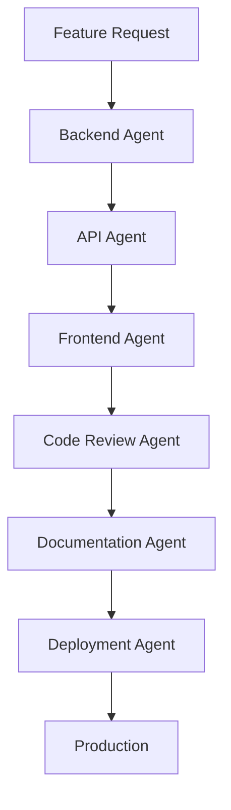

# Claude Code Agents for Medical SaaS Development

## Overview
Specialized Claude Code agents for comprehensive development workflow automation across backend, frontend, APIs, code review, deployment, and documentation.

## Agent Activation

### Invoke Specific Agent with claude-squad
```bash
# Backend development tasks
claude-squad backend "Add audit logging to Patient model"

# Frontend development tasks  
claude-squad frontend "Create patient dashboard component with charts"

# API development and testing
claude-squad api "Add authentication to analytics endpoints"

# Code review tasks
claude-squad code-review "Review security of authentication system"

# Deployment tasks
claude-squad deployment "Deploy to staging with health checks"

# Documentation tasks
claude-squad documentation "Update API docs for new endpoints"

# Medical translation tasks
claude-squad medical-translator "Translate surgical procedure forms to French"
```

## Agent Specializations

| Agent | Focus Area | Key Capabilities |
|-------|------------|------------------|
| **Backend** | Django Development | Models, APIs, Security, Medical Compliance |
| **Frontend** | React Development | Components, State, UI/UX, Accessibility |
| **API** | API Development | Testing, Documentation, Performance |
| **Code Review** | Quality Assurance | Security, Performance, Compliance |
| **Deployment** | DevOps & Infrastructure | CI/CD, Monitoring, EC2 CLI, Cloud Deployment |
| **Documentation** | Technical Writing | API Docs, Guides, Compliance Docs |
| **Medical Translator** | Medical Translation | FR/EN Medical Terms, Surgery, Compliance Docs |

## Workflow Integration

### Development Workflow


### Cross-Agent Collaboration
- **Backend + API**: Model changes trigger API documentation updates
- **Frontend + API**: Component development with API integration
- **Code Review + All**: Security and compliance validation across all code
- **Documentation + All**: Automatic documentation generation from code changes
- **Deployment + All**: Coordinated deployment with all components

## Medical SaaS Context - French Market
All agents are configured with:
- **RGPD Compliance** awareness (French data protection)
- **Medical Data** handling expertise for French market
- **Security Best Practices** for healthcare (CNIL guidelines)
- **Audit Logging** requirements (French medical standards)
- **Performance Standards** for medical applications
- **Trilingual Support** (French primary → German → English)

## Quick Start
1. **Choose the right agent** for your task
2. **Provide clear context** about the French medical requirements
3. **Specify compliance needs** (RGPD, security, performance)
4. **Review generated code** for French medical standards compliance

## Agent Communication
Agents can reference each other's work:
```bash
# Backend agent references API agent's work
claude-squad backend "Implement the authentication system designed by the API agent"

# Frontend agent uses backend models
claude-squad frontend "Create UI for the Patient model from backend agent"

# Medical translator coordinates with frontend
claude-squad medical-translator "Translate the Patient UI created by frontend agent to German"
```

This creates a comprehensive development ecosystem where each agent specializes in their domain while maintaining awareness of the overall medical SaaS requirements.