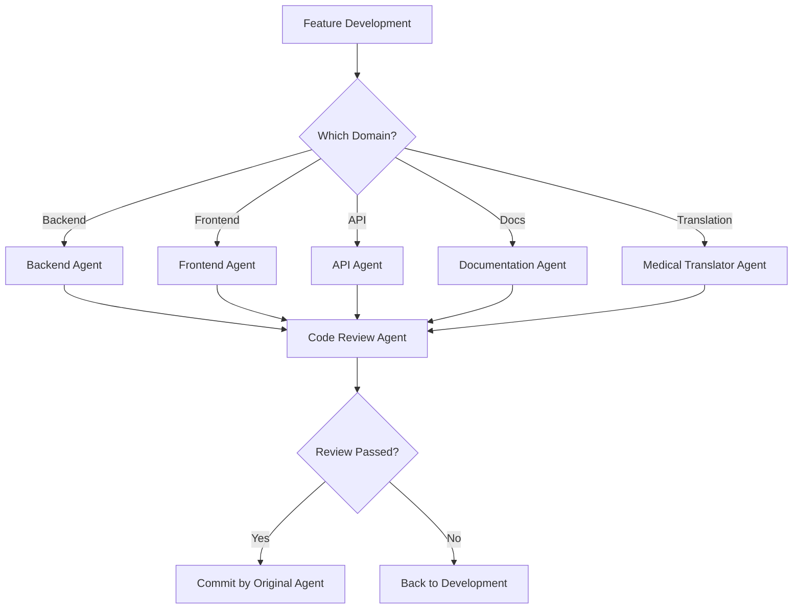

# Commit Workflow & Agent Responsibilities

## Commit Task Distribution

### Primary Commit Agents
| **Agent** | **Commit Responsibility** | **When to Commit** |
|-----------|--------------------------|-------------------|
| 🔧 **Backend Agent** | Backend code changes | After Django models, views, APIs, tests are complete |
| 🎨 **Frontend Agent** | Frontend code changes | After React components, styles, tests are complete |
| 🔌 **API Agent** | API-specific changes | After API endpoints, documentation, tests are complete |
| 📚 **Documentation Agent** | Documentation updates | After docs, README, API specs are updated |
| 🌍 **Medical Translator Agent** | Translation files | After locale files, multilingual content is complete |

### Review & Quality Agents (Pre-Commit)
| **Agent** | **Pre-Commit Role** | **Action** |
|-----------|---------------------|------------|
| 🔍 **Code Review Agent** | Quality gate before commits | Review code, run tests, validate compliance |
| 🚀 **Deployment Agent** | Infrastructure changes | Commit deployment configs, CI/CD updates |

## Commit Workflow Process

### 1. Development Phase


### 2. Commit Standards by Agent

#### Backend Agent Commits
```bash
# Commit format for Django backend changes - French market focus
git commit -m "feat(backend): ajouter l'audit logging RGPD au modèle AnalyticsRecord

- Ajout de l'enregistrement auditlog pour la conformité RGPD
- Implémentation des permissions au niveau objet avec Guardian
- Mise à jour du modèle avec permissions personnalisées pour données analytiques
- Ajout des tests pour la fonctionnalité d'audit logging
- Configuration pour le marché français (RGPD, CNIL)

Closes #123

🤖 Generated with [Claude Code](https://claude.ai/code)
Co-Authored-By: Claude <noreply@anthropic.com>"
```

#### Frontend Agent Commits
```bash
# Commit format for React frontend changes
git commit -m "feat(frontend): create patient dashboard with surgical metrics

- Added PatientDashboard component with medical charts
- Implemented responsive design for mobile devices
- Added accessibility features for medical professionals
- Integrated with analytics API endpoints
- Added French translation support for surgical terms

Closes #124

🤖 Generated with [Claude Code](https://claude.ai/code)
Co-Authored-By: Claude <noreply@anthropic.com>"
```

#### API Agent Commits
```bash
# Commit format for API changes
git commit -m "feat(api): add authentication to surgical analytics endpoints

- Added JWT authentication to all analytics endpoints
- Implemented rate limiting for medical data access
- Updated OpenAPI documentation with auth examples
- Added comprehensive API tests with medical scenarios
- Validated HIPAA compliance for data access patterns

Closes #125

🤖 Generated with [Claude Code](https://claude.ai/code)
Co-Authored-By: Claude <noreply@anthropic.com>"
```

#### Medical Translator Agent Commits
```bash
# Commit format for translation changes  
git commit -m "feat(i18n): add French translations for surgical procedures

- Added complete French medical terminology dictionary
- Translated surgical procedure forms and UI labels
- Updated patient intake forms with French medical terms
- Added context-aware translation for surgical specialties
- Validated translations with medical professionals

Closes #126

🤖 Generated with [Claude Code](https://claude.ai/code)
Co-Authored-By: Claude <noreply@anthropic.com>"
```

## Agent-Specific Commit Workflows

### Backend Agent Commit Process
1. **Pre-Commit Checks**:
   ```bash
   python manage.py check --deploy
   python manage.py test
   bandit -r apps/
   ```
2. **Commit Medical Backend Changes**
3. **Post-Commit Actions**:
   - Run migrations if needed
   - Update API documentation
   - Notify API agent of schema changes

### Frontend Agent Commit Process  
1. **Pre-Commit Checks**:
   ```bash
   npm run lint
   npm run type-check
   npm run test
   npm run build
   ```
2. **Commit React Frontend Changes**
3. **Post-Commit Actions**:
   - Update component documentation
   - Notify medical translator for new UI text

### API Agent Commit Process
1. **Pre-Commit Checks**:
   ```bash
   python manage.py spectacular --validate
   pytest tests/api/
   curl -f http://localhost:8000/api/health/
   ```
2. **Commit API Changes**
3. **Post-Commit Actions**:
   - Regenerate OpenAPI documentation
   - Update Postman collections
   - Notify frontend agent of API changes

### Code Review Agent (Quality Gate)
**Role**: Reviews all code before any agent commits
```bash
# Pre-commit validation workflow
claude-squad code-review "Review backend changes for RGPD compliance before commit"
```

**Responsibilities**:
- Run security scans (bandit, safety)
- Validate medical compliance requirements  
- Check test coverage and quality
- Verify documentation updates
- **Approve or reject commits**

### Documentation Agent Commit Process
1. **Pre-Commit Checks**:
   ```bash
   markdownlint docs/
   vale docs/
   python manage.py spectacular --file api-schema.yml
   ```
2. **Commit Documentation Updates**
3. **Post-Commit Actions**:
   - Deploy documentation site
   - Update API documentation portal

## Multi-Agent Commit Scenarios

### Feature Branch Workflow
```bash
# 1. Backend Agent creates feature
git checkout -b feature/surgical-analytics
# Backend agent develops and commits backend changes

# 2. API Agent adds endpoints  
# API agent commits API changes to same branch

# 3. Frontend Agent builds UI
# Frontend agent commits frontend changes to same branch

# 4. Medical Translator adds translations
# Translator agent commits i18n changes to same branch

# 5. Code Review Agent validates everything
claude-squad code-review "Review complete surgical analytics feature"

# 6. Documentation Agent updates docs
# Documentation agent commits final docs

# 7. Create PR for human review
```

### Hotfix Workflow
```bash
# Critical medical compliance fix
git checkout -b hotfix/hipaa-audit-logging

# 1. Backend Agent implements fix
claude-squad backend "Fix critical RGPD audit logging issue"
# Backend agent commits fix

# 2. Code Review Agent validates 
claude-squad code-review "Validate RGPD hotfix for immediate deployment"

# 3. Deployment Agent handles release
claude-squad deployment "Deploy RGPD hotfix to production immediately"
```

## Commit Message Standards

### Medical SaaS Specific Prefixes
- `feat(medical):` - New medical functionality
- `fix(hipaa):` - HIPAA compliance fixes
- `feat(surgery):` - Surgical practice features  
- `fix(audit):` - Audit logging fixes
- `feat(i18n):` - Medical translation features
- `fix(security):` - Security vulnerability fixes

### Commit Validation Rules
1. **Medical Context Required**: All commits must reference medical/surgical context
2. **Compliance Check**: HIPAA/security implications must be noted
3. **Test Coverage**: Medical functionality must include tests
4. **Documentation**: Medical features must include documentation
5. **Translation**: User-facing text must include translation considerations

This ensures every commit maintains the high standards required for medical SaaS development! 🏥