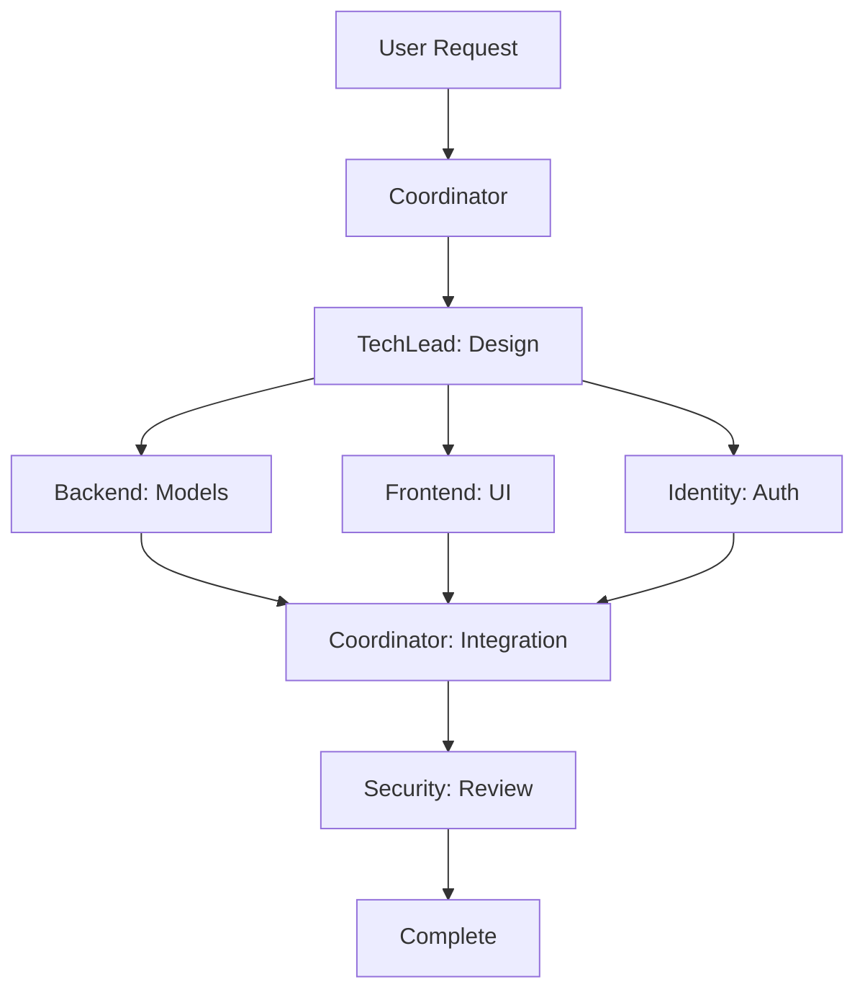

# Agent Communication Patterns and Best Practices

## Table of Contents
1. [Overview](#overview)
2. [Communication Architecture](#communication-architecture)
3. [Agent Interaction Patterns](#agent-interaction-patterns)
4. [Task Delegation Workflows](#task-delegation-workflows)
5. [Conflict Resolution](#conflict-resolution)
6. [Context Sharing](#context-sharing)
7. [Error Handling](#error-handling)
8. [Performance Optimization](#performance-optimization)
9. [Best Practices](#best-practices)
10. [Troubleshooting](#troubleshooting)

## Overview

The Agent Communication System provides a robust framework for coordinating multiple Claude Code agents working on different aspects of the ReactDjango-Hub project. This document outlines the patterns, protocols, and best practices for effective agent collaboration.

### Key Components

1. **Communication Hub** (`agent_communication_hub.py`): Central message broker and task router
2. **Coordinator** (`agent_coordinator.sh`): High-level orchestration and workflow management
3. **Monitor Dashboard** (`agent_monitor_dashboard.py`): Real-time visualization and monitoring
4. **Auto-commit System** (`scripts/auto-commit.sh`): Automated, boundary-aware git operations

## Communication Architecture

### Hub-and-Spoke Model

```
                    ┌─────────────────┐
                    │ Communication   │
                    │      Hub        │
                    └────────┬────────┘
                             │
          ┌──────────────────┼──────────────────┐
          │                  │                  │
    ┌─────▼─────┐     ┌─────▼─────┐     ┌─────▼─────┐
    │  Backend  │     │ Frontend  │     │ Identity  │
    │   Agent   │     │   Agent   │     │  Agent   │
    └───────────┘     └───────────┘     └───────────┘
```

### Message Flow

1. **Direct Messages**: Point-to-point communication between agents
2. **Broadcast Messages**: Hub distributes to all relevant agents
3. **Request-Response**: Synchronous communication with timeout
4. **Event Notifications**: Asynchronous status updates

## Agent Interaction Patterns

### 1. Task Delegation Pattern

When an agent receives a task outside its domain:

```python
# Agent detects task is outside boundaries
if not self.can_handle(task):
    # Delegate to appropriate agent
    hub.delegate_task(
        task_id=task.id,
        from_agent=self.name,
        to_agent=hub.task_router.route_task(task.type),
        reason="Outside agent boundaries"
    )
```

**Example Workflow:**
1. Frontend agent receives database migration task
2. Recognizes it's outside frontend boundaries
3. Delegates to backend agent via hub
4. Backend agent accepts and processes task
5. Notifies frontend agent upon completion

### 2. Collaborative Development Pattern

For features requiring multiple agents:

```bash
# Coordinator orchestrates multi-agent feature
./agent_coordinator.sh feature "user-authentication" \
    "Implement complete user authentication system"

# This triggers:
# 1. TechLead agent: Architecture design
# 2. Identity agent: Auth service implementation
# 3. Backend agent: Django integration
# 4. Frontend agent: UI components
# 5. Security agent: Security review
```

### 3. Handoff Pattern

For sequential task processing:

```python
# Phase 1: Backend creates API
backend_task = hub.create_task(
    "Create user profile API",
    agent="backend",
    context={"model": "UserProfile"}
)

# Phase 2: Frontend consumes API (triggered on backend completion)
frontend_task = hub.create_task(
    "Create profile UI components",
    agent="frontend",
    dependencies=[backend_task.id]
)
```

### 4. Conflict Resolution Pattern

When agents attempt conflicting operations:

```python
# Hub detects file conflict
conflict = hub.report_conflict(
    agent1="backend",
    agent2="frontend",
    resource="package.json",
    operation="write"
)

# Resolution strategies:
# - Queue: Sequential access
# - Merge: Combine changes
# - Reject: Block operation
# - Escalate: Human intervention
```

## Task Delegation Workflows

### Feature Development Workflow



### Bug Fix Workflow

```bash
# 1. Report bug
./agent_coordinator.sh bugfix "BUG-123" \
    "Login fails with special characters" "frontend"

# 2. Agent analyzes and fixes
# 3. Creates tests
# 4. Validates fix
# 5. Commits with proper scope
```

### Deployment Workflow

```bash
# Orchestrated deployment
./agent_coordinator.sh deploy staging v1.2.3

# Triggers:
# - Run all tests (backend, frontend agents)
# - Security scan (security agent)
# - Build artifacts (infrastructure agent)
# - Deploy (infrastructure agent)
# - Health check (coordinator)
```

## Conflict Resolution

### Boundary Violations

```python
# Agent attempts to modify file outside boundaries
if agent == "frontend" and file.startswith("backend/"):
    return {
        "resolution": "reject",
        "message": "Frontend agent cannot modify backend files",
        "suggestion": "Delegate to backend agent"
    }
```

### Resource Conflicts

```python
# Multiple agents accessing shared resource
if resource in ["docker-compose.yml", "Makefile"]:
    return {
        "resolution": "coordinate",
        "message": "Shared resource requires coordination",
        "action": "Route through infrastructure agent"
    }
```

### Dependency Conflicts

```python
# Task depends on incomplete work
if task.dependencies and not all_complete(task.dependencies):
    return {
        "resolution": "wait",
        "message": "Waiting for dependencies",
        "retry_after": 60  # seconds
    }
```

## Context Sharing

### Sharing Context Between Agents

```python
# Backend shares API endpoint info
hub.share_context(
    key="user_api_endpoints",
    value={
        "list": "/api/users/",
        "detail": "/api/users/{id}/",
        "profile": "/api/users/{id}/profile/"
    },
    agent="backend",
    ttl=3600  # 1 hour
)

# Frontend retrieves context
endpoints = hub.shared_context.get_context("user_api_endpoints")
```

### Persistent Context

```bash
# Share deployment status
./agent_coordinator.sh context "deployment_status" "in_progress" "infrastructure"

# Other agents check status
status=$(./agent_coordinator.sh get-context "deployment_status")
```

## Error Handling

### Error Escalation Chain

1. **Agent Level**: Try to handle locally
2. **Hub Level**: Route to appropriate handler
3. **Coordinator Level**: Orchestrate recovery
4. **Human Level**: Alert for intervention

### Error Recovery Patterns

```python
# Automatic retry with backoff
if task.retry_count < task.max_retries:
    task.retry_count += 1
    delay = 2 ** task.retry_count  # Exponential backoff
    hub.reschedule_task(task, delay=delay)
else:
    # Escalate to human
    hub.send_notification(
        "Task failed after max retries",
        priority=MessagePriority.CRITICAL
    )
```

## Performance Optimization

### Task Prioritization

```python
# Priority levels
class MessagePriority(Enum):
    CRITICAL = 1  # Security issues, production bugs
    HIGH = 2      # User-facing features, deadlines
    NORMAL = 3    # Regular development tasks
    LOW = 4       # Documentation, cleanup
```

### Parallel Processing

```bash
# Parallel independent tasks
tasks=(
    "backend:migrations"
    "frontend:components"
    "identity:auth"
)

for task in "${tasks[@]}"; do
    agent="${task%%:*}"
    work="${task#*:}"
    ./agent_coordinator.sh delegate "$work" "$agent" &
done
wait
```

### Resource Management

```python
# Agent workload balancing
def find_available_agent(task_type):
    candidates = router.get_capable_agents(task_type)
    
    # Sort by current workload
    candidates.sort(key=lambda a: a.current_workload())
    
    return candidates[0] if candidates else None
```

## Best Practices

### 1. Clear Task Definitions

```python
# Good task definition
task = hub.create_task(
    title="Implement user profile model",
    description="Create Django model for user profiles with fields: bio, avatar, location",
    agent="backend",
    priority=MessagePriority.HIGH,
    context={
        "app": "profiles",
        "fields": ["bio", "avatar", "location"],
        "requirements": ["unique constraint on user"]
    }
)
```

### 2. Proper Agent Selection

```python
# Use intelligent routing
agent = hub.task_router.route_task(
    task_type="api_endpoint",
    context={"file_path": "backend/api/users.py"}
)
# Returns: "backend"
```

### 3. Context Preservation

```python
# Share important context
hub.share_context(
    "current_sprint_goals",
    ["user auth", "profile management", "api docs"],
    agent="techlead",
    ttl=86400  # 24 hours
)
```

### 4. Error Handling

```python
try:
    result = process_task(task)
    hub.complete_task(task.id, result)
except Exception as e:
    hub.fail_task(task.id, str(e))
    hub.escalate_error(task, e)
```

### 5. Progress Tracking

```bash
# Regular status updates
while processing; do
    ./agent_coordinator.sh update-status "$task_id" "in_progress" "$progress%"
    sleep 10
done
```

## Troubleshooting

### Common Issues and Solutions

#### 1. Agent Not Responding

```bash
# Check agent status
python3 .claude/agent_communication_hub.py status --agent backend

# Restart agent
./launch-agent.sh backend
```

#### 2. Task Stuck in Queue

```bash
# View task queue
python3 .claude/agent_communication_hub.py status

# Force task reassignment
./agent_coordinator.sh reassign-task "task-id" "new-agent"
```

#### 3. Context Not Sharing

```bash
# Check context directory
ls -la .claude/shared_context/

# Clear expired context
python3 -c "from agent_communication_hub import *; hub = AgentCommunicationHub(); hub.shared_context.clear_expired()"
```

#### 4. Conflict Loop

```python
# Break conflict loop
hub.conflict_resolver.resolution_strategies['file_conflict'] = lambda c: {
    'resolution': 'force',
    'message': 'Breaking conflict loop',
    'action': 'grant_access_to_first'
}
```

### Monitoring and Debugging

#### Real-time Monitoring

```bash
# Launch dashboard
python3 .claude/agent_monitor_dashboard.py

# Views available:
# - Overview: System status
# - Agents: Individual agent status
# - Tasks: Task queue and progress
# - Messages: Inter-agent communication
# - Conflicts: Conflict history
# - Performance: Agent metrics
# - Logs: System logs
```

#### Debug Mode

```bash
# Enable debug logging
export AGENT_DEBUG=1
export AGENT_LOG_LEVEL=DEBUG

# Run with verbose output
./agent_coordinator.sh delegate "task" "agent" --verbose
```

#### Database Inspection

```bash
# Direct database queries
sqlite3 .claude/communication_hub/hub.db

# Common queries:
.tables
SELECT * FROM agent_status;
SELECT * FROM tasks WHERE status = 'failed';
SELECT * FROM conflict_log ORDER BY timestamp DESC LIMIT 10;
```

## Integration with Auto-commit System

The communication system integrates seamlessly with the auto-commit system:

```bash
# Agent completes task and commits
task_complete() {
    local agent=$1
    local message=$2
    
    # Notify hub of completion
    python3 .claude/agent_communication_hub.py complete-task "$task_id"
    
    # Auto-commit with agent scope
    .claude/scripts/auto-commit.sh "$agent" "feat" "$message"
}
```

## Future Enhancements

1. **Machine Learning Integration**: Predictive task routing based on historical performance
2. **Advanced Conflict Resolution**: AI-powered merge strategies
3. **Resource Optimization**: Dynamic agent scaling based on workload
4. **Cross-Project Coordination**: Federation with other project hubs
5. **Visual Workflow Designer**: GUI for creating complex workflows

## Conclusion

The Agent Communication System provides a robust foundation for coordinating multiple Claude Code agents. By following these patterns and best practices, teams can achieve efficient, conflict-free development with clear boundaries and excellent visibility into the development process.

For questions or improvements, please consult the technical lead agent or submit a task through the coordinator.