# Agent Architecture Visual Guide for ReactDjango-Hub

## Overview

This document provides a comprehensive visual representation of the agent architecture for building the ReactDjango-Hub SaaS application. The system uses specialized Claude Code agents, each responsible for specific domains, with strict boundaries to maintain clean separation of concerns.

## 1. Overall Agent Hierarchy and Relationships

```mermaid
graph TB
    subgraph "Leadership & Strategy"
        TL[🎯 Technical Lead<br/>Architecture & Research]
        SPM[🏥 Surgical Product Manager<br/>Medical Market Strategy]
        PPM[🏛️ Public Procurement PM<br/>GovTech Strategy]
        PLM[📊 Platform Product Manager<br/>Unified Platform Strategy]
    end
    
    subgraph "Quality & Compliance"
        SEC[🔒 Security & Compliance<br/>Audits & Standards]
        REV[👀 Code Reviewer<br/>Quality Assurance]
    end
    
    subgraph "Infrastructure & Coordination"
        INFRA[🚀 Infrastructure<br/>Docker/K8s/Deployment]
        COORD[🎯 Services Coordinator<br/>API Gateway & Integration]
    end
    
    subgraph "Core Services"
        BE[🔧 Django Backend<br/>Business Logic]
        FE[🎨 React Frontend<br/>User Interface]
    end
    
    subgraph "Microservices"
        ID[🔐 Identity Service<br/>Auth & Users]
        COMM[📧 Communication<br/>Notifications]
        CONT[📝 Content Service<br/>Documents]
        WF[🧠 Workflow Intelligence<br/>Automation & AI]
    end
    
    %% Leadership relationships
    TL -->|Defines Architecture| INFRA
    TL -->|Sets Standards| COORD
    TL -->|Guides Development| BE
    TL -->|Guides Development| FE
    
    SPM -->|Product Requirements| FE
    PPM -->|Product Requirements| FE
    PLM -->|Platform Strategy| COORD
    
    %% Quality relationships
    SEC -.->|Security Review| BE
    SEC -.->|Security Review| FE
    SEC -.->|Security Review| ID
    SEC -.->|Compliance Check| COMM
    SEC -.->|Compliance Check| CONT
    SEC -.->|Compliance Check| WF
    
    REV -.->|Code Review| BE
    REV -.->|Code Review| FE
    REV -.->|Code Review| ID
    REV -.->|Code Review| COMM
    REV -.->|Code Review| CONT
    REV -.->|Code Review| WF
    
    %% Infrastructure relationships
    INFRA -->|Containerizes| BE
    INFRA -->|Containerizes| FE
    INFRA -->|Containerizes| ID
    INFRA -->|Containerizes| COMM
    INFRA -->|Containerizes| CONT
    INFRA -->|Containerizes| WF
    
    %% Coordination relationships
    COORD -->|API Contracts| BE
    COORD -->|API Contracts| ID
    COORD -->|API Contracts| COMM
    COORD -->|API Contracts| CONT
    COORD -->|API Contracts| WF
    COORD -->|Aggregates APIs| FE
    
    %% Service dependencies
    FE -->|Consumes APIs| BE
    BE -->|Uses Auth| ID
    BE -->|Sends Notifications| COMM
    BE -->|Manages Content| CONT
    BE -->|Triggers Workflows| WF
    
    style TL fill:#f9f,stroke:#333,stroke-width:4px
    style INFRA fill:#bbf,stroke:#333,stroke-width:2px
    style COORD fill:#bbf,stroke:#333,stroke-width:2px
    style SEC fill:#fbb,stroke:#333,stroke-width:2px
    style REV fill:#fbb,stroke:#333,stroke-width:2px
```



## 2. Service Boundaries and Constraints


## 3. Communication Flow Patterns


## 4. Development Workflow Using Agents


## 5. Agent Decision Tree


## 6. Inter-Agent Communication Matrix


## 7. API Contract Management Flow


## 8. Development Environment State Machine


## 9. Error Handling and Escalation


## 10. Best Practices Summary

### Agent Selection Guidelines

| Task Type | Primary Agent | Supporting Agents |
|-----------|---------------|-------------------|
| New UI Component | Frontend | Coordinator (for API) |
| New API Endpoint | Backend/Service | Coordinator (contracts) |
| Authentication Feature | Identity | Security (review) |
| Deployment Issue | Infrastructure | Coordinator (testing) |
| Performance Problem | Technical Lead | Service agents (implement) |
| Security Vulnerability | Security | Service agents (fix) |
| API Integration | Coordinator | Service agents (implement) |
| Architecture Decision | Technical Lead | All agents (feedback) |

### Communication Patterns

1. **Direct Modification**: Agents only modify their own service code
2. **API Communication**: All inter-service communication through APIs
3. **Contract-First**: Define API contracts before implementation
4. **Review Process**: All changes go through code review
5. **Security Scanning**: Automatic security checks on all code

### Boundary Enforcement


## Agent Activation Command

To use any agent in development:

```bash
# Launch agent with unified launcher
./.claude/launch-agent.sh <agent-name>

# Examples:
./.claude/launch-agent.sh backend      # Django development
./.claude/launch-agent.sh frontend     # React development
./.claude/launch-agent.sh identity     # Identity service
./.claude/launch-agent.sh coordinator  # API integration
./.claude/launch-agent.sh techlead    # Architecture decisions
```

## Conclusion

This agent architecture ensures:

1. **Clean Separation**: Each agent has clear boundaries and responsibilities
2. **Scalability**: New services can be added without affecting existing ones
3. **Quality**: Multiple review layers ensure code quality and security
4. **Flexibility**: Agents can work independently while maintaining integration
5. **Traceability**: Clear communication patterns and audit trails

The system is designed to support both local-first development (current strategy per ADR-010) and future production deployment with containerization when the platform matures.