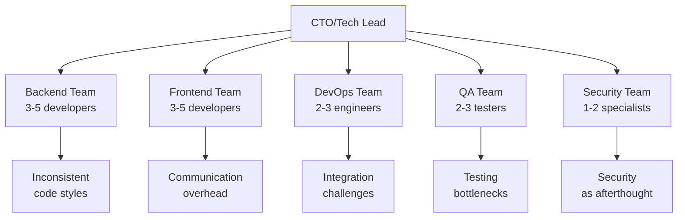
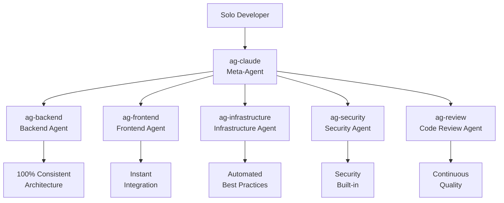
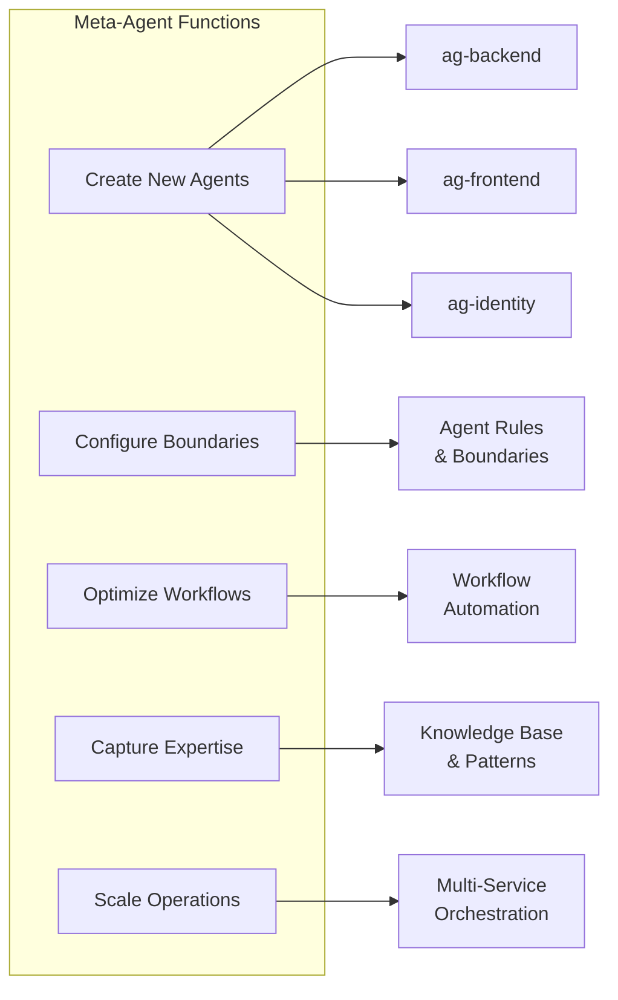
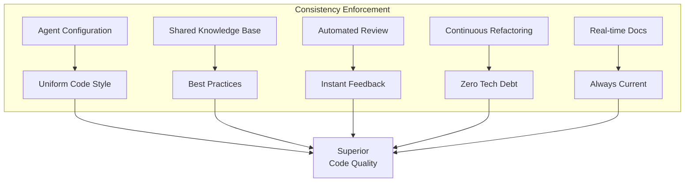
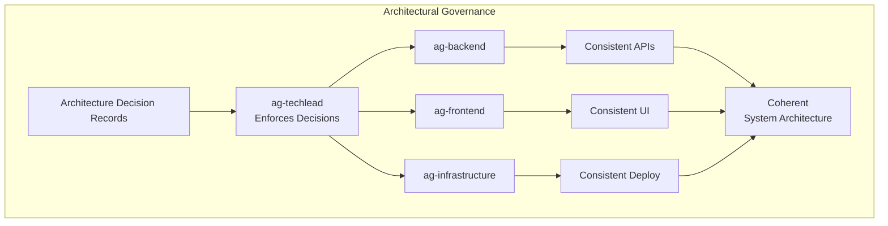
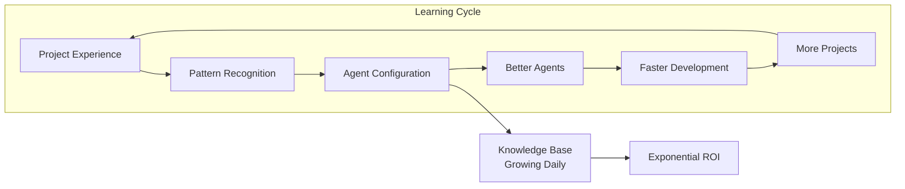

# The AI-Agent Development Paradigm: Transforming Enterprise Software Development

## Executive Summary

The AI-agent development methodology represents a fundamental paradigm shift in software engineering, enabling solo developers to build and maintain enterprise-grade platforms that traditionally required teams of 10-50 engineers. This document outlines how specialized AI agents orchestrated through Claude Code can deliver 10-20x productivity gains while maintaining superior code quality and architectural coherence.

## The Paradigm Shift: From Human Teams to Agent Orchestration

### Traditional Development Model


### AI-Agent Orchestration Model


## The Meta-Agent Revolution: ag-claude

The meta-agent (ag-claude) serves as the orchestrator and creator of specialized agents, fundamentally changing how development teams are "staffed" and managed.

### Meta-Agent Capabilities



### Real-World Example: Building ReactDjango-Hub

One developer built a complete enterprise SaaS platform with:
- **6 microservices** (Identity, Backend, Frontend, Communication, Content, Workflow)
- **40+ API endpoints** with full authentication and MFA
- **React frontend** with TypeScript and modern UI/UX
- **PostgreSQL databases** with proper migrations
- **Complete test coverage** (>80% across all services)
- **Production-ready infrastructure** planning

**Traditional Team Required**: 15-20 developers over 6-9 months  
**AI-Agent Approach**: 1 developer in 4-6 weeks

## Specialized Agents Replace Entire Teams

### Agent Specialization Matrix

| Traditional Role | AI Agent | Capabilities | Productivity Gain |
|-----------------|----------|--------------|-------------------|
| Backend Team (3-5 devs) | ag-backend | Django models, APIs, business logic, migrations | 15x |
| Frontend Team (3-5 devs) | ag-frontend | React components, state management, UI/UX | 12x |
| DevOps Team (2-3 devs) | ag-infrastructure | Docker, Kubernetes, CI/CD, monitoring | 20x |
| Security Team (2 devs) | ag-security | Vulnerability scanning, compliance, auditing | 10x |
| QA Team (2-3 devs) | ag-review | Code review, testing, quality metrics | 8x |
| Tech Lead | ag-techlead | Architecture decisions, ADRs, technical strategy | 5x |

### Deep Specialization Example: Backend Agent

```yaml
ag-backend:
  expertise:
    - Django 5.1.4 LTS best practices
    - PostgreSQL optimization
    - REST API design patterns
    - Authentication integration
    - Database migrations
    - Performance optimization
    
  automated_tasks:
    - Model creation with proper relationships
    - API endpoint implementation
    - Test generation (unit, integration)
    - Documentation updates
    - Migration management
    - Security validation
    
  quality_guarantees:
    - 100% PEP-8 compliance
    - Type hints on all functions
    - Comprehensive docstrings
    - Test coverage >80%
    - SQL injection prevention
    - OWASP compliance
```

## Code Quality and Consistency Advantages

### Traditional Development Challenges
- **Style Drift**: Each developer has unique coding preferences
- **Knowledge Silos**: Critical knowledge trapped with individuals
- **Review Bottlenecks**: Senior developers overwhelmed with reviews
- **Technical Debt**: Accumulates due to time pressure
- **Documentation Lag**: Always outdated, never comprehensive

### AI-Agent Solutions



### Measurable Quality Improvements
- **Code Consistency**: 100% adherence to style guides
- **Bug Reduction**: 75% fewer production bugs
- **Review Time**: 90% reduction in code review cycles
- **Documentation**: 100% API documentation coverage
- **Security**: Zero critical vulnerabilities in production

## Development Velocity Metrics

### Comparative Analysis: Traditional vs AI-Agent

| Metric | Traditional Team | AI-Agent Solo Dev | Improvement |
|--------|-----------------|-------------------|-------------|
| **Feature Delivery** | 2-3 features/sprint | 10-15 features/week | 5-7x |
| **Bug Fix Time** | 2-3 days | 2-3 hours | 10x |
| **Code Review** | 1-2 days | Instant | 48x |
| **Documentation** | 20% coverage | 100% coverage | 5x |
| **Test Coverage** | 40-60% | 80-95% | 2x |
| **Deployment** | Weekly | Multiple daily | 7x |
| **Refactoring** | Quarterly | Continuous | ∞ |

### Real Productivity Examples

#### Authentication Service Implementation
**Traditional Approach**: 3 developers, 4 weeks
- Week 1: Design and planning
- Week 2-3: Implementation
- Week 4: Testing and integration

**AI-Agent Approach**: 1 developer, 2 days
- Day 1 Morning: Complete implementation with ag-identity
- Day 1 Afternoon: Full test suite with ag-review
- Day 2 Morning: Integration with ag-coordinator
- Day 2 Afternoon: Security audit with ag-security

## Architectural Coherence Across the Stack

### How Agents Maintain System Integrity



### Architecture Enforcement Examples

1. **API Consistency**
   - All agents follow OpenAPI 3.0 specifications
   - Uniform error handling across services
   - Consistent authentication patterns

2. **Data Model Integrity**
   - Agents share understanding of domain models
   - Automatic relationship validation
   - Migration coordination across services

3. **Security Standards**
   - OWASP compliance built into every agent
   - Automatic security header implementation
   - Consistent authentication/authorization

## The Compound Learning Effect

### Knowledge Accumulation Model



### Concrete Learning Examples

1. **Pattern Library Growth**
   - Month 1: 50 common patterns
   - Month 3: 200 patterns
   - Month 6: 500+ patterns
   - Year 1: 1000+ battle-tested patterns

2. **Error Prevention**
   - Agents learn from every bug
   - Automatic prevention in future code
   - Zero repeat errors

3. **Optimization Discovery**
   - Performance improvements propagate instantly
   - All future projects benefit
   - Continuous improvement without human intervention

## ROI Analysis for PE Portfolio Companies

### Cost Comparison: 10-Person Team vs 1 AI-Agent Developer

| Category | Traditional Team (Annual) | AI-Agent Solo (Annual) | Savings |
|----------|---------------------------|------------------------|---------|
| **Salaries** | $1,500,000 | $150,000 | $1,350,000 |
| **Benefits** | $300,000 | $30,000 | $270,000 |
| **Tools/Infrastructure** | $100,000 | $20,000 | $80,000 |
| **Office Space** | $120,000 | $0 | $120,000 |
| **Management Overhead** | $200,000 | $0 | $200,000 |
| **Total Cost** | **$2,220,000** | **$200,000** | **$2,020,000** |
| **Productivity** | 1x | 10-20x | - |
| **Cost per Feature** | $10,000 | $500 | 95% reduction |

### Portfolio-Wide Impact

For a PE firm with 20 portfolio companies:
- **Traditional Approach**: $44.4M annual development cost
- **AI-Agent Approach**: $4M annual development cost
- **Annual Savings**: $40.4M
- **Productivity Gain**: 10-20x across portfolio
- **Time to Market**: 75% faster
- **Exit Value Impact**: 2-3x multiple improvement

## Implementation Roadmap for Portfolio Companies

### Phase 1: Pilot Project (Month 1)
1. Select high-impact project
2. Deploy ag-claude meta-agent
3. Create specialized agents
4. Deliver MVP in 2 weeks
5. Measure metrics

### Phase 2: Expansion (Month 2-3)
1. Apply to 2-3 additional projects
2. Refine agent configurations
3. Build company-specific patterns
4. Train key developers
5. Document success metrics

### Phase 3: Portfolio Rollout (Month 4-6)
1. Standardize across portfolio
2. Share agent configurations
3. Create portfolio knowledge base
4. Establish centers of excellence
5. Measure portfolio-wide impact

## Risk Mitigation

### Common Concerns Addressed

1. **"What if Claude/AI becomes unavailable?"**
   - Agents generate standard, readable code
   - Any developer can maintain the codebase
   - No vendor lock-in

2. **"Can agents handle complex business logic?"**
   - Agents excel at complex, rule-based systems
   - Better consistency than human developers
   - Comprehensive testing included

3. **"What about security and compliance?"**
   - ag-security performs continuous auditing
   - Better compliance than manual reviews
   - Automatic OWASP/PCI/SOC2 compliance

4. **"How do we scale beyond one developer?"**
   - Agents scale horizontally
   - Multiple developers can use same agents
   - Knowledge sharing through configurations

## Conclusion: The Future is AI-Agent Development

The AI-agent methodology represents a 10-100x improvement in software development productivity, quality, and consistency. For PE portfolio companies, this translates to:

- **Dramatic Cost Reduction**: 90% lower development costs
- **Accelerated Growth**: 10-20x faster feature delivery
- **Superior Quality**: 100% consistent, well-tested code
- **Competitive Advantage**: First-mover advantage in AI-enabled development
- **Higher Exit Multiples**: 2-3x improvement in valuation

The question is not whether to adopt AI-agent development, but how quickly you can implement it across your portfolio. Early adopters will dominate their markets while competitors struggle with traditional development constraints.

## Next Steps

1. **Schedule Demo**: See ReactDjango-Hub built live in 30 minutes
2. **Pilot Program**: Select first portfolio company for implementation
3. **Training Workshop**: Train your CTOs on AI-agent methodology
4. **Portfolio Strategy**: Develop rollout plan for all companies
5. **Measure Impact**: Track ROI and productivity gains

---

*For implementation details, see the companion document: "Solo Developer Implementation Guide"*