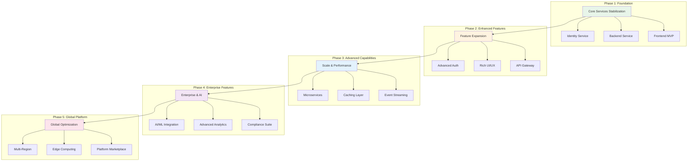
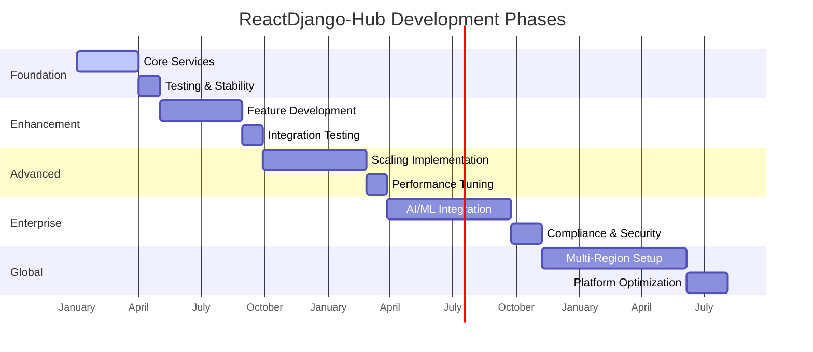
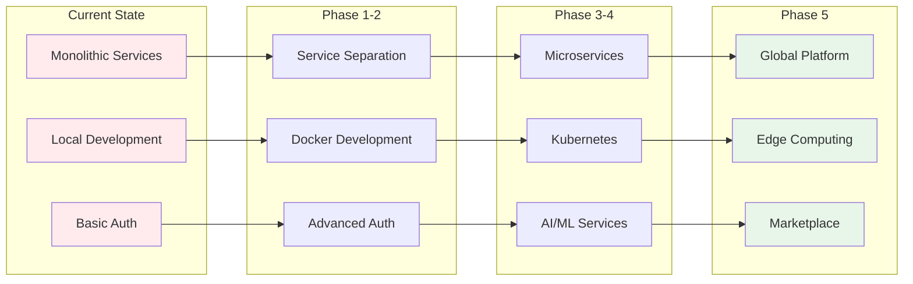
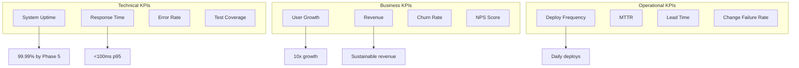
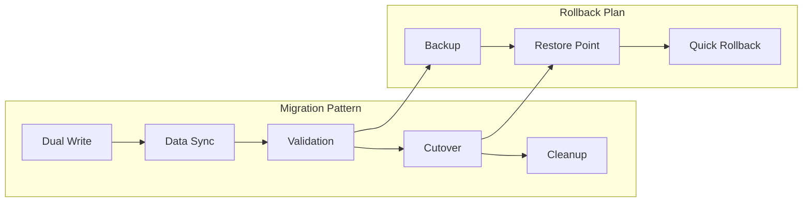

# ReactDjango-Hub Improvement Roadmap

## Executive Summary

This roadmap outlines the evolution of ReactDjango-Hub from its current MVP state to a fully enterprise-ready global SaaS platform. The roadmap is organized into five distinct phases, each building upon the previous foundation while maintaining backward compatibility and system stability.

## Roadmap Overview

## Phase Progression Timeline

---

## Phase 1: Foundation & Core Services

### Overview
Establish a solid foundation with core services fully operational, tested, and documented. This phase focuses on stability, reliability, and essential functionality.

### Key Objectives
- Complete core service implementation
- Establish testing frameworks
- Implement basic monitoring
- Create foundational documentation
- Set up CI/CD pipelines

### Implementation Details

| Component | Features | Technical Implementation | Agent Responsibility | Success Metrics |
|-----------|----------|-------------------------|---------------------|-----------------|
| **Identity Service** | - User registration/login - Basic MFA (email/SMS) - Organization management - Role-based access control | - FastAPI + PostgreSQL - JWT token management - Redis for sessions - Alembic migrations | `identity` agent | - 99.9% uptime - <200ms auth response - 100% test coverage |
| **Backend Service** | - Core business models - REST API endpoints - Data validation - Basic CRUD operations | - Django 5.1 + Django Ninja - PostgreSQL database - Celery for async tasks - Django migrations | `backend` agent | - 95% test coverage - <500ms API response - Zero critical bugs |
| **Frontend** | - Authentication flows - Dashboard views - Basic data tables - Responsive design | - React 18 + Vite - Tailwind CSS - React Query - TypeScript | `frontend` agent | - Lighthouse score >90 - Mobile responsive - <3s page load |
| **Infrastructure** | - Local development setup - Basic Docker configs - Development databases - Environment management | - Docker Compose - PostgreSQL 17 - Redis cache - Nginx proxy | `infrastructure` agent | - One-command setup - Consistent environments - Automated backups |
| **Testing** | - Unit test suites - Integration tests - API contract tests - Frontend component tests | - Pytest + Django tests - Jest + React Testing - API mocking - Coverage reporting | `review` agent | - >80% coverage - All critical paths tested - CI/CD integration |

### Prerequisites
- Development team assembled
- Technology stack finalized
- Initial requirements documented
- Development environment ready

### Dependencies
- PostgreSQL and Redis installed
- Node.js and Python environments
- Git repository configured
- Basic CI/CD pipeline

---

## Phase 2: Enhanced Features & Integration

### Overview
Expand platform capabilities with advanced features, improved user experience, and service integration patterns.

### Key Objectives
- Implement advanced authentication features
- Enhance UI/UX with modern patterns
- Establish API gateway
- Add real-time capabilities
- Implement data analytics

### Implementation Details

| Component | Features | Technical Implementation | Agent Responsibility | Success Metrics |
|-----------|----------|-------------------------|---------------------|-----------------|
| **Advanced Auth** | - TOTP/Authenticator apps - SSO/SAML integration - Passwordless login - Session management | - PyOTP integration - SAML2 provider - WebAuthn support - Advanced JWT handling | `identity` agent | - MFA adoption >50% - SSO for enterprises - Zero auth breaches |
| **API Gateway** | - Request routing - Rate limiting - API versioning - Request/response transformation | - Kong or Traefik - Redis for rate limiting - OpenAPI specs - GraphQL gateway | `coordinator` agent | - <50ms routing overhead - 99.99% availability - API version support |
| **Rich UI/UX** | - Advanced data grids - Interactive dashboards - Drag-and-drop builders - Dark mode support | - AG Grid or TanStack - D3.js/Recharts - React DnD - CSS variables | `frontend` agent | - User satisfaction >4.5/5 - Reduced support tickets - Improved engagement |
| **Communication** | - Email notifications - In-app messaging - Push notifications - Webhook system | - SendGrid/SES - WebSocket server - Firebase Cloud Messaging - Webhook queues | `communication` agent | - 99% delivery rate - <1s notification delay - Webhook reliability |
| **Analytics** | - User behavior tracking - Custom dashboards - Report generation - Data exports | - Mixpanel/Amplitude - Metabase integration - PDF generation - CSV/Excel exports | `backend` agent | - Real-time analytics - Custom reports - Data accuracy >99% |

### Prerequisites
- Phase 1 completed and stable
- User feedback incorporated
- Performance baselines established
- Security audit passed

### Dependencies
- Third-party service accounts (email, SMS, analytics)
- Enhanced infrastructure capacity
- Additional team members
- Extended testing infrastructure

---

## Phase 3: Advanced Capabilities & Scale

### Overview
Build for scale with microservices architecture, advanced caching, event-driven patterns, and performance optimizations.

### Key Objectives
- Implement full microservices architecture
- Add sophisticated caching layers
- Establish event streaming
- Optimize database performance
- Implement advanced monitoring

### Implementation Details

| Component | Features | Technical Implementation | Agent Responsibility | Success Metrics |
|-----------|----------|-------------------------|---------------------|-----------------|
| **Microservices** | - Service decomposition - Service discovery - Circuit breakers - Distributed tracing | - Kubernetes orchestration - Consul/Eureka - Hystrix patterns - Jaeger tracing | `infrastructure` agent | - Service isolation - <100ms service calls - Auto-scaling active |
| **Caching Layer** | - Multi-tier caching - CDN integration - Database query cache - Session caching | - Redis Cluster - CloudFlare CDN - Query optimization - Memcached | `coordinator` agent | - 90% cache hit rate - <10ms cache response - Reduced DB load 50% |
| **Event Streaming** | - Event sourcing - CQRS patterns - Real-time updates - Event replay | - Apache Kafka - Event Store - WebSocket broadcasting - Event schemas | `workflow` agent | - <100ms event processing - Zero event loss - Event ordering guaranteed |
| **Content Service** | - File storage - Image processing - Document management - Version control | - S3-compatible storage - ImageMagick/Sharp - Document indexing - Git-based versioning | `content` agent | - 99.99% durability - <2s file upload - Unlimited storage |
| **Performance** | - Database sharding - Read replicas - Query optimization - Load balancing | - PostgreSQL sharding - Read replica routing - Query analysis - HAProxy/Nginx | `backend` agent | - <100ms p95 response - 10K concurrent users - Linear scaling |

### Prerequisites
- Phase 2 features stable
- Performance bottlenecks identified
- Scaling requirements defined
- DevOps team expanded

### Dependencies
- Kubernetes cluster
- Message broker infrastructure
- CDN provider contract
- Monitoring stack deployed

---

## Phase 4: Enterprise & AI Features

### Overview
Introduce enterprise-grade features including AI/ML capabilities, advanced analytics, compliance tools, and sophisticated automation.

### Key Objectives
- Integrate AI/ML capabilities
- Implement predictive analytics
- Add compliance and audit tools
- Build workflow automation
- Create advanced security features

### Implementation Details

| Component | Features | Technical Implementation | Agent Responsibility | Success Metrics |
|-----------|----------|-------------------------|---------------------|-----------------|
| **AI/ML Platform** | - Natural language processing - Predictive analytics - Recommendation engine - Anomaly detection | - OpenAI/Claude APIs - TensorFlow/PyTorch - MLflow pipeline - Real-time inference | `workflow` agent | - <500ms inference - >90% accuracy - Auto-retraining |
| **Advanced Analytics** | - Predictive dashboards - Custom ML models - A/B testing platform - Business intelligence | - Apache Spark - Jupyter notebooks - Statsig/Optimizely - Tableau integration | `backend` agent | - Real-time insights - Custom model support - Self-service BI |
| **Compliance Suite** | - GDPR/CCPA tools - Audit logging - Data retention policies - Compliance reporting | - Audit trail system - Data anonymization - Policy engine - Report automation | `security` agent | - 100% audit coverage - Automated compliance - Zero violations |
| **Workflow Engine** | - Visual workflow builder - Business rule engine - Process automation - Integration hub | - Apache Airflow - Drools rule engine - n8n/Zapier-like - API connectors | `workflow` agent | - 100+ integrations - Visual designer - <1s rule evaluation |
| **Security Platform** | - Zero-trust architecture - Threat detection - Security scanning - Incident response | - Vault secrets - SIEM integration - Vulnerability scanning - SOC automation | `security` agent | - Zero breaches - <1min threat detection - Automated response |

### Prerequisites
- Phase 3 infrastructure stable
- ML team established
- Compliance requirements documented
- Security team in place

### Dependencies
- AI/ML infrastructure
- Compliance certifications
- Security tools and licenses
- Data science platform

---

## Phase 5: Global Expansion & Optimization

### Overview
Transform into a global platform with multi-region deployment, edge computing, marketplace capabilities, and platform optimization.

### Key Objectives
- Deploy multi-region infrastructure
- Implement edge computing
- Build platform marketplace
- Optimize for global scale
- Create partner ecosystem

### Implementation Details

| Component | Features | Technical Implementation | Agent Responsibility | Success Metrics |
|-----------|----------|-------------------------|---------------------|-----------------|
| **Multi-Region** | - Geographic distribution - Data sovereignty - Regional failover - Global load balancing | - Multi-region K8s - Cross-region replication - GeoDNS routing - Regional compliance | `infrastructure` agent | - <100ms regional latency - 99.999% uptime - Regional compliance |
| **Edge Computing** | - Edge functions - Content delivery - Edge caching - Compute at edge | - Cloudflare Workers - Edge databases - Lambda@Edge - WebAssembly | `infrastructure` agent | - <50ms edge response - Global coverage - Edge compute scaling |
| **Marketplace** | - App marketplace - Plugin system - Developer portal - Revenue sharing | - Plugin architecture - Developer SDK - App store backend - Payment processing | `coordinator` agent | - 100+ apps - Developer adoption - Revenue generation |
| **Platform APIs** | - Public API platform - Developer tools - API monetization - Partner integrations | - API management - Developer portal - Usage billing - Partner APIs | `coordinator` agent | - 1000+ API consumers - API revenue stream - Partner ecosystem |
| **Optimization** | - Cost optimization - Green computing - Performance tuning - Resource efficiency | - FinOps practices - Carbon tracking - Auto-optimization - Resource pooling | `techlead` agent | - 30% cost reduction - Carbon neutral - Optimal utilization |

### Prerequisites
- Phase 4 features mature
- Global customer base
- International team
- Regulatory compliance

### Dependencies
- Global infrastructure providers
- International partnerships
- Localization complete
- 24/7 support capability

---

## Architecture Evolution

---

## Agent Responsibility Matrix

### Phase Distribution

| Agent | Phase 1 | Phase 2 | Phase 3 | Phase 4 | Phase 5 |
|-------|---------|---------|---------|---------|---------|
| **Backend** | Core APIs, Models | Analytics, Reports | Performance, Sharding | AI Integration | API Platform |
| **Frontend** | Basic UI, Auth | Rich UX, Dashboards | Real-time UI | AI Features UI | Marketplace UI |
| **Identity** | Basic Auth, RBAC | SSO, Advanced MFA | Distributed Auth | Zero-trust | Global Identity |
| **Communication** | Email Setup | Notifications, Webhooks | Event Streaming | AI Notifications | Global Messaging |
| **Content** | File Storage | Document Management | CDN Integration | AI Processing | Edge Storage |
| **Workflow** | Basic Automation | Rule Engine | Event Processing | AI Workflows | Platform Workflows |
| **Infrastructure** | Local Setup | Docker, CI/CD | Kubernetes, Scale | ML Infrastructure | Global Deploy |
| **Coordinator** | Service Integration | API Gateway | Service Mesh | Platform APIs | Marketplace APIs |
| **Security** | Basic Security | Security Scanning | Threat Detection | Compliance Suite | Global Security |
| **TechLead** | Architecture | Technical Decisions | Scaling Strategy | AI Strategy | Platform Strategy |

---

## Risk Management

### Technical Risks by Phase

| Phase | Risk | Mitigation | Contingency |
|-------|------|------------|-------------|
| **Phase 1** | Technical debt accumulation | Regular refactoring, code reviews | Technical debt sprints |
| **Phase 2** | Integration complexity | Clear API contracts, testing | Rollback procedures |
| **Phase 3** | Scaling bottlenecks | Performance testing, monitoring | Vertical scaling option |
| **Phase 4** | AI model accuracy | Continuous training, validation | Human-in-the-loop |
| **Phase 5** | Global complexity | Regional teams, automation | Phased rollout |

---

## Success Metrics

### Key Performance Indicators

### Phase Completion Criteria

| Phase | Technical Criteria | Business Criteria | Quality Criteria |
|-------|-------------------|-------------------|------------------|
| **Phase 1** | Core services operational | MVP features complete | >80% test coverage |
| **Phase 2** | Advanced features integrated | User adoption growing | <1% error rate |
| **Phase 3** | Scalable architecture | 10K+ active users | <100ms p95 latency |
| **Phase 4** | AI/ML operational | Enterprise customers | SOC 2 compliance |
| **Phase 5** | Global deployment | International presence | 99.999% uptime |

---

## Migration Strategies

### Backward Compatibility

Each phase maintains backward compatibility through:
- API versioning strategy
- Database migration patterns
- Feature flags for gradual rollout
- Deprecation notices and timelines
- Compatibility testing suite

### Data Migration Approach

---

## Investment Requirements

### Resource Allocation by Phase

| Phase | Team Size | Infrastructure | Tools & Licenses | Training |
|-------|-----------|----------------|------------------|----------|
| **Phase 1** | 5-8 developers | $5K/month | $2K/month | $5K |
| **Phase 2** | 10-15 team members | $10K/month | $5K/month | $10K |
| **Phase 3** | 20-25 team members | $25K/month | $10K/month | $20K |
| **Phase 4** | 30-40 team members | $50K/month | $20K/month | $30K |
| **Phase 5** | 50+ team members | $100K+/month | $40K/month | $50K |

---

## Conclusion

This roadmap provides a structured approach to evolving ReactDjango-Hub from an MVP to a world-class enterprise SaaS platform. Each phase builds upon previous achievements while maintaining system stability and backward compatibility.

### Key Success Factors
- Incremental development with continuous delivery
- Strong focus on testing and quality
- Clear agent boundaries and responsibilities
- Regular stakeholder communication
- Flexibility to adapt based on market feedback

### Next Steps
1. Review and approve Phase 1 objectives
2. Allocate resources for Phase 1 implementation
3. Establish success metrics and monitoring
4. Begin Phase 1 development sprints
5. Schedule regular roadmap reviews

---

*Document Version: 1.0*  
*Last Updated: 2025-09-16*  
*Maintained by: TechLead Agent*