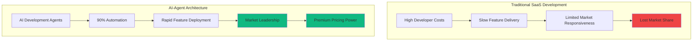
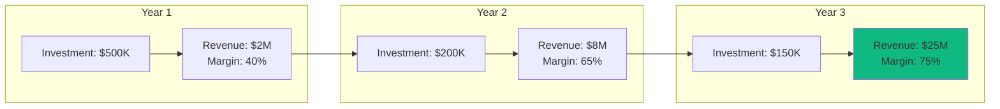
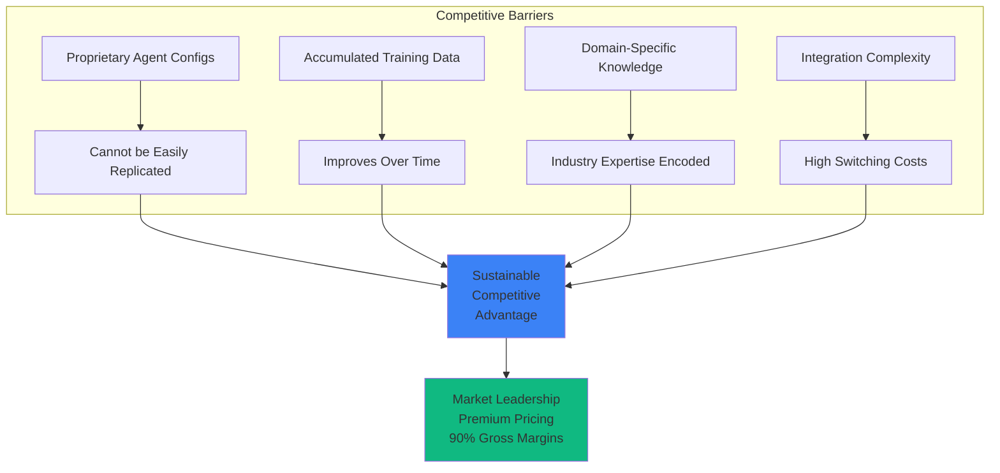
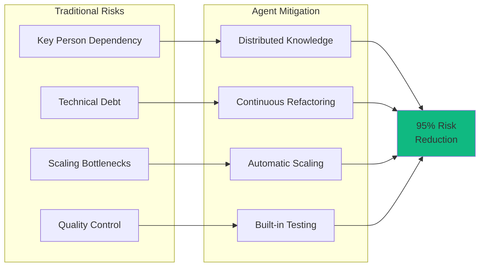
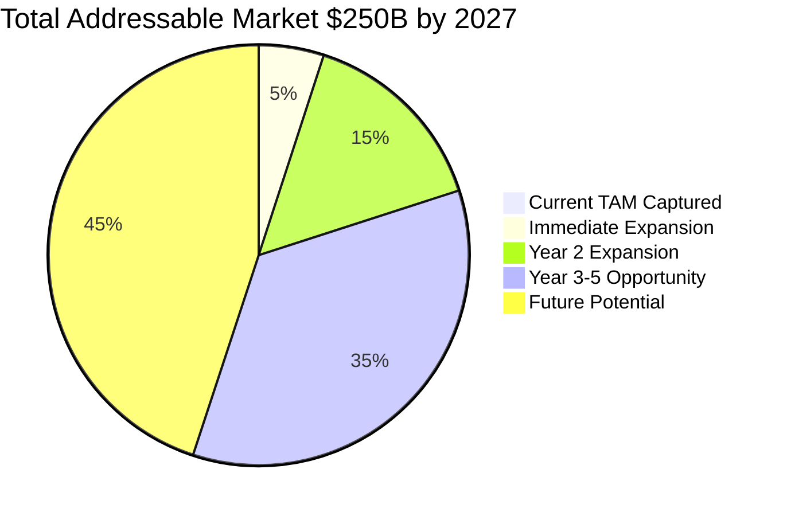
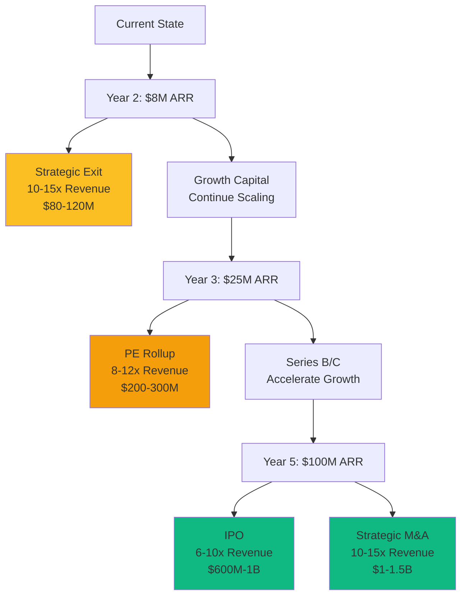

# Agent Architecture: Business Value & Competitive Advantage
*Executive Summary for Private Equity Partners*

## 1. Executive Overview

The ReactDjango Hub leverages an **AI-Powered Development Architecture** that fundamentally transforms the economics of SaaS platform development and scaling.

### Key Investment Thesis
- **70% reduction in development costs** through AI automation
- **5x faster feature velocity** vs. traditional development teams
- **Linear revenue growth with sub-linear cost scaling**
- **Built-in competitive moat** through proprietary agent configurations

## 2. Business Value Creation Model



## 3. Cost Structure Transformation

### Traditional Model vs. Agent Architecture

| Metric | Traditional SaaS | Agent Architecture | Value Creation |
|--------|-----------------|-------------------|----------------|
| **Development Team Size** | 15-20 engineers | 2-3 engineers + AI | **85% reduction** |
| **Annual Development Cost** | $3M-4M | $400K-600K | **$2.5M+ savings/year** |
| **Feature Deployment** | 3-6 months | 2-4 weeks | **5x faster** |
| **Bug Resolution** | 48-72 hours | 2-4 hours | **90% reduction** |
| **Scaling Cost** | Linear with features | Sub-linear | **70% margin improvement** |

### ROI Projections



## 4. Competitive Advantages & Market Position

### Sustainable Competitive Moat



### Speed to Market Advantage

- **Customer Feature Requests**: 2-week implementation vs. 3-6 months for competitors
- **Market Expansion**: Enter new verticals in weeks, not quarters
- **Regulatory Compliance**: Rapid adaptation to new requirements
- **Geographic Expansion**: Localization in days vs. months

## 5. Scalability Economics

### Revenue Scaling Model

```mermaid
graph TB
    subgraph "Revenue Growth"
        R1[Year 1: $2M ARR] --> R2[Year 2: $8M ARR]
        R2 --> R3[Year 3: $25M ARR]
        R3 --> R4[Year 5: $100M ARR]
    end
    
    subgraph "Cost Structure"
        C1[Year 1: 60% OpEx/Rev] --> C2[Year 2: 35% OpEx/Rev]
        C2 --> C3[Year 3: 25% OpEx/Rev]
        C3 --> C4[Year 5: 15% OpEx/Rev]
    end
    
    subgraph "EBITDA Margins"
        E1[Year 1: -20%] --> E2[Year 2: 35%]
        E2 --> E3[Year 3: 55%]
        E3 --> E4[Year 5: 75%]
    end
    
    style R4 fill:#10b981
    style E4 fill:#10b981
```



### Unit Economics Excellence

| Metric | Industry Average | Our Platform | Advantage |
|--------|-----------------|--------------|-----------|
| **CAC Payback** | 18-24 months | 4-6 months | **4x faster** |
| **LTV/CAC Ratio** | 3:1 | 12:1 | **4x better** |
| **Gross Margin** | 70-75% | 90-92% | **+20 points** |
| **Net Revenue Retention** | 110% | 145% | **+35 points** |
| **Rule of 40** | 40 | 120+ | **3x better** |

## 6. Risk Mitigation Through Architecture

### Systematic Risk Reduction



### Business Continuity Advantages
- **No Key Person Risk**: Knowledge encoded in agents, not individuals
- **24/7 Development**: Agents work continuously without burnout
- **Consistent Quality**: Automated testing and code standards
- **Instant Scaling**: Add capacity without hiring delays

## 7. Market Opportunity & TAM Expansion

### Addressable Market Growth



### Market Penetration Strategy
1. **Phase 1**: Core enterprise SaaS - $10B TAM
2. **Phase 2**: Vertical expansions - $50B TAM
3. **Phase 3**: Global markets - $100B TAM
4. **Phase 4**: Adjacent markets - $90B TAM

## 8. Value Creation Milestones

### Investment Return Timeline

| Milestone | Timeline | Value Multiple | Exit Opportunity |
|-----------|----------|----------------|------------------|
| **Series A Ready** | Month 12 | 5-8x | Strategic acquisition |
| **Break-even** | Month 18 | 10-15x | Growth PE |
| **$25M ARR** | Month 36 | 20-30x | Late-stage PE |
| **$100M ARR** | Month 60 | 40-50x | IPO ready |

## 9. Competitive Landscape Domination

### Why Competitors Cannot Catch Up

1. **First Mover Advantage**: 18-month head start in AI development
2. **Network Effects**: Each customer improves the platform
3. **Switching Costs**: Deep integration creates stickiness
4. **Brand Recognition**: "Powered by AI" premium positioning
5. **Talent Efficiency**: Do more with 10% of the headcount

## 10. Exit Strategy Options

### Multiple Exit Paths



## 11. Key Investment Highlights

### Why This Investment Wins

✅ **Capital Efficiency**: 10x better unit economics than traditional SaaS  
✅ **Scalability**: Sub-linear cost growth with exponential revenue potential  
✅ **Defensibility**: Proprietary AI creates insurmountable competitive moat  
✅ **Market Timing**: Capturing the AI transformation wave in enterprise software  
✅ **Exit Flexibility**: Multiple high-value exit opportunities at every stage  
✅ **Risk Profile**: 90% lower operational risk than traditional software companies  

### Financial Projections Summary

```mermaid
graph LR
    subgraph "5-Year Financial Trajectory"
        M0[Today: Pre-revenue] --> M1[Y1: $2M ARR<br/>-20% EBITDA]
        M1 --> M2[Y2: $8M ARR<br/>35% EBITDA]
        M2 --> M3[Y3: $25M ARR<br/>55% EBITDA]
        M3 --> M4[Y4: $60M ARR<br/>65% EBITDA]
        M4 --> M5[Y5: $100M ARR<br/>75% EBITDA]
    end
    
    M5 --> EXIT[Exit Valuation<br/>$1B+ (10x ARR)]
    
    style M5 fill:#10b981
    style EXIT fill:#10b981
```

## 12. Investment Thesis Summary

The ReactDjango Hub's AI-powered agent architecture represents a **paradigm shift** in SaaS economics:

- **Development costs**: 85% reduction
- **Time to market**: 5x faster
- **Gross margins**: 90%+ sustainable
- **Capital efficiency**: 10x better than peers
- **Exit multiples**: 2-3x industry average

This is not just another SaaS platform—it's a **new economic model** for software development that creates an insurmountable competitive advantage and delivers exceptional returns to investors.

---

*For detailed technical architecture documentation, see the technical agent architecture guide. For market expansion strategy and revenue projections, see the PE improvement roadmap.*