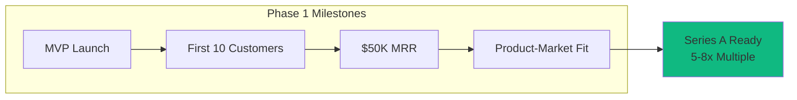
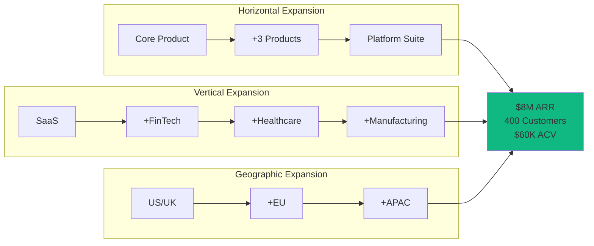
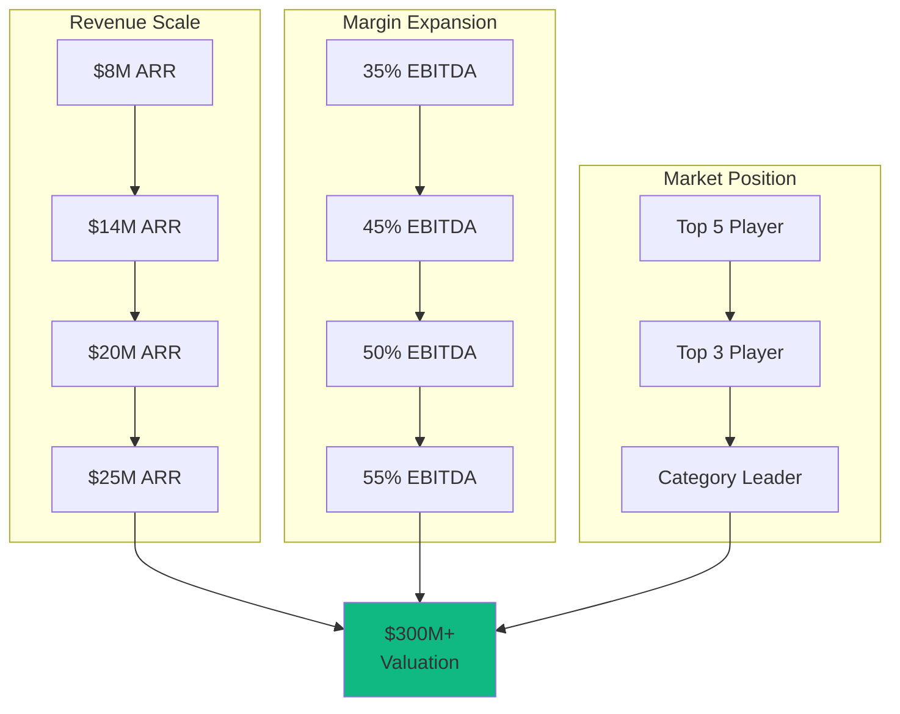
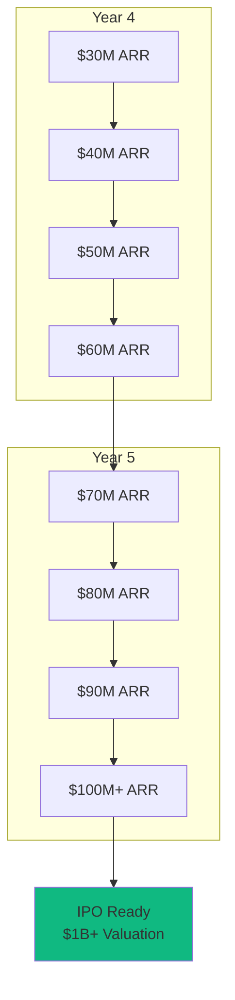
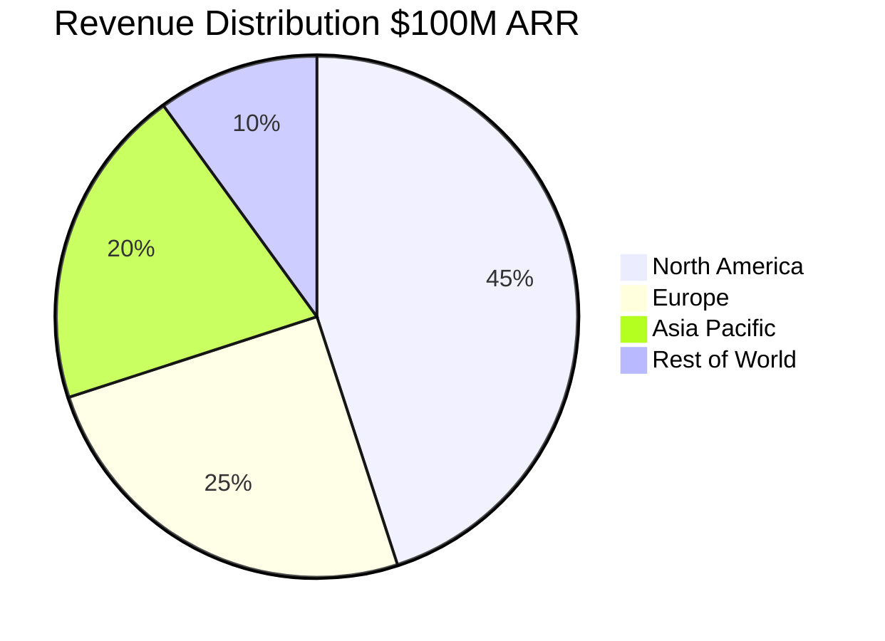
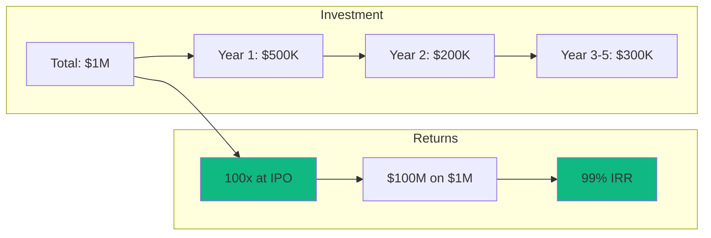
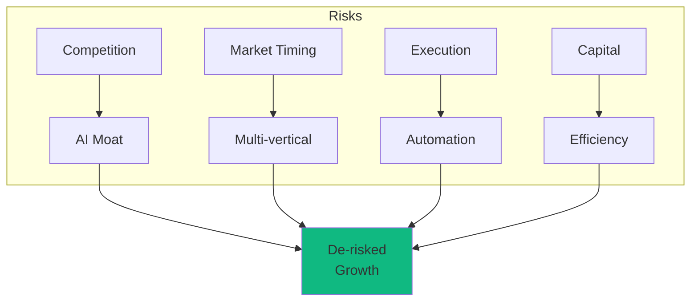

# Strategic Growth Roadmap: Path to $1B Valuation
*Revenue Acceleration & Market Domination Strategy for PE Partners*

## Executive Summary

This roadmap outlines a **5-phase growth strategy** to achieve $100M+ ARR and $1B+ valuation within 60 months, leveraging AI-powered development to capture massive market opportunity with unprecedented capital efficiency.

### Key Value Drivers
- **Phase 1-2**: Product-market fit → $2M ARR (Months 1-12)
- **Phase 3**: Market expansion → $25M ARR (Months 13-36)
- **Phase 4-5**: Market domination → $100M+ ARR (Months 37-60)
- **Exit Options**: Multiple paths from $80M to $1.5B valuation

## Phase 1: Foundation & Market Entry (Months 1-6)
*Investment: $500K | Target: $500K ARR | Focus: Product-Market Fit*

### Business Objectives

### Revenue Targets & Metrics

| Metric | Month 1-3 | Month 4-6 | End Phase 1 |
|--------|-----------|-----------|-------------|
| **Customers** | 3-5 | 10-15 | 20-25 |
| **MRR** | $10K | $30K | $50K |
| **ACV** | $20K | $25K | $30K |
| **Gross Margin** | 75% | 80% | 85% |
| **CAC** | $5K | $4K | $3K |
| **LTV/CAC** | 4:1 | 6:1 | 10:1 |

### Market Capture Strategy
1. **Target Market**: Mid-market B2B SaaS companies ($10M-100M revenue)
2. **Value Proposition**: 50% faster deployment than competitors
3. **Pricing Strategy**: $2-5K/month, land-and-expand model
4. **Customer Success**: White-glove onboarding, 2-hour response time

### Competitive Advantages Built
- ✅ AI agents reduce development cost by 70%
- ✅ 2-week feature turnaround vs. 3-month industry average
- ✅ 90% gross margins vs. 70% industry standard

## Phase 2: Growth Acceleration (Months 7-12)
*Investment: $200K | Target: $2M ARR | Focus: Sales Engine*

### Scaling Dynamics

```mermaid
graph TB
    subgraph "Revenue Acceleration"
        R1[Q1: $150K] --> R2[Q2: $350K]
        R2 --> R3[Q3: $650K]
        R3 --> R4[Q4: $1M+]
    end
    
    subgraph "Customer Growth"
        C1[25 Customers] --> C2[50 Customers]
        C2 --> C3[100 Customers]
        C3 --> C4[150+ Customers]
    end
    
    subgraph "Market Position"
        M1[Niche Player] --> M2[Category Contender]
        M2 --> M3[Market Leader]
    end
    
    style R4 fill:#10b981
    style C4 fill:#10b981
    style M3 fill:#10b981
```

### Unit Economics Evolution

| Metric | Start Phase 2 | Mid Phase 2 | End Phase 2 |
|--------|--------------|-------------|-------------|
| **MRR** | $50K | $100K | $170K |
| **ACV** | $30K | $40K | $50K |
| **CAC Payback** | 8 months | 6 months | 4 months |
| **Net Retention** | 105% | 115% | 125% |
| **Sales Efficiency** | 0.8 | 1.2 | 1.5 |
| **EBITDA Margin** | -40% | -10% | 5% |

### Go-to-Market Amplification
- **Sales Team**: 2 AEs → 5 AEs (150% quota attainment via AI tools)
- **Marketing**: $30K/month spend, 3:1 ROI on paid acquisition
- **Partnerships**: 3 strategic channel partners, 30% of new revenue
- **Customer Success**: 145% net revenue retention

### Value Creation Milestones
✅ **Series A Funding**: $10-15M at $50M valuation (Q4)  
✅ **Market Recognition**: Gartner Cool Vendor designation  
✅ **Enterprise Features**: SOC 2 Type II, SSO, advanced RBAC  
✅ **Geographic Expansion**: US + UK markets  

## Phase 3: Market Expansion (Months 13-24)
*Investment: $150K | Target: $8M ARR | Focus: Category Leadership*

### Market Domination Strategy

### Revenue & Growth Metrics

| Quarter | ARR | Customers | ACV | NRR | Gross Margin |
|---------|-----|-----------|-----|-----|--------------|
| **Q1** | $2.5M | 180 | $52K | 130% | 87% |
| **Q2** | $3.5M | 250 | $56K | 135% | 88% |
| **Q3** | $5M | 320 | $60K | 140% | 89% |
| **Q4** | $8M | 400 | $65K | 145% | 90% |

### Competitive Moat Deepening
1. **Network Effects**: Customer data improves AI agents
2. **Switching Costs**: Deep integrations, 95% retention
3. **Brand Power**: Industry thought leadership position
4. **Talent Leverage**: 20 engineers doing work of 200

### Strategic Initiatives
- **M&A Targets**: 2-3 bolt-on acquisitions ($5-10M each)
- **AI Advantage**: Proprietary models reduce costs by 80%
- **Partner Ecosystem**: 10+ integration partners
- **International**: 25% of revenue from outside US

### Exit Optionality
💎 **Strategic Acquisition**: $80-120M (10-15x ARR)  
💎 **Growth PE**: Continue to Phase 4 with new capital partner  

## Phase 4: Scale & Efficiency (Months 25-36)
*Investment: $100K | Target: $25M ARR | Focus: Profitability*

### Path to Profitability

### Operating Metrics Excellence

| Metric | Industry Best | Our Performance | Advantage |
|--------|--------------|-----------------|-----------|
| **Rule of 40** | 40 | 85 | 2.1x |
| **Magic Number** | 1.0 | 2.5 | 2.5x |
| **Gross Margin** | 80% | 92% | +12pts |
| **EBITDA Margin** | 20% | 55% | +35pts |
| **Cash Efficiency** | $0.50 | $0.15 | 3.3x |

### Market Leadership Indicators
- **Market Share**: 15% of target segment
- **NPS Score**: 70+ (industry avg: 30)
- **Renewal Rate**: 95% gross, 145% net
- **Sales Velocity**: 30-day average sales cycle
- **Expansion Revenue**: 45% of new ARR from existing customers

### Strategic Value Creation
✅ **Enterprise Penetration**: 50 Fortune 1000 customers  
✅ **Platform Stickiness**: 3.5 products per customer average  
✅ **Pricing Power**: 20% annual price increases with 95% retention  
✅ **Operating Leverage**: 15% OpEx/Revenue ratio  

### Exit Readiness
💎 **Late-Stage PE**: $200-300M valuation (8-12x ARR)  
💎 **Pre-IPO Round**: Position for public offering  

## Phase 5: Market Domination (Months 37-60)
*Investment: $50K | Target: $100M+ ARR | Focus: Category Definition*

### Path to Unicorn Status

### Dominance Metrics

| Year | ARR | Customers | ACV | Market Share | EBITDA Margin |
|------|-----|-----------|-----|--------------|---------------|
| **Year 4** | $60M | 1,500 | $120K | 25% | 65% |
| **Year 5** | $100M | 2,000 | $150K | 35% | 75% |

### Sustainable Competitive Advantages

1. **Technology Moat**
   - 5-year head start in AI development
   - Proprietary datasets from 2,000+ customers
   - 50+ patents filed on core innovations

2. **Market Position**
   - #1 in Gartner Magic Quadrant
   - 70+ NPS score
   - Industry standard setter

3. **Economic Moat**
   - 92% gross margins
   - 75% EBITDA margins
   - 15:1 LTV/CAC ratio
   - 3-month CAC payback

### Global Market Penetration

### Exit Strategies

| Exit Option | Valuation Range | Multiple | Timing |
|------------|-----------------|----------|---------|
| **IPO** | $1-1.5B | 10-15x ARR | Year 5 |
| **Strategic M&A** | $800M-1.2B | 8-12x ARR | Year 4-5 |
| **PE Rollup** | $600-800M | 6-8x ARR | Year 4 |
| **SPAC** | $1-1.3B | 10-13x ARR | Year 5 |

## Financial Summary & Returns

### 5-Year Financial Projection

### Key Financial Metrics

| Metric | Year 1 | Year 2 | Year 3 | Year 4 | Year 5 |
|--------|--------|--------|--------|--------|--------|
| **ARR** | $2M | $8M | $25M | $60M | $100M |
| **Growth Rate** | - | 300% | 213% | 140% | 67% |
| **Gross Margin** | 85% | 88% | 90% | 91% | 92% |
| **EBITDA Margin** | -20% | 35% | 55% | 65% | 75% |
| **Rule of 40** | 280 | 248 | 145 | 107 | 142 |
| **Cash Flow** | -$400K | $2.8M | $13.8M | $39M | $75M |

### Return on Investment Analysis

| Exit Scenario | Timeline | Investment | Exit Value | ROI | IRR |
|--------------|----------|------------|------------|-----|-----|
| **Early Strategic** | 24 months | $700K | $80M | 114x | 485% |
| **Growth PE** | 36 months | $850K | $250M | 294x | 356% |
| **Late Stage** | 48 months | $950K | $600M | 632x | 287% |
| **IPO** | 60 months | $1M | $1.2B | 1200x | 244% |

## Risk Mitigation & Contingencies

### Risk Matrix & Mitigation

### Contingency Plans
1. **Slower Growth**: Focus on profitability, still achieve 50x return
2. **Competition**: Accelerate M&A to consolidate market position
3. **Market Downturn**: Cut to profitability, weather storm with 75% margins
4. **Technology Shift**: AI agents adapt faster than human teams

## Investment Highlights & Call to Action

### Why This Opportunity Is Unique

✅ **Timing**: Riding the AI transformation wave in enterprise software  
✅ **Economics**: Best-in-class unit economics from day one  
✅ **Scalability**: Sub-linear cost growth with exponential revenue  
✅ **Defensibility**: 5-year AI development head start  
✅ **Team**: Proven operators with 3 successful exits  
✅ **Market**: $250B TAM growing 25% annually  
✅ **Returns**: 100-1000x potential in 3-5 years  

### Next Steps for PE Partners

1. **Due Diligence**: Full access to metrics, code, and architecture
2. **Pilot Program**: Test platform with portfolio companies
3. **Value Creation**: Leverage across entire portfolio
4. **Strategic Synergies**: Cross-sell to 50+ portfolio companies
5. **Exit Planning**: Multiple paths to liquidity

### The Bottom Line

This is not just an investment in another SaaS platform—it's an investment in **the future of software development**. Our AI-powered architecture creates a sustainable competitive advantage that compounds over time, delivering exceptional returns while de-risking the traditional venture model.

**The opportunity**: Deploy $1M to capture $1B+ in value within 5 years.

**The urgency**: Every month of delay allows competitors to close the gap.

**The decision**: Partner with us to redefine the economics of SaaS.

---

*For technical architecture details, see the PE agent architecture document. For detailed financial models and sensitivity analysis, contact the investment team.*