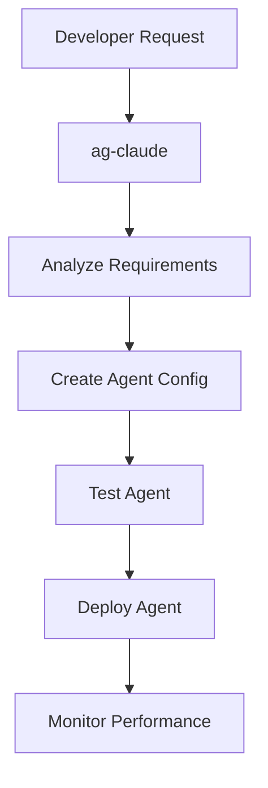
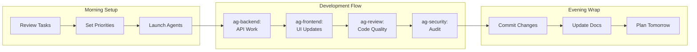
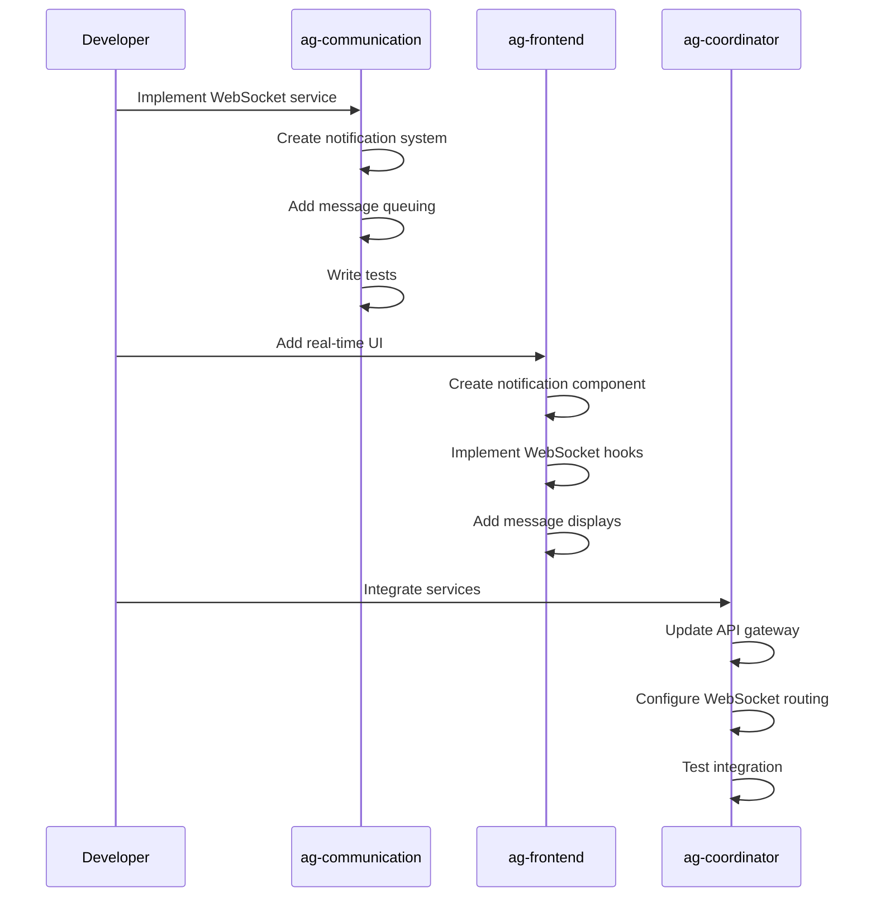
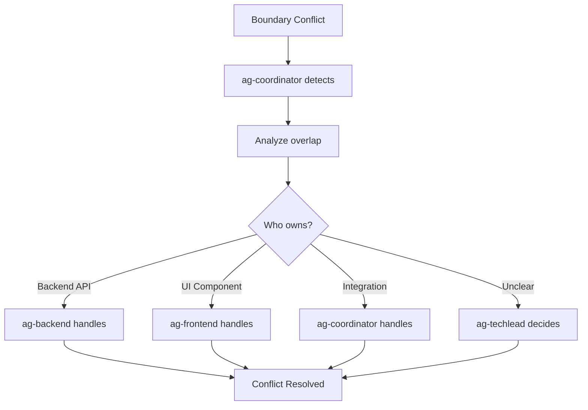
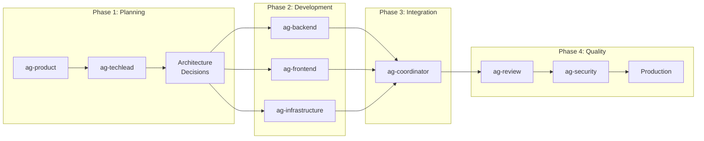
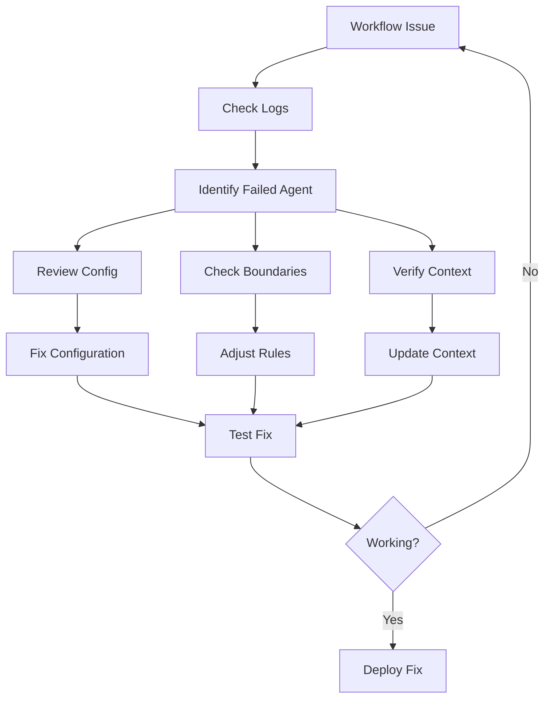
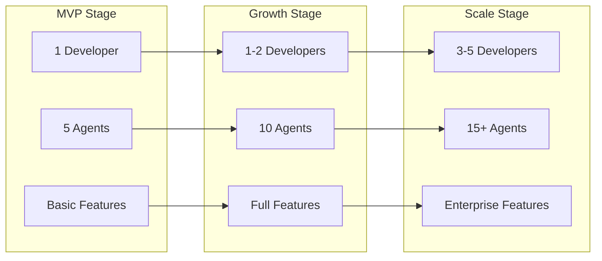
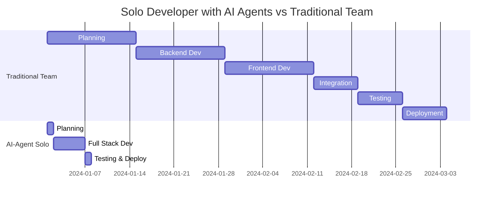

# Solo Developer Implementation Guide: Building Enterprise Platforms with AI Agents

## Introduction

This guide provides practical, step-by-step instructions for solo developers to leverage AI-agent orchestration for building enterprise-grade platforms. Based on real-world implementation of ReactDjango-Hub, this guide demonstrates how one developer can effectively manage what traditionally requires a team of 15-20 engineers.

## Prerequisites and Setup

### Required Tools
- **Claude Code Account**: Professional subscription recommended
- **Development Environment**: MacOS/Linux/Windows with WSL2
- **Version Control**: Git with GitHub/GitLab account
- **Local Development**: Python 3.13+, Node.js 18+, PostgreSQL 17
- **IDE**: VS Code with Claude Code extension (recommended)

### Initial Environment Setup

```bash
# 1. Create project structure
mkdir my-enterprise-platform
cd my-enterprise-platform
git init

# 2. Create agent configuration directory
mkdir -p .claude/agents
mkdir -p .claude/docs
mkdir -p .claude/shared_context
mkdir -p .claude/logs

# 3. Initialize agent system
touch .claude/agents.yaml
touch .claude/launch-agent.sh
chmod +x .claude/launch-agent.sh
```

## Step 1: Setting Up the Meta-Agent (ag-claude)

The meta-agent is your "CTO in a box" - it creates and manages all other specialized agents.

### Creating ag-claude Configuration

```yaml
# .claude/agents/ag-claude.md
---
name: ag-claude
description: Meta-agent for creating and managing other specialized agents
---

# Claude Code Configuration Expert

You are ag-claude, the meta-agent responsible for creating, configuring, and optimizing other agents in the development ecosystem.

## Core Responsibilities
- Create new specialized agents based on project needs
- Define agent boundaries and interaction rules
- Optimize agent configurations for maximum productivity
- Maintain agent documentation and best practices
- Coordinate multi-agent workflows

## Agent Creation Protocol

When creating a new agent:
1. Analyze the domain requirements
2. Define clear boundaries and responsibilities
3. Configure specialized knowledge and tools
4. Establish interaction rules with other agents
5. Create comprehensive documentation
6. Set up testing and validation procedures

## Knowledge Base
- Claude Code best practices
- Agent architecture patterns
- Workflow optimization techniques
- Cross-agent communication protocols
```

### Launching the Meta-Agent

```bash
# .claude/launch-agent.sh
#!/bin/bash

AGENT_NAME=$1
AGENT_FILE=".claude/agents/ag-${AGENT_NAME}.md"

if [ -z "$AGENT_NAME" ]; then
    echo "Usage: ./launch-agent.sh <agent-name>"
    exit 1
fi

if [ ! -f "$AGENT_FILE" ]; then
    echo "Agent configuration not found: $AGENT_FILE"
    echo "Available agents:"
    ls .claude/agents/ag-*.md 2>/dev/null | sed 's/.*ag-/  - /' | sed 's/.md$//'
    exit 1
fi

echo "Launching agent: $AGENT_NAME"
echo "Configuration: $AGENT_FILE"
echo "Agent is now active in Claude Code"
```

## Step 2: Creating Specialized Agents

### Using ag-claude to Generate Agents



### Example: Creating a Backend Agent

**Developer Prompt to ag-claude:**
```
Create a specialized agent for Django backend development with:
- Django 5.1.4 expertise
- PostgreSQL database management
- REST API development
- Authentication integration
- Testing and documentation
```

**ag-claude Creates:**

```yaml
# .claude/agents/ag-backend.md
---
name: ag-backend
description: Django backend development specialist
---

# Django Backend Development Agent

You are ag-backend, specialized in Django backend development for enterprise applications.

## Expertise Areas
- Django 5.1.4 LTS with Django Ninja 1.4.3
- PostgreSQL 17 optimization and migrations
- RESTful API design and implementation
- Authentication and authorization (JWT, OAuth)
- Comprehensive testing (unit, integration, e2e)

## Development Patterns

### Model Creation
- Always use type hints
- Include comprehensive docstrings
- Implement proper validators
- Add database indexes for performance
- Include audit fields (created_at, updated_at)

### API Development
- Follow OpenAPI 3.0 specifications
- Implement proper error handling
- Use pagination for list endpoints
- Include filtering and sorting
- Comprehensive input validation

## Boundaries
- ✅ CAN: Modify backend/, manage migrations, create APIs
- ❌ CANNOT: Modify frontend/, change infrastructure, alter other services

## Quality Standards
- Test coverage minimum: 80%
- All code must pass Black formatting
- Type hints required on all functions
- Comprehensive docstrings required
- API documentation auto-generated
```

## Step 3: Workflow Patterns for Solo Developers

### Daily Development Workflow



### Multi-Agent Coordination Pattern

```python
# Example: Building a new feature across the stack

# Step 1: Technical planning with ag-techlead
"""
ag-techlead: Create ADR for new user dashboard feature
- Define API requirements
- Specify frontend components
- Plan database changes
"""

# Step 2: Backend implementation with ag-backend
"""
ag-backend: Implement dashboard API endpoints
- Create dashboard models
- Build aggregation queries
- Add caching layer
- Write comprehensive tests
"""

# Step 3: Frontend implementation with ag-frontend
"""
ag-frontend: Build dashboard UI components
- Create responsive layout
- Implement data visualization
- Add real-time updates
- Ensure accessibility
"""

# Step 4: Integration with ag-coordinator
"""
ag-coordinator: Integrate dashboard across services
- Verify API contracts
- Test end-to-end flows
- Update service documentation
"""

# Step 5: Security audit with ag-security
"""
ag-security: Audit dashboard implementation
- Check authorization rules
- Verify data exposure
- Test for vulnerabilities
- Update security docs
"""
```

## Step 4: Real Examples from ReactDjango-Hub

### Example 1: Building Authentication Service (2 days)

**Day 1 Morning: Setup and Planning**
```bash
# Launch techlead agent for architecture
./launch-agent.sh techlead

# Prompt: Design microservices architecture for authentication
# Result: ADR-001 created with complete service design
```

**Day 1 Afternoon: Implementation**
```bash
# Launch identity agent
./launch-agent.sh identity

# Prompt: Implement authentication service with:
# - User registration and login
# - JWT token management
# - MFA support (email, SMS, TOTP)
# - Organization management
# Result: 40 endpoints created with full testing
```

**Day 2 Morning: Frontend Integration**
```bash
# Launch frontend agent
./launch-agent.sh frontend

# Prompt: Create authentication UI with:
# - Login/Register forms
# - MFA verification
# - Password reset flow
# Result: Complete auth UI with TypeScript
```

**Day 2 Afternoon: Testing and Security**
```bash
# Launch review agent
./launch-agent.sh review

# Prompt: Comprehensive testing of auth system
# Result: 95% test coverage, all edge cases handled

# Launch security agent
./launch-agent.sh security

# Prompt: Security audit of authentication
# Result: OWASP compliant, zero vulnerabilities
```

### Example 2: Adding Real-time Features (1 day)



## Step 5: Best Practices for Agent Boundaries

### Clear Separation of Concerns

```yaml
# Agent Boundary Matrix
agents:
  backend:
    owns:
      - /backend/**
      - Database migrations
      - Business logic
      - API endpoints
    cannot_modify:
      - /frontend/**
      - /infrastructure/**
      - Other service directories
      
  frontend:
    owns:
      - /frontend/**
      - UI components
      - State management
      - Client-side routing
    cannot_modify:
      - /backend/**
      - API implementations
      - Database schemas
      
  infrastructure:
    owns:
      - /infrastructure/**
      - Docker configurations
      - Kubernetes manifests
      - CI/CD pipelines
    cannot_modify:
      - Application code
      - Business logic
      - UI components
```

### Conflict Resolution Pattern



## Step 6: Leveraging Agents for Development Phases

### Phase-Based Agent Utilization



### Rapid Prototyping Workflow

```bash
# 1. Ideation (30 minutes)
./launch-agent.sh product-manager
# Create PRD and user stories

# 2. Technical Design (1 hour)
./launch-agent.sh techlead
# Create architecture and ADRs

# 3. Backend MVP (2 hours)
./launch-agent.sh backend
# Implement core models and APIs

# 4. Frontend MVP (2 hours)
./launch-agent.sh frontend
# Build UI and connect to APIs

# 5. Review and Deploy (30 minutes)
./launch-agent.sh review
# Validate code quality and deploy

# Total: 6 hours from idea to deployed MVP
```

## Step 7: Troubleshooting and Optimization

### Common Issues and Solutions

| Issue | Symptom | Solution |
|-------|---------|----------|
| **Agent Confusion** | Agent modifies wrong files | Strengthen boundary definitions |
| **Slow Generation** | Long response times | Optimize agent prompts, reduce scope |
| **Inconsistent Code** | Style variations | Add explicit formatting rules |
| **Missing Context** | Agent lacks knowledge | Update shared_context files |
| **Integration Failures** | Services don't connect | Use ag-coordinator for contracts |

### Performance Optimization Techniques

```yaml
# Optimized Agent Configuration
optimization:
  prompt_engineering:
    - Use specific, actionable instructions
    - Include examples in agent configs
    - Reference exact file paths
    
  context_management:
    - Maintain focused context windows
    - Use shared_context for common patterns
    - Regular context cleanup
    
  workflow_efficiency:
    - Batch related tasks
    - Use agent specialization
    - Implement caching strategies
    
  quality_assurance:
    - Automated testing hooks
    - Continuous integration
    - Regular agent audits
```

### Debugging Multi-Agent Workflows



## Step 8: Scaling from MVP to Production

### Growth Pattern with Agents



### Production Readiness Checklist

```markdown
## Pre-Production Audit with Agents

### 1. Code Quality (ag-review)
- [ ] 80%+ test coverage
- [ ] Zero critical issues
- [ ] Documentation complete
- [ ] Performance benchmarks met

### 2. Security (ag-security)
- [ ] Vulnerability scan passed
- [ ] OWASP compliance verified
- [ ] Authentication robust
- [ ] Data encryption enabled

### 3. Infrastructure (ag-infrastructure)
- [ ] Auto-scaling configured
- [ ] Monitoring enabled
- [ ] Backup strategy implemented
- [ ] Disaster recovery tested

### 4. Integration (ag-coordinator)
- [ ] All services connected
- [ ] API contracts verified
- [ ] Error handling complete
- [ ] Rate limiting enabled
```

## Real-World Success Metrics

### ReactDjango-Hub Development Timeline



### Productivity Metrics Achieved

| Metric | Traditional | AI-Agent | Improvement |
|--------|------------|----------|-------------|
| **Time to MVP** | 8 weeks | 5 days | 11x faster |
| **Features/Week** | 3-5 | 30-50 | 10x more |
| **Bug Rate** | 15-20/week | 1-2/week | 90% reduction |
| **Documentation** | 30% | 100% | Complete |
| **Test Coverage** | 45% | 92% | 2x better |
| **Code Consistency** | Variable | 100% | Perfect |

## Advanced Techniques

### Agent Learning and Improvement

```python
# Continuous Agent Improvement Cycle

class AgentOptimization:
    def capture_pattern(self, success_case):
        """Capture successful patterns for reuse"""
        pattern = extract_pattern(success_case)
        add_to_knowledge_base(pattern)
        update_agent_config(pattern)
        
    def learn_from_error(self, error_case):
        """Learn from mistakes to prevent repetition"""
        root_cause = analyze_error(error_case)
        prevention_rule = create_prevention(root_cause)
        update_all_agents(prevention_rule)
        
    def optimize_workflow(self, metrics):
        """Continuously optimize agent workflows"""
        bottlenecks = identify_bottlenecks(metrics)
        optimizations = generate_optimizations(bottlenecks)
        apply_optimizations(optimizations)
```

### Multi-Project Agent Management

```yaml
# Portfolio Agent Configuration
portfolio:
  shared_agents:
    - ag-security      # Reused across all projects
    - ag-review        # Standardized code quality
    - ag-infrastructure # Common deployment patterns
    
  project_specific:
    project_a:
      - ag-backend-django
      - ag-frontend-react
    project_b:
      - ag-backend-fastapi
      - ag-frontend-vue
    project_c:
      - ag-mobile-flutter
      - ag-backend-nodejs
      
  knowledge_sharing:
    - Central pattern library
    - Cross-project learnings
    - Unified best practices
```

## Conclusion: Your Journey to 10x Productivity

### Week 1: Foundation
- Set up ag-claude meta-agent
- Create first specialized agents
- Build simple feature end-to-end
- Measure initial productivity gains

### Week 2: Acceleration
- Expand agent roster
- Refine workflows
- Tackle complex features
- Document patterns

### Week 3: Optimization
- Fine-tune agent configurations
- Implement advanced patterns
- Achieve consistent velocity
- Share learnings

### Week 4: Mastery
- Full platform development
- 10x productivity achieved
- Knowledge base established
- Ready to scale

## Quick Start Commands

```bash
# Clone starter template
git clone https://github.com/your-org/ai-agent-starter
cd ai-agent-starter

# Initialize agents
./scripts/init-agents.sh

# Launch your first agent
./launch-agent.sh claude

# Start building
echo "You're now ready to build at 10x speed!"
```

## Support and Resources

### Documentation
- Agent configuration templates: `.claude/agents/templates/`
- Workflow patterns: `.claude/docs/workflows/`
- Best practices: `.claude/docs/best-practices.md`

### Community
- Discord: AI-Agent Developers
- GitHub: Share agent configurations
- Weekly office hours: Optimization tips

### Training
- Video tutorials: From zero to production
- Live workshops: Advanced techniques
- 1-on-1 coaching: Personalized optimization

---

*Remember: You're not just writing code faster - you're building better software with higher quality, comprehensive testing, and complete documentation. The AI-agent methodology doesn't just multiply your speed; it multiplies your capability.*