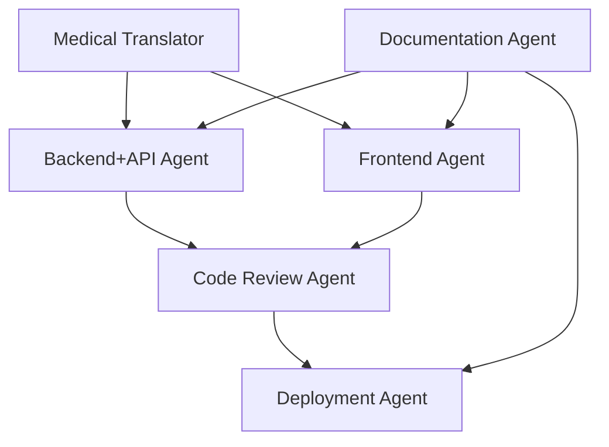

# Vue d'Ensemble des Agents Claude Code

> **Système d'agents spécialisés pour le développement SaaS médical français**

## 🤖 Agents Actifs

### 🔧 Backend + API Agent
**Rôle**: Développeur Django Full-Stack avec expertise API et conformité RGPD

**Responsabilités**:
- **Django Backend**: Models, migrations, database design
- **APIs REST**: DRF + Django Ninja endpoints, serializers  
- **Documentation API**: OpenAPI/Swagger, testing, validation
- **Conformité RGPD**: Chiffrement, audit logging, permissions
- **Tests**: Unit, integration, API testing

**Contexte Médical**: Spécialisé marché français, terminologie chirurgicale, Code de la santé publique

**Fichier**: [`.claude/agents/backend-agent.md`](../../.claude/agents/backend-agent.md)

### 🎨 Frontend Agent  
**Rôle**: Développeur React spécialisé UI médicale trilingue

**Responsabilités**:
- **Composants React**: Interface médical français-first
- **Trilingue**: FR (primaire) → DE → EN support
- **UX Médical**: Design adapté professionnels santé
- **Accessibilité**: RGAA conformité

**Contexte Médical**: Terminologie médicale française, workflows chirurgiens

**Fichier**: [`.claude/agents/frontend-agent.md`](../../.claude/agents/frontend-agent.md)

### 🌐 Medical Translator Agent
**Rôle**: Traducteur médical spécialisé terminologie chirurgicale

**Responsabilités**:
- **Traduction FR → DE → EN**: Terminologie médicale précise
- **Glossaire Chirurgical**: Procédures, instruments, diagnostics
- **Cohérence Terminologique**: Uniformité inter-langues
- **Contexte Médical**: Préservation sens clinique

**Spécialisation**: Pratique chirurgicale, interventions, anesthésie

**Fichier**: [`.claude/agents/medical-translator-agent.md`](../../.claude/agents/medical-translator-agent.md)

### ⚖️ Code Review Agent
**Rôle**: Auditeur qualité et conformité RGPD

**Responsabilités**:
- **Review Sécurité**: Validation chiffrement données sensibles
- **Conformité RGPD**: Vérification Article 9 données médicales
- **Qualité Code**: Standards Django et React
- **Performance**: Optimisation requêtes et rendu

**Focus**: Audit médical, traçabilité, sécurité sanitaire

**Fichier**: [`.claude/agents/code-review-agent.md`](../../.claude/agents/code-review-agent.md)

### 🚀 Deployment Agent
**Rôle**: DevOps spécialisé infrastructure médicale sécurisée

**Responsabilités**:
- **AWS Infrastructure**: EC2, RDS, ElastiCache configuration
- **Sécurité Cloud**: Chiffrement transit/repos, VPC isolation
- **Monitoring**: Santé système, conformité RGPD
- **CI/CD**: Pipelines automated testing et déploiement

**Expertise**: EC2 CLI avancé, infrastructure médical-grade

**Fichier**: [`.claude/agents/deployment-agent.md`](../../.claude/agents/deployment-agent.md)

### 📝 Documentation Agent
**Rôle**: Gestionnaire documentation technique et utilisateur

**Responsabilités**:
- **Documentation API**: Swagger/OpenAPI maintenance
- **Guides Utilisateur**: Manuels chirurgiens français  
- **Architecture**: Diagrammes techniques
- **Conformité**: Documentation RGPD/CNIL

**Langues**: Français (primaire), Allemand, Anglais

**Fichier**: [`.claude/agents/documentation-agent.md`](../../.claude/agents/documentation-agent.md)

## 🔄 Workflow Agents

### Coordination Multi-Agents


### Responsabilités Commits

**Backend + API Agent**:
- ✅ Models Django + migrations
- ✅ Serializers DRF + endpoints Ninja
- ✅ Tests backend + API
- ✅ Documentation OpenAPI

**Frontend Agent**:
- ✅ Composants React trilingues
- ✅ Styles CSS/Tailwind
- ✅ Tests composants Vitest
- ✅ Intégration APIs

**Deployment Agent**:
- ✅ Configuration infrastructure
- ✅ Scripts déploiement
- ✅ Monitoring setup
- ✅ CI/CD pipelines

## 🎯 Utilisation Agents

### Lancement Individual
```bash
# Backend + API development
make claude-backend-api

# Frontend development  
make claude-frontend

# All agents parallel
make claude-agents
```

### VS Code Integration
- **Command Palette**: `Tasks: Run Task` → Select agent
- **Terminal Profiles**: Dropdown → Agent terminal
- **Keyboard Shortcuts**: `Cmd+Shift+P` → Agent tasks

### Git Worktrees
```bash
# Backend + API worktree
git worktree add ../ReactDjango-Hub-worktrees/backend-dev feature/backend-development

# Frontend worktree  
git worktree add ../ReactDjango-Hub-worktrees/frontend-dev feature/frontend-development
```

## 📊 Performance Agents

### Benchmarks Génération Code
- **Backend Agent**: Models < 10s, APIs < 8s
- **Frontend Agent**: Composants < 12s, Forms < 8s
- **Medical Translator**: Termes < 2s, UI < 7s

### Métriques Qualité
- **Conformité RGPD**: 95%+ validation automatique
- **Couverture Tests**: 80%+ backend, 70%+ frontend
- **Documentation**: 100% endpoints API documentés

## 🛠️ Configuration Agents

Tous les agents sont pré-configurés pour:
- **Marché Français**: Première langue, réglementation RGPD
- **Contexte Médical**: Terminologie chirurgicale, workflows santé
- **Qualité Code**: Standards Django/React, sécurité médicale
- **Trilingue**: Support FR/DE/EN avec français prioritaire

---

*Documentation agents maintenue automatiquement lors des mises à jour de configuration*