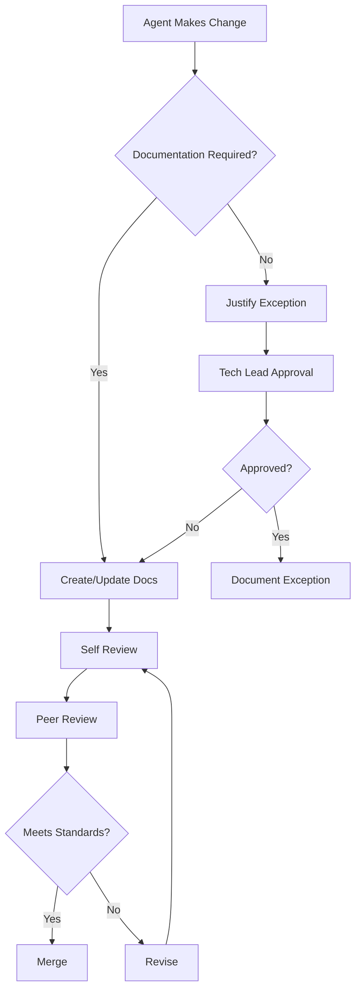
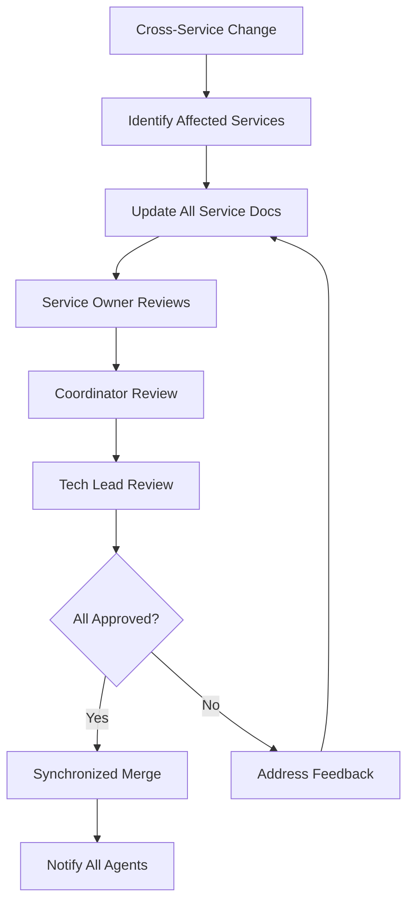

# Technical Lead Agent - Documentation Governance Hub

**Agent**: ag-techlead  
**Authority**: Documentation Architecture & Enforcement  
**Last Updated**: September 11, 2025

## 📋 Executive Summary

The Technical Lead agent serves as the **Chief Documentation Architect** for the ReactDjango Hub platform, with full authority to:
- Define and enforce documentation standards
- Review and approve documentation changes
- Audit documentation quality and coverage
- Resolve documentation conflicts between agents
- Train and guide agents on best practices

## 🎯 Documentation Governance Authority

### **Enforcement Powers**
1. **Standards Definition**: Create and maintain documentation standards
2. **Quality Gates**: Implement documentation review checkpoints
3. **Compliance Monitoring**: Track and report documentation metrics
4. **Escalation Authority**: Enforce documentation requirements
5. **Conflict Resolution**: Arbitrate documentation disputes

### **Review Responsibilities**
- All architectural documentation changes
- Cross-service documentation updates
- Documentation structure modifications
- Style guide and template changes
- Documentation tool selections

## 📐 Documentation Organization Structure

### **Primary Documentation Hierarchy**
```
docs/
├── architecture/           # Strategic technical decisions (OWNER: Tech Lead)
│   ├── adr/               # Architecture Decision Records
│   ├── patterns/          # Cross-cutting patterns
│   └── agents/            # Agent-specific guides
├── services/              # Service documentation (OWNER: Service Agents)
│   ├── backend/           # Django service docs
│   ├── frontend/          # React app docs
│   ├── identity/          # Auth service docs
│   └── [other-services]/  # Other microservice docs
├── agents/                # Agent documentation (OWNER: Each Agent)
│   ├── techlead/          # This directory
│   ├── backend/           # Backend agent docs
│   ├── frontend/          # Frontend agent docs
│   └── [other-agents]/    # Other agent docs
└── operations/            # Operational docs (OWNER: Infrastructure)
    ├── deployment/        # Deployment procedures
    ├── monitoring/        # Monitoring setup
    └── runbooks/          # Operational runbooks
```

### **Documentation Ownership Matrix**

| Documentation Type | Primary Owner | Contributors | Reviewer | Approver |
|-------------------|---------------|--------------|----------|----------|
| **Architecture** | Tech Lead | All Agents | Tech Lead | Tech Lead |
| **Service APIs** | Service Agent | Consumers | Coordinator | Service Agent |
| **User Guides** | Service Agent | PM Agents | Tech Lead | Product Owner |
| **Infrastructure** | Infrastructure | Service Agents | Tech Lead | Infrastructure |
| **Security** | Security Agent | All Agents | Security | Tech Lead |
| **Integration** | Coordinator | Service Agents | Tech Lead | Coordinator |

## 📖 Documentation Standards & Requirements

### **Mandatory Documentation for All Changes**

#### **Code Changes**
- [ ] Updated README files
- [ ] API documentation (OpenAPI/Swagger)
- [ ] Code comments for complex logic
- [ ] Configuration documentation
- [ ] Migration guides for breaking changes

#### **Feature Additions**
- [ ] User documentation
- [ ] Technical documentation
- [ ] API endpoint documentation
- [ ] Integration guides
- [ ] Example code/usage

#### **Infrastructure Changes**
- [ ] Deployment documentation
- [ ] Configuration changes
- [ ] Scaling implications
- [ ] Security impacts
- [ ] Rollback procedures

### **Documentation Quality Standards**

#### **Content Requirements**
- **Accuracy**: 100% technical correctness
- **Completeness**: All aspects covered
- **Clarity**: Readable by target audience
- **Currency**: Updated with each change
- **Consistency**: Follows style guide

#### **Format Requirements**
- **Markdown**: Primary format for all docs
- **Diagrams**: Mermaid or PlantUML
- **API Specs**: OpenAPI 3.0+
- **Version Control**: All docs in Git
- **Linking**: Cross-references validated

## 🔄 Documentation Workflows

### **Standard Documentation Flow**


### **Cross-Service Documentation Flow**


## 📊 Documentation Metrics & Reporting

### **Key Performance Indicators**
- Documentation Coverage: Target >90%
- API Documentation: Target 100%
- Documentation Freshness: Target <30 days
- Quality Score: Target >85%
- Broken Links: Target 0

### **Reporting Schedule**
- **Daily**: Broken link checks
- **Weekly**: Coverage reports
- **Monthly**: Quality assessments
- **Quarterly**: Comprehensive audits

### **Metrics Dashboard**
Access documentation metrics at: `/docs/agents/techlead/documentation-metrics.md`

## 🚨 Enforcement & Escalation

### **Enforcement Levels**

#### **Level 1: Automated Reminder** (Day 1)
- System notification to responsible agent
- Documentation requirements provided
- Templates and examples shared

#### **Level 2: Technical Review** (Day 3)
- Tech Lead reviews gaps
- Direct guidance provided
- Timeline established

#### **Level 3: Formal Escalation** (Day 7)
- Documentation debt tracked
- Priority increased
- Resources allocated

#### **Level 4: Feature Blocking** (Day 14)
- Non-critical work blocked
- Focus on documentation
- Daily progress reviews

### **Compliance Tracking**
All documentation compliance is tracked in:
- `/docs/agents/techlead/documentation-enforcement-checklist.md`
- `/docs/agents/techlead/documentation-metrics.md`

## 🎓 Training & Resources

### **Documentation Training Program**

#### **Onboarding** (New Agents)
1. Documentation standards overview
2. Tool training (Markdown, Mermaid, etc.)
3. Template walkthrough
4. Practice exercises
5. Certification checklist

#### **Ongoing Training** (All Agents)
- Monthly best practices sessions
- Quarterly workshops
- Annual documentation summit
- Continuous feedback loops

### **Documentation Resources**
- **Templates**: `/docs/agents/techlead/documentation-templates/`
- **Style Guide**: `/docs/DOCUMENTATION-STYLE-GUIDE.md`
- **Examples**: `/docs/agents/techlead/documentation-examples/`
- **Tools**: `/docs/agents/techlead/documentation-tools.md`

## 🤝 Agent Collaboration

### **Documentation Responsibilities by Agent**

| Agent | Primary Documentation | Review Duties | Training Needs |
|-------|----------------------|---------------|----------------|
| **Backend** | Django APIs, Models | Frontend integration | API documentation |
| **Frontend** | React components, UI | Backend integration | Component docs |
| **Identity** | Auth flows, Security | All integrations | Security docs |
| **Infrastructure** | Deployment, Scaling | Service requirements | Operations docs |
| **Coordinator** | Integration, Gateway | All services | Integration patterns |
| **Security** | Security controls | All changes | Compliance docs |
| **Reviewer** | Code quality | Documentation quality | Review standards |

### **Collaboration Protocols**
1. **Weekly Sync**: Documentation status review
2. **PR Reviews**: Documentation check required
3. **Shared Templates**: Consistent format
4. **Knowledge Sharing**: Best practices exchange
5. **Conflict Resolution**: Tech Lead arbitration

## 📈 Continuous Improvement

### **Feedback Mechanisms**
- Agent surveys (monthly)
- Documentation effectiveness metrics
- User satisfaction scores
- Time-to-find metrics
- Support ticket analysis

### **Improvement Process**
1. Collect feedback continuously
2. Analyze patterns quarterly
3. Propose improvements
4. Test with pilot group
5. Roll out platform-wide
6. Measure impact

### **Innovation Areas**
- Documentation automation
- AI-assisted documentation
- Interactive documentation
- Video documentation
- Real-time collaboration

## 🔗 Quick Links

### **Essential Documents**
- [Documentation Enforcement Checklist](./documentation-enforcement-checklist.md)
- [Documentation Metrics](./documentation-metrics.md)
- [Platform Architecture](/docs/architecture/platform-architecture-v2.md)
- [Documentation Guide](/docs/DOCUMENTATION-GUIDE.md)

### **Agent Guides**
- [Backend Agent Docs](/docs/agents/backend/)
- [Frontend Agent Docs](/docs/agents/frontend/)
- [Infrastructure Agent Docs](/docs/agents/infrastructure/)
- [Security Agent Docs](/docs/agents/security/)

### **Tools & Templates**
- [ADR Template](/docs/architecture/adr/template.md)
- [API Documentation Template](/docs/templates/api-template.md)
- [Service README Template](/docs/templates/service-readme.md)

## 📞 Contact & Support

For documentation questions or issues:
1. Check this guide first
2. Review relevant templates
3. Consult with Tech Lead agent
4. Submit documentation request
5. Attend office hours

---

**Remember**: Documentation is not an afterthought—it's an integral part of every change. The Technical Lead agent has full authority to enforce documentation standards and will use that authority to maintain the quality and completeness of our platform documentation.

**Enforcement Notice**: All agents must comply with documentation standards. Non-compliance will result in escalation and potential blocking of features.