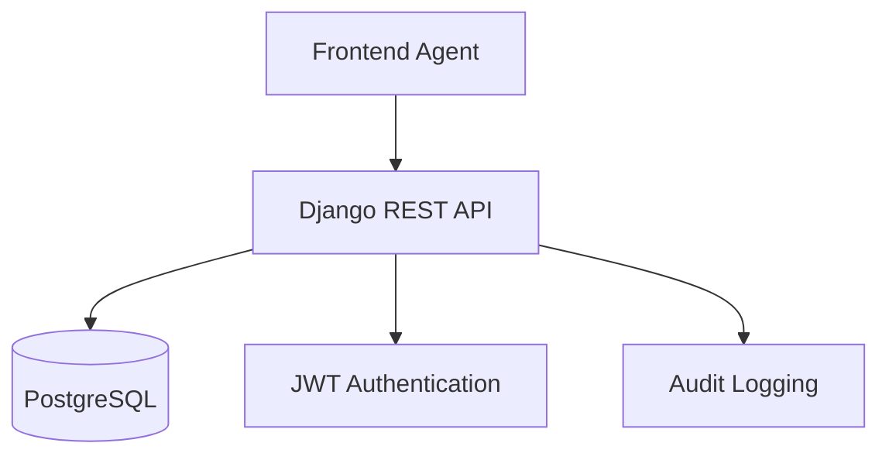

# API Contract Documentation

Shared API contract between Backend and Frontend Agents to ensure consistency and synchronization.

## 🔗 **Architecture API**



## 📋 **Communication Contract**

### Backend Agent Responsibilities
- Maintain `backend/docs/api/README.md` with all endpoints
- Auto-generate OpenAPI schema
- Export TypeScript types for frontend
- Document all API changes

### Frontend Agent Responsibilities  
- Consult `backend/docs/api/README.md` for specifications
- Maintain `frontend/docs/api/README.md` with integration details
- Implement error handling according to backend HTTP codes
- Synchronize TypeScript types

## 🔄 **Synchronization Workflow**

### 1. Backend Agent modifie l'API
```bash
# Dans backend-dev worktree
git bcommit "feat: add appointment status endpoint"
```

### 2. Documentation auto-générée
```bash
# Script automatique dans CI/CD
python manage.py spectacular --file docs/api/schema.yml
python manage.py export_types > frontend/src/api/types.ts
```

### 3. Frontend Agent intègre les changements  
```bash
# Dans frontend-dev worktree
npm run api:sync  # Récupère les nouveaux types
git fcommit "feat: integrate appointment status API"
```

## 📊 **Schema API Versioning**

### Version actuelle: `v1`

```yaml
# docs/api/schema.yml
openapi: 3.0.0
info:
  title: ReactDjango Hub Medical API
  version: 1.0.0
  description: API pour plateforme médicale SaaS avec conformité RGPD
servers:
  - url: http://localhost:8000/api/v1
    description: Development server
  - url: https://medicalhub.stephanerichard.com/api/v1  
    description: Production server
```

### Breaking Changes Policy

- **Patch** (`1.0.x`) - Bug fixes, no breaking changes
- **Minor** (`1.x.0`) - New endpoints, backward compatible
- **Major** (`x.0.0`) - Breaking changes, frontend must adapt

## 🛡️ **Sécurité API**

### Authentication Flow

```typescript
// Shared authentication contract
interface AuthToken {
  access: string
  refresh: string
  expires_in: number
}

interface User {
  id: number
  email: string
  role: 'doctor' | 'secretary' | 'admin'
  permissions: string[]
}
```

### Error Response Format

```typescript
// Standard error contract
interface ApiError {
  error: string
  message: string
  details?: Record<string, string[]>
  status_code: number
}
```

## 📝 **Types Contract**

### Shared TypeScript Definitions

```typescript
// Generated from Django models
export interface Patient {
  id: number
  first_name: string
  last_name: string
  birth_date: string // ISO date string
  phone: string
  email?: string
  address: string
  created_at: string // ISO datetime
  updated_at: string // ISO datetime
}

export interface Appointment {
  id: number
  patient: number // Patient ID
  doctor: number // User ID
  appointment_date: string // ISO datetime
  duration_minutes: number
  status: 'scheduled' | 'completed' | 'cancelled'
  notes?: string
}
```

## 🧪 **Testing Contract**

### API Test Requirements

**Backend Agent** doit fournir :
- Tests unitaires pour tous les endpoints
- Tests d'intégration avec authentification
- Fixtures de données de test
- Documentation des cas d'erreur

**Frontend Agent** doit implémenter :
- Mocks API basés sur la documentation backend
- Tests d'intégration avec vrais endpoints  
- Tests de gestion d'erreurs
- Tests de validation côté client

## 🔍 **Monitoring & Debugging**

### API Health Check

```bash
GET /api/health/
{
  "status": "healthy",
  "version": "1.0.0",
  "database": "connected",
  "cache": "connected"
}
```

### Debug Headers

```typescript
// Development only
headers: {
  'X-Debug-SQL': 'true',
  'X-Debug-Performance': 'true'
}
```

## 📚 **Documentation Sync Commands**

### Pour Backend Agent

```bash
make api-docs-generate    # Génère la doc OpenAPI
make api-types-export     # Exporte les types TS
```

### Pour Frontend Agent

```bash
make api-sync            # Synchronise avec backend
make api-types-check     # Vérifie la compatibilité des types
```

---

🤝 **Contrat maintenu conjointement par Backend et Frontend Agents**

- Backend Agent : Génère et documente l'API
- Frontend Agent : Consomme et intègre l'API  
- Synchronisation automatique via CI/CD