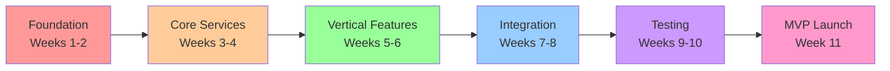
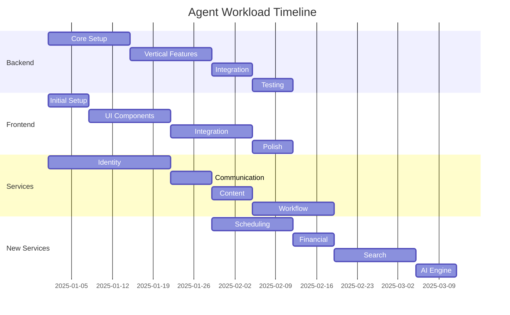

# Implementation Priority Matrix
## Strategic Roadmap for ReactDjango Hub Platform

**Version**: 1.0  
**Date**: January 2025  
**Purpose**: Define task dependencies, critical paths, and resource allocation for platform implementation  

---

## Executive Summary

This document provides a comprehensive implementation roadmap for the ReactDjango Hub platform, showing task dependencies across all agents, identifying the critical path for MVP delivery, defining parallel work streams, and providing resource allocation recommendations with timeline milestones.

---

## Critical Path Analysis

### MVP Definition
The Minimum Viable Product (MVP) includes:
- **Medical Hub**: Basic patient management, surgery scheduling, clinical notes
- **Public Hub**: Tender publication, supplier registration, bid submission
- **Core Features**: Authentication, multi-language support (FR/EN), document management
- **Infrastructure**: Development and staging environments

---

## Phase 1: Foundation (Weeks 1-2)
**Status**: Critical Path - Sequential Execution Required

### Week 1: Core Infrastructure

| Priority | Agent | Task | Duration | Dependencies | Deliverable |
|----------|-------|------|----------|--------------|-------------|
| **P0** | ag-infrastructure | Setup development environment | 2 days | None | Docker compose running |
| **P0** | ag-infrastructure | Configure Kong API Gateway | 1 day | Docker setup | API routing functional |
| **P0** | ag-backend | Create Django project structure | 2 days | None | Django skeleton |
| **P0** | ag-backend | Setup core apps framework | 3 days | Django skeleton | Base models, views |
| **P0** | ag-frontend | Initialize React project | 1 day | None | React app running |
| **P0** | ag-frontend | Configure i18next | 2 days | React app | i18n working |

### Week 2: Service Foundations

| Priority | Agent | Task | Duration | Dependencies | Deliverable |
|----------|-------|------|----------|--------------|-------------|
| **P0** | ag-identity | Extend user model for verticals | 3 days | None | Multi-role support |
| **P0** | ag-identity | Add language preferences | 2 days | User model | i18n in auth |
| **P0** | ag-communication | Setup template engine | 3 days | None | Template system |
| **P0** | ag-content | Configure document storage | 2 days | None | S3/MinIO ready |
| **P0** | ag-workflow | Create workflow engine base | 3 days | None | Workflow executor |
| **P0** | ag-coordinator | Setup service registry | 2 days | All services | Service discovery |

### Critical Success Factors
- All services must be containerized and communicating
- Authentication must work end-to-end
- Basic i18n must be functional
- API Gateway must route to all services

---

## Phase 2: Core Features (Weeks 3-4)
**Status**: Parallel Execution Possible

### Week 3: Vertical Backends

#### Medical Track (3 developers)
| Priority | Agent | Task | Duration | Dependencies | Deliverable |
|----------|-------|------|----------|--------------|-------------|
| **P1** | ag-backend | Patient models & API | 3 days | Phase 1 | CRUD operations |
| **P1** | ag-backend | Surgery scheduling models | 2 days | Patient models | Scheduling API |
| **P1** | ag-backend | Clinical notes models | 2 days | Patient models | Notes API |

#### Public Track (3 developers)
| Priority | Agent | Task | Duration | Dependencies | Deliverable |
|----------|-------|------|----------|--------------|-------------|
| **P1** | ag-backend | Tender models & API | 3 days | Phase 1 | Tender CRUD |
| **P1** | ag-backend | Supplier models & API | 2 days | Phase 1 | Supplier registry |
| **P1** | ag-backend | Bid submission models | 2 days | Tender models | Bid API |

### Week 4: Vertical Frontends

#### Medical UI Track (2 developers)
| Priority | Agent | Task | Duration | Dependencies | Deliverable |
|----------|-------|------|----------|--------------|-------------|
| **P1** | ag-frontend | Patient list component | 2 days | Week 3 APIs | Patient UI |
| **P1** | ag-frontend | Surgery calendar | 3 days | Week 3 APIs | Calendar UI |
| **P1** | ag-frontend | Clinical note editor | 2 days | Week 3 APIs | Note editor |

#### Public UI Track (2 developers)
| Priority | Agent | Task | Duration | Dependencies | Deliverable |
|----------|-------|------|----------|--------------|-------------|
| **P1** | ag-frontend | Tender list/search | 2 days | Week 3 APIs | Tender UI |
| **P1** | ag-frontend | Supplier dashboard | 2 days | Week 3 APIs | Supplier UI |
| **P1** | ag-frontend | Bid submission form | 3 days | Week 3 APIs | Bid UI |

---

## Phase 3: Service Integration (Weeks 5-6)
**Status**: Mixed Sequential and Parallel

### Week 5: Cross-Service Integration

| Priority | Agent | Task | Duration | Dependencies | Deliverable |
|----------|-------|------|----------|--------------|-------------|
| **P1** | ag-coordinator | Configure vertical routing | 2 days | Phase 2 | Routing rules |
| **P1** | ag-backend | Integrate identity service | 3 days | Phase 2 | Auth working |
| **P1** | ag-backend | Integrate communication | 2 days | Phase 2 | Notifications |
| **P1** | ag-backend | Integrate content service | 2 days | Phase 2 | Documents |
| **P2** | ag-workflow | Medical workflows | 3 days | Phase 2 | Surgery approval |
| **P2** | ag-workflow | Public workflows | 3 days | Phase 2 | Tender evaluation |

### Week 6: Advanced Features

| Priority | Agent | Task | Duration | Dependencies | Deliverable |
|----------|-------|------|----------|--------------|-------------|
| **P2** | ag-communication | Multi-language templates | 3 days | Week 5 | FR/EN templates |
| **P2** | ag-content | Document generation | 3 days | Week 5 | PDF generation |
| **P2** | ag-frontend | Language switcher | 2 days | Templates | UI language switch |
| **P2** | ag-frontend | Responsive design | 3 days | Phase 2 | Mobile support |
| **P2** | ag-identity | Organization management | 3 days | Week 5 | Multi-tenant |

---

## Phase 4: New Services (Weeks 7-9)
**Status**: Parallel Development - Additional Resources Needed

### Service Development Teams

#### Team A: Scheduling & Financial (3 developers)
| Week | Service | Key Features | Integration Points |
|------|---------|--------------|-------------------|
| 7 | ag-scheduling | Appointment booking, Calendar sync | Medical, Public |
| 8 | ag-scheduling | Resource management, Conflicts | Workflow service |
| 8 | ag-financial | Invoice generation, Payment processing | Both verticals |
| 9 | ag-financial | Insurance claims, Reporting | Medical, Identity |

#### Team B: Search & AI (3 developers)
| Week | Service | Key Features | Integration Points |
|------|---------|--------------|-------------------|
| 7 | ag-search | ElasticSearch setup, Indexing | Content service |
| 8 | ag-search | Multi-language search, Facets | Both verticals |
| 8 | ag-ai-engine | NLP models deployment | Search service |
| 9 | ag-ai-engine | Medical AI features | Medical vertical |

#### Team C: Market & Contract (2 developers)
| Week | Service | Key Features | Integration Points |
|------|---------|--------------|-------------------|
| 8 | ag-market-intelligence | Opportunity matching | Public vertical |
| 9 | ag-market-intelligence | Analytics dashboards | Search, AI |
| 9 | ag-contract | Contract templates | Content, Workflow |

---

## Phase 5: Testing & Optimization (Weeks 9-10)
**Status**: All Hands - Full Team Required

### Week 9: Integration Testing

| Track | Focus Area | Test Coverage | Success Criteria |
|-------|------------|---------------|------------------|
| Medical | End-to-end patient flow | 80% | <2s response time |
| Medical | Surgery scheduling | 85% | No conflicts |
| Public | Tender publication | 80% | Multi-language |
| Public | Bid submission | 85% | Document handling |
| Platform | Authentication | 90% | JWT validation |
| Platform | i18n/l10n | 95% | 5 languages |

### Week 10: Performance & Security

| Area | Testing Type | Target | Tools |
|------|--------------|--------|-------|
| Performance | Load testing | 1000 users | JMeter |
| Performance | API response | <200ms | Grafana |
| Security | Penetration | OWASP Top 10 | Burp Suite |
| Security | Compliance | GDPR/HIPAA | Audit tools |
| Reliability | Failover | 99.9% uptime | Chaos engineering |

---

## Phase 6: Deployment (Week 11)
**Status**: Coordinated Release

### Deployment Checklist

| Stage | Tasks | Owner | Duration |
|-------|-------|-------|----------|
| Pre-deployment | Database migrations | ag-backend | 2 hours |
| Pre-deployment | Static assets CDN | ag-frontend | 1 hour |
| Pre-deployment | SSL certificates | ag-infrastructure | 1 hour |
| Deployment | Blue-green switch | ag-infrastructure | 30 min |
| Post-deployment | Smoke tests | ag-coordinator | 1 hour |
| Post-deployment | Monitoring setup | ag-infrastructure | 2 hours |

---

## Resource Allocation Matrix

### Team Composition (Recommended)

| Role | Count | Allocation | Phase Focus |
|------|-------|------------|-------------|
| Backend Developers | 6 | 3 Medical, 3 Public | Phases 1-3 |
| Frontend Developers | 4 | 2 Medical, 2 Public | Phases 2-4 |
| DevOps Engineers | 2 | Infrastructure, CI/CD | All phases |
| QA Engineers | 3 | 1 Medical, 1 Public, 1 Platform | Phases 4-5 |
| Technical Lead | 1 | Architecture, Coordination | All phases |
| **Total** | **16** | | |

### Agent Workload Distribution

---

## Risk Mitigation Strategy

### Critical Risks and Mitigations

| Risk | Probability | Impact | Mitigation | Owner |
|------|-------------|--------|------------|-------|
| i18n complexity | High | High | Start with FR/EN only | ag-frontend |
| Service integration delays | Medium | High | Mock services early | ag-coordinator |
| Performance issues | Medium | Medium | Early load testing | ag-infrastructure |
| Medical compliance | Low | High | Consultant engagement | ag-backend |
| Resource availability | Medium | High | Contractor backup | Management |

---

## Milestone Timeline

### Key Deliverables

| Week | Milestone | Success Criteria | Demo |
|------|-----------|------------------|------|
| 2 | Foundation Complete | All services running | Internal |
| 4 | Vertical Features | Basic CRUD working | Stakeholder |
| 6 | Integration Complete | Cross-service flows | Technical |
| 8 | New Services | 3+ services added | Product |
| 10 | Testing Complete | 80% coverage | QA |
| 11 | **MVP Launch** | Production ready | Public |
| 12 | Post-launch | Bug fixes, monitoring | Operations |

---

## Success Metrics

### Platform KPIs

| Metric | Target | Measurement |
|--------|--------|-------------|
| API Response Time | <200ms | P95 latency |
| System Uptime | 99.9% | Monthly |
| Test Coverage | >80% | Per service |
| Language Support | 5 languages | Completion |
| User Capacity | 1000 concurrent | Load test |
| Deployment Time | <30 min | Blue-green |

### Vertical-Specific KPIs

#### Medical Hub
- Patient records: 10,000+
- Surgery scheduling: <5s
- Document generation: <10s
- HIPAA compliance: 100%

#### Public Hub
- Active tenders: 1,000+
- Supplier registry: 5,000+
- Bid processing: <30s
- Transparency score: 95%

---

## Conclusion

This implementation matrix provides a clear roadmap for delivering the ReactDjango Hub MVP in 11 weeks with a team of 16 people. The critical path focuses on establishing the foundation, implementing core features for both verticals, and ensuring proper integration before adding advanced services.

Key success factors:
1. **Parallel development** of Medical and Public verticals after Phase 1
2. **Early integration testing** to catch issues quickly
3. **Incremental feature delivery** with regular demos
4. **Strong coordination** through ag-coordinator
5. **Risk mitigation** through mocking and early testing

The timeline is aggressive but achievable with proper resource allocation and strong technical leadership. Regular milestone reviews will ensure the project stays on track for successful MVP delivery.