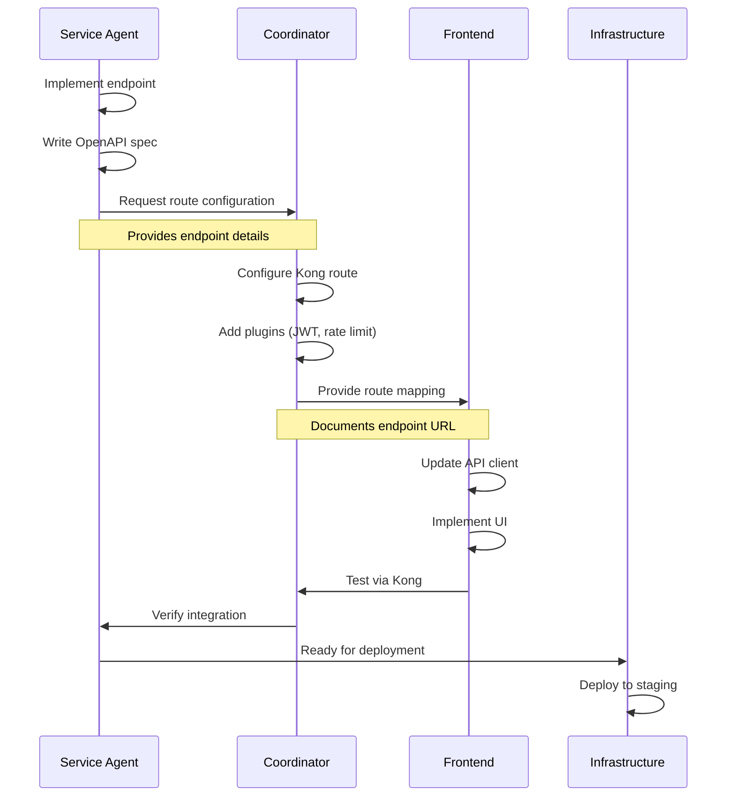
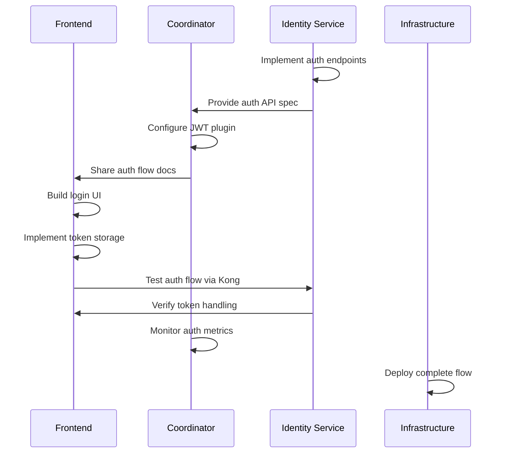
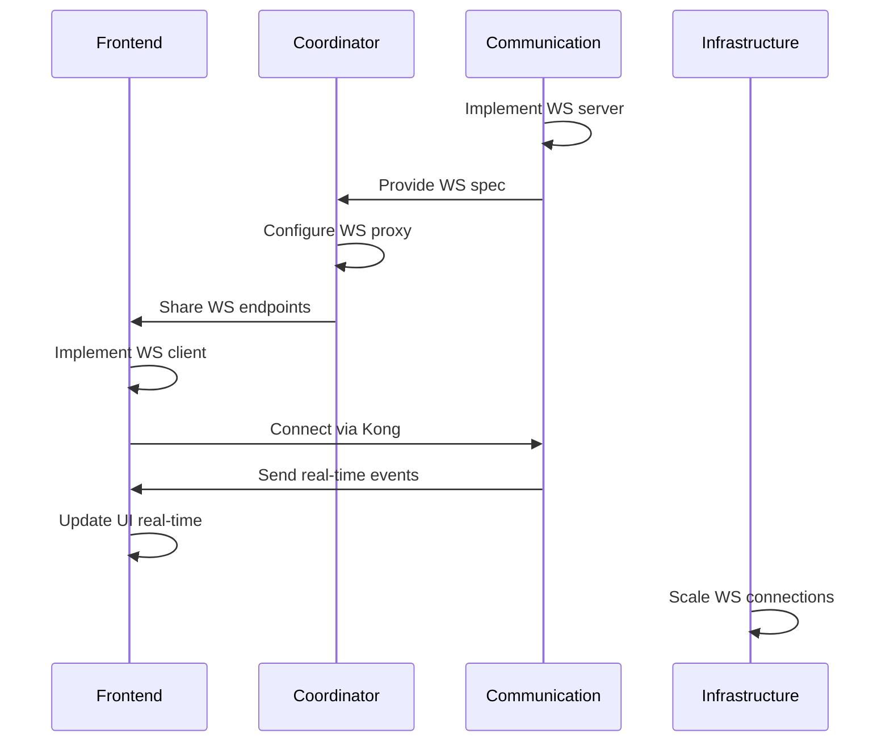
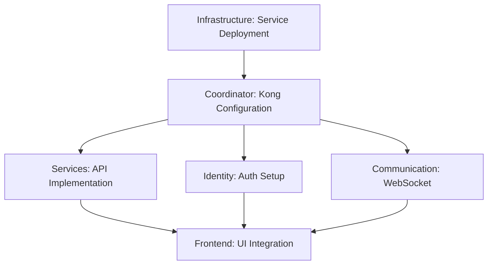

# Inter-Agent Coordination Plan

## Executive Summary

This document defines the coordination protocols, communication patterns, and dependency management strategies for all agents working on the ReactDjango Hub platform. It ensures smooth handoffs, clear boundaries, and efficient collaboration across the microservices architecture.

**Created by**: Technical Lead Agent (ag-techlead)  
**Date**: September 11, 2025  
**Status**: ACTIVE

## Coordination Principles

### 1. Service Boundary Respect
- Each agent operates within their defined service boundaries
- Cross-service changes require explicit coordination
- No agent directly modifies another service's code

### 2. API Contract First
- Service interfaces are defined before implementation
- Changes to APIs require coordination with consumers
- Breaking changes require versioning strategy

### 3. Documentation as Communication
- All handoffs include written documentation
- API changes are documented in OpenAPI specs
- Integration points are clearly specified

### 4. Test-Driven Integration
- Integration points have automated tests
- Changes are validated before handoff
- Both parties verify integration success

## Agent Communication Matrix

### Direct Communication Requirements

| Agent A | Agent B | Communication Type | Frequency | Protocol |
|---------|---------|-------------------|-----------|----------|
| ag-frontend | ag-coordinator | API endpoint mapping | Per feature | Documentation + Testing |
| ag-frontend | ag-identity | Auth UI requirements | Per auth feature | API spec + UI mockups |
| ag-frontend | ag-communication | WebSocket events | Per real-time feature | Event schema docs |
| ag-coordinator | All service agents | Route configuration | Per endpoint | Kong config + OpenAPI |
| ag-infrastructure | All agents | Deployment changes | Per deployment | Change notification |
| ag-techlead | All agents | Architecture decisions | As needed | ADRs + Guidelines |

### Coordination Workflows

## Workflow 1: New API Endpoint Integration



### Implementation Steps:

1. **Service Agent** (e.g., ag-identity):
   - Implements new endpoint (e.g., `/api/v1/users/profile`)
   - Creates/updates OpenAPI specification
   - Tests endpoint locally
   - Commits with message: `feat(identity): add user profile endpoint`

2. **Coordinator Agent**:
   - Reviews OpenAPI spec
   - Configures Kong route:
     ```yaml
     - name: user-profile
       paths: ['/api/v1/users/profile']
       service: identity-service
       plugins:
         - name: jwt
         - name: cors
         - name: rate-limiting
     ```
   - Documents in `infrastructure/kong/routes.md`
   - Commits: `feat(kong): add route for user profile endpoint`

3. **Frontend Agent**:
   - Updates API client:
     ```typescript
     getUserProfile: () => apiClient.get('/api/v1/users/profile')
     ```
   - Implements UI components
   - Tests through Kong gateway
   - Commits: `feat(frontend): integrate user profile API`

4. **Infrastructure Agent**:
   - Deploys all changes to staging
   - Runs integration tests
   - Promotes to production

## Workflow 2: Authentication Flow Implementation



### Handoff Points:

1. **Identity → Coordinator**:
   - Provides: JWT structure, token lifetimes, refresh strategy
   - Documentation: `services/identity-service/docs/auth-flow.md`

2. **Coordinator → Frontend**:
   - Provides: Kong endpoints, JWT validation rules
   - Documentation: `infrastructure/kong/auth-configuration.md`

3. **Frontend → Identity**:
   - Tests: Login, logout, refresh, MFA flows
   - Feedback: UI requirements, error handling needs

## Workflow 3: WebSocket Integration



### Coordination Requirements:

1. **Communication Service**:
   - Defines event schemas
   - Implements connection handling
   - Provides reconnection strategy

2. **Coordinator**:
   - Configures WebSocket upgrade in Kong
   - Sets up connection pooling
   - Monitors WebSocket metrics

3. **Frontend**:
   - Implements WebSocket manager
   - Handles reconnection logic
   - Updates UI with real-time data

## Dependency Management

### Critical Path Dependencies



### Dependency Resolution Process

1. **Identify Dependencies**:
   - Check task ownership matrix
   - List prerequisite tasks
   - Identify blocking agents

2. **Communicate Requirements**:
   - Create detailed handoff documentation
   - Specify acceptance criteria
   - Set expected timelines

3. **Track Progress**:
   - Update task status regularly
   - Notify dependent agents of delays
   - Escalate blockers to ag-techlead

4. **Verify Completion**:
   - Test integration points
   - Validate against requirements
   - Document any issues

## Handoff Protocols

### Standard Handoff Template

```markdown
## Handoff: [Task Name]

**From Agent**: [Source agent]
**To Agent**: [Target agent]
**Date**: [Handoff date]
**Status**: Ready | In Progress | Blocked

### Deliverables
- [ ] Code implementation
- [ ] API documentation
- [ ] Test coverage
- [ ] Integration tests

### Acceptance Criteria
1. [Specific requirement 1]
2. [Specific requirement 2]

### Integration Points
- Endpoint: [URL/path]
- Authentication: [Method]
- Data format: [JSON schema]

### Testing Instructions
1. [Step to test]
2. [Expected result]

### Known Issues
- [Any issues or limitations]

### Contact
- Primary: [Agent name]
- Questions: [Where to ask]
```

### Handoff Verification Checklist

- [ ] Code is committed and pushed
- [ ] Tests are passing
- [ ] Documentation is complete
- [ ] API specs are updated
- [ ] Integration points are tested
- [ ] Receiving agent is notified
- [ ] Handoff document is created

## Conflict Resolution

### Escalation Path

1. **Level 1: Direct Resolution**
   - Agents discuss and resolve directly
   - Document agreement
   - Update relevant documentation

2. **Level 2: Coordinator Mediation**
   - ag-coordinator helps resolve integration conflicts
   - Focuses on API contracts and boundaries
   - Documents resolution

3. **Level 3: Technical Lead Decision**
   - ag-techlead makes final decision
   - Creates ADR if needed
   - Updates architecture documentation

### Common Conflict Scenarios

| Conflict Type | Resolution Approach | Decision Maker |
|---------------|-------------------|----------------|
| API design disagreement | Follow REST/GraphQL standards | ag-coordinator |
| Service boundary dispute | Check microservices principles | ag-techlead |
| Technology choice | Evaluate trade-offs | ag-techlead |
| Performance vs. features | Measure and prioritize | Product + ag-techlead |
| Timeline conflicts | Reassess dependencies | Project management |

## Communication Channels

### Documentation Locations

| Content Type | Location | Maintained By |
|--------------|----------|---------------|
| API Specifications | `services/*/openapi.yaml` | Service agents |
| Kong Configuration | `infrastructure/kong/` | ag-coordinator |
| Architecture Decisions | `docs/architecture/adr/` | ag-techlead |
| Integration Guides | `docs/integration/` | All agents |
| Handoff Documents | `docs/handoffs/` | Initiating agent |

### Status Tracking

1. **Task Status Updates**:
   - Update task ownership matrix
   - Mark status: Pending → In Progress → Review → Complete
   - Note blockers immediately

2. **Daily Sync Points**:
   - Morning: Check dependencies
   - Midday: Update progress
   - End of day: Document completions

3. **Weekly Coordination**:
   - Review upcoming dependencies
   - Identify potential conflicts
   - Plan next week's handoffs

## Success Metrics

### Coordination Effectiveness

| Metric | Target | Measurement |
|--------|--------|-------------|
| Handoff success rate | >95% | Successful integrations / Total handoffs |
| Integration test coverage | >80% | Tested integration points / Total |
| Blocking time | <4 hours | Average time blocked on dependencies |
| Rework rate | <10% | Tasks requiring rework / Total |
| Documentation completeness | 100% | Documented handoffs / Total |

### Continuous Improvement

1. **Weekly Retrospectives**:
   - What coordination worked well?
   - What caused delays?
   - What can be improved?

2. **Process Updates**:
   - Update this document based on learnings
   - Refine handoff templates
   - Improve communication protocols

3. **Tool Optimization**:
   - Automate repetitive handoffs
   - Create integration test suites
   - Build coordination dashboards

## Timeline Considerations

### Sprint 1 Coordination Points

| Week | Key Handoffs | Critical Path |
|------|--------------|---------------|
| Week 1 | Kong routes → Frontend API client | Infrastructure → Coordinator → Frontend |
| Week 1 | Auth endpoints → Frontend UI | Identity → Coordinator → Frontend |
| Week 2 | WebSocket server → Frontend client | Communication → Coordinator → Frontend |
| Week 2 | Service APIs → Frontend integration | All services → Frontend |

### Dependency Mitigation Strategies

1. **Parallel Development**:
   - Mock APIs for frontend development
   - Stub services for testing
   - Contract-first development

2. **Early Integration**:
   - Test integration points early
   - Use feature flags for gradual rollout
   - Maintain backward compatibility

3. **Risk Management**:
   - Identify critical path early
   - Have backup plans for blockers
   - Prioritize based on dependencies

---

**Document Status**: ACTIVE  
**Maintained By**: Technical Lead Agent (ag-techlead)  
**Last Updated**: September 11, 2025  
**Next Review**: September 18, 2025  
**Related Documents**: 
- `/docs/architecture/task-ownership-matrix.md`
- `/docs/technical-leadership/frontend-architecture-analysis.md`