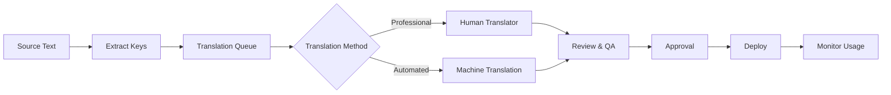

# Internationalization & Localization Architecture
## Multi-Language Support for ReactDjango Hub Platform

**Version**: 1.0  
**Date**: January 2025  
**Status**: Active  
**Architecture Decision**: ADR-007  

---

## Executive Summary

This document defines the comprehensive internationalization (i18n) and localization (l10n) architecture for the ReactDjango Hub platform, supporting multiple languages across all verticals (Medical Hub and Public Hub) with French as the primary language, followed by English, German, Italian, and Spanish. The architecture ensures consistent translation management, optimal performance, and seamless user experience across all platform components.

---

## Language Support Strategy

### Primary Languages
1. **French (fr-FR)** - Primary language for all verticals
2. **English (en-US)** - International business language
3. **German (de-DE)** - DACH region support
4. **Italian (it-IT)** - Southern European markets
5. **Spanish (es-ES)** - Iberian and Latin American markets

### Future Language Considerations
- **Portuguese (pt-PT/pt-BR)** - Brazilian and Portuguese markets
- **Arabic (ar-SA)** - Middle East expansion (RTL support ready)
- **Chinese (zh-CN)** - Asian market expansion
- **Japanese (ja-JP)** - Japanese healthcare market

---

## Backend Internationalization Strategy

### Django i18n Architecture

```python
# settings/base.py
LANGUAGE_CODE = 'fr-FR'
LANGUAGES = [
    ('fr', 'Français'),
    ('en', 'English'),
    ('de', 'Deutsch'),
    ('it', 'Italiano'),
    ('es', 'Español'),
]

USE_I18N = True
USE_L10N = True
USE_TZ = True

LOCALE_PATHS = [
    BASE_DIR / 'locale',
    BASE_DIR / 'apps/medical/locale',
    BASE_DIR / 'apps/public/locale',
]

# Middleware configuration
MIDDLEWARE = [
    'django.middleware.locale.LocaleMiddleware',
    'apps.core.middleware.LanguagePreferenceMiddleware',
    # ... other middleware
]
```

### Database Translation Strategy

#### 1. System Content (Static)
```python
# Using django-modeltranslation for static content
class ServiceCategory(models.Model):
    name = models.CharField(max_length=100)
    description = models.TextField()
    
    class Meta:
        translate = ('name', 'description')
```

#### 2. User-Generated Content (Dynamic)
```python
# Translation table approach for user content
class TranslatableContent(models.Model):
    content_type = models.ForeignKey(ContentType)
    object_id = models.PositiveIntegerField()
    content_object = GenericForeignKey()
    
class ContentTranslation(models.Model):
    content = models.ForeignKey(TranslatableContent)
    language = models.CharField(max_length=10)
    field_name = models.CharField(max_length=100)
    translated_text = models.TextField()
    is_machine_translated = models.BooleanField(default=False)
    verified_by = models.ForeignKey(User, null=True)
```

### API Response Localization

```python
# API middleware for automatic response translation
class APILocalizationMiddleware:
    def process_response(self, request, response):
        if request.META.get('HTTP_ACCEPT_LANGUAGE'):
            language = parse_accept_language(request.META['HTTP_ACCEPT_LANGUAGE'])
            response.data = localize_response(response.data, language)
        return response

# Response structure with translations
{
    "data": {
        "id": 1,
        "name": "Service chirurgical",
        "description": "Description en français"
    },
    "meta": {
        "language": "fr-FR",
        "available_languages": ["fr", "en", "de", "it", "es"]
    }
}
```

---

## Frontend Internationalization Strategy

### React i18next Configuration

```typescript
// i18n/config.ts
import i18n from 'i18next';
import { initReactI18next } from 'react-i18next';
import LanguageDetector from 'i18next-browser-languagedetector';
import Backend from 'i18next-http-backend';

i18n
  .use(Backend)
  .use(LanguageDetector)
  .use(initReactI18next)
  .init({
    fallbackLng: 'fr',
    debug: false,
    defaultNS: 'common',
    ns: [
      'common',
      'medical',
      'public',
      'auth',
      'errors',
      'validation'
    ],
    
    interpolation: {
      escapeValue: false,
      format: (value, format, lng) => {
        if (format === 'currency') {
          return new Intl.NumberFormat(lng, {
            style: 'currency',
            currency: getCurrencyForLocale(lng)
          }).format(value);
        }
        if (format === 'date') {
          return new Intl.DateTimeFormat(lng).format(value);
        }
        return value;
      }
    },
    
    backend: {
      loadPath: '/api/v1/translations/{{lng}}/{{ns}}',
      allowMultiLoading: true,
      crossDomain: false,
      withCredentials: true,
    },
    
    detection: {
      order: ['localStorage', 'cookie', 'navigator', 'htmlTag'],
      caches: ['localStorage', 'cookie'],
    }
  });
```

### Translation File Structure

```
frontend/public/locales/
├── fr/
│   ├── common.json         # Shared UI elements
│   ├── medical.json         # Medical Hub specific
│   ├── public.json          # Public Hub specific
│   ├── auth.json            # Authentication
│   ├── errors.json          # Error messages
│   └── validation.json      # Form validation
├── en/
│   └── [same structure]
├── de/
│   └── [same structure]
├── it/
│   └── [same structure]
└── es/
    └── [same structure]
```

### Component Implementation

```tsx
// components/LocalizedComponent.tsx
import { useTranslation } from 'react-i18next';

export const SurgeryScheduler: React.FC = () => {
  const { t, i18n } = useTranslation(['medical', 'common']);
  
  return (
    <div>
      <h1>{t('medical:surgery.scheduler.title')}</h1>
      <p>{t('medical:surgery.scheduler.description', {
        date: new Date(),
        count: 5
      })}</p>
      <Button>{t('common:actions.save')}</Button>
    </div>
  );
};
```

### RTL Support Strategy

```css
/* Global RTL support using CSS logical properties */
.container {
  margin-inline-start: 1rem;  /* Instead of margin-left */
  padding-inline-end: 2rem;   /* Instead of padding-right */
  text-align: start;           /* Instead of text-align: left */
}

/* RTL-specific overrides */
[dir="rtl"] {
  .special-component {
    /* RTL-specific styles */
  }
}
```

---

## Content Management Strategy

### Multi-Language Content Types

#### 1. System Messages
- **Storage**: Translation files (JSON)
- **Management**: Developer-managed through code
- **Deployment**: Bundled with application

#### 2. User Interface Text
- **Storage**: Translation files + CDN
- **Management**: Translation management system
- **Deployment**: Dynamic loading with caching

#### 3. User-Generated Content
- **Storage**: Database with translation tables
- **Management**: User-provided or machine translation
- **Deployment**: API-delivered with language preference

#### 4. Documents and Files
- **Storage**: Object storage with language tagging
- **Management**: Version control per language
- **Deployment**: CDN with language-based routing

### Medical Hub Specific Terms

```typescript
// medical-terminology.ts
export const medicalTerminology = {
  fr: {
    'surgeon': 'chirurgien',
    'anesthesiologist': 'anesthésiste',
    'operating_room': 'salle d\'opération',
    'surgical_procedure': 'intervention chirurgicale',
    'pre_operative': 'préopératoire',
    'post_operative': 'postopératoire',
    // Regulatory terms
    'hipaa_compliant': 'conforme HIPAA',
    'patient_consent': 'consentement du patient'
  },
  en: {
    // English medical terms
  }
  // ... other languages
};
```

### Public Hub Legal Terms

```typescript
// legal-terminology.ts
export const legalTerminology = {
  fr: {
    'tender': 'appel d\'offres',
    'bid': 'soumission',
    'procurement': 'approvisionnement',
    'contract': 'contrat',
    'compliance': 'conformité',
    'public_entity': 'entité publique',
    // Regulatory terms
    'transparency_requirement': 'exigence de transparence',
    'audit_trail': 'piste d\'audit'
  },
  en: {
    // English legal terms
  }
  // ... other languages
};
```

---

## Database Schema Considerations

### Translation Tables Design

```sql
-- Core translation support
CREATE TABLE translations (
    id UUID PRIMARY KEY,
    entity_type VARCHAR(100),
    entity_id UUID,
    field_name VARCHAR(100),
    language_code VARCHAR(10),
    translated_value TEXT,
    is_verified BOOLEAN DEFAULT FALSE,
    translator_id UUID REFERENCES users(id),
    created_at TIMESTAMP,
    updated_at TIMESTAMP,
    INDEX idx_entity (entity_type, entity_id, language_code)
);

-- Medical vertical translations
CREATE TABLE medical_translations (
    id UUID PRIMARY KEY,
    procedure_id UUID REFERENCES procedures(id),
    language_code VARCHAR(10),
    name VARCHAR(255),
    description TEXT,
    instructions TEXT,
    risks TEXT,
    UNIQUE(procedure_id, language_code)
);

-- Public vertical translations  
CREATE TABLE tender_translations (
    id UUID PRIMARY KEY,
    tender_id UUID REFERENCES tenders(id),
    language_code VARCHAR(10),
    title VARCHAR(500),
    description TEXT,
    requirements TEXT,
    evaluation_criteria TEXT,
    UNIQUE(tender_id, language_code)
);
```

### Indexed Search Strategy

```sql
-- Full-text search indexes per language
CREATE INDEX idx_medical_search_fr ON medical_translations 
USING gin(to_tsvector('french', name || ' ' || description)) 
WHERE language_code = 'fr';

CREATE INDEX idx_medical_search_en ON medical_translations 
USING gin(to_tsvector('english', name || ' ' || description)) 
WHERE language_code = 'en';
```

---

## Performance Optimization

### Translation Loading Strategy

```typescript
// Lazy loading with chunking
const loadTranslations = async (language: string, namespace: string) => {
  // Check cache first
  const cached = await cache.get(`translations:${language}:${namespace}`);
  if (cached) return cached;
  
  // Load from CDN with compression
  const response = await fetch(`${CDN_URL}/locales/${language}/${namespace}.json`, {
    headers: { 'Accept-Encoding': 'gzip' }
  });
  
  const translations = await response.json();
  
  // Cache with TTL
  await cache.set(`translations:${language}:${namespace}`, translations, 3600);
  
  return translations;
};
```

### Caching Architecture

```yaml
# Redis caching strategy
translations:
  static:
    ttl: 86400  # 24 hours for static content
    pattern: "trans:static:{lang}:{namespace}"
  
  dynamic:
    ttl: 3600   # 1 hour for dynamic content
    pattern: "trans:dynamic:{lang}:{entity}:{id}"
  
  user_preferences:
    ttl: 604800 # 7 days for user preferences
    pattern: "trans:user:{user_id}:lang"
```

### CDN Configuration

```nginx
# CDN rules for translation files
location /locales/ {
    add_header Cache-Control "public, max-age=3600";
    add_header Vary "Accept-Language";
    gzip_static on;
    
    # Language-based routing
    if ($http_accept_language ~* "^fr") {
        rewrite ^/locales/(.*)$ /locales/fr/$1 break;
    }
}
```

---

## Translation Workflow

### Translation Management Process



### Translation Tools Integration

#### 1. Development Tools
```bash
# Extract translation keys
npm run i18n:extract

# Validate translations
npm run i18n:validate

# Generate TypeScript types
npm run i18n:types

# Django management commands
python manage.py makemessages -l fr
python manage.py compilemessages
```

#### 2. Translation Management System (TMS)
- **Crowdin Integration** for professional translations
- **DeepL API** for machine translation fallback
- **Quality metrics** tracking and reporting
- **Translation memory** for consistency

### Quality Assurance

```typescript
// Translation validation
interface TranslationValidation {
  checkCompleteness(): ValidationResult;
  checkPlaceholders(): ValidationResult;
  checkLength(): ValidationResult;
  checkTerminology(): ValidationResult;
}

class MedicalTranslationValidator implements TranslationValidation {
  checkTerminology(): ValidationResult {
    // Validate medical terms consistency
    const errors = [];
    if (translation.includes('surgery') && !translation.includes('chirurgie')) {
      errors.push('Medical term mismatch');
    }
    return { valid: errors.length === 0, errors };
  }
}
```

---

## Vertical-Specific Considerations

### Medical Hub i18n Requirements

#### Clinical Terms Standardization
```typescript
const clinicalStandards = {
  'ICD-10': {
    fr: 'CIM-10',
    en: 'ICD-10',
    de: 'ICD-10-GM'
  },
  'CPT': {
    fr: 'CCAM',
    en: 'CPT',
    de: 'EBM'
  }
};
```

#### Date/Time Formats for Medical Records
```typescript
const medicalDateFormats = {
  fr: 'DD/MM/YYYY HH:mm',
  en: 'MM/DD/YYYY hh:mm A',
  de: 'DD.MM.YYYY HH:mm'
};
```

#### Measurement Units
```typescript
const measurementUnits = {
  weight: {
    fr: 'kg',
    en: 'lbs',
    de: 'kg'
  },
  temperature: {
    fr: '°C',
    en: '°F',
    de: '°C'
  }
};
```

### Public Hub i18n Requirements

#### Legal Document Templates
```typescript
const documentTemplates = {
  'tender_notice': {
    fr: 'templates/fr/avis_appel_offres.docx',
    en: 'templates/en/tender_notice.docx',
    de: 'templates/de/ausschreibung.docx'
  }
};
```

#### Currency and Financial Formats
```typescript
const financialFormats = {
  fr: {
    currency: 'EUR',
    format: '#.###,## €',
    taxLabel: 'TVA'
  },
  en: {
    currency: 'USD',
    format: '$#,###.##',
    taxLabel: 'VAT'
  }
};
```

#### Regulatory Compliance Text
```typescript
const complianceText = {
  'gdpr_notice': {
    fr: 'Conformément au RGPD...',
    en: 'In accordance with GDPR...',
    de: 'Gemäß DSGVO...'
  }
};
```

---

## Implementation Roadmap

### Phase 1: Foundation (Weeks 1-2)
- [ ] Set up i18next in frontend
- [ ] Configure Django i18n middleware
- [ ] Create base translation files
- [ ] Implement language detection

### Phase 2: Core Translations (Weeks 3-4)
- [ ] Translate common UI elements
- [ ] Translate authentication flows
- [ ] Translate error messages
- [ ] Implement API localization

### Phase 3: Vertical Translations (Weeks 5-6)
- [ ] Medical Hub terminology
- [ ] Public Hub legal terms
- [ ] Document templates
- [ ] Email templates

### Phase 4: Advanced Features (Weeks 7-8)
- [ ] Machine translation integration
- [ ] Translation management UI
- [ ] A/B testing framework
- [ ] Performance optimization

### Phase 5: Quality & Polish (Weeks 9-10)
- [ ] Professional translation review
- [ ] User acceptance testing
- [ ] Performance testing
- [ ] Documentation

---

## Testing Strategy

### Unit Tests
```typescript
describe('Translations', () => {
  it('should have all required keys for each language', () => {
    languages.forEach(lang => {
      expect(translations[lang]).toHaveProperty('common.save');
      expect(translations[lang]).toHaveProperty('errors.network');
    });
  });
  
  it('should format currencies correctly', () => {
    expect(formatCurrency(1000, 'fr')).toBe('1.000,00 €');
    expect(formatCurrency(1000, 'en')).toBe('$1,000.00');
  });
});
```

### Integration Tests
```python
class TranslationAPITest(TestCase):
    def test_api_respects_language_header(self):
        response = self.client.get('/api/v1/services/', 
                                 HTTP_ACCEPT_LANGUAGE='fr')
        self.assertEqual(response.data['message'], 'Services disponibles')
        
    def test_user_language_preference(self):
        user = User.objects.create(preferred_language='de')
        self.client.force_authenticate(user)
        response = self.client.get('/api/v1/profile/')
        self.assertEqual(response.data['greeting'], 'Willkommen')
```

---

## Monitoring and Analytics

### Translation Coverage Metrics
```typescript
interface TranslationMetrics {
  coverage: {
    language: string;
    percentage: number;
    missingKeys: string[];
  }[];
  usage: {
    key: string;
    frequency: number;
    lastUsed: Date;
  }[];
  performance: {
    loadTime: number;
    cacheHitRate: number;
  };
}
```

### User Language Analytics
```sql
-- Track language usage patterns
CREATE TABLE language_analytics (
    user_id UUID,
    language_code VARCHAR(10),
    session_id UUID,
    page_views INTEGER,
    translation_errors INTEGER,
    timestamp TIMESTAMP
);

-- Query for language adoption
SELECT 
    language_code,
    COUNT(DISTINCT user_id) as users,
    AVG(page_views) as avg_engagement
FROM language_analytics
GROUP BY language_code;
```

---

## Security Considerations

### Translation Injection Prevention
```typescript
// Sanitize user-provided translations
const sanitizeTranslation = (text: string): string => {
  return DOMPurify.sanitize(text, {
    ALLOWED_TAGS: ['b', 'i', 'em', 'strong'],
    ALLOWED_ATTR: []
  });
};
```

### Access Control for Translations
```python
class TranslationPermissions:
    """
    Control who can modify translations
    """
    def can_edit_system_translations(self, user):
        return user.has_perm('translations.edit_system')
    
    def can_edit_content_translations(self, user, content):
        return content.owner == user or user.has_perm('translations.edit_any')
```

---

## Conclusion

This internationalization architecture provides a robust foundation for multi-language support across the ReactDjango Hub platform. The design ensures:

1. **Consistency** - Unified translation approach across all services
2. **Performance** - Optimized loading and caching strategies
3. **Scalability** - Easy addition of new languages and verticals
4. **Quality** - Professional translation workflow with validation
5. **User Experience** - Seamless language switching and detection

The architecture supports both current requirements (French primary, with EN/DE/IT/ES) and future expansion into additional markets and languages, while maintaining the specific terminology and compliance requirements of each vertical (Medical Hub and Public Hub).