# Marketing Architecture - ReactDjango Hub Platform
## Multi-Vertical Go-to-Market Architecture

**Version**: 1.0  
**Date**: January 13, 2025  
**Status**: Active  
**Type**: Marketing & Sales Architecture

---

## Executive Summary

This document outlines the comprehensive marketing architecture for both Medical Hub (ChirurgieProX) and Public Hub (PublicHub) verticals, detailing customer acquisition funnels, marketing technology stacks, and go-to-market execution frameworks.

---

## 1. Medical Hub Marketing Architecture (ChirurgieProX)

### 1.1 Market Segmentation Architecture

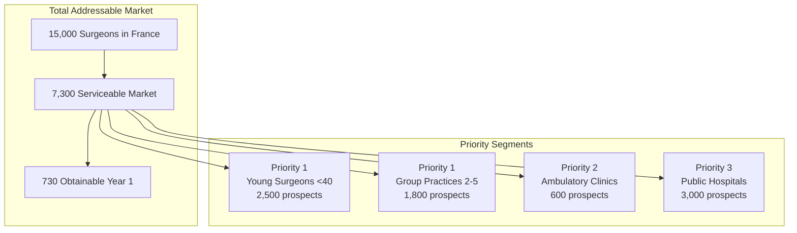

### 1.2 Customer Journey & Funnel Architecture

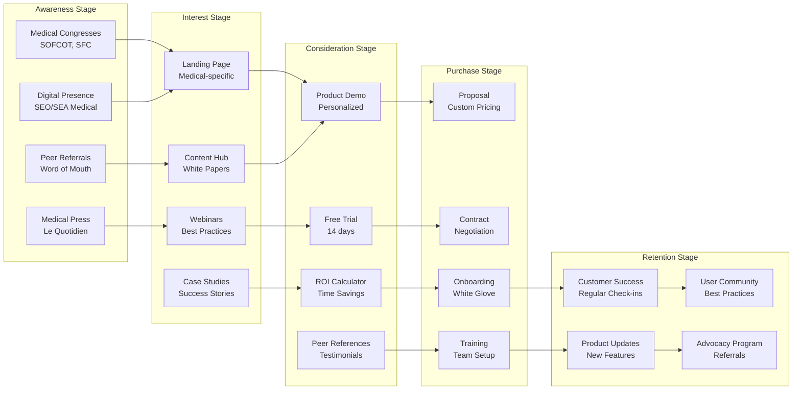

### 1.3 Marketing Technology Stack

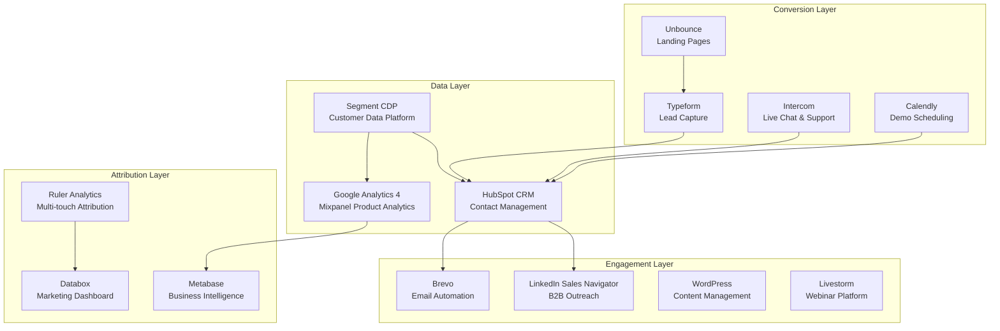

### 1.4 Channel Strategy & Budget Allocation

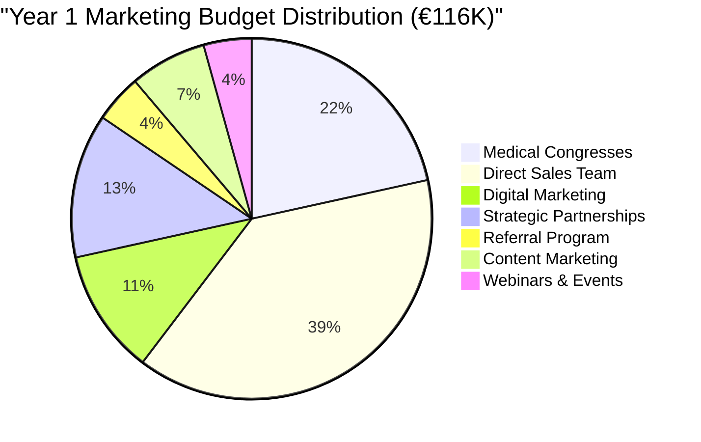

### 1.5 Content Marketing Architecture

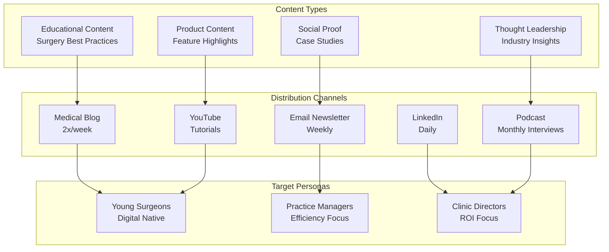

---

## 2. Public Hub Marketing Architecture (PublicHub)

### 2.1 Market Segmentation Architecture

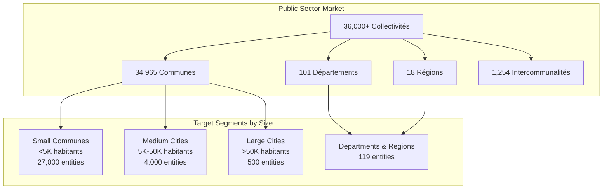

### 2.2 B2G Sales Funnel Architecture

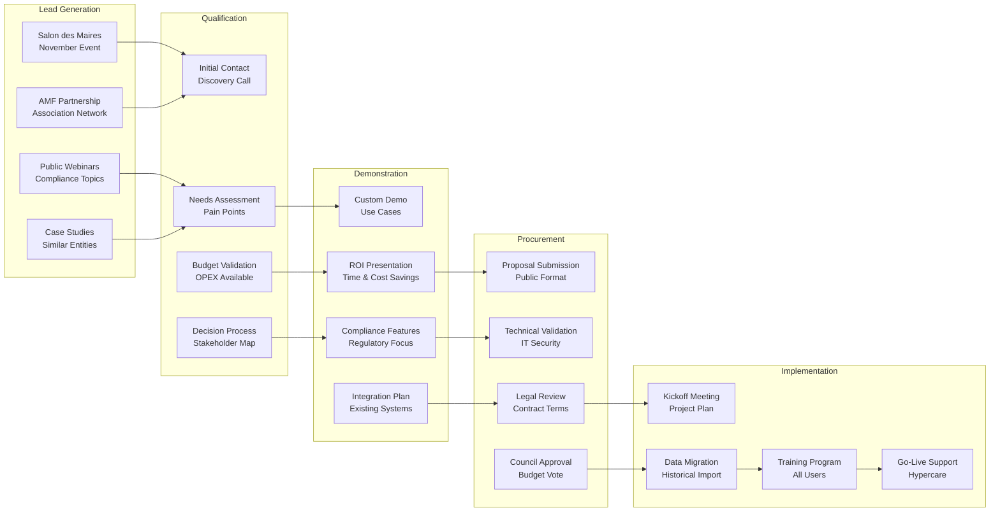

### 2.3 Partner Ecosystem Architecture

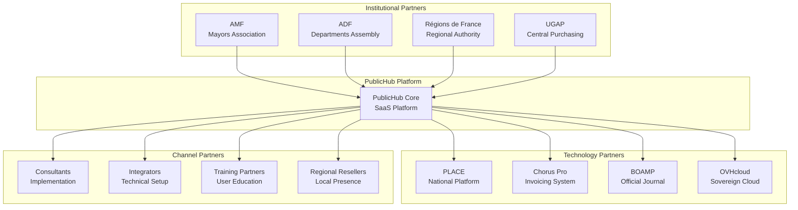

### 2.4 Content & Education Strategy

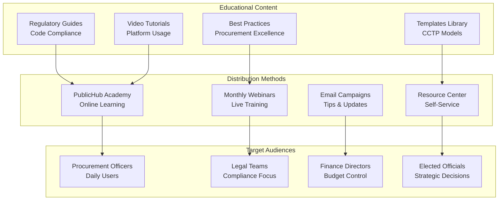

### 2.5 Growth Metrics Architecture

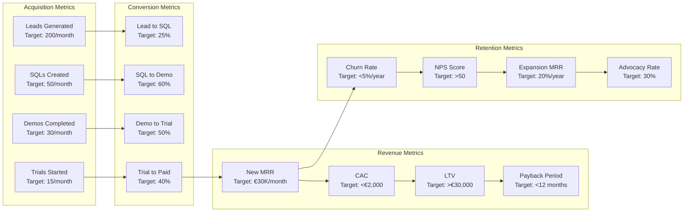

---

## 3. Integrated Marketing Platform Architecture

### 3.1 Shared Marketing Infrastructure

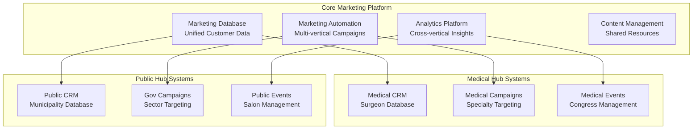

### 3.2 Customer Acquisition Cost Model

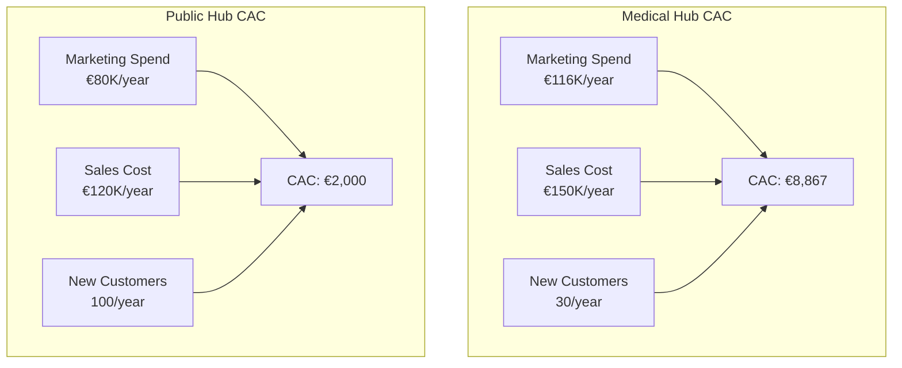

### 3.3 Revenue Growth Architecture

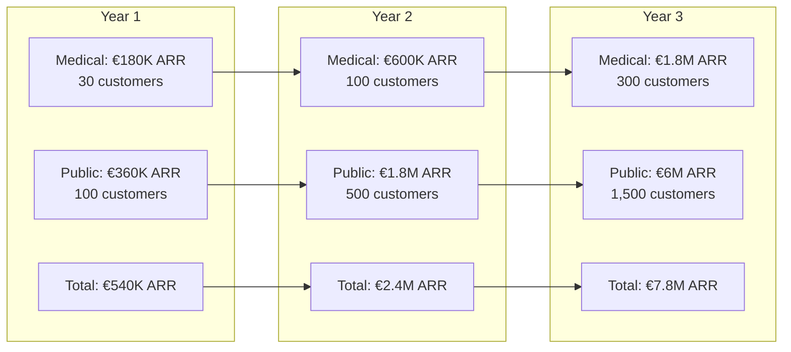

---

## 4. Marketing Operations Architecture

### 4.1 Lead Scoring & Routing

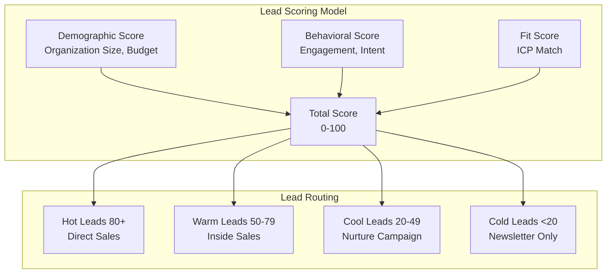

### 4.2 Campaign Performance Framework

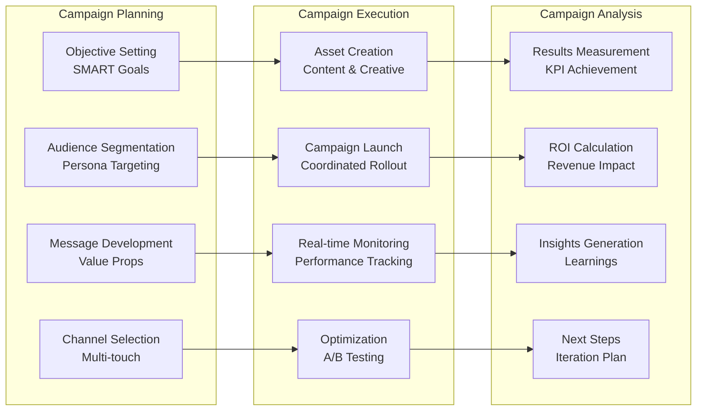

---

## 5. Key Performance Indicators

### 5.1 Medical Hub KPIs

| Metric | Target Y1 | Target Y2 | Target Y3 |
|--------|-----------|-----------|-----------|
| **MQLs/Month** | 50 | 150 | 300 |
| **SQLs/Month** | 10 | 30 | 60 |
| **Demos/Month** | 8 | 25 | 50 |
| **New Customers/Month** | 2.5 | 8 | 25 |
| **CAC** | €8,867 | €6,000 | €4,000 |
| **LTV:CAC Ratio** | 3:1 | 5:1 | 7:1 |
| **Monthly Churn** | 2% | 1.5% | 1% |

### 5.2 Public Hub KPIs

| Metric | Target Y1 | Target Y2 | Target Y3 |
|--------|-----------|-----------|-----------|
| **MQLs/Month** | 200 | 500 | 1,000 |
| **SQLs/Month** | 50 | 125 | 250 |
| **Demos/Month** | 30 | 75 | 150 |
| **New Customers/Month** | 8 | 42 | 125 |
| **CAC** | €2,000 | €1,500 | €1,000 |
| **LTV:CAC Ratio** | 15:1 | 20:1 | 30:1 |
| **Monthly Churn** | 0.5% | 0.4% | 0.3% |

---

## 6. Marketing Technology Integration

### 6.1 Data Flow Architecture

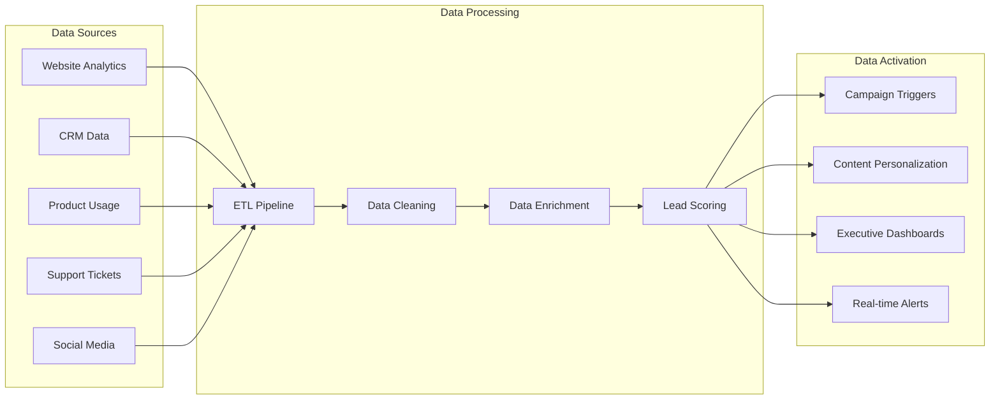

---

## 7. Implementation Roadmap

### Phase 1: Foundation (Months 1-3)
- Set up core marketing technology stack
- Establish tracking and analytics
- Create initial content library
- Launch basic lead generation campaigns

### Phase 2: Optimization (Months 4-6)
- Implement lead scoring models
- Launch marketing automation workflows
- Begin A/B testing program
- Establish partnership channels

### Phase 3: Scale (Months 7-12)
- Full multi-channel campaigns
- Advanced personalization
- Account-based marketing for enterprise
- Referral and advocacy programs

### Phase 4: Excellence (Year 2+)
- Predictive analytics implementation
- AI-powered content generation
- Cross-vertical synergies
- International expansion preparation

---

## Conclusion

This marketing architecture provides a comprehensive framework for both Medical Hub and Public Hub go-to-market strategies, ensuring:

1. **Clear Segmentation**: Precise targeting of high-value segments
2. **Efficient Funnels**: Optimized conversion paths for each vertical
3. **Scalable Technology**: Infrastructure supporting rapid growth
4. **Data-Driven Decisions**: Analytics informing strategy
5. **Cross-Vertical Synergies**: Shared resources and learnings

The architecture is designed to support aggressive growth targets while maintaining efficient customer acquisition costs and high retention rates across both verticals.