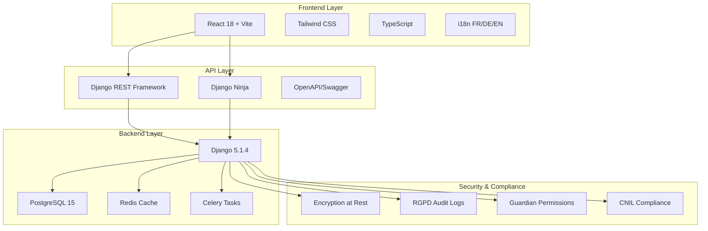
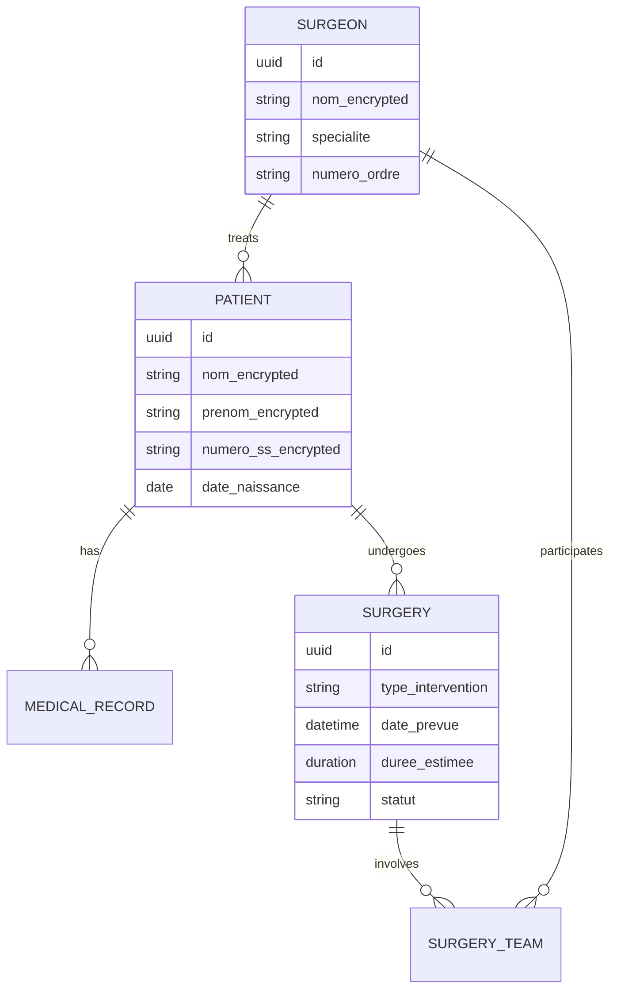

# Architecture Overview - ReactDjango Hub Medical

> **Architecture technique complète pour SaaS médical français avec conformité RGPD**

## 🏗️ Vue d'Ensemble



## 🎯 Principes Architecturaux

### Multi-Tenancy Médical
- **Isolation Tenant**: Séparation stricte données entre cabinets médicaux
- **RGPD by Design**: Chiffrement et audit trail intégrés
- **Performance**: Cache Redis et optimisations requêtes

### Trilingue Native
- **Français Primaire**: Interface et données de base
- **Allemand/Anglais**: Traduction automatique avec contexte médical
- **Medical Translator Agent**: Terminologie chirurgicale précise

### API-First Design
- **DRF Traditional**: REST classique avec pagination/filtering
- **Django Ninja**: FastAPI-style avec types et documentation auto
- **OpenAPI Spec**: Documentation interactive Swagger

## 🔧 Stack Technique

### Frontend React
```typescript
// Structure composants
src/
├── components/          // Composants réutilisables
│   ├── medical/        // Composants spécifiques métier
│   └── ui/            // Composants interface de base
├── pages/             // Pages principales
├── hooks/             // Hooks React personnalisés
├── contexts/          // Contexts React (auth, i18n)
├── api/              // Client API
└── types/            // Définitions TypeScript
```

**Technologies**:
- React 18 + Hooks
- TypeScript strict
- Tailwind CSS + HeadlessUI
- Vite build tool
- Vitest testing

### Backend Django
```python
# Architecture apps
backend/
├── apps/
│   ├── core/          # Models de base, utils
│   ├── patients/      # Gestion patients
│   ├── surgeries/     # Planification chirurgicale  
│   ├── analytics/     # Reporting et KPIs
│   └── compliance/    # RGPD et audit
├── config/            # Settings Django
└── tests/            # Tests et fixtures
```

**Technologies**:
- Django 5.1.4 LTS
- PostgreSQL 15 + Extensions
- Redis cache et sessions
- Celery background tasks
- django-auditlog RGPD

### APIs REST
```python
# DRF Traditional
/api/v1/patients/          # CRUD patients
/api/v1/surgeries/         # Planification
/api/v1/analytics/         # Reporting

# Django Ninja FastAPI-style  
/api/ninja/patients/       # Auto-docs
/api/ninja/surgeries/      # Type hints
/api/ninja/docs/          # Swagger UI
```

## 🔒 Sécurité & Conformité

### RGPD Article 9 - Données Sensibles
```python
# Modèles avec chiffrement
class Patient(BaseModel):
    nom = EncryptedTextField(max_length=100)
    prenom = EncryptedTextField(max_length=100)
    numero_securite_sociale = EncryptedTextField(max_length=15)
    diagnostic = EncryptedTextField()
    
    class Meta:
        permissions = [
            ('view_patient_medical', 'Can view medical data'),
            ('edit_patient_medical', 'Can edit medical data'),
        ]
```

### Audit Trail CNIL
```python
# Configuration audit logging
AUDITLOG_INCLUDE_ALL_MODELS = True

# Enregistrement automatique
from auditlog.registry import auditlog
auditlog.register(Patient)
auditlog.register(Surgery)
auditlog.register(MedicalRecord)
```

### Permissions Granulaires
```python
# Guardian object-level permissions
from guardian.shortcuts import assign_perm

# Permissions chirurgien -> patient
assign_perm('view_patient', surgeon, patient)
assign_perm('edit_patient', surgeon, patient)
```

## 🏥 Modèles Métier

### Domaine Médical


### Base Model Pattern
```python
# Modèle de base avec audit
class BaseModel(models.Model):
    id = models.UUIDField(primary_key=True, default=uuid.uuid4)
    created_at = models.DateTimeField(auto_now_add=True)
    updated_at = models.DateTimeField(auto_now=True)
    created_by = models.ForeignKey(User, on_delete=models.PROTECT)
    
    class Meta:
        abstract = True
```

## 🌐 Internationalisation

### Structure i18n
```python
# Configuration Django
LANGUAGE_CODE = 'fr-fr'
TIME_ZONE = 'Europe/Paris'

LANGUAGES = [
    ('fr', 'Français'),      # Primaire - marché cible
    ('de', 'Deutsch'),       # Expansion DACH
    ('en', 'English'),       # Documentation technique
]

USE_I18N = True
USE_L10N = True
USE_TZ = True
```

### Traduction Médicale
```typescript
// Frontend - Terminologie contextualisée
const medicalTerms = {
  fr: {
    'diagnostic': 'Diagnostic',
    'intervention': 'Intervention chirurgicale',
    'anesthesie': 'Anesthésie'
  },
  de: {
    'diagnostic': 'Diagnose', 
    'intervention': 'Chirurgischer Eingriff',
    'anesthesie': 'Anästhesie'
  },
  en: {
    'diagnostic': 'Diagnosis',
    'intervention': 'Surgical procedure', 
    'anesthesie': 'Anesthesia'
  }
}
```

## 📊 Performance & Scalabilité

### Cache Strategy
```python
# Redis cache configuration
CACHES = {
    'default': {
        'BACKEND': 'django_redis.cache.RedisCache',
        'LOCATION': 'redis://127.0.0.1:6379/1',
        'OPTIONS': {
            'CLIENT_CLASS': 'django_redis.client.DefaultClient',
        }
    }
}

# Cache medical data (non-sensitive)
@cache_page(300)  # 5 minutes
def surgery_statistics(request):
    # Cache-safe analytics
```

### Background Tasks
```python
# Celery pour tâches asynchrones
@shared_task
def generate_medical_report(patient_id):
    """Generate encrypted medical reports"""
    patient = Patient.objects.get(id=patient_id)
    # Generate report with encryption
    
@shared_task  
def rgpd_data_cleanup():
    """Automated RGPD data retention cleanup"""
    # Handle data retention periods
```

## 🚀 Déploiement

### Infrastructure AWS
```yaml
# Architecture cloud
Production:
  - Load Balancer (ALB)
  - ECS Fargate containers
  - RDS PostgreSQL Multi-AZ
  - ElastiCache Redis
  - S3 encrypted storage
  - CloudFront CDN
  
Security:
  - WAF protection
  - VPC isolation  
  - Encryption in transit/rest
  - IAM roles minimal
```

### CI/CD Pipeline
```yaml
# GitHub Actions workflow
stages:
  - Code Quality (black, flake8, bandit)
  - RGPD Compliance Check
  - Unit Tests (pytest)
  - Integration Tests
  - Security Scan (safety)
  - Docker Build
  - Deploy Staging
  - Manual Production Approval
```

## 📈 Monitoring

### Application Monitoring
- **Django Silk**: Performance profiling
- **Sentry**: Error tracking  
- **Prometheus**: Metrics collection
- **Grafana**: Dashboards

### Medical Compliance Monitoring
- **RGPD Audit Logs**: All data access tracked
- **Performance KPIs**: Response times < 200ms
- **Availability**: 99.9% uptime SLA
- **Security Events**: Real-time alerts

## 🔄 Development Workflow

### Claude Code Agents
```bash
# Architecture supportée par agents
Backend + API Agent    → Models, APIs, RGPD compliance
Frontend Agent        → React components, trilingual UI  
Medical Translator    → Terminology management
Code Review Agent     → Security & quality validation
Deployment Agent      → Infrastructure & monitoring
```

### Git Worktrees
```bash
# Développement parallèle
main/                 # Production-ready
├── backend-dev/      # Backend + API development  
└── frontend-dev/     # Frontend development
```

---

*Architecture évolutive conçue pour la conformité médicale française et l'expansion européenne*