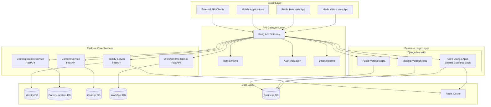
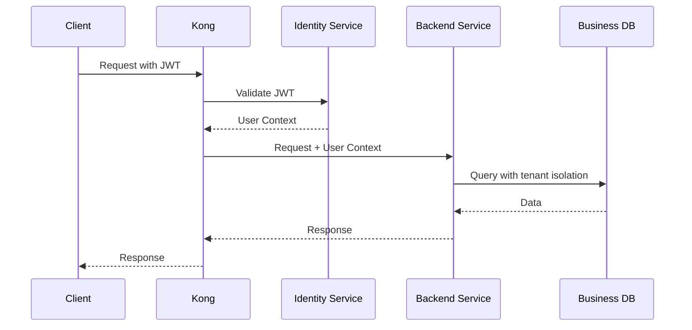

# ReactDjango Hub Platform Architecture v2
## Multi-Vertical SaaS Platform Design

**Version**: 2.0  
**Date**: January 2025  
**Status**: Active  
**Authors**: Technical Architecture Team

---

## Executive Summary

ReactDjango Hub is a **multi-vertical SaaS platform** designed to serve multiple industry-specific applications while maintaining a common technical foundation. This architecture enables rapid deployment of new verticals while ensuring consistency, security, and scalability across all applications.

### Current Verticals
1. **Medical Hub** - Healthcare practice management for surgeons and medical professionals
2. **Public Hub** - Public procurement and tender management for government entities

### Architecture Principles

1. **Domain-Driven Design** - Clear separation between platform core and vertical domains
2. **Microservices Architecture** - Loosely coupled services with clear boundaries
3. **Vertical Isolation** - Each vertical operates independently while sharing common infrastructure
4. **Extension Over Modification** - Verticals extend common components without modifying core
5. **API-First Design** - All integrations through well-defined APIs
6. **Security by Default** - Authentication, authorization, and audit built into platform core

---

## Platform Architecture Overview



---

## Architectural Layers

### 1. Client Layer
Multiple client applications connect to the platform, each tailored to their specific vertical:

- **Web Applications**: React-based SPAs with vertical-specific UI/UX
- **Mobile Applications**: React Native apps sharing core components
- **API Clients**: Third-party integrations via REST/GraphQL APIs

### 2. API Gateway Layer (Kong)
Centralized entry point for all client requests:

```yaml
Services:
  - name: identity-service
    url: http://identity-service:8001
    routes:
      - /api/v1/auth/**
      - /api/v1/users/**
      - /api/v1/organizations/**
    
  - name: medical-backend
    url: http://backend:8000
    routes:
      - /api/v1/medical/**
    plugins:
      - jwt-auth
      - rate-limiting
      - request-transformer
    
  - name: public-backend
    url: http://backend:8000
    routes:
      - /api/v1/public/**
    plugins:
      - jwt-auth
      - rate-limiting
      - cors
```

### 3. Platform Core Services (Microservices)

#### Identity Service (Port 8001)
- **Technology**: FastAPI + SQLAlchemy + PostgreSQL
- **Responsibilities**:
  - Authentication (JWT, OAuth2)
  - User management
  - Organization management
  - Multi-factor authentication
  - Role-based access control
  - Session management

#### Communication Service (Port 8002)
- **Technology**: FastAPI + PostgreSQL + Redis
- **Responsibilities**:
  - Email notifications
  - SMS messaging
  - In-app notifications
  - Real-time messaging (WebSocket)
  - Notification templates
  - Delivery tracking

#### Content Service (Port 8003)
- **Technology**: FastAPI + PostgreSQL + S3
- **Responsibilities**:
  - Document management
  - File storage and retrieval
  - Document versioning
  - Media processing
  - Content delivery
  - Access control

#### Workflow Intelligence Service (Port 8004)
- **Technology**: FastAPI + PostgreSQL + Celery
- **Responsibilities**:
  - Process automation
  - AI/ML workflows
  - Task scheduling
  - Business rules engine
  - Workflow orchestration
  - Event processing

### 4. Business Logic Layer (Django Monolith)

#### Core Django Apps (Shared)
```python
backend/apps/core/
├── auth/          # Integration with Identity Service
├── base/          # Base models and mixins
├── api/           # Common API utilities
├── notifications/ # Integration with Communication Service
├── documents/     # Integration with Content Service
├── workflow/      # Integration with Workflow Service
└── utils/         # Shared utilities
```

#### Vertical-Specific Apps
```python
backend/apps/medical/
├── patients/      # Patient management
├── appointments/  # Scheduling system
├── procedures/    # Medical procedures
├── billing/       # Medical billing
└── clinical/      # Clinical records

backend/apps/public/
├── tenders/       # Tender management
├── suppliers/     # Supplier registry
├── contracts/     # Contract management
├── compliance/    # Regulatory compliance
└── procurement/   # Procurement workflows
```

### 5. Data Layer

#### Database Strategy
- **Service Isolation**: Each microservice has its own database
- **Vertical Separation**: Vertical-specific tables use prefixes (med_, pub_)
- **Shared Tables**: Common entities without prefixes
- **Cross-Service Communication**: Via APIs only, no direct DB access

```sql
-- Common tables (no prefix)
CREATE TABLE users (extended by Identity Service);
CREATE TABLE organizations (extended by Identity Service);
CREATE TABLE audit_logs (all services);

-- Medical vertical tables (med_ prefix)
CREATE TABLE med_patients (...);
CREATE TABLE med_appointments (...);
CREATE TABLE med_procedures (...);

-- Public vertical tables (pub_ prefix)
CREATE TABLE pub_tenders (...);
CREATE TABLE pub_suppliers (...);
CREATE TABLE pub_contracts (...);
```

---

## Service Interaction Patterns

### 1. Authentication Flow


### 2. Cross-Service Communication
```python
# Django service calling Identity Service
class UserService:
    def get_user_details(self, user_id: str):
        response = self.identity_client.get(
            f"/api/v1/users/{user_id}",
            headers=self._get_service_auth_headers()
        )
        return response.json()

# Service-to-service authentication
def _get_service_auth_headers(self):
    return {
        "X-Service-Name": "backend-service",
        "X-Service-Token": settings.SERVICE_AUTH_TOKEN
    }
```

### 3. Event-Driven Communication
```python
# Publishing events
class EventPublisher:
    def publish(self, event_type: str, payload: dict):
        self.redis_client.publish(
            channel=f"events.{event_type}",
            message=json.dumps({
                "event_id": str(uuid.uuid4()),
                "timestamp": datetime.utcnow().isoformat(),
                "type": event_type,
                "payload": payload,
                "source": "backend-service"
            })
        )

# Subscribing to events
class EventSubscriber:
    def subscribe(self, event_types: List[str]):
        pubsub = self.redis_client.pubsub()
        for event_type in event_types:
            pubsub.subscribe(f"events.{event_type}")
        return pubsub
```

---

## Vertical Extension Points

### 1. Backend Extension Pattern
```python
# Base model in core
class BaseEntity(models.Model):
    id = models.UUIDField(primary_key=True, default=uuid.uuid4)
    created_at = models.DateTimeField(auto_now_add=True)
    updated_at = models.DateTimeField(auto_now=True)
    created_by = models.ForeignKey('auth.User', ...)
    organization = models.ForeignKey('core.Organization', ...)
    
    class Meta:
        abstract = True

# Medical vertical extension
class MedicalPatient(BaseEntity):
    medical_record_number = models.CharField(max_length=50)
    date_of_birth = models.DateField()
    blood_type = models.CharField(max_length=5)
    allergies = models.JSONField(default=list)
    
    class Meta:
        db_table = 'med_patients'

# Public vertical extension
class PublicSupplier(BaseEntity):
    registration_number = models.CharField(max_length=50)
    tax_id = models.CharField(max_length=30)
    certification_level = models.CharField(max_length=20)
    compliance_status = models.JSONField()
    
    class Meta:
        db_table = 'pub_suppliers'
```

### 2. Frontend Extension Pattern
```typescript
// Common component
export const BaseDataTable: React.FC<BaseDataTableProps> = ({
  columns,
  data,
  onRowClick,
  customRenderers,
  ...props
}) => {
  return (
    <Table {...props}>
      {/* Common table implementation */}
    </Table>
  );
};

// Medical vertical extension
export const PatientTable: React.FC = () => {
  const columns = [
    { key: 'medical_record_number', label: 'MRN' },
    { key: 'name', label: 'Patient Name' },
    { key: 'next_appointment', label: 'Next Appointment' },
  ];
  
  return (
    <BaseDataTable
      columns={columns}
      data={patients}
      customRenderers={{
        medical_record_number: (value) => (
          <Badge variant="medical">{value}</Badge>
        ),
      }}
    />
  );
};

// Public vertical extension
export const TenderTable: React.FC = () => {
  const columns = [
    { key: 'tender_number', label: 'Tender #' },
    { key: 'title', label: 'Title' },
    { key: 'deadline', label: 'Submission Deadline' },
  ];
  
  return (
    <BaseDataTable
      columns={columns}
      data={tenders}
      customRenderers={{
        deadline: (value) => (
          <DeadlineIndicator date={value} />
        ),
      }}
    />
  );
};
```

### 3. API Extension Pattern
```python
# Common API base
class BaseAPIView(APIView):
    authentication_classes = [JWTAuthentication]
    permission_classes = [IsAuthenticated, OrganizationPermission]
    
    def get_queryset(self):
        # Automatic tenant filtering
        return self.model.objects.filter(
            organization=self.request.user.organization
        )

# Medical API extension
class MedicalPatientAPI(BaseAPIView):
    model = MedicalPatient
    serializer_class = MedicalPatientSerializer
    
    def post(self, request):
        # Medical-specific validation
        self.validate_medical_license(request.user)
        return super().post(request)

# Public API extension
class PublicTenderAPI(BaseAPIView):
    model = PublicTender
    serializer_class = PublicTenderSerializer
    
    def post(self, request):
        # Public-specific validation
        self.validate_procurement_authority(request.user)
        return super().post(request)
```

---

## Security Architecture

### Multi-Tenant Isolation
```python
# Automatic tenant filtering
class TenantFilteredManager(models.Manager):
    def get_queryset(self):
        request = get_current_request()
        if request and hasattr(request, 'user'):
            return super().get_queryset().filter(
                organization=request.user.organization
            )
        return super().get_queryset()

# Row-level security in PostgreSQL
CREATE POLICY tenant_isolation ON all_tables
    FOR ALL
    TO application_role
    USING (organization_id = current_setting('app.current_organization')::uuid);
```

### API Security Layers
1. **Kong Gateway**: Rate limiting, API key validation
2. **JWT Validation**: Token verification and claims extraction
3. **RBAC**: Role-based access control per vertical
4. **Data Validation**: Input sanitization and validation
5. **Audit Logging**: Comprehensive activity tracking

---

## Deployment Architecture

### Container Strategy
```yaml
# docker-compose.yml structure
services:
  # Platform Core Services
  identity-service:
    image: reactdjango-hub/identity-service:latest
    environment:
      - SERVICE_NAME=identity-service
      - DATABASE_URL=postgresql://...
  
  communication-service:
    image: reactdjango-hub/communication-service:latest
    
  # Business Logic Layer
  backend:
    image: reactdjango-hub/backend:latest
    environment:
      - ENABLED_VERTICALS=medical,public
      - MEDICAL_ENABLED=true
      - PUBLIC_ENABLED=true
  
  # Frontend Applications
  medical-frontend:
    image: reactdjango-hub/medical-frontend:latest
    environment:
      - REACT_APP_VERTICAL=medical
      - REACT_APP_API_URL=https://api.medical.hub.com
  
  public-frontend:
    image: reactdjango-hub/public-frontend:latest
    environment:
      - REACT_APP_VERTICAL=public
      - REACT_APP_API_URL=https://api.public.hub.com
```

### Kubernetes Architecture
```yaml
# Namespace separation
apiVersion: v1
kind: Namespace
metadata:
  name: platform-core
---
apiVersion: v1
kind: Namespace
metadata:
  name: medical-vertical
---
apiVersion: v1
kind: Namespace
metadata:
  name: public-vertical

# Service mesh for communication
apiVersion: v1
kind: Service
metadata:
  name: identity-service
  namespace: platform-core
spec:
  selector:
    app: identity-service
  ports:
    - port: 8001
```

---

## Adding New Verticals

### Step-by-Step Process

1. **Define Vertical Requirements**
   - Business domain analysis
   - Regulatory requirements
   - Integration needs

2. **Create Django Apps**
   ```bash
   cd backend/apps
   mkdir new_vertical
   python manage.py startapp new_vertical_core
   ```

3. **Extend Base Models**
   ```python
   # backend/apps/new_vertical/models.py
   from apps.core.base import BaseEntity
   
   class NewVerticalEntity(BaseEntity):
       # Vertical-specific fields
       pass
   ```

4. **Create Frontend Module**
   ```bash
   cd frontend/src/verticals
   mkdir new-vertical
   # Copy template structure
   ```

5. **Configure Routing**
   ```python
   # backend/config/urls.py
   if settings.NEW_VERTICAL_ENABLED:
       urlpatterns += [
           path('api/v1/new/', include('apps.new_vertical.urls')),
       ]
   ```

6. **Update Kong Configuration**
   ```yaml
   - name: new-vertical-backend
     url: http://backend:8000
     routes:
       - /api/v1/new/**
   ```

### Vertical Template Structure
```
new-vertical/
├── backend/
│   ├── apps/
│   │   └── new_vertical/
│   │       ├── models.py
│   │       ├── serializers.py
│   │       ├── views.py
│   │       ├── urls.py
│   │       └── migrations/
│   └── tests/
├── frontend/
│   ├── src/
│   │   └── verticals/
│   │       └── new-vertical/
│   │           ├── components/
│   │           ├── pages/
│   │           ├── hooks/
│   │           └── api/
│   └── tests/
└── docs/
    └── new-vertical/
```

---

## Performance Considerations

### Caching Strategy
- **Redis**: Session cache, API response cache
- **CDN**: Static assets, media files
- **Database**: Query result caching
- **Application**: In-memory caching for hot data

### Scaling Patterns
- **Horizontal Scaling**: All services designed for horizontal scaling
- **Database Sharding**: By organization for large deployments
- **Read Replicas**: For read-heavy operations
- **Message Queues**: For async processing

---

## Monitoring and Observability

### Metrics Collection
```yaml
# Prometheus metrics
metrics:
  - service_request_duration
  - service_request_count
  - database_query_duration
  - cache_hit_ratio
  - api_error_rate
```

### Logging Strategy
```python
# Structured logging
logger.info("api_request", extra={
    "vertical": "medical",
    "user_id": user.id,
    "organization_id": user.organization_id,
    "endpoint": "/api/v1/medical/patients",
    "method": "GET",
    "duration_ms": 45,
    "status_code": 200
})
```

### Distributed Tracing
- **OpenTelemetry**: End-to-end request tracing
- **Jaeger**: Trace visualization and analysis
- **Correlation IDs**: Request tracking across services

---

## Migration Path

### From Monolith to Platform
1. **Phase 1**: Extract authentication → Identity Service
2. **Phase 2**: Extract notifications → Communication Service
3. **Phase 3**: Extract documents → Content Service
4. **Phase 4**: Separate vertical-specific code
5. **Phase 5**: Implement service mesh

### Version Migration Strategy
- **API Versioning**: Support multiple API versions
- **Database Migrations**: Blue-green deployments
- **Feature Flags**: Gradual rollout of new features
- **Backward Compatibility**: Maintain for 2 major versions

---

## Decision Records

### ADR-001: Microservices vs Monolith
**Decision**: Hybrid approach with microservices for cross-cutting concerns and Django monolith for business logic
**Rationale**: Balances development speed with scalability needs

### ADR-002: Database Per Service
**Decision**: Each microservice owns its database
**Rationale**: Ensures service independence and scalability

### ADR-003: API Gateway
**Decision**: Kong as the API gateway
**Rationale**: Mature, feature-rich, supports our authentication needs

### ADR-004: Multi-Tenant Strategy
**Decision**: Single database with row-level security
**Rationale**: Simplifies operations while maintaining data isolation

---

## Future Considerations

### Planned Enhancements
1. **GraphQL Federation**: For complex data queries
2. **Event Sourcing**: For audit and compliance
3. **CQRS**: For read/write optimization
4. **Service Mesh**: Full Istio implementation
5. **Multi-Region**: Geographic distribution

### Technology Radar
- **Adopt**: FastAPI, PostgreSQL, Redis, React, Kong
- **Trial**: GraphQL, Kubernetes, Istio
- **Assess**: Event sourcing, CQRS, Serverless
- **Hold**: Monolithic expansion, Direct DB access

---

## Conclusion

This architecture provides a robust foundation for building and scaling multiple vertical applications while maintaining:
- **Code reusability** through shared components
- **Vertical independence** for domain-specific needs
- **Security and compliance** built into the platform
- **Scalability** through microservices and proper separation
- **Developer productivity** through clear patterns and templates

The platform is designed to grow with the business, supporting new verticals and features while maintaining stability and performance for existing applications.