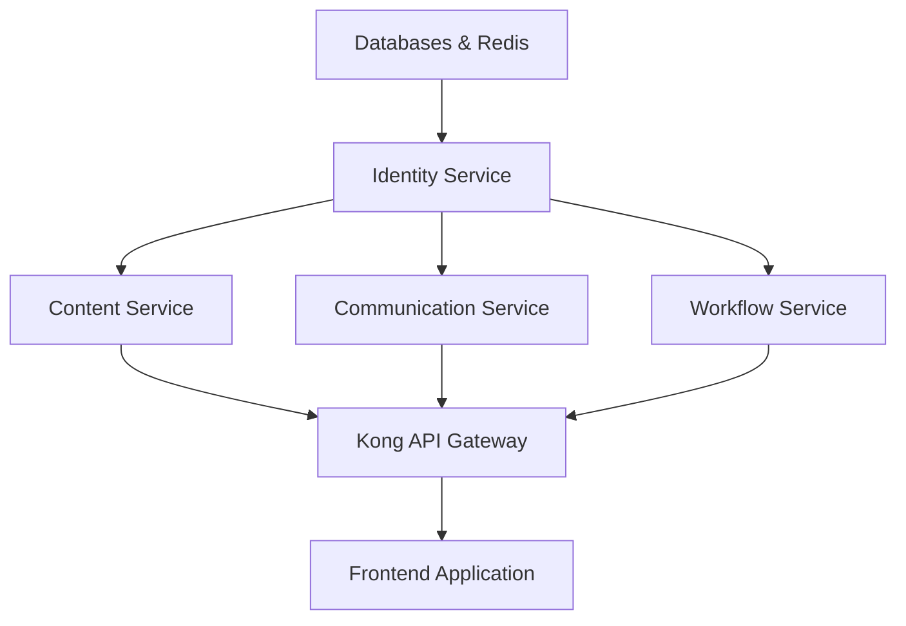

# Service Discovery and Registration

## Overview

This document describes the service discovery architecture for ReactDjango Hub microservices, based on the production deployment orchestrated by ag-coordinator. All services are accessible through Kong API Gateway for production use, with direct access available for development.

## Current Service Registry

### Production Services (Through Kong Gateway)

| Service | Kong Route | Direct Port | Health Check | Status |
|---------|------------|-------------|--------------|--------|
| **Kong API Gateway** | - | 8000 (proxy) | `/health` | ✅ Configured |
| **Kong Admin** | - | 8445 | `/status` | ✅ Configured |
| **Identity Service** | `/api/v1/auth`<br>`/api/v1/users`<br>`/api/v1/organizations`<br>`/api/v1/mfa` | 8001 | `/health` | ✅ Ready |
| **Content Service** | `/api/v1/documents`<br>`/api/v1/search` | 8002 | `/health` | ✅ Ready |
| **Communication Service** | `/api/v1/notifications`<br>`/api/v1/messages` | 8003 | `/health` | ✅ Ready |
| **Workflow Intelligence** | `/api/v1/workflows`<br>`/api/v1/ai` | 8004 | `/health` | ✅ Ready |

### Database Services

| Database | Port | Username | Database Name | Purpose |
|----------|------|----------|---------------|---------|
| **Identity DB** | 5433 | identity_user | identity_service | User authentication, organizations, RBAC |
| **Content DB** | 5434 | content_user | content_service | Document storage, search, versioning |
| **Communication DB** | 5435 | communication_user | communication_service | Notifications, messages, email templates |
| **Workflow DB** | 5436 | workflow_user | workflow_intelligence_service | Workflow definitions, AI processing |

### Cache Services (Redis)

| Redis Instance | Port | Purpose | Used By |
|----------------|------|---------|---------|
| **Identity Redis** | 6380 | Session cache, JWT blacklist | Identity Service |
| **Content Redis** | 6381 | Document cache, search index | Content Service |
| **Communication Redis** | 6382 | Message queue, notification cache | Communication Service |
| **Workflow Redis** | 6383 | Workflow state, AI model cache | Workflow Service |

## Service Discovery Patterns

### 1. Kong Gateway Discovery (Production)

```typescript
// Service discovery through Kong
class KongServiceDiscovery {
  private readonly KONG_URL = process.env.VITE_KONG_URL || 'http://localhost:8000';
  
  async discoverServices(): Promise<ServiceMap> {
    // Kong admin API provides service registry
    const response = await fetch(`${this.KONG_URL}/health`);
    
    return {
      identity: {
        auth: `${this.KONG_URL}/api/v1/auth`,
        users: `${this.KONG_URL}/api/v1/users`,
        organizations: `${this.KONG_URL}/api/v1/organizations`,
        mfa: `${this.KONG_URL}/api/v1/mfa`,
        health: `${this.KONG_URL}/api/v1/auth/health`,
      },
      content: {
        documents: `${this.KONG_URL}/api/v1/documents`,
        search: `${this.KONG_URL}/api/v1/search`,
        health: `${this.KONG_URL}/api/v1/documents/health`,
      },
      communication: {
        notifications: `${this.KONG_URL}/api/v1/notifications`,
        messages: `${this.KONG_URL}/api/v1/messages`,
        health: `${this.KONG_URL}/api/v1/notifications/health`,
      },
      workflow: {
        workflows: `${this.KONG_URL}/api/v1/workflows`,
        ai: `${this.KONG_URL}/api/v1/ai`,
        health: `${this.KONG_URL}/api/v1/workflows/health`,
      },
    };
  }
  
  async checkServiceHealth(servicePath: string): Promise<boolean> {
    try {
      const response = await fetch(`${servicePath}/health`);
      return response.ok;
    } catch {
      return false;
    }
  }
}
```

### 2. Direct Service Discovery (Development)

```typescript
// Direct service access for development
class DirectServiceDiscovery {
  private readonly services = {
    identity: 'http://localhost:8001',
    content: 'http://localhost:8002',
    communication: 'http://localhost:8003',
    workflow: 'http://localhost:8004',
  };
  
  async discoverService(serviceName: string): Promise<string> {
    return this.services[serviceName];
  }
  
  async getAllServices(): Promise<ServiceStatus[]> {
    const statuses = [];
    
    for (const [name, url] of Object.entries(this.services)) {
      const healthy = await this.checkHealth(`${url}/health`);
      statuses.push({ name, url, healthy });
    }
    
    return statuses;
  }
}
```

### 3. Docker Compose Service Names (Internal)

When services communicate internally within Docker network:

```yaml
# Internal service names in Docker network
services:
  identity-service    # Accessible as http://identity-service:8001
  content-service     # Accessible as http://content-service:8002
  communication-service # Accessible as http://communication-service:8003
  workflow-service    # Accessible as http://workflow-service:8004
```

## Service Dependencies and Startup Order

Based on the coordinator's orchestration:



### Startup Sequence

1. **Infrastructure Layer** (Parallel)
   - PostgreSQL databases (ports 5433-5436)
   - Redis instances (ports 6380-6383)

2. **Identity Service** (Port 8001)
   - Must start first as other services depend on authentication
   - Waits for identity-db and identity-redis

3. **Application Services** (Parallel after Identity)
   - Content Service (Port 8002)
   - Communication Service (Port 8003)
   - Workflow Service (Port 8004)

4. **API Gateway**
   - Kong Gateway (Port 8000/8445)
   - Configures routes to all services

5. **Frontend**
   - React Application (Port 3000/5173)
   - Connects through Kong Gateway

## Health Monitoring

### Service Health Endpoints

All services expose standardized health endpoints:

```http
GET /health

Response: 200 OK
{
  "service": "identity-service",
  "status": "healthy",
  "version": "1.0.0",
  "timestamp": "2025-09-11T10:00:00Z",
  "checks": {
    "database": "healthy",
    "redis": "healthy",
    "dependencies": "healthy"
  }
}
```

### Comprehensive Health Check Script

The coordinator provides a health monitoring script:

```bash
# Check all services
cd services
./health-check-all.sh

# Output shows:
# ✅ Database connections
# ✅ Redis connections
# ✅ Service endpoints
# ✅ Kong gateway status
```

## Frontend Integration

### Environment Configuration

```env
# .env.development
VITE_KONG_URL=http://localhost:8000
VITE_KONG_ADMIN_URL=http://localhost:8445
VITE_ENABLE_DIRECT_SERVICE=true

# .env.production
VITE_KONG_URL=https://api.yourdomain.com
VITE_KONG_ADMIN_URL=https://admin.api.yourdomain.com
VITE_ENABLE_DIRECT_SERVICE=false
```

### Service Discovery Hook

```typescript
// useServiceDiscovery.ts
import { useEffect, useState } from 'react';

export function useServiceDiscovery() {
  const [services, setServices] = useState<ServiceMap>({});
  const [loading, setLoading] = useState(true);
  
  useEffect(() => {
    const discovery = import.meta.env.VITE_ENABLE_DIRECT_SERVICE
      ? new DirectServiceDiscovery()
      : new KongServiceDiscovery();
    
    discovery.discoverServices()
      .then(setServices)
      .finally(() => setLoading(false));
  }, []);
  
  return { services, loading };
}
```

## Kong Configuration Details

### Route Mappings

Kong routes are configured with specific plugins:

| Route | Plugins | Rate Limit |
|-------|---------|------------|
| `/api/v1/auth` | CORS, Rate Limiting | 100/min |
| `/api/v1/users` | JWT, CORS | - |
| `/api/v1/documents` | JWT, Request Size (10MB) | - |
| `/api/v1/workflows` | JWT, Rate Limiting | 30/min |

### Load Balancing

Kong provides round-robin load balancing for service scaling:

```yaml
upstreams:
  - name: identity-service-upstream
    algorithm: round-robin
    targets:
      - target: identity-service-1:8001
      # Additional instances added here for scaling
```

## Troubleshooting Service Discovery

### Common Issues

1. **Service Not Reachable Through Kong**
   - Check Kong configuration: `docker-compose exec kong kong config db_export`
   - Verify route exists: `curl http://localhost:8445/routes`

2. **Direct Service Access Fails**
   - Ensure service is running: `docker-compose ps`
   - Check service logs: `docker-compose logs -f <service-name>`

3. **Health Check Failures**
   - Verify database connections
   - Check Redis connectivity
   - Review service dependencies

### Debug Commands

```bash
# Check Kong routes
curl http://localhost:8445/routes | jq

# Test service through Kong
curl http://localhost:8000/api/v1/auth/health

# Test direct service access
curl http://localhost:8001/health

# View service logs
docker-compose logs -f identity-service

# Check network connectivity
docker-compose exec identity-service ping content-service
```

## Best Practices

1. **Always use Kong Gateway in production** - Provides centralized auth, rate limiting, and monitoring
2. **Implement retry logic** - Services may take time to initialize
3. **Cache service discovery results** - Reduce unnecessary network calls
4. **Monitor health endpoints** - Set up alerts for service failures
5. **Use environment-specific configuration** - Different URLs for dev/staging/production

## Future Enhancements

- [ ] Implement service mesh (Istio/Linkerd) for advanced traffic management
- [ ] Add distributed tracing (Zipkin/Jaeger)
- [ ] Implement circuit breakers for resilience
- [ ] Add service versioning and canary deployments
- [ ] Implement dynamic service registration