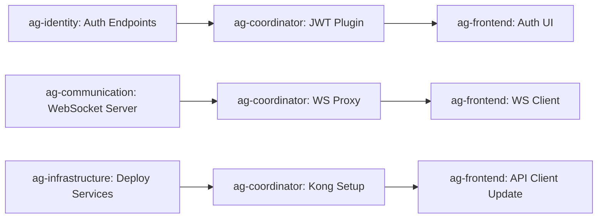

# Task Ownership Matrix - ReactDjango Hub

## Document Overview

**Purpose**: This document clarifies task ownership across all agents based on microservices architecture boundaries and technical domains.

**Created by**: Technical Lead Agent (ag-techlead)  
**Created on**: September 11, 2025  
**Status**: ACTIVE - Authoritative source for task assignments

## Agent Responsibility Matrix

### Service Domain Agents

| Agent | Primary Domain | Can Modify | Cannot Modify | Key Responsibilities |
|-------|----------------|------------|---------------|---------------------|
| **ag-frontend** | React UI Layer | - `frontend/` directory - React components - UI state management - Client-side routing | - Backend services - API configurations - Kong routes - Infrastructure | - React component development - UI/UX implementation - Client-side API integration - Frontend testing |
| **ag-backend** | Django Service | - `backend/` directory - Django models/views - Business logic - Django APIs | - Other microservices - Frontend code - Kong configuration - Infrastructure | - Django development - Business logic - Database models - REST API endpoints |
| **ag-identity** | Identity Service | - `services/identity-service/` - Auth endpoints - User management - RBAC logic | - Other services - Frontend code - Kong routes - Infrastructure | - Authentication flows - User/org management - MFA implementation - JWT handling |
| **ag-communication** | Communication Service | - `services/communication-service/` - Notification logic - Message handling - WebSocket server | - Other services - Frontend code - Kong configuration - Infrastructure | - Email/SMS/Push - Real-time messaging - WebSocket implementation - Notification queues |
| **ag-content** | Content Service | - `services/content-service/` - Document management - File storage logic - Search indexing | - Other services - Frontend code - Kong configuration - Infrastructure | - File upload/download - Document versioning - Search functionality - Storage management |
| **ag-workflow** | Workflow Service | - `services/workflow-service/` - Workflow engine - Process automation - AI integrations | - Other services - Frontend code - Kong configuration - Infrastructure | - Workflow orchestration - Process automation - AI/ML pipelines - Task scheduling |

### Infrastructure & Coordination Agents

| Agent | Primary Domain | Can Modify | Cannot Modify | Key Responsibilities |
|-------|----------------|------------|---------------|---------------------|
| **ag-coordinator** | Service Integration | - `infrastructure/kong/` - API contracts - Service discovery - Kong configuration | - Service implementations - Business logic - UI components - Deployment configs | - Kong API Gateway setup - Service mesh configuration - API routing rules - Load balancing |
| **ag-infrastructure** | Deployment & DevOps | - `infrastructure/docker/` - `infrastructure/kubernetes/` - CI/CD pipelines - Cloud configs | - Application code - Business logic - API implementations - UI components | - Docker configurations - Kubernetes manifests - Deployment automation - Infrastructure as Code |

### Cross-Cutting Agents

| Agent | Primary Domain | Can Modify | Cannot Modify | Key Responsibilities |
|-------|----------------|------------|---------------|---------------------|
| **ag-techlead** | Architecture & Strategy | - `docs/architecture/` - ADRs - Technical standards - Cross-service patterns | - Implementation code - Service-specific logic - Infrastructure deployment - UI components | - Architecture decisions - Technology evaluation - Technical strategy - Cross-service patterns |
| **ag-security** | Security & Compliance | - Security configs - Compliance docs - Security policies - Audit configurations | - Implementation code - Business logic - Infrastructure - UI components | - Security audits - Vulnerability scanning - Compliance verification - Security best practices |
| **ag-reviewer** | Code Quality | - Code review comments - Quality reports - Best practice guides | - Cannot modify code directly - Only reviews and suggests | - Code review - Quality assessment - Best practice enforcement - Performance review |

## Task Assignment Clarifications

### Frontend Architecture Tasks (from frontend-architecture-analysis.md)

#### Task #1: API Client Update to Kong Endpoints

**Primary Owner**: ag-frontend  
**Support From**: ag-coordinator  
**Task Breakdown**:

| Subtask | Owner | Description |
|---------|-------|-------------|
| Kong route configuration | **ag-coordinator** | Define and configure Kong API routes, plugins, and policies |
| Update React API client | **ag-frontend** | Modify `src/services/api/client.ts` to use Kong endpoints |
| Environment variable updates | **ag-frontend** | Update `.env` files to point to Kong gateway |
| API testing through Kong | **ag-frontend** | Test all API calls through the gateway |
| Kong health checks | **ag-coordinator** | Configure service health monitoring in Kong |

**Sequencing**:
1. ag-coordinator configures Kong routes FIRST
2. ag-frontend updates client code AFTER Kong is ready
3. Both agents collaborate on testing

#### Task #2: ServiceOrchestrator Implementation

**Primary Owner**: ag-frontend  
**Support From**: None required  
**Rationale**: This is purely a frontend pattern for orchestrating multiple API calls from the React layer. It's client-side coordination logic.

| Component | Owner | Location |
|-----------|-------|----------|
| ServiceOrchestrator class | **ag-frontend** | `frontend/src/services/integration/` |
| Service client interfaces | **ag-frontend** | `frontend/src/services/api/` |
| Cross-service operations | **ag-frontend** | Frontend orchestration logic |

#### Task #3: Authentication Flow

**Primary Owner**: Split ownership  
**Task Breakdown**:

| Component | Owner | Description |
|-----------|-------|-------------|
| JWT token generation | **ag-identity** | Identity service handles token creation |
| Authentication endpoints | **ag-identity** | Login, logout, refresh endpoints |
| Frontend auth UI | **ag-frontend** | Login forms, MFA screens, password reset UI |
| Auth state management | **ag-frontend** | Zustand store for auth state |
| Token storage/refresh | **ag-frontend** | Client-side token handling |
| Kong JWT validation | **ag-coordinator** | Configure Kong JWT plugin |

#### Task #4: WebSocket Connections

**Primary Owner**: Split ownership  
**Task Breakdown**:

| Component | Owner | Description |
|-----------|-------|-------------|
| WebSocket server | **ag-communication** | Server-side WebSocket implementation |
| Kong WebSocket proxy | **ag-coordinator** | Configure Kong for WebSocket upgrade |
| React WebSocket client | **ag-frontend** | Client-side WebSocket manager |
| Connection management | **ag-frontend** | Reconnection logic, error handling |
| Real-time UI updates | **ag-frontend** | React components for real-time features |

#### Task #5: Internationalization (i18n) Setup

**Primary Owner**: ag-frontend  
**Support From**: Backend services for translated content  
**Task Breakdown**:

| Component | Owner | Description |
|-----------|-------|-------------|
| i18next configuration | **ag-frontend** | Install and configure i18next |
| Translation files | **ag-frontend** | Create locale JSON files |
| Language switcher UI | **ag-frontend** | React component for language selection |
| Translation management | **ag-frontend** | Translation key management |
| Backend translations | **Service agents** | Each service handles its error messages |
| Database translations | **ag-backend** | Stored translations for dynamic content |

## Inter-Agent Dependencies

### Critical Dependency Chains

### Handoff Protocols

#### Protocol 1: Kong Route Configuration → Frontend Integration
1. **ag-coordinator** creates Kong routes and documents them
2. **ag-coordinator** provides endpoint mappings to ag-frontend
3. **ag-frontend** updates API clients with new endpoints
4. Both agents collaborate on integration testing

#### Protocol 2: Service API Changes → Frontend Updates
1. **Service agent** implements new API endpoint
2. **Service agent** documents API in OpenAPI spec
3. **ag-coordinator** adds Kong route if needed
4. **ag-frontend** updates API client and UI

#### Protocol 3: Infrastructure Changes → Service Updates
1. **ag-infrastructure** plans deployment change
2. **ag-infrastructure** notifies affected agents
3. **Service agents** update configuration if needed
4. **ag-infrastructure** executes deployment
5. All agents verify their services post-deployment

## Task Priority Matrix

### 🔴 Critical (Must complete first)

| Task | Primary Owner | Dependencies | Deadline |
|------|---------------|--------------|----------|
| Kong route configuration | ag-coordinator | Infrastructure deployed | Sprint 1 |
| API client Kong integration | ag-frontend | Kong routes configured | Sprint 1 |
| Authentication flow | ag-identity + ag-frontend | Kong JWT plugin | Sprint 1 |
| Service health checks | ag-coordinator | All services running | Sprint 1 |

### 🟡 High Priority (Complete second)

| Task | Primary Owner | Dependencies | Deadline |
|------|---------------|--------------|----------|
| WebSocket implementation | ag-communication + ag-frontend | Kong WS proxy | Sprint 2 |
| i18n setup | ag-frontend | None | Sprint 2 |
| ServiceOrchestrator | ag-frontend | API clients working | Sprint 2 |
| Error handling standardization | All service agents | API patterns defined | Sprint 2 |

### 🟢 Medium Priority (Complete third)

| Task | Primary Owner | Dependencies | Deadline |
|------|---------------|--------------|----------|
| Performance optimization | ag-frontend | Core features complete | Sprint 3 |
| Component library | ag-frontend | UI patterns established | Sprint 3 |
| Monitoring setup | ag-infrastructure | Services stable | Sprint 3 |
| Documentation | All agents | Features implemented | Sprint 3 |

## Conflict Resolution

### Ownership Disputes
1. **Default Rule**: Code location determines ownership
2. **Escalation Path**: ag-techlead makes final decision
3. **Collaboration Required**: Document shared responsibilities

### Boundary Violations
- **Violation**: Agent modifies code outside their domain
- **Resolution**: Revert change, reassign to correct agent
- **Prevention**: Use git hooks to enforce boundaries

### Communication Gaps
- **Issue**: Missing handoff between agents
- **Resolution**: ag-coordinator facilitates communication
- **Prevention**: Use this matrix as reference

## Success Metrics

### Task Completion
- Tasks assigned to correct agent: 100%
- Cross-agent handoffs documented: 100%
- Boundary violations: 0
- Rework due to wrong assignment: <5%

### Agent Efficiency
- Time wasted on out-of-scope work: 0
- Clear ownership for all tasks: 100%
- Successful inter-agent collaborations: >90%

## Maintenance

**Review Schedule**: Weekly during active development  
**Update Authority**: ag-techlead with input from all agents  
**Change Process**: 
1. Propose change with rationale
2. Review impact on other agents
3. Update matrix and notify all agents
4. Update agent configuration files if needed

---

**Document Status**: ACTIVE  
**Last Updated**: September 11, 2025  
**Next Review**: September 18, 2025  
**Maintained By**: Technical Lead Agent (ag-techlead)