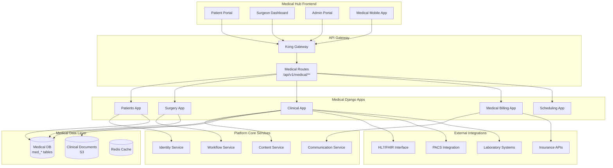
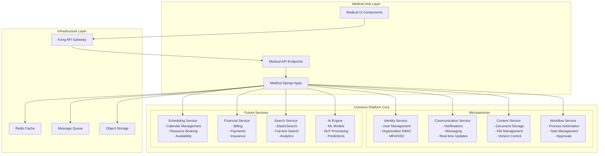
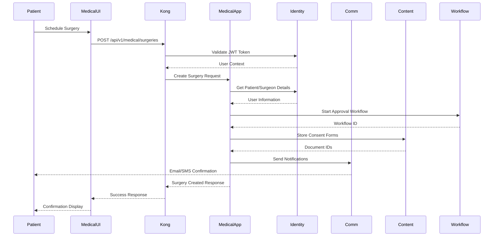

# Medical Hub Vertical Architecture
## Healthcare Practice Management Platform

**Version**: 1.0  
**Date**: January 2025  
**Status**: Active  
**Vertical**: Medical/Healthcare  

---

## Executive Summary

Medical Hub is a comprehensive healthcare practice management platform designed for surgeons, medical professionals, and healthcare facilities. Built on the ReactDjango Hub platform core, it extends common components with medical-specific functionality while maintaining regulatory compliance (HIPAA, GDPR) and clinical workflow requirements.

---

## Medical Hub Overview

### Target Users
- **Surgeons**: Managing surgical schedules, patient records, procedures
- **Medical Staff**: Nurses, anesthesiologists, administrative personnel
- **Healthcare Facilities**: Hospitals, surgical centers, private clinics
- **Patients**: Portal access for appointments, documents, communications

### Key Features
- **Surgery Planning**: Comprehensive surgical scheduling and resource management
- **Patient Management**: Electronic health records (EHR) with clinical data
- **Clinical Workflows**: Pre-op, operative, and post-op process management
- **Medical Billing**: Insurance claims, patient billing, payment processing
- **Compliance**: HIPAA-compliant data handling and audit trails
- **Clinical Communications**: Secure messaging between healthcare providers

---

## Architecture Extensions

### Medical-Specific Architecture Diagram



---

## Integration with Common Platform Architecture

### Shared Microservices Integration

The Medical Hub leverages all platform core services while extending them with medical-specific functionality:



### Service Integration Patterns

#### 1. Identity Service Integration
```python
# Medical Hub uses Identity Service for all authentication
class MedicalPatientViewSet(BaseModelViewSet):
    def create(self, request):
        # Create user in Identity Service first
        identity_user = IdentityServiceClient.create_user({
            'email': request.data['email'],
            'first_name': request.data['first_name'],
            'last_name': request.data['last_name'],
            'organization_id': request.organization.id,
            'role': 'patient'
        })
        
        # Then create medical-specific patient record
        patient = MedicalPatient.objects.create(
            identity_user_id=identity_user['id'],
            medical_record_number=generate_mrn(),
            **request.data
        )
        return patient
```

#### 2. Communication Service Integration
```python
# Medical notifications through Communication Service
class SurgeryNotificationService:
    def send_surgery_reminders(self, procedure):
        # Use Communication Service for multi-channel delivery
        CommunicationServiceClient.send_notification({
            'template': 'surgery_reminder',
            'recipients': [
                procedure.patient.identity_user_id,
                procedure.primary_surgeon.identity_user_id
            ],
            'channels': ['email', 'sms', 'in_app'],
            'data': {
                'procedure_date': procedure.scheduled_date,
                'facility': procedure.facility.name,
                'instructions': procedure.pre_op_instructions
            },
            'language': procedure.patient.preferred_language
        })
```

#### 3. Content Service Integration
```python
# Medical documents managed by Content Service
class ClinicalDocumentService:
    def store_clinical_document(self, document, patient):
        # Store in Content Service with medical metadata
        doc_id = ContentServiceClient.store_document({
            'file': document,
            'metadata': {
                'type': 'clinical_document',
                'patient_id': patient.id,
                'compliance': 'HIPAA',
                'retention_years': 7,
                'encryption': 'AES-256'
            },
            'permissions': {
                'owner': patient.identity_user_id,
                'viewers': [patient.primary_physician_id],
                'editors': []
            }
        })
        return doc_id
```

#### 4. Workflow Service Integration
```python
# Medical workflows orchestrated by Workflow Service
class SurgeryApprovalWorkflow:
    def initiate(self, procedure):
        workflow = WorkflowServiceClient.create_workflow({
            'type': 'surgery_approval',
            'vertical': 'medical',
            'steps': [
                {
                    'name': 'insurance_verification',
                    'assignee': 'billing_department',
                    'sla_hours': 24
                },
                {
                    'name': 'medical_clearance',
                    'assignee': procedure.primary_surgeon_id,
                    'sla_hours': 48
                },
                {
                    'name': 'facility_scheduling',
                    'assignee': 'scheduling_department',
                    'sla_hours': 24
                }
            ],
            'data': {
                'procedure_id': procedure.id,
                'patient_id': procedure.patient.id
            }
        })
        return workflow
```

### Data Flow Architecture



### API Gateway Routing

The Kong API Gateway routes medical-specific requests while enforcing authentication and rate limiting:

```yaml
# Kong route configuration for Medical Hub
routes:
  - name: medical-patient-routes
    paths:
      - /api/v1/medical/patients
    service: django-backend
    plugins:
      - name: jwt
        config:
          claims_to_verify: ["exp", "role"]
      - name: rate-limiting
        config:
          minute: 100
          policy: local
      - name: request-transformer
        config:
          add:
            headers:
              X-Vertical: medical
              X-Compliance: HIPAA

  - name: medical-surgery-routes
    paths:
      - /api/v1/medical/surgeries
    service: django-backend
    plugins:
      - name: jwt
      - name: rbac
        config:
          roles: ["surgeon", "medical_admin"]
```

### Database Schema Integration

```sql
-- Medical tables reference common platform tables
CREATE TABLE med_patients (
    id UUID PRIMARY KEY,
    identity_user_id UUID REFERENCES identity_service.users(id),
    organization_id UUID REFERENCES identity_service.organizations(id),
    medical_record_number VARCHAR(50) UNIQUE,
    -- Medical-specific fields
    blood_type VARCHAR(5),
    allergies JSONB,
    chronic_conditions JSONB,
    -- Audit fields from common pattern
    created_by UUID REFERENCES identity_service.users(id),
    created_at TIMESTAMP DEFAULT NOW(),
    updated_at TIMESTAMP DEFAULT NOW()
);

-- Link to workflow service
CREATE TABLE med_surgery_workflows (
    surgery_id UUID REFERENCES med_surgical_procedures(id),
    workflow_id UUID, -- References workflow_service.workflows
    status VARCHAR(50),
    PRIMARY KEY (surgery_id, workflow_id)
);

-- Link to content service
CREATE TABLE med_clinical_documents (
    id UUID PRIMARY KEY,
    patient_id UUID REFERENCES med_patients(id),
    content_service_doc_id UUID, -- References content_service.documents
    document_type VARCHAR(50),
    created_at TIMESTAMP DEFAULT NOW()
);
```

### Deployment Architecture

```yaml
# docker-compose.medical.yml
version: '3.8'

services:
  # Medical Hub extends base services
  django-backend:
    extends:
      file: docker-compose.base.yml
      service: django-backend
    environment:
      - VERTICAL_ENABLED=medical
      - HIPAA_COMPLIANCE=true
    volumes:
      - ./backend/apps/medical:/app/apps/medical
  
  # Medical-specific configurations
  medical-redis:
    image: redis:7-alpine
    command: redis-server --requirepass ${MEDICAL_REDIS_PASSWORD}
    volumes:
      - medical_redis_data:/data
  
  # Medical cron jobs
  medical-scheduler:
    extends:
      service: django-backend
    command: python manage.py medical_scheduler
    environment:
      - SCHEDULER_TYPE=medical
```

### Performance Optimization

```python
# Medical-specific caching strategies
class MedicalCacheConfig:
    CACHE_STRATEGIES = {
        'patient_summary': {
            'timeout': 3600,  # 1 hour
            'key_prefix': 'med:patient',
            'invalidate_on': ['patient_update', 'procedure_complete']
        },
        'surgery_schedule': {
            'timeout': 300,  # 5 minutes
            'key_prefix': 'med:schedule',
            'invalidate_on': ['surgery_scheduled', 'surgery_cancelled']
        },
        'insurance_verification': {
            'timeout': 86400,  # 24 hours
            'key_prefix': 'med:insurance',
            'invalidate_on': ['insurance_updated']
        }
    }
    
    @staticmethod
    def get_cache_key(cache_type, **kwargs):
        strategy = MedicalCacheConfig.CACHE_STRATEGIES[cache_type]
        return f"{strategy['key_prefix']}:{':'.join(str(v) for v in kwargs.values())}"
```

### Monitoring and Observability

```python
# Medical-specific metrics
class MedicalMetrics:
    # Performance metrics
    surgery_scheduling_time = Histogram(
        'medical_surgery_scheduling_duration_seconds',
        'Time to schedule a surgery'
    )
    
    patient_lookup_time = Histogram(
        'medical_patient_lookup_duration_seconds',
        'Time to retrieve patient information'
    )
    
    # Business metrics
    active_surgeries = Gauge(
        'medical_active_surgeries_total',
        'Number of surgeries in progress'
    )
    
    daily_appointments = Counter(
        'medical_daily_appointments_total',
        'Total appointments per day',
        ['facility', 'department']
    )
    
    # Compliance metrics
    phi_access_logs = Counter(
        'medical_phi_access_total',
        'PHI access audit events',
        ['user_role', 'access_type']
    )
```

---

## Django Medical Apps

### 1. Patients App
**Location**: `backend/apps/medical/patients/`

#### Models
```python
# backend/apps/medical/patients/models.py
from apps.core.base import BaseEntity, SoftDeleteModel, AuditModel

class MedicalPatient(BaseEntity, SoftDeleteModel, AuditModel):
    """Core patient model for medical vertical"""
    
    # Patient Identification
    medical_record_number = models.CharField(
        max_length=50, 
        unique=True,
        db_index=True
    )
    national_id = models.CharField(
        max_length=50, 
        blank=True,
        help_text="National identification number"
    )
    
    # Personal Information
    first_name = models.CharField(max_length=100)
    last_name = models.CharField(max_length=100)
    date_of_birth = models.DateField()
    gender = models.CharField(
        max_length=10,
        choices=[
            ('male', 'Male'),
            ('female', 'Female'),
            ('other', 'Other')
        ]
    )
    
    # Contact Information
    email = models.EmailField(blank=True)
    phone = models.CharField(max_length=20)
    emergency_contact = models.JSONField(default=dict)
    address = models.JSONField(default=dict)
    
    # Medical Information
    blood_type = models.CharField(
        max_length=5,
        choices=[
            ('A+', 'A+'), ('A-', 'A-'),
            ('B+', 'B+'), ('B-', 'B-'),
            ('AB+', 'AB+'), ('AB-', 'AB-'),
            ('O+', 'O+'), ('O-', 'O-')
        ],
        blank=True
    )
    allergies = models.JSONField(
        default=list,
        help_text="List of known allergies"
    )
    chronic_conditions = models.JSONField(
        default=list,
        help_text="Chronic medical conditions"
    )
    current_medications = models.JSONField(
        default=list,
        help_text="Current medication list"
    )
    
    # Insurance Information
    insurance_provider = models.CharField(max_length=100, blank=True)
    insurance_policy_number = models.CharField(max_length=100, blank=True)
    insurance_group_number = models.CharField(max_length=100, blank=True)
    
    # Privacy and Consent
    privacy_consent = models.BooleanField(default=False)
    privacy_consent_date = models.DateTimeField(null=True, blank=True)
    data_sharing_consent = models.JSONField(
        default=dict,
        help_text="Specific data sharing consents"
    )
    
    class Meta:
        db_table = 'med_patients'
        indexes = [
            models.Index(fields=['medical_record_number']),
            models.Index(fields=['last_name', 'first_name']),
            models.Index(fields=['date_of_birth']),
        ]
        
    def get_age(self):
        """Calculate patient age"""
        from datetime import date
        today = date.today()
        return today.year - self.date_of_birth.year - (
            (today.month, today.day) < 
            (self.date_of_birth.month, self.date_of_birth.day)
        )


class MedicalHistory(BaseEntity):
    """Patient medical history records"""
    
    patient = models.ForeignKey(
        MedicalPatient,
        on_delete=models.CASCADE,
        related_name='medical_history'
    )
    
    record_type = models.CharField(
        max_length=50,
        choices=[
            ('diagnosis', 'Diagnosis'),
            ('procedure', 'Procedure'),
            ('medication', 'Medication'),
            ('allergy', 'Allergy'),
            ('immunization', 'Immunization'),
            ('lab_result', 'Lab Result'),
        ]
    )
    
    record_date = models.DateField()
    description = models.TextField()
    icd_codes = models.JSONField(
        default=list,
        help_text="ICD-10 diagnosis codes"
    )
    cpt_codes = models.JSONField(
        default=list,
        help_text="CPT procedure codes"
    )
    provider = models.ForeignKey(
        'auth.User',
        on_delete=models.SET_NULL,
        null=True
    )
    attachments = models.JSONField(
        default=list,
        help_text="Document IDs from content service"
    )
    
    class Meta:
        db_table = 'med_medical_history'
        ordering = ['-record_date']
```

#### API Endpoints
```python
# backend/apps/medical/patients/views.py
from rest_framework import viewsets, status
from rest_framework.decorators import action
from apps.core.api import BaseModelViewSet

class MedicalPatientViewSet(BaseModelViewSet):
    """Patient management API endpoints"""
    queryset = MedicalPatient.objects.all()
    serializer_class = MedicalPatientSerializer
    
    @action(detail=True, methods=['get'])
    def medical_history(self, request, pk=None):
        """Get complete medical history for a patient"""
        patient = self.get_object()
        history = patient.medical_history.all()
        serializer = MedicalHistorySerializer(history, many=True)
        return Response(serializer.data)
    
    @action(detail=True, methods=['get'])
    def upcoming_appointments(self, request, pk=None):
        """Get upcoming appointments for a patient"""
        patient = self.get_object()
        appointments = patient.appointments.filter(
            appointment_date__gte=timezone.now()
        ).order_by('appointment_date')
        serializer = AppointmentSerializer(appointments, many=True)
        return Response(serializer.data)
    
    @action(detail=True, methods=['post'])
    def generate_summary(self, request, pk=None):
        """Generate AI-powered patient summary"""
        patient = self.get_object()
        summary = self.medical_ai_service.generate_patient_summary(patient)
        return Response({'summary': summary})
```

---

### 2. Surgery App
**Location**: `backend/apps/medical/surgery/`

#### Models
```python
# backend/apps/medical/surgery/models.py
class SurgicalProcedure(BaseEntity, AuditModel):
    """Surgical procedure planning and tracking"""
    
    # Procedure Information
    procedure_id = models.CharField(
        max_length=50,
        unique=True,
        default=generate_procedure_id
    )
    patient = models.ForeignKey(
        'patients.MedicalPatient',
        on_delete=models.PROTECT,
        related_name='procedures'
    )
    procedure_type = models.CharField(max_length=200)
    cpt_codes = models.JSONField(
        default=list,
        help_text="CPT procedure codes"
    )
    icd_codes = models.JSONField(
        default=list,
        help_text="ICD-10 diagnosis codes"
    )
    
    # Scheduling
    scheduled_date = models.DateTimeField()
    estimated_duration = models.DurationField()
    actual_start_time = models.DateTimeField(null=True, blank=True)
    actual_end_time = models.DateTimeField(null=True, blank=True)
    
    # Surgical Team
    primary_surgeon = models.ForeignKey(
        'auth.User',
        on_delete=models.PROTECT,
        related_name='primary_procedures'
    )
    assistant_surgeons = models.ManyToManyField(
        'auth.User',
        related_name='assistant_procedures',
        blank=True
    )
    anesthesiologist = models.ForeignKey(
        'auth.User',
        on_delete=models.SET_NULL,
        null=True,
        blank=True,
        related_name='anesthesia_procedures'
    )
    surgical_nurses = models.ManyToManyField(
        'auth.User',
        related_name='nursing_procedures',
        blank=True
    )
    
    # Location
    facility = models.ForeignKey(
        'facilities.MedicalFacility',
        on_delete=models.PROTECT
    )
    operating_room = models.CharField(max_length=50)
    
    # Status and Workflow
    status = models.CharField(
        max_length=30,
        choices=[
            ('scheduled', 'Scheduled'),
            ('pre_op', 'Pre-Operative'),
            ('in_progress', 'In Progress'),
            ('post_op', 'Post-Operative'),
            ('completed', 'Completed'),
            ('cancelled', 'Cancelled'),
            ('postponed', 'Postponed'),
        ],
        default='scheduled'
    )
    
    # Clinical Details
    urgency_level = models.CharField(
        max_length=20,
        choices=[
            ('elective', 'Elective'),
            ('urgent', 'Urgent'),
            ('emergency', 'Emergency'),
        ],
        default='elective'
    )
    anesthesia_type = models.CharField(
        max_length=50,
        choices=[
            ('general', 'General'),
            ('regional', 'Regional'),
            ('local', 'Local'),
            ('sedation', 'Sedation'),
        ],
        blank=True
    )
    
    # Documentation
    pre_op_notes = models.TextField(blank=True)
    operative_notes = models.TextField(blank=True)
    post_op_notes = models.TextField(blank=True)
    complications = models.JSONField(
        default=list,
        help_text="List of complications if any"
    )
    
    # Equipment and Supplies
    equipment_requirements = models.JSONField(
        default=list,
        help_text="Required surgical equipment"
    )
    special_requirements = models.TextField(blank=True)
    
    # Billing
    estimated_cost = models.DecimalField(
        max_digits=10,
        decimal_places=2,
        null=True,
        blank=True
    )
    insurance_pre_authorization = models.CharField(
        max_length=100,
        blank=True
    )
    
    class Meta:
        db_table = 'med_surgical_procedures'
        indexes = [
            models.Index(fields=['scheduled_date']),
            models.Index(fields=['status']),
            models.Index(fields=['primary_surgeon']),
        ]


class SurgicalChecklist(BaseEntity):
    """WHO Surgical Safety Checklist implementation"""
    
    procedure = models.OneToOneField(
        SurgicalProcedure,
        on_delete=models.CASCADE,
        related_name='checklist'
    )
    
    # Sign In (Before anesthesia)
    sign_in_completed = models.BooleanField(default=False)
    patient_identity_confirmed = models.BooleanField(default=False)
    surgical_site_marked = models.BooleanField(default=False)
    anesthesia_safety_check = models.BooleanField(default=False)
    pulse_oximeter_functioning = models.BooleanField(default=False)
    allergies_reviewed = models.BooleanField(default=False)
    difficult_airway_risk = models.BooleanField(default=False)
    blood_loss_risk = models.BooleanField(default=False)
    
    # Time Out (Before incision)
    timeout_completed = models.BooleanField(default=False)
    team_introductions = models.BooleanField(default=False)
    patient_procedure_site_confirmed = models.BooleanField(default=False)
    antibiotics_given = models.BooleanField(default=False)
    imaging_displayed = models.BooleanField(default=False)
    critical_events_reviewed = models.BooleanField(default=False)
    
    # Sign Out (Before leaving OR)
    signout_completed = models.BooleanField(default=False)
    procedure_recorded = models.BooleanField(default=False)
    instrument_count_correct = models.BooleanField(default=False)
    specimen_labeled = models.BooleanField(default=False)
    equipment_issues_addressed = models.BooleanField(default=False)
    recovery_concerns_reviewed = models.BooleanField(default=False)
    
    class Meta:
        db_table = 'med_surgical_checklists'
```

---

### 3. Clinical App
**Location**: `backend/apps/medical/clinical/`

#### Clinical Documentation
```python
# backend/apps/medical/clinical/models.py
class ClinicalNote(BaseEntity, AuditModel):
    """Clinical documentation and notes"""
    
    patient = models.ForeignKey(
        'patients.MedicalPatient',
        on_delete=models.CASCADE,
        related_name='clinical_notes'
    )
    
    note_type = models.CharField(
        max_length=50,
        choices=[
            ('progress', 'Progress Note'),
            ('consultation', 'Consultation Note'),
            ('discharge', 'Discharge Summary'),
            ('operative', 'Operative Report'),
            ('radiology', 'Radiology Report'),
            ('pathology', 'Pathology Report'),
        ]
    )
    
    encounter_date = models.DateTimeField()
    provider = models.ForeignKey(
        'auth.User',
        on_delete=models.PROTECT
    )
    
    # SOAP Format
    subjective = models.TextField(
        blank=True,
        help_text="Patient's subjective complaints"
    )
    objective = models.TextField(
        blank=True,
        help_text="Objective findings and observations"
    )
    assessment = models.TextField(
        blank=True,
        help_text="Clinical assessment and diagnosis"
    )
    plan = models.TextField(
        blank=True,
        help_text="Treatment plan"
    )
    
    # Additional structured data
    vital_signs = models.JSONField(
        default=dict,
        help_text="Vital signs at time of encounter"
    )
    diagnoses = models.JSONField(
        default=list,
        help_text="List of diagnoses with ICD codes"
    )
    procedures_performed = models.JSONField(
        default=list,
        help_text="Procedures performed during encounter"
    )
    medications_prescribed = models.JSONField(
        default=list,
        help_text="Medications prescribed"
    )
    
    # Attachments and references
    attachments = models.JSONField(
        default=list,
        help_text="Document IDs from content service"
    )
    related_procedure = models.ForeignKey(
        'surgery.SurgicalProcedure',
        on_delete=models.SET_NULL,
        null=True,
        blank=True
    )
    
    # Signature and attestation
    is_signed = models.BooleanField(default=False)
    signed_at = models.DateTimeField(null=True, blank=True)
    signature_data = models.JSONField(
        default=dict,
        help_text="Digital signature data"
    )
    
    class Meta:
        db_table = 'med_clinical_notes'
        indexes = [
            models.Index(fields=['patient', '-encounter_date']),
            models.Index(fields=['provider', '-encounter_date']),
        ]


class LabOrder(BaseEntity):
    """Laboratory test orders and results"""
    
    patient = models.ForeignKey(
        'patients.MedicalPatient',
        on_delete=models.CASCADE,
        related_name='lab_orders'
    )
    
    ordering_provider = models.ForeignKey(
        'auth.User',
        on_delete=models.PROTECT
    )
    
    order_date = models.DateTimeField(auto_now_add=True)
    priority = models.CharField(
        max_length=20,
        choices=[
            ('routine', 'Routine'),
            ('urgent', 'Urgent'),
            ('stat', 'STAT'),
        ],
        default='routine'
    )
    
    tests_ordered = models.JSONField(
        help_text="List of test codes and names"
    )
    
    clinical_information = models.TextField(
        blank=True,
        help_text="Clinical information for lab"
    )
    
    # Results
    status = models.CharField(
        max_length=20,
        choices=[
            ('ordered', 'Ordered'),
            ('collected', 'Specimen Collected'),
            ('in_progress', 'In Progress'),
            ('resulted', 'Resulted'),
            ('cancelled', 'Cancelled'),
        ],
        default='ordered'
    )
    
    collection_date = models.DateTimeField(null=True, blank=True)
    result_date = models.DateTimeField(null=True, blank=True)
    results = models.JSONField(
        default=dict,
        help_text="Lab results data"
    )
    
    # Integration
    external_order_id = models.CharField(
        max_length=100,
        blank=True,
        help_text="External lab system order ID"
    )
    hl7_message = models.TextField(
        blank=True,
        help_text="HL7 message data"
    )
    
    class Meta:
        db_table = 'med_lab_orders'
```

---

## Frontend Medical Components

### 1. Medical-Specific UI Components
**Location**: `frontend/src/verticals/medical/components/`

#### Patient Card Component
```typescript
// components/PatientCard/PatientCard.tsx
interface PatientCardProps {
  patient: MedicalPatient;
  showDetails?: boolean;
  onSelect?: (patient: MedicalPatient) => void;
  actions?: React.ReactNode;
}

export const PatientCard: React.FC<PatientCardProps> = ({
  patient,
  showDetails = false,
  onSelect,
  actions
}) => {
  const age = calculateAge(patient.dateOfBirth);
  const hasAllergies = patient.allergies?.length > 0;
  
  return (
    <Card 
      className="patient-card"
      onClick={() => onSelect?.(patient)}
      interactive={!!onSelect}
    >
      <CardHeader>
        <div className="patient-header">
          <Avatar 
            name={`${patient.firstName} ${patient.lastName}`}
            size="lg"
          />
          <div className="patient-info">
            <h3>{patient.firstName} {patient.lastName}</h3>
            <p className="text-muted">
              MRN: {patient.medicalRecordNumber} | Age: {age} | {patient.gender}
            </p>
          </div>
          {hasAllergies && (
            <Badge variant="warning" icon={<AlertIcon />}>
              Allergies
            </Badge>
          )}
        </div>
      </CardHeader>
      
      {showDetails && (
        <CardBody>
          <div className="patient-details">
            <DetailRow label="Blood Type" value={patient.bloodType} />
            <DetailRow label="Phone" value={patient.phone} />
            <DetailRow label="Insurance" value={patient.insuranceProvider} />
            {patient.chronicConditions?.length > 0 && (
              <DetailRow 
                label="Chronic Conditions" 
                value={patient.chronicConditions.join(', ')}
              />
            )}
          </div>
        </CardBody>
      )}
      
      {actions && (
        <CardFooter>
          <div className="patient-actions">{actions}</div>
        </CardFooter>
      )}
    </Card>
  );
};
```

#### Surgery Schedule Component
```typescript
// components/SurgerySchedule/SurgerySchedule.tsx
interface SurgeryScheduleProps {
  date: Date;
  surgeries: SurgicalProcedure[];
  view: 'day' | 'week' | 'month';
  onSurgerySelect?: (surgery: SurgicalProcedure) => void;
  onTimeSlotSelect?: (slot: TimeSlot) => void;
}

export const SurgerySchedule: React.FC<SurgeryScheduleProps> = ({
  date,
  surgeries,
  view,
  onSurgerySelect,
  onTimeSlotSelect
}) => {
  const groupedSurgeries = groupSurgeriesByRoom(surgeries);
  
  return (
    <div className="surgery-schedule">
      <ScheduleHeader date={date} view={view} />
      
      <div className="schedule-grid">
        {Object.entries(groupedSurgeries).map(([room, roomSurgeries]) => (
          <div key={room} className="room-schedule">
            <div className="room-header">
              <RoomIcon />
              <span>OR {room}</span>
            </div>
            
            <div className="surgery-timeline">
              {roomSurgeries.map(surgery => (
                <SurgeryBlock
                  key={surgery.id}
                  surgery={surgery}
                  onClick={() => onSurgerySelect?.(surgery)}
                  className={getSurgeryStatusClass(surgery.status)}
                >
                  <div className="surgery-time">
                    {formatTime(surgery.scheduledDate)} - 
                    {calculateEndTime(surgery.scheduledDate, surgery.estimatedDuration)}
                  </div>
                  <div className="surgery-patient">
                    {surgery.patient.firstName} {surgery.patient.lastName}
                  </div>
                  <div className="surgery-procedure">
                    {surgery.procedureType}
                  </div>
                  <div className="surgery-team">
                    <UserIcon /> Dr. {surgery.primarySurgeon.lastName}
                  </div>
                </SurgeryBlock>
              ))}
            </div>
          </div>
        ))}
      </div>
    </div>
  );
};
```

#### Clinical Note Editor
```typescript
// components/ClinicalNoteEditor/ClinicalNoteEditor.tsx
interface ClinicalNoteEditorProps {
  patient: MedicalPatient;
  noteType: ClinicalNoteType;
  onSave: (note: ClinicalNote) => Promise<void>;
  templates?: NoteTemplate[];
}

export const ClinicalNoteEditor: React.FC<ClinicalNoteEditorProps> = ({
  patient,
  noteType,
  onSave,
  templates
}) => {
  const [note, setNote] = useState<Partial<ClinicalNote>>({
    noteType,
    patientId: patient.id,
    encounterDate: new Date(),
    subjective: '',
    objective: '',
    assessment: '',
    plan: ''
  });
  
  const [vitalSigns, setVitalSigns] = useState<VitalSigns>({});
  const [selectedTemplate, setSelectedTemplate] = useState<NoteTemplate | null>(null);
  
  const handleTemplateSelect = (template: NoteTemplate) => {
    setSelectedTemplate(template);
    setNote(prev => ({
      ...prev,
      ...template.content
    }));
  };
  
  const handleSave = async () => {
    const completeNote: ClinicalNote = {
      ...note as ClinicalNote,
      vitalSigns,
      provider: getCurrentUser(),
      organization: getCurrentOrganization()
    };
    
    await onSave(completeNote);
  };
  
  return (
    <div className="clinical-note-editor">
      <div className="editor-header">
        <PatientBanner patient={patient} />
        <TemplateSelector 
          templates={templates}
          onSelect={handleTemplateSelect}
        />
      </div>
      
      <div className="editor-body">
        <VitalSignsInput 
          value={vitalSigns}
          onChange={setVitalSigns}
        />
        
        <div className="soap-sections">
          <Section title="Subjective">
            <RichTextEditor
              value={note.subjective}
              onChange={(value) => setNote(prev => ({ ...prev, subjective: value }))}
              placeholder="Patient's chief complaint and history..."
            />
          </Section>
          
          <Section title="Objective">
            <RichTextEditor
              value={note.objective}
              onChange={(value) => setNote(prev => ({ ...prev, objective: value }))}
              placeholder="Physical examination findings..."
            />
          </Section>
          
          <Section title="Assessment">
            <RichTextEditor
              value={note.assessment}
              onChange={(value) => setNote(prev => ({ ...prev, assessment: value }))}
              placeholder="Clinical assessment and diagnosis..."
            />
            <DiagnosisSelector
              selected={note.diagnoses || []}
              onChange={(diagnoses) => setNote(prev => ({ ...prev, diagnoses }))}
            />
          </Section>
          
          <Section title="Plan">
            <RichTextEditor
              value={note.plan}
              onChange={(value) => setNote(prev => ({ ...prev, plan: value }))}
              placeholder="Treatment plan and follow-up..."
            />
            <MedicationPrescriber
              patient={patient}
              onPrescribe={(medications) => 
                setNote(prev => ({ 
                  ...prev, 
                  medicationsPrescribed: medications 
                }))
              }
            />
          </Section>
        </div>
      </div>
      
      <div className="editor-footer">
        <Button variant="secondary" onClick={handleCancel}>
          Cancel
        </Button>
        <Button variant="primary" onClick={handleSave}>
          Sign and Save
        </Button>
      </div>
    </div>
  );
};
```

---

### 2. Medical-Specific Pages
**Location**: `frontend/src/verticals/medical/pages/`

#### Surgeon Dashboard
```typescript
// pages/SurgeonDashboard/SurgeonDashboard.tsx
export const SurgeonDashboard: React.FC = () => {
  const { user } = useAuth();
  const { surgeries, loading } = useSurgeries({ 
    surgeonId: user.id,
    dateRange: 'upcoming' 
  });
  
  return (
    <DashboardLayout>
      <DashboardHeader>
        <h1>Welcome, Dr. {user.lastName}</h1>
        <QuickActions>
          <Button icon={<PlusIcon />} onClick={scheduleNewSurgery}>
            Schedule Surgery
          </Button>
          <Button icon={<PatientIcon />} onClick={viewPatients}>
            View Patients
          </Button>
        </QuickActions>
      </DashboardHeader>
      
      <DashboardGrid>
        <Widget title="Today's Schedule" size="large">
          <TodaySchedule surgeries={todaysSurgeries} />
        </Widget>
        
        <Widget title="Patient Queue">
          <PatientQueue patients={waitingPatients} />
        </Widget>
        
        <Widget title="Recent Lab Results">
          <LabResultsList results={recentLabResults} />
        </Widget>
        
        <Widget title="Pending Tasks">
          <TaskList tasks={pendingTasks} />
        </Widget>
      </DashboardGrid>
    </DashboardLayout>
  );
};
```

---

## Medical-Specific Integrations

### HL7/FHIR Integration
```python
# backend/apps/medical/integrations/hl7.py
from hl7apy import core as hl7
from fhirclient import client

class HL7Integration:
    """HL7 message processing and integration"""
    
    def parse_adt_message(self, message: str):
        """Parse ADT (Admit, Discharge, Transfer) message"""
        msg = hl7.parse(message)
        patient_data = {
            'mrn': msg.PID.PID_3.value,
            'first_name': msg.PID.PID_5.XPN_2.value,
            'last_name': msg.PID.PID_5.XPN_1.value,
            'date_of_birth': msg.PID.PID_7.value,
            'gender': msg.PID.PID_8.value,
        }
        return patient_data
    
    def create_orm_message(self, lab_order):
        """Create ORM (Order Message) for lab orders"""
        msg = hl7.Message('ORM_O01')
        msg.MSH.MSH_9 = 'ORM^O01'
        msg.PID.PID_3 = lab_order.patient.medical_record_number
        # ... build complete message
        return str(msg)


class FHIRIntegration:
    """FHIR API integration"""
    
    def __init__(self):
        settings = {
            'app_id': 'medical_hub',
            'api_base': settings.FHIR_SERVER_URL
        }
        self.client = client.FHIRClient(settings=settings)
    
    def export_patient_to_fhir(self, patient: MedicalPatient):
        """Export patient data to FHIR format"""
        from fhirclient.models import patient as fhir_patient
        
        p = fhir_patient.Patient()
        p.id = str(patient.id)
        
        # Name
        name = fhir_patient.HumanName()
        name.given = [patient.first_name]
        name.family = patient.last_name
        p.name = [name]
        
        # Identifiers
        identifier = fhir_patient.Identifier()
        identifier.value = patient.medical_record_number
        identifier.system = 'http://hospital.example.org/mrn'
        p.identifier = [identifier]
        
        return p.as_json()
```

### Insurance Verification
```python
# backend/apps/medical/integrations/insurance.py
class InsuranceVerification:
    """Insurance eligibility and verification"""
    
    async def verify_eligibility(self, patient: MedicalPatient, procedure_codes: List[str]):
        """Verify insurance eligibility for procedures"""
        
        request_data = {
            'provider_npi': settings.PROVIDER_NPI,
            'patient': {
                'first_name': patient.first_name,
                'last_name': patient.last_name,
                'dob': patient.date_of_birth.isoformat(),
                'member_id': patient.insurance_policy_number,
            },
            'payer_id': self.get_payer_id(patient.insurance_provider),
            'service_types': procedure_codes,
        }
        
        response = await self.insurance_api.eligibility_check(request_data)
        
        return {
            'eligible': response['eligible'],
            'coverage_details': response['coverage'],
            'copay': response['copay'],
            'deductible': response['deductible'],
            'out_of_pocket_max': response['out_of_pocket_max'],
        }
```

---

## Medical Compliance & Security

### HIPAA Compliance
```python
# backend/apps/medical/compliance/hipaa.py
class HIPAACompliance:
    """HIPAA compliance utilities"""
    
    @staticmethod
    def audit_phi_access(user, patient, action, data_accessed):
        """Log PHI (Protected Health Information) access"""
        from apps.compliance.models import PHIAuditLog
        
        PHIAuditLog.objects.create(
            user=user,
            patient=patient,
            action=action,
            data_accessed=data_accessed,
            ip_address=get_client_ip(),
            user_agent=get_user_agent(),
            timestamp=timezone.now()
        )
    
    @staticmethod
    def encrypt_phi(data: dict) -> str:
        """Encrypt PHI data at rest"""
        from cryptography.fernet import Fernet
        key = settings.PHI_ENCRYPTION_KEY.encode()
        f = Fernet(key)
        return f.encrypt(json.dumps(data).encode()).decode()
    
    @staticmethod
    def check_minimum_necessary(user, patient, requested_data):
        """Ensure minimum necessary standard"""
        role = user.role
        allowed_fields = ROLE_PHI_ACCESS_MAP.get(role, [])
        
        for field in requested_data:
            if field not in allowed_fields:
                raise PermissionDenied(
                    f"Role {role} cannot access {field}"
                )
```

### Medical Data Retention
```python
# backend/apps/medical/compliance/retention.py
class MedicalDataRetention:
    """Medical record retention policies"""
    
    RETENTION_PERIODS = {
        'adult_medical_records': timedelta(days=365 * 7),  # 7 years
        'pediatric_medical_records': timedelta(days=365 * 25),  # Until age 25
        'surgical_records': timedelta(days=365 * 10),  # 10 years
        'radiology_images': timedelta(days=365 * 7),  # 7 years
        'lab_results': timedelta(days=365 * 5),  # 5 years
    }
    
    def apply_retention_policy(self):
        """Apply retention policies to medical records"""
        for record_type, retention_period in self.RETENTION_PERIODS.items():
            cutoff_date = timezone.now() - retention_period
            
            # Archive records past retention
            records = self.get_records_for_archival(record_type, cutoff_date)
            for record in records:
                self.archive_record(record)
```

---

## Medical-Specific Workflows

### Surgery Approval Workflow
```python
# backend/apps/medical/workflows/surgery_approval.py
class SurgeryApprovalWorkflow:
    """Multi-step surgery approval process"""
    
    WORKFLOW_STEPS = [
        'insurance_verification',
        'medical_clearance',
        'anesthesia_evaluation',
        'surgical_consent',
        'facility_scheduling',
        'final_approval'
    ]
    
    async def initiate_approval(self, procedure: SurgicalProcedure):
        """Start surgery approval workflow"""
        
        workflow = await WorkflowService.create_workflow(
            workflow_type='surgery_approval',
            entity_id=procedure.id,
            steps=self.WORKFLOW_STEPS
        )
        
        # Start first step
        await self.verify_insurance(procedure, workflow)
        
        return workflow
    
    async def verify_insurance(self, procedure, workflow):
        """Step 1: Insurance verification"""
        verification = await InsuranceService.verify_procedure(
            patient=procedure.patient,
            procedure_codes=procedure.cpt_codes
        )
        
        if verification['requires_preauth']:
            await self.request_preauthorization(procedure)
        
        await workflow.complete_step('insurance_verification', verification)
```

### Patient Discharge Workflow
```python
# backend/apps/medical/workflows/discharge.py
class PatientDischargeWorkflow:
    """Patient discharge process"""
    
    def process_discharge(self, patient: MedicalPatient, encounter_id: str):
        """Complete discharge process"""
        
        tasks = []
        
        # Generate discharge summary
        tasks.append(self.generate_discharge_summary(patient, encounter_id))
        
        # Prescriptions
        tasks.append(self.process_discharge_medications(patient))
        
        # Follow-up appointments
        tasks.append(self.schedule_follow_ups(patient))
        
        # Patient education
        tasks.append(self.provide_discharge_instructions(patient))
        
        # Billing
        tasks.append(self.finalize_billing(patient, encounter_id))
        
        return asyncio.gather(*tasks)
```

---

## Testing Strategy

### Medical-Specific Test Cases
```python
# backend/apps/medical/tests/test_compliance.py
class HIPAAComplianceTests(TestCase):
    """Test HIPAA compliance features"""
    
    def test_phi_encryption(self):
        """Test PHI data is encrypted"""
        patient = MedicalPatient.objects.create(
            first_name="John",
            last_name="Doe",
            date_of_birth="1980-01-01"
        )
        
        # Check database storage
        raw_sql = "SELECT * FROM med_patients WHERE id = %s"
        with connection.cursor() as cursor:
            cursor.execute(raw_sql, [patient.id])
            row = cursor.fetchone()
            
        # Sensitive fields should be encrypted
        self.assertNotIn("John", str(row))
        self.assertNotIn("Doe", str(row))
    
    def test_audit_logging(self):
        """Test PHI access is logged"""
        with self.assertLogs('medical.audit', level='INFO') as logs:
            response = self.client.get(f'/api/v1/medical/patients/{patient.id}/')
            
        self.assertIn('PHI_ACCESS', logs.output[0])
```

---

## Performance Optimizations

### Medical Data Caching
```python
# backend/apps/medical/cache.py
class MedicalCacheStrategy:
    """Caching strategy for medical data"""
    
    @cache_result(timeout=3600, key_prefix='patient_summary')
    def get_patient_summary(self, patient_id: str):
        """Cache patient summaries for 1 hour"""
        patient = MedicalPatient.objects.select_related(
            'organization'
        ).prefetch_related(
            'medical_history',
            'appointments',
            'procedures'
        ).get(id=patient_id)
        
        return PatientSummarySerializer(patient).data
    
    def invalidate_patient_cache(self, patient_id: str):
        """Invalidate patient-related caches"""
        cache_keys = [
            f'patient_summary:{patient_id}',
            f'patient_appointments:{patient_id}',
            f'patient_history:{patient_id}',
        ]
        cache.delete_many(cache_keys)
```

---

## Deployment Configuration

### Medical Hub Environment Variables
```yaml
# Medical-specific configuration
MEDICAL_ENABLED: "true"
HIPAA_COMPLIANCE_MODE: "true"
PHI_ENCRYPTION_KEY: "${PHI_ENCRYPTION_KEY}"

# HL7/FHIR Integration
FHIR_SERVER_URL: "https://fhir.medical-hub.com"
HL7_LISTENER_PORT: "2575"
HL7_SENDER_HOST: "hl7.hospital.network"

# Insurance APIs
INSURANCE_API_URL: "https://api.insuranceverification.com"
INSURANCE_API_KEY: "${INSURANCE_API_KEY}"

# Medical compliance
MEDICAL_RECORD_RETENTION_YEARS: "7"
REQUIRE_PHYSICIAN_SIGNATURE: "true"
ENABLE_PRESCRIPTION_MODULE: "true"

# Integration endpoints
LAB_SYSTEM_URL: "https://lab.hospital.network"
PACS_SERVER_URL: "https://pacs.hospital.network"
PHARMACY_SYSTEM_URL: "https://pharmacy.hospital.network"
```

---

## Summary

The Medical Hub vertical extends the ReactDjango Hub platform with comprehensive healthcare-specific functionality:

1. **Clinical Features**: Complete EHR, surgical planning, clinical documentation
2. **Compliance**: HIPAA-compliant with audit trails and data encryption
3. **Integrations**: HL7/FHIR, insurance verification, lab systems
4. **Workflows**: Surgery approval, patient discharge, clinical processes
5. **UI Components**: Medical-specific interfaces for healthcare workflows

The architecture maintains clear separation from the platform core while leveraging all common services and components, ensuring maintainability and scalability.