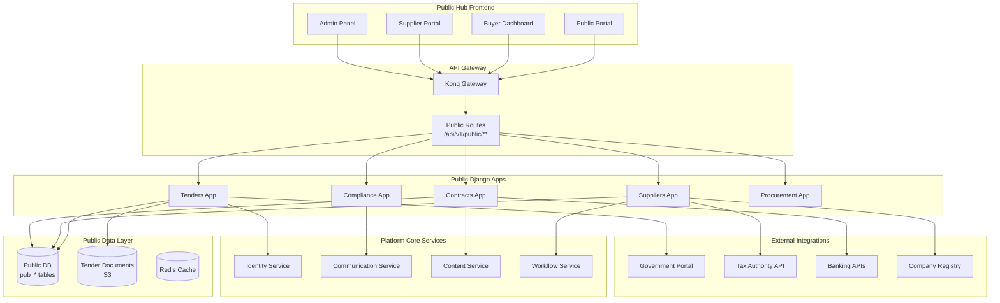
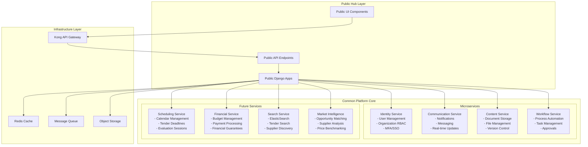
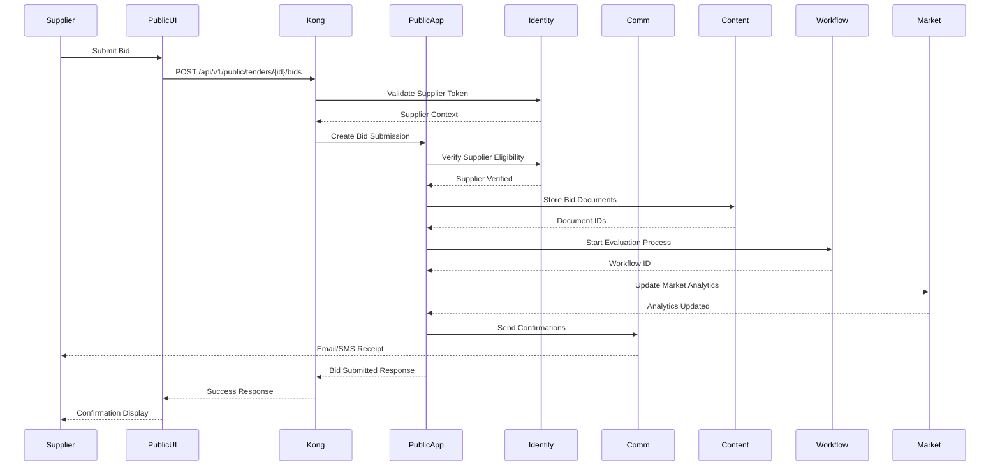

# Public Hub Vertical Architecture
## Public Procurement and Tender Management Platform

**Version**: 1.0  
**Date**: January 2025  
**Status**: Active  
**Vertical**: Public Sector/Government Procurement  

---

## Executive Summary

Public Hub is a comprehensive public procurement platform designed for government entities, public institutions, and suppliers participating in public tenders. Built on the ReactDjango Hub platform core, it extends common components with procurement-specific functionality while maintaining regulatory compliance and transparency requirements for public sector operations.

---

## Public Hub Overview

### Target Users
- **Government Entities**: Ministries, agencies, municipalities
- **Public Institutions**: Universities, hospitals, public corporations
- **Suppliers**: Companies bidding on public contracts
- **Citizens**: Public access to tender information (transparency)
- **Auditors**: Regulatory bodies and compliance officers

### Key Features
- **Tender Management**: Complete tender lifecycle from publication to award
- **Supplier Registry**: Pre-qualification and vendor management
- **Bid Evaluation**: Multi-criteria evaluation with scoring matrices
- **Contract Management**: Contract lifecycle and performance monitoring
- **Compliance Tracking**: Regulatory compliance and audit trails
- **Public Portal**: Transparent access to public procurement data
- **Analytics**: Procurement analytics and spending analysis

---

## Architecture Extensions

### Public Hub Architecture Diagram



---

## Integration with Common Platform Architecture

### Shared Microservices Integration

The Public Hub leverages all platform core services while extending them with procurement-specific functionality:



### Service Integration Patterns

#### 1. Identity Service Integration
```python
# Public Hub uses Identity Service for multi-stakeholder authentication
class SupplierRegistrationService:
    def register_supplier(self, request):
        # Create organization in Identity Service
        org = IdentityServiceClient.create_organization({
            'name': request.data['company_name'],
            'type': 'supplier',
            'tax_id': request.data['tax_id'],
            'country': request.data['country']
        })
        
        # Create admin user for the supplier
        admin_user = IdentityServiceClient.create_user({
            'email': request.data['admin_email'],
            'first_name': request.data['admin_first_name'],
            'last_name': request.data['admin_last_name'],
            'organization_id': org['id'],
            'role': 'supplier_admin'
        })
        
        # Create supplier profile with procurement-specific data
        supplier = Supplier.objects.create(
            identity_org_id=org['id'],
            registration_number=generate_supplier_number(),
            business_categories=request.data['categories'],
            certifications=request.data['certifications'],
            **request.data
        )
        return supplier
```

#### 2. Communication Service Integration
```python
# Public procurement notifications through Communication Service
class TenderNotificationService:
    def notify_tender_publication(self, tender):
        # Get interested suppliers based on categories
        suppliers = self.get_matching_suppliers(tender.categories)
        
        # Multi-channel notification through Communication Service
        CommunicationServiceClient.send_bulk_notification({
            'template': 'new_tender_alert',
            'recipients': [s.identity_user_id for s in suppliers],
            'channels': ['email', 'sms', 'platform'],
            'data': {
                'tender_title': tender.title,
                'tender_reference': tender.reference_number,
                'submission_deadline': tender.submission_deadline,
                'estimated_value': tender.estimated_value,
                'categories': tender.categories
            },
            'language_preference': 'user_preferred',
            'priority': 'high' if tender.is_urgent else 'normal'
        })
```

#### 3. Content Service Integration
```python
# Tender documents managed by Content Service
class TenderDocumentService:
    def upload_tender_documents(self, tender, documents):
        doc_ids = []
        for doc in documents:
            # Store in Content Service with public procurement metadata
            doc_id = ContentServiceClient.store_document({
                'file': doc['file'],
                'metadata': {
                    'type': 'tender_document',
                    'tender_id': tender.id,
                    'document_type': doc['type'],  # RFP, Technical Specs, etc.
                    'is_public': not doc.get('restricted', False),
                    'language': doc.get('language', 'fr'),
                    'version': doc.get('version', '1.0')
                },
                'permissions': {
                    'owner': tender.contracting_authority_id,
                    'viewers': ['public'] if not doc.get('restricted') else [],
                    'downloaders': self.get_authorized_suppliers(tender)
                },
                'retention': {
                    'years': 10,  # Legal retention for public contracts
                    'policy': 'archive_after_expiry'
                }
            })
            doc_ids.append(doc_id)
        return doc_ids
```

#### 4. Workflow Service Integration
```python
# Procurement workflows orchestrated by Workflow Service
class TenderEvaluationWorkflow:
    def initiate(self, tender):
        workflow = WorkflowServiceClient.create_workflow({
            'type': 'tender_evaluation',
            'vertical': 'public',
            'steps': [
                {
                    'name': 'administrative_check',
                    'assignee': 'procurement_officer',
                    'sla_hours': 48,
                    'criteria': ['completeness', 'eligibility', 'compliance']
                },
                {
                    'name': 'technical_evaluation',
                    'assignee': 'technical_committee',
                    'sla_hours': 120,
                    'scoring_matrix': tender.technical_criteria
                },
                {
                    'name': 'financial_evaluation',
                    'assignee': 'financial_committee',
                    'sla_hours': 72,
                    'scoring_matrix': tender.financial_criteria
                },
                {
                    'name': 'award_decision',
                    'assignee': 'contracting_authority',
                    'sla_hours': 48,
                    'approval_required': True
                }
            ],
            'data': {
                'tender_id': tender.id,
                'submission_count': tender.submissions.count(),
                'evaluation_method': tender.evaluation_method
            },
            'transparency': {
                'audit_trail': True,
                'public_results': True,
                'notification_required': True
            }
        })
        return workflow
```

### Data Flow Architecture



### API Gateway Routing

```yaml
# Kong route configuration for Public Hub
routes:
  - name: public-tender-routes
    paths:
      - /api/v1/public/tenders
    service: django-backend
    plugins:
      - name: jwt
        config:
          claims_to_verify: ["exp", "org_type"]
      - name: rate-limiting
        config:
          minute: 200
          policy: local
      - name: request-transformer
        config:
          add:
            headers:
              X-Vertical: public
              X-Compliance: PUBLIC_PROCUREMENT

  - name: public-supplier-routes
    paths:
      - /api/v1/public/suppliers
    service: django-backend
    plugins:
      - name: jwt
      - name: rbac
        config:
          roles: ["supplier", "buyer", "public_admin"]
      - name: cors
        config:
          origins: ["https://public.hub.com"]
          
  - name: public-portal-routes
    paths:
      - /api/v1/public/portal
    service: django-backend
    plugins:
      - name: rate-limiting
        config:
          minute: 1000
      # No auth required for public transparency
```

### Database Schema Integration

```sql
-- Public tables reference common platform tables
CREATE TABLE pub_suppliers (
    id UUID PRIMARY KEY,
    identity_org_id UUID REFERENCES identity_service.organizations(id),
    registration_number VARCHAR(50) UNIQUE,
    tax_id VARCHAR(50),
    business_categories JSONB,
    certifications JSONB,
    financial_standing JSONB,
    -- Audit fields from common pattern
    created_by UUID REFERENCES identity_service.users(id),
    created_at TIMESTAMP DEFAULT NOW(),
    updated_at TIMESTAMP DEFAULT NOW()
);

-- Link to workflow service for tender processes
CREATE TABLE pub_tender_workflows (
    tender_id UUID REFERENCES pub_tenders(id),
    workflow_id UUID, -- References workflow_service.workflows
    workflow_type VARCHAR(50), -- evaluation, amendment, cancellation
    status VARCHAR(50),
    PRIMARY KEY (tender_id, workflow_id)
);

-- Link to content service for documents
CREATE TABLE pub_tender_documents (
    id UUID PRIMARY KEY,
    tender_id UUID REFERENCES pub_tenders(id),
    content_service_doc_id UUID, -- References content_service.documents
    document_type VARCHAR(50), -- RFP, Technical, Financial, Legal
    is_public BOOLEAN DEFAULT TRUE,
    created_at TIMESTAMP DEFAULT NOW()
);

-- Link to communication service for notifications
CREATE TABLE pub_notification_subscriptions (
    id UUID PRIMARY KEY,
    supplier_id UUID REFERENCES pub_suppliers(id),
    categories JSONB, -- CPV codes or categories to monitor
    keywords TEXT[], -- Keywords to match in tender titles
    notification_channels JSONB, -- email, sms, platform
    is_active BOOLEAN DEFAULT TRUE
);
```

### Deployment Architecture

```yaml
# docker-compose.public.yml
version: '3.8'

services:
  # Public Hub extends base services
  django-backend:
    extends:
      file: docker-compose.base.yml
      service: django-backend
    environment:
      - VERTICAL_ENABLED=public
      - PUBLIC_TRANSPARENCY=true
      - AUDIT_LEVEL=comprehensive
    volumes:
      - ./backend/apps/public:/app/apps/public
  
  # Public-specific configurations
  public-redis:
    image: redis:7-alpine
    command: redis-server --requirepass ${PUBLIC_REDIS_PASSWORD}
    volumes:
      - public_redis_data:/data
  
  # Public tender scheduler
  tender-scheduler:
    extends:
      service: django-backend
    command: python manage.py tender_scheduler
    environment:
      - SCHEDULER_TYPE=tender_deadlines
      
  # Market intelligence worker
  market-intelligence:
    extends:
      service: django-backend
    command: python manage.py market_intelligence_worker
    environment:
      - WORKER_TYPE=market_analysis
```

### Performance Optimization

```python
# Public-specific caching strategies
class PublicCacheConfig:
    CACHE_STRATEGIES = {
        'active_tenders': {
            'timeout': 300,  # 5 minutes for active tender list
            'key_prefix': 'pub:tenders:active',
            'invalidate_on': ['tender_published', 'tender_closed']
        },
        'supplier_profile': {
            'timeout': 3600,  # 1 hour for supplier profiles
            'key_prefix': 'pub:supplier',
            'invalidate_on': ['supplier_updated', 'certification_changed']
        },
        'tender_statistics': {
            'timeout': 86400,  # 24 hours for statistics
            'key_prefix': 'pub:stats',
            'invalidate_on': ['tender_awarded', 'contract_signed']
        },
        'public_portal': {
            'timeout': 600,  # 10 minutes for public data
            'key_prefix': 'pub:portal',
            'cdn_enabled': True
        }
    }
    
    @staticmethod
    def get_cache_strategy(cache_type):
        return PublicCacheConfig.CACHE_STRATEGIES.get(cache_type)
```

### Transparency and Compliance

```python
# Public procurement transparency requirements
class TransparencyService:
    def publish_tender_results(self, tender):
        """Publish evaluation results for transparency"""
        results = {
            'tender_reference': tender.reference_number,
            'publication_date': tender.publication_date,
            'submission_deadline': tender.submission_deadline,
            'number_of_bids': tender.bids.count(),
            'evaluation_criteria': tender.get_evaluation_criteria(),
            'scores': self.get_anonymized_scores(tender),
            'winner': {
                'name': tender.awarded_to.name if tender.awarded_to else None,
                'score': tender.winning_score,
                'amount': tender.contract_amount
            },
            'audit_trail': self.get_public_audit_trail(tender)
        }
        
        # Publish to public portal
        ContentServiceClient.publish_public_document({
            'type': 'tender_results',
            'data': results,
            'languages': ['fr', 'en', 'de'],
            'retention_years': 10
        })
        
        # Notify all participants
        self.notify_participants(tender, results)
```

### Monitoring and Analytics

```python
# Public procurement metrics
class PublicMetrics:
    # Performance metrics
    tender_processing_time = Histogram(
        'public_tender_processing_duration_days',
        'Time from publication to award'
    )
    
    bid_submission_time = Histogram(
        'public_bid_submission_duration_seconds',
        'Time to submit a bid'
    )
    
    # Business metrics
    active_tenders = Gauge(
        'public_active_tenders_total',
        'Number of open tenders',
        ['category', 'authority']
    )
    
    total_procurement_value = Counter(
        'public_procurement_value_total',
        'Total value of procurement',
        ['category', 'region', 'year']
    )
    
    supplier_participation = Gauge(
        'public_supplier_participation_rate',
        'Average bids per tender',
        ['category', 'tender_size']
    )
    
    # Compliance metrics
    transparency_score = Gauge(
        'public_transparency_score',
        'Transparency compliance score',
        ['authority', 'quarter']
    )
    
    audit_events = Counter(
        'public_audit_events_total',
        'Audit trail events',
        ['event_type', 'authority']
    )
```

---

## Django Public Apps

### 1. Tenders App
**Location**: `backend/apps/public/tenders/`

#### Models
```python
# backend/apps/public/tenders/models.py
from apps.core.base import BaseEntity, SoftDeleteModel, AuditModel
from decimal import Decimal

class PublicTender(BaseEntity, AuditModel):
    """Public tender/RFP management"""
    
    # Tender Identification
    tender_number = models.CharField(
        max_length=50,
        unique=True,
        db_index=True,
        help_text="Unique tender reference number"
    )
    internal_reference = models.CharField(
        max_length=100,
        blank=True,
        help_text="Internal reference number"
    )
    
    # Basic Information
    title = models.CharField(max_length=500)
    description = models.TextField()
    procurement_type = models.CharField(
        max_length=50,
        choices=[
            ('goods', 'Goods'),
            ('services', 'Services'),
            ('works', 'Works'),
            ('consultancy', 'Consultancy'),
        ]
    )
    
    # Categorization
    cpv_codes = models.JSONField(
        default=list,
        help_text="Common Procurement Vocabulary codes"
    )
    category = models.CharField(
        max_length=100,
        choices=[
            ('construction', 'Construction'),
            ('it_services', 'IT Services'),
            ('medical_supplies', 'Medical Supplies'),
            ('professional_services', 'Professional Services'),
            ('infrastructure', 'Infrastructure'),
            ('education', 'Education'),
            ('defense', 'Defense'),
        ]
    )
    
    # Procurement Method
    procurement_method = models.CharField(
        max_length=50,
        choices=[
            ('open', 'Open Tender'),
            ('restricted', 'Restricted Tender'),
            ('negotiated', 'Negotiated Procedure'),
            ('competitive_dialogue', 'Competitive Dialogue'),
            ('framework', 'Framework Agreement'),
            ('direct_award', 'Direct Award'),
        ],
        default='open'
    )
    
    # Financial Information
    estimated_value = models.DecimalField(
        max_digits=15,
        decimal_places=2,
        help_text="Estimated contract value"
    )
    currency = models.CharField(
        max_length=3,
        default='EUR',
        choices=[
            ('EUR', 'Euro'),
            ('USD', 'US Dollar'),
            ('GBP', 'British Pound'),
            ('CHF', 'Swiss Franc'),
        ]
    )
    budget_source = models.CharField(
        max_length=200,
        blank=True,
        help_text="Source of funding"
    )
    
    # Timeline
    publication_date = models.DateTimeField()
    submission_deadline = models.DateTimeField()
    questions_deadline = models.DateTimeField(
        null=True,
        blank=True,
        help_text="Deadline for clarification questions"
    )
    opening_date = models.DateTimeField(
        help_text="Bid opening date"
    )
    evaluation_start_date = models.DateTimeField(null=True, blank=True)
    award_date = models.DateTimeField(null=True, blank=True)
    contract_start_date = models.DateField(null=True, blank=True)
    contract_end_date = models.DateField(null=True, blank=True)
    
    # Requirements
    eligibility_criteria = models.JSONField(
        default=dict,
        help_text="Supplier eligibility requirements"
    )
    technical_requirements = models.JSONField(
        default=dict,
        help_text="Technical specifications"
    )
    financial_requirements = models.JSONField(
        default=dict,
        help_text="Financial capacity requirements"
    )
    required_documents = models.JSONField(
        default=list,
        help_text="List of required documents"
    )
    
    # Evaluation Criteria
    evaluation_criteria = models.JSONField(
        default=dict,
        help_text="Evaluation criteria and weights"
    )
    price_weight = models.IntegerField(
        default=40,
        help_text="Price weight in evaluation (0-100)"
    )
    quality_weight = models.IntegerField(
        default=60,
        help_text="Quality weight in evaluation (0-100)"
    )
    
    # Status
    status = models.CharField(
        max_length=30,
        choices=[
            ('draft', 'Draft'),
            ('published', 'Published'),
            ('clarification', 'Clarification Period'),
            ('submission', 'Submission Period'),
            ('evaluation', 'Under Evaluation'),
            ('awarded', 'Awarded'),
            ('contracted', 'Contracted'),
            ('cancelled', 'Cancelled'),
            ('completed', 'Completed'),
        ],
        default='draft'
    )
    
    # Contracting Authority
    contracting_authority = models.ForeignKey(
        'organizations.PublicOrganization',
        on_delete=models.PROTECT,
        related_name='tenders'
    )
    contact_person = models.ForeignKey(
        'auth.User',
        on_delete=models.SET_NULL,
        null=True,
        related_name='managed_tenders'
    )
    
    # Transparency
    is_public = models.BooleanField(
        default=True,
        help_text="Visible on public portal"
    )
    confidentiality_level = models.CharField(
        max_length=20,
        choices=[
            ('public', 'Public'),
            ('restricted', 'Restricted'),
            ('confidential', 'Confidential'),
        ],
        default='public'
    )
    
    # Lots (for divided tenders)
    is_divided_into_lots = models.BooleanField(default=False)
    allow_partial_bids = models.BooleanField(default=False)
    
    class Meta:
        db_table = 'pub_tenders'
        indexes = [
            models.Index(fields=['tender_number']),
            models.Index(fields=['status']),
            models.Index(fields=['submission_deadline']),
            models.Index(fields=['contracting_authority']),
        ]


class TenderLot(BaseEntity):
    """Individual lots within a tender"""
    
    tender = models.ForeignKey(
        PublicTender,
        on_delete=models.CASCADE,
        related_name='lots'
    )
    
    lot_number = models.IntegerField()
    title = models.CharField(max_length=200)
    description = models.TextField()
    estimated_value = models.DecimalField(
        max_digits=12,
        decimal_places=2
    )
    cpv_codes = models.JSONField(default=list)
    
    # Specific requirements for this lot
    technical_specifications = models.JSONField(default=dict)
    delivery_location = models.JSONField(default=dict)
    delivery_schedule = models.JSONField(default=dict)
    
    class Meta:
        db_table = 'pub_tender_lots'
        unique_together = [['tender', 'lot_number']]


class TenderAmendment(BaseEntity, AuditModel):
    """Amendments to published tenders"""
    
    tender = models.ForeignKey(
        PublicTender,
        on_delete=models.CASCADE,
        related_name='amendments'
    )
    
    amendment_number = models.IntegerField()
    amendment_date = models.DateTimeField(auto_now_add=True)
    amendment_type = models.CharField(
        max_length=50,
        choices=[
            ('deadline_extension', 'Deadline Extension'),
            ('specification_change', 'Specification Change'),
            ('clarification', 'Clarification'),
            ('correction', 'Correction'),
            ('addendum', 'Addendum'),
        ]
    )
    
    description = models.TextField()
    changes = models.JSONField(
        help_text="Detailed changes made"
    )
    
    # Notification
    notified_suppliers = models.ManyToManyField(
        'suppliers.PublicSupplier',
        blank=True
    )
    notification_sent = models.BooleanField(default=False)
    
    class Meta:
        db_table = 'pub_tender_amendments'
        unique_together = [['tender', 'amendment_number']]
```

#### API Endpoints
```python
# backend/apps/public/tenders/views.py
from rest_framework import viewsets, status
from rest_framework.decorators import action
from apps.core.api import BaseModelViewSet

class PublicTenderViewSet(BaseModelViewSet):
    """Public tender management API"""
    queryset = PublicTender.objects.all()
    serializer_class = PublicTenderSerializer
    
    def get_queryset(self):
        """Filter based on user role and organization"""
        queryset = super().get_queryset()
        
        if self.request.user.role == 'supplier':
            # Suppliers see only published tenders
            return queryset.filter(
                status__in=['published', 'clarification', 'submission'],
                is_public=True
            )
        elif self.request.user.role == 'buyer':
            # Buyers see their organization's tenders
            return queryset.filter(
                contracting_authority=self.request.user.organization
            )
        
        return queryset
    
    @action(detail=False, methods=['get'])
    def public_list(self, request):
        """Public access to tender list (no auth required)"""
        tenders = PublicTender.objects.filter(
            is_public=True,
            status__in=['published', 'clarification', 'submission']
        ).select_related('contracting_authority')
        
        serializer = PublicTenderListSerializer(tenders, many=True)
        return Response(serializer.data)
    
    @action(detail=True, methods=['post'])
    def publish(self, request, pk=None):
        """Publish a draft tender"""
        tender = self.get_object()
        
        if tender.status != 'draft':
            return Response(
                {'error': 'Only draft tenders can be published'},
                status=status.HTTP_400_BAD_REQUEST
            )
        
        # Validate required fields
        validation_errors = self.validate_for_publication(tender)
        if validation_errors:
            return Response(
                {'errors': validation_errors},
                status=status.HTTP_400_BAD_REQUEST
            )
        
        # Publish tender
        tender.status = 'published'
        tender.publication_date = timezone.now()
        tender.save()
        
        # Send notifications
        self.notification_service.notify_registered_suppliers(tender)
        
        return Response({'status': 'published'})
    
    @action(detail=True, methods=['post'])
    def submit_clarification(self, request, pk=None):
        """Submit clarification question"""
        tender = self.get_object()
        
        if timezone.now() > tender.questions_deadline:
            return Response(
                {'error': 'Clarification deadline has passed'},
                status=status.HTTP_400_BAD_REQUEST
            )
        
        clarification = TenderClarification.objects.create(
            tender=tender,
            supplier=request.user.organization,
            question=request.data.get('question'),
            is_public=request.data.get('is_public', True)
        )
        
        return Response(
            TenderClarificationSerializer(clarification).data,
            status=status.HTTP_201_CREATED
        )
```

---

### 2. Suppliers App
**Location**: `backend/apps/public/suppliers/`

#### Models
```python
# backend/apps/public/suppliers/models.py
class PublicSupplier(BaseEntity, AuditModel):
    """Supplier/vendor registry for public procurement"""
    
    # Company Information
    company_name = models.CharField(max_length=200)
    legal_form = models.CharField(
        max_length=50,
        choices=[
            ('sole_proprietor', 'Sole Proprietorship'),
            ('partnership', 'Partnership'),
            ('llc', 'Limited Liability Company'),
            ('corporation', 'Corporation'),
            ('cooperative', 'Cooperative'),
            ('ngo', 'Non-Governmental Organization'),
        ]
    )
    
    # Registration
    registration_number = models.CharField(
        max_length=50,
        unique=True,
        help_text="Company registration number"
    )
    tax_id = models.CharField(
        max_length=50,
        unique=True,
        help_text="Tax identification number"
    )
    vat_number = models.CharField(
        max_length=50,
        blank=True,
        help_text="VAT registration number"
    )
    
    # Contact Information
    headquarters_address = models.JSONField()
    billing_address = models.JSONField(null=True, blank=True)
    phone = models.CharField(max_length=20)
    email = models.EmailField()
    website = models.URLField(blank=True)
    
    # Legal Representative
    legal_representative = models.JSONField(
        help_text="Legal representative details"
    )
    
    # Business Information
    establishment_date = models.DateField()
    number_of_employees = models.IntegerField()
    annual_turnover = models.DecimalField(
        max_digits=12,
        decimal_places=2,
        null=True,
        blank=True
    )
    business_sectors = models.JSONField(
        default=list,
        help_text="NACE codes or business sectors"
    )
    
    # Certifications
    certifications = models.JSONField(
        default=list,
        help_text="Quality certifications (ISO, etc.)"
    )
    
    # Pre-qualification Status
    prequalification_status = models.CharField(
        max_length=30,
        choices=[
            ('pending', 'Pending Review'),
            ('approved', 'Approved'),
            ('conditional', 'Conditionally Approved'),
            ('suspended', 'Suspended'),
            ('blacklisted', 'Blacklisted'),
            ('expired', 'Expired'),
        ],
        default='pending'
    )
    prequalification_date = models.DateField(null=True, blank=True)
    prequalification_expiry = models.DateField(null=True, blank=True)
    
    # Categories eligible to bid
    eligible_categories = models.JSONField(
        default=list,
        help_text="Procurement categories supplier can bid for"
    )
    
    # Financial Capacity
    financial_capacity = models.JSONField(
        default=dict,
        help_text="Financial capacity indicators"
    )
    bank_guarantees = models.JSONField(
        default=list,
        help_text="Available bank guarantees"
    )
    
    # Performance History
    completed_contracts = models.IntegerField(default=0)
    total_contract_value = models.DecimalField(
        max_digits=15,
        decimal_places=2,
        default=Decimal('0.00')
    )
    performance_score = models.DecimalField(
        max_digits=3,
        decimal_places=2,
        null=True,
        blank=True,
        help_text="Average performance score (0-100)"
    )
    
    # Compliance
    compliance_documents = models.JSONField(
        default=list,
        help_text="Document IDs from content service"
    )
    last_compliance_check = models.DateField(null=True, blank=True)
    compliance_issues = models.JSONField(
        default=list,
        help_text="Current compliance issues"
    )
    
    # Debarment
    is_debarred = models.BooleanField(default=False)
    debarment_reason = models.TextField(blank=True)
    debarment_start = models.DateField(null=True, blank=True)
    debarment_end = models.DateField(null=True, blank=True)
    
    class Meta:
        db_table = 'pub_suppliers'
        indexes = [
            models.Index(fields=['registration_number']),
            models.Index(fields=['tax_id']),
            models.Index(fields=['prequalification_status']),
        ]


class SupplierDocument(BaseEntity):
    """Supplier compliance and qualification documents"""
    
    supplier = models.ForeignKey(
        PublicSupplier,
        on_delete=models.CASCADE,
        related_name='documents'
    )
    
    document_type = models.CharField(
        max_length=50,
        choices=[
            ('registration_cert', 'Registration Certificate'),
            ('tax_clearance', 'Tax Clearance'),
            ('financial_statement', 'Financial Statement'),
            ('bank_guarantee', 'Bank Guarantee'),
            ('insurance_policy', 'Insurance Policy'),
            ('quality_cert', 'Quality Certification'),
            ('authorization_letter', 'Authorization Letter'),
            ('technical_capability', 'Technical Capability'),
        ]
    )
    
    document_name = models.CharField(max_length=200)
    document_number = models.CharField(max_length=100, blank=True)
    issue_date = models.DateField()
    expiry_date = models.DateField(null=True, blank=True)
    issuing_authority = models.CharField(max_length=200)
    
    # Document storage
    file_id = models.CharField(
        max_length=100,
        help_text="Document ID from content service"
    )
    
    # Verification
    is_verified = models.BooleanField(default=False)
    verified_by = models.ForeignKey(
        'auth.User',
        on_delete=models.SET_NULL,
        null=True,
        blank=True
    )
    verification_date = models.DateTimeField(null=True, blank=True)
    verification_notes = models.TextField(blank=True)
    
    class Meta:
        db_table = 'pub_supplier_documents'
```

---

### 3. Bid Management
**Location**: `backend/apps/public/procurement/`

#### Models
```python
# backend/apps/public/procurement/models.py
class Bid(BaseEntity, AuditModel):
    """Bid submission for tenders"""
    
    # Bid Identification
    bid_number = models.CharField(
        max_length=50,
        unique=True,
        default=generate_bid_number
    )
    
    tender = models.ForeignKey(
        'tenders.PublicTender',
        on_delete=models.PROTECT,
        related_name='bids'
    )
    
    supplier = models.ForeignKey(
        'suppliers.PublicSupplier',
        on_delete=models.PROTECT,
        related_name='bids'
    )
    
    # Bid Type
    bid_type = models.CharField(
        max_length=20,
        choices=[
            ('full', 'Full Tender'),
            ('partial', 'Partial Lots'),
        ],
        default='full'
    )
    
    lots = models.ManyToManyField(
        'tenders.TenderLot',
        blank=True,
        help_text="Lots bid for (if partial)"
    )
    
    # Financial Proposal
    total_price = models.DecimalField(
        max_digits=12,
        decimal_places=2
    )
    price_breakdown = models.JSONField(
        help_text="Detailed price breakdown"
    )
    currency = models.CharField(max_length=3, default='EUR')
    payment_terms = models.TextField()
    validity_period = models.IntegerField(
        help_text="Bid validity in days"
    )
    
    # Technical Proposal
    technical_proposal = models.JSONField(
        help_text="Technical proposal details"
    )
    implementation_timeline = models.JSONField(
        help_text="Project timeline"
    )
    key_personnel = models.JSONField(
        default=list,
        help_text="Key personnel CVs"
    )
    
    # Documents
    bid_documents = models.JSONField(
        default=list,
        help_text="Document IDs from content service"
    )
    
    # Bid Security
    bid_security_provided = models.BooleanField(default=False)
    bid_security_amount = models.DecimalField(
        max_digits=10,
        decimal_places=2,
        null=True,
        blank=True
    )
    bid_security_type = models.CharField(
        max_length=30,
        choices=[
            ('bank_guarantee', 'Bank Guarantee'),
            ('insurance_bond', 'Insurance Bond'),
            ('cash_deposit', 'Cash Deposit'),
        ],
        blank=True
    )
    
    # Submission
    submission_date = models.DateTimeField(auto_now_add=True)
    submission_method = models.CharField(
        max_length=20,
        choices=[
            ('electronic', 'Electronic'),
            ('physical', 'Physical'),
            ('hybrid', 'Hybrid'),
        ],
        default='electronic'
    )
    
    # Status
    status = models.CharField(
        max_length=30,
        choices=[
            ('draft', 'Draft'),
            ('submitted', 'Submitted'),
            ('received', 'Received'),
            ('under_evaluation', 'Under Evaluation'),
            ('technically_qualified', 'Technically Qualified'),
            ('financially_evaluated', 'Financially Evaluated'),
            ('selected', 'Selected'),
            ('rejected', 'Rejected'),
            ('withdrawn', 'Withdrawn'),
        ],
        default='draft'
    )
    
    # Evaluation
    technical_score = models.DecimalField(
        max_digits=5,
        decimal_places=2,
        null=True,
        blank=True
    )
    financial_score = models.DecimalField(
        max_digits=5,
        decimal_places=2,
        null=True,
        blank=True
    )
    total_score = models.DecimalField(
        max_digits=5,
        decimal_places=2,
        null=True,
        blank=True
    )
    ranking = models.IntegerField(null=True, blank=True)
    
    # Encryption (for sealed bidding)
    is_encrypted = models.BooleanField(default=True)
    encryption_key = models.TextField(
        blank=True,
        help_text="Encrypted bid key"
    )
    decryption_timestamp = models.DateTimeField(
        null=True,
        blank=True,
        help_text="When bid was decrypted"
    )
    
    class Meta:
        db_table = 'pub_bids'
        indexes = [
            models.Index(fields=['tender', 'supplier']),
            models.Index(fields=['status']),
            models.Index(fields=['submission_date']),
        ]
        unique_together = [['tender', 'supplier']]


class BidEvaluation(BaseEntity, AuditModel):
    """Bid evaluation records"""
    
    bid = models.ForeignKey(
        Bid,
        on_delete=models.CASCADE,
        related_name='evaluations'
    )
    
    evaluator = models.ForeignKey(
        'auth.User',
        on_delete=models.PROTECT
    )
    
    evaluation_type = models.CharField(
        max_length=20,
        choices=[
            ('preliminary', 'Preliminary Check'),
            ('technical', 'Technical Evaluation'),
            ('financial', 'Financial Evaluation'),
            ('final', 'Final Evaluation'),
        ]
    )
    
    # Evaluation Criteria Scores
    criteria_scores = models.JSONField(
        help_text="Scores for each criterion"
    )
    
    total_score = models.DecimalField(
        max_digits=5,
        decimal_places=2
    )
    
    # Comments and Recommendations
    strengths = models.TextField(blank=True)
    weaknesses = models.TextField(blank=True)
    recommendations = models.TextField(blank=True)
    
    # Compliance Check
    compliance_checklist = models.JSONField(
        default=dict,
        help_text="Compliance requirements check"
    )
    is_compliant = models.BooleanField(default=True)
    non_compliance_reasons = models.JSONField(
        default=list,
        blank=True
    )
    
    # Decision
    recommendation = models.CharField(
        max_length=20,
        choices=[
            ('accept', 'Accept'),
            ('reject', 'Reject'),
            ('clarification', 'Request Clarification'),
        ]
    )
    
    evaluation_date = models.DateTimeField(auto_now_add=True)
    
    class Meta:
        db_table = 'pub_bid_evaluations'
        unique_together = [['bid', 'evaluator', 'evaluation_type']]
```

---

## Frontend Public Components

### 1. Public-Specific UI Components
**Location**: `frontend/src/verticals/public/components/`

#### Tender Card Component
```typescript
// components/TenderCard/TenderCard.tsx
interface TenderCardProps {
  tender: PublicTender;
  viewMode: 'public' | 'buyer' | 'supplier';
  showActions?: boolean;
  onSelect?: (tender: PublicTender) => void;
}

export const TenderCard: React.FC<TenderCardProps> = ({
  tender,
  viewMode,
  showActions = false,
  onSelect
}) => {
  const daysUntilDeadline = calculateDaysUntil(tender.submissionDeadline);
  const isUrgent = daysUntilDeadline <= 7;
  
  return (
    <Card 
      className="tender-card"
      onClick={() => onSelect?.(tender)}
      interactive={!!onSelect}
    >
      <CardHeader>
        <div className="tender-header">
          <div className="tender-number">
            <Badge variant="primary">{tender.tenderNumber}</Badge>
            {isUrgent && (
              <Badge variant="warning" icon={<ClockIcon />}>
                {daysUntilDeadline} days left
              </Badge>
            )}
          </div>
          <div className="tender-value">
            {formatCurrency(tender.estimatedValue, tender.currency)}
          </div>
        </div>
      </CardHeader>
      
      <CardBody>
        <h3 className="tender-title">{tender.title}</h3>
        <p className="tender-description">{truncate(tender.description, 200)}</p>
        
        <div className="tender-meta">
          <MetaItem 
            icon={<BuildingIcon />} 
            label="Authority"
            value={tender.contractingAuthority.name}
          />
          <MetaItem 
            icon={<CategoryIcon />} 
            label="Category"
            value={tender.category}
          />
          <MetaItem 
            icon={<CalendarIcon />} 
            label="Deadline"
            value={formatDate(tender.submissionDeadline)}
          />
        </div>
        
        {viewMode === 'supplier' && (
          <div className="tender-requirements">
            <RequirementIndicator 
              met={checkEligibility(tender.eligibilityCriteria)}
              label="Eligibility"
            />
            <RequirementIndicator 
              met={checkDocuments(tender.requiredDocuments)}
              label="Documents"
            />
          </div>
        )}
      </CardBody>
      
      {showActions && (
        <CardFooter>
          {viewMode === 'supplier' ? (
            <div className="tender-actions">
              <Button variant="secondary" size="sm">
                View Details
              </Button>
              <Button variant="primary" size="sm">
                Submit Bid
              </Button>
            </div>
          ) : (
            <div className="tender-actions">
              <Button variant="secondary" size="sm">
                Edit
              </Button>
              <Button variant="primary" size="sm">
                View Bids
              </Button>
            </div>
          )}
        </CardFooter>
      )}
    </Card>
  );
};
```

#### Bid Evaluation Matrix
```typescript
// components/BidEvaluationMatrix/BidEvaluationMatrix.tsx
interface BidEvaluationMatrixProps {
  tender: PublicTender;
  bids: Bid[];
  criteria: EvaluationCriteria[];
  onEvaluate?: (bid: Bid, scores: CriteriaScores) => void;
  readOnly?: boolean;
}

export const BidEvaluationMatrix: React.FC<BidEvaluationMatrixProps> = ({
  tender,
  bids,
  criteria,
  onEvaluate,
  readOnly = false
}) => {
  const [scores, setScores] = useState<Record<string, CriteriaScores>>({});
  const [sortBy, setSortBy] = useState<'rank' | 'price' | 'technical'>('rank');
  
  const calculateTotalScore = (bidId: string) => {
    const bidScores = scores[bidId];
    if (!bidScores) return 0;
    
    return criteria.reduce((total, criterion) => {
      const score = bidScores[criterion.id] || 0;
      return total + (score * criterion.weight / 100);
    }, 0);
  };
  
  const sortedBids = useMemo(() => {
    return [...bids].sort((a, b) => {
      switch (sortBy) {
        case 'rank':
          return calculateTotalScore(b.id) - calculateTotalScore(a.id);
        case 'price':
          return a.totalPrice - b.totalPrice;
        case 'technical':
          return (b.technicalScore || 0) - (a.technicalScore || 0);
        default:
          return 0;
      }
    });
  }, [bids, scores, sortBy]);
  
  return (
    <div className="evaluation-matrix">
      <div className="matrix-header">
        <h3>Bid Evaluation Matrix</h3>
        <div className="matrix-controls">
          <Select 
            value={sortBy} 
            onChange={(e) => setSortBy(e.target.value as any)}
          >
            <option value="rank">Sort by Rank</option>
            <option value="price">Sort by Price</option>
            <option value="technical">Sort by Technical Score</option>
          </Select>
        </div>
      </div>
      
      <div className="matrix-table-container">
        <table className="evaluation-table">
          <thead>
            <tr>
              <th rowSpan={2}>Rank</th>
              <th rowSpan={2}>Supplier</th>
              <th rowSpan={2}>Price</th>
              <th colSpan={criteria.length}>Evaluation Criteria</th>
              <th rowSpan={2}>Total Score</th>
              <th rowSpan={2}>Actions</th>
            </tr>
            <tr>
              {criteria.map(criterion => (
                <th key={criterion.id}>
                  {criterion.name}
                  <span className="weight">({criterion.weight}%)</span>
                </th>
              ))}
            </tr>
          </thead>
          <tbody>
            {sortedBids.map((bid, index) => (
              <tr key={bid.id} className={bid.status === 'selected' ? 'selected' : ''}>
                <td className="rank">
                  <Badge variant={index === 0 ? 'success' : 'default'}>
                    #{index + 1}
                  </Badge>
                </td>
                <td className="supplier">
                  <div className="supplier-info">
                    <strong>{bid.supplier.companyName}</strong>
                    <small>{bid.supplier.registrationNumber}</small>
                  </div>
                </td>
                <td className="price">
                  {formatCurrency(bid.totalPrice, bid.currency)}
                </td>
                {criteria.map(criterion => (
                  <td key={criterion.id} className="score-cell">
                    {readOnly ? (
                      <span className="score-display">
                        {scores[bid.id]?.[criterion.id] || '-'}
                      </span>
                    ) : (
                      <ScoreInput
                        value={scores[bid.id]?.[criterion.id]}
                        max={criterion.maxScore}
                        onChange={(value) => {
                          setScores(prev => ({
                            ...prev,
                            [bid.id]: {
                              ...prev[bid.id],
                              [criterion.id]: value
                            }
                          }));
                        }}
                      />
                    )}
                  </td>
                ))}
                <td className="total-score">
                  <strong>{calculateTotalScore(bid.id).toFixed(2)}</strong>
                </td>
                <td className="actions">
                  <Button
                    size="sm"
                    variant="secondary"
                    onClick={() => viewBidDetails(bid)}
                  >
                    View Details
                  </Button>
                  {!readOnly && (
                    <Button
                      size="sm"
                      variant="primary"
                      onClick={() => onEvaluate?.(bid, scores[bid.id])}
                    >
                      Save Evaluation
                    </Button>
                  )}
                </td>
              </tr>
            ))}
          </tbody>
        </table>
      </div>
      
      <div className="matrix-footer">
        <Button variant="secondary">Export to Excel</Button>
        <Button variant="primary">Generate Evaluation Report</Button>
      </div>
    </div>
  );
};
```

#### Supplier Registration Wizard
```typescript
// components/SupplierRegistration/SupplierRegistrationWizard.tsx
interface RegistrationWizardProps {
  onComplete: (supplier: PublicSupplier) => void;
  onCancel: () => void;
}

export const SupplierRegistrationWizard: React.FC<RegistrationWizardProps> = ({
  onComplete,
  onCancel
}) => {
  const [currentStep, setCurrentStep] = useState(0);
  const [formData, setFormData] = useState<Partial<PublicSupplier>>({});
  const [documents, setDocuments] = useState<SupplierDocument[]>([]);
  
  const steps = [
    { id: 'company', title: 'Company Information', icon: <BuildingIcon /> },
    { id: 'legal', title: 'Legal Details', icon: <ScaleIcon /> },
    { id: 'financial', title: 'Financial Information', icon: <CurrencyIcon /> },
    { id: 'technical', title: 'Technical Capability', icon: <ToolIcon /> },
    { id: 'documents', title: 'Documentation', icon: <DocumentIcon /> },
    { id: 'review', title: 'Review & Submit', icon: <CheckIcon /> },
  ];
  
  const handleStepComplete = (stepData: any) => {
    setFormData(prev => ({ ...prev, ...stepData }));
    if (currentStep < steps.length - 1) {
      setCurrentStep(currentStep + 1);
    }
  };
  
  const handleSubmit = async () => {
    try {
      const supplier = await submitSupplierRegistration({
        ...formData,
        documents
      });
      onComplete(supplier);
    } catch (error) {
      showError('Registration failed. Please try again.');
    }
  };
  
  return (
    <div className="registration-wizard">
      <WizardHeader steps={steps} currentStep={currentStep} />
      
      <div className="wizard-content">
        {currentStep === 0 && (
          <CompanyInfoStep
            data={formData}
            onComplete={handleStepComplete}
          />
        )}
        
        {currentStep === 1 && (
          <LegalDetailsStep
            data={formData}
            onComplete={handleStepComplete}
          />
        )}
        
        {currentStep === 2 && (
          <FinancialInfoStep
            data={formData}
            onComplete={handleStepComplete}
          />
        )}
        
        {currentStep === 3 && (
          <TechnicalCapabilityStep
            data={formData}
            onComplete={handleStepComplete}
          />
        )}
        
        {currentStep === 4 && (
          <DocumentUploadStep
            documents={documents}
            onDocumentsChange={setDocuments}
            onComplete={handleStepComplete}
          />
        )}
        
        {currentStep === 5 && (
          <ReviewStep
            supplier={formData}
            documents={documents}
            onSubmit={handleSubmit}
          />
        )}
      </div>
      
      <WizardFooter>
        <Button
          variant="secondary"
          onClick={() => setCurrentStep(Math.max(0, currentStep - 1))}
          disabled={currentStep === 0}
        >
          Previous
        </Button>
        <Button
          variant="primary"
          onClick={() => {
            if (currentStep === steps.length - 1) {
              handleSubmit();
            } else {
              setCurrentStep(currentStep + 1);
            }
          }}
        >
          {currentStep === steps.length - 1 ? 'Submit' : 'Next'}
        </Button>
      </WizardFooter>
    </div>
  );
};
```

---

### 2. Public-Specific Pages
**Location**: `frontend/src/verticals/public/pages/`

#### Public Portal Homepage
```typescript
// pages/PublicPortal/PublicPortal.tsx
export const PublicPortal: React.FC = () => {
  const { tenders, loading } = usePublicTenders({
    status: ['published', 'submission'],
    orderBy: 'deadline'
  });
  
  const { statistics } = useProcurementStatistics();
  
  return (
    <PublicLayout>
      <Hero>
        <h1>Public Procurement Portal</h1>
        <p>Transparent access to government tenders and contracts</p>
        <SearchBar 
          placeholder="Search tenders by keyword, CPV code, or organization"
          onSearch={handleSearch}
        />
      </Hero>
      
      <StatisticsBar>
        <Stat label="Active Tenders" value={statistics.activeTenders} />
        <Stat label="Total Value" value={formatCurrency(statistics.totalValue)} />
        <Stat label="Registered Suppliers" value={statistics.suppliers} />
        <Stat label="Contracts Awarded" value={statistics.contractsAwarded} />
      </StatisticsBar>
      
      <Container>
        <FilterSidebar>
          <FilterGroup title="Category">
            <CheckboxList options={categories} onChange={setFilters} />
          </FilterGroup>
          <FilterGroup title="Value Range">
            <RangeSlider min={0} max={1000000} onChange={setValueRange} />
          </FilterGroup>
          <FilterGroup title="Deadline">
            <DateRangePicker onChange={setDateRange} />
          </FilterGroup>
        </FilterSidebar>
        
        <MainContent>
          <SectionHeader>
            <h2>Open Tenders</h2>
            <ViewToggle views={['grid', 'list']} />
          </SectionHeader>
          
          {loading ? (
            <LoadingGrid />
          ) : (
            <TenderGrid>
              {tenders.map(tender => (
                <TenderCard
                  key={tender.id}
                  tender={tender}
                  viewMode="public"
                  onSelect={navigateToTender}
                />
              ))}
            </TenderGrid>
          )}
          
          <Pagination
            currentPage={page}
            totalPages={totalPages}
            onPageChange={setPage}
          />
        </MainContent>
      </Container>
    </PublicLayout>
  );
};
```

---

## Public-Specific Integrations

### Government Portal Integration
```python
# backend/apps/public/integrations/gov_portal.py
class GovernmentPortalIntegration:
    """Integration with national procurement portal"""
    
    async def publish_to_national_portal(self, tender: PublicTender):
        """Publish tender to national procurement portal"""
        
        # Transform to national portal format
        portal_data = {
            'notice_type': self.map_procurement_type(tender.procurement_type),
            'cpv_codes': tender.cpv_codes,
            'contracting_authority': {
                'name': tender.contracting_authority.name,
                'id': tender.contracting_authority.national_id,
            },
            'tender_details': {
                'title': tender.title,
                'description': tender.description,
                'value': str(tender.estimated_value),
                'currency': tender.currency,
                'deadline': tender.submission_deadline.isoformat(),
            },
            'documents': await self.prepare_documents(tender),
        }
        
        response = await self.portal_api.publish_tender(portal_data)
        
        # Store portal reference
        tender.external_references['national_portal'] = response['notice_id']
        tender.save()
        
        return response['notice_id']
    
    async def sync_amendments(self, tender: PublicTender):
        """Sync tender amendments with national portal"""
        if 'national_portal' not in tender.external_references:
            return
        
        for amendment in tender.amendments.filter(notified=False):
            await self.portal_api.publish_amendment(
                notice_id=tender.external_references['national_portal'],
                amendment_data=self.format_amendment(amendment)
            )
            amendment.notified = True
            amendment.save()
```

### Tax Authority Integration
```python
# backend/apps/public/integrations/tax_authority.py
class TaxAuthorityIntegration:
    """Tax compliance verification"""
    
    async def verify_tax_compliance(self, supplier: PublicSupplier):
        """Verify supplier tax compliance status"""
        
        response = await self.tax_api.check_compliance({
            'tax_id': supplier.tax_id,
            'company_name': supplier.company_name,
            'check_type': 'full_compliance',
        })
        
        compliance_status = {
            'is_compliant': response['status'] == 'compliant',
            'tax_clearance_valid': response['clearance_valid'],
            'tax_debt': response.get('outstanding_debt', 0),
            'last_filing_date': response.get('last_filing_date'),
            'verification_date': timezone.now(),
        }
        
        supplier.compliance_documents.append({
            'type': 'tax_compliance',
            'status': compliance_status,
            'reference': response.get('reference_number'),
        })
        supplier.save()
        
        return compliance_status
```

### Company Registry Integration
```python
# backend/apps/public/integrations/company_registry.py
class CompanyRegistryIntegration:
    """Company registration verification"""
    
    async def verify_company_registration(self, supplier: PublicSupplier):
        """Verify company registration details"""
        
        registry_data = await self.registry_api.get_company_details(
            registration_number=supplier.registration_number
        )
        
        # Validate provided information
        discrepancies = []
        
        if registry_data['name'] != supplier.company_name:
            discrepancies.append({
                'field': 'company_name',
                'provided': supplier.company_name,
                'registry': registry_data['name']
            })
        
        if registry_data['legal_form'] != supplier.legal_form:
            discrepancies.append({
                'field': 'legal_form',
                'provided': supplier.legal_form,
                'registry': registry_data['legal_form']
            })
        
        # Check for bankruptcy or liquidation
        if registry_data.get('status') in ['bankrupt', 'liquidation']:
            supplier.is_debarred = True
            supplier.debarment_reason = f"Company status: {registry_data['status']}"
            supplier.save()
        
        return {
            'verified': len(discrepancies) == 0,
            'discrepancies': discrepancies,
            'company_status': registry_data.get('status'),
            'directors': registry_data.get('directors', []),
        }
```

---

## Public Sector Compliance

### Transparency Requirements
```python
# backend/apps/public/compliance/transparency.py
class TransparencyCompliance:
    """Public procurement transparency requirements"""
    
    @staticmethod
    def ensure_public_disclosure(tender: PublicTender):
        """Ensure required information is publicly disclosed"""
        
        required_fields = [
            'tender_number',
            'title',
            'contracting_authority',
            'estimated_value',
            'submission_deadline',
            'evaluation_criteria',
        ]
        
        missing_fields = []
        for field in required_fields:
            if not getattr(tender, field):
                missing_fields.append(field)
        
        if missing_fields:
            raise ValidationError(
                f"Missing required public disclosure fields: {missing_fields}"
            )
        
        # Log public disclosure
        AuditLog.objects.create(
            action='tender_published',
            entity_type='tender',
            entity_id=tender.id,
            data={
                'tender_number': tender.tender_number,
                'value': str(tender.estimated_value),
                'public_url': tender.get_public_url(),
            }
        )
    
    @staticmethod
    def generate_transparency_report(start_date, end_date):
        """Generate transparency report for period"""
        
        tenders = PublicTender.objects.filter(
            publication_date__range=(start_date, end_date)
        )
        
        contracts = Contract.objects.filter(
            award_date__range=(start_date, end_date)
        )
        
        return {
            'period': f"{start_date} to {end_date}",
            'tenders_published': tenders.count(),
            'total_tender_value': tenders.aggregate(
                Sum('estimated_value')
            )['estimated_value__sum'],
            'contracts_awarded': contracts.count(),
            'total_contract_value': contracts.aggregate(
                Sum('contract_value')
            )['contract_value__sum'],
            'average_bidders_per_tender': calculate_average_bidders(tenders),
            'procurement_methods': tenders.values('procurement_method').annotate(
                count=Count('id')
            ),
        }
```

### Anti-Corruption Measures
```python
# backend/apps/public/compliance/anti_corruption.py
class AntiCorruptionMeasures:
    """Anti-corruption and conflict of interest management"""
    
    @staticmethod
    def check_conflict_of_interest(evaluator: User, bid: Bid):
        """Check for conflicts of interest"""
        
        conflicts = []
        
        # Check direct relationships
        if evaluator.organization == bid.supplier:
            conflicts.append({
                'type': 'direct_employment',
                'description': 'Evaluator works for bidding company'
            })
        
        # Check family relationships
        family_connections = check_family_connections(
            evaluator,
            bid.supplier.directors
        )
        if family_connections:
            conflicts.append({
                'type': 'family_connection',
                'description': family_connections
            })
        
        # Check financial interests
        financial_interests = check_financial_interests(
            evaluator,
            bid.supplier
        )
        if financial_interests:
            conflicts.append({
                'type': 'financial_interest',
                'description': financial_interests
            })
        
        if conflicts:
            # Log and prevent evaluation
            ConflictOfInterestLog.objects.create(
                evaluator=evaluator,
                bid=bid,
                conflicts=conflicts,
                action_taken='evaluator_recused'
            )
            raise ConflictOfInterestError(conflicts)
        
        return True
    
    @staticmethod
    def rotate_evaluation_committee(tender: PublicTender):
        """Randomly assign evaluation committee members"""
        
        eligible_evaluators = User.objects.filter(
            role='evaluator',
            is_active=True,
            organization=tender.contracting_authority
        ).exclude(
            # Exclude those with recent evaluations in same category
            evaluations__bid__tender__category=tender.category,
            evaluations__evaluation_date__gte=timezone.now() - timedelta(days=30)
        )
        
        # Random selection
        import random
        committee_size = min(5, eligible_evaluators.count())
        committee = random.sample(
            list(eligible_evaluators),
            committee_size
        )
        
        # Assign to tender
        tender.evaluation_committee.set(committee)
        
        # Notify committee members
        for member in committee:
            notify_committee_assignment(member, tender)
```

---

## Public-Specific Workflows

### Tender Publication Workflow
```python
# backend/apps/public/workflows/tender_publication.py
class TenderPublicationWorkflow:
    """Multi-step tender publication process"""
    
    WORKFLOW_STEPS = [
        'internal_review',
        'legal_review',
        'budget_approval',
        'publication_approval',
        'portal_publication',
        'notification_dispatch'
    ]
    
    async def initiate_publication(self, tender: PublicTender):
        """Start tender publication workflow"""
        
        workflow = await WorkflowService.create_workflow(
            workflow_type='tender_publication',
            entity_id=tender.id,
            steps=self.WORKFLOW_STEPS
        )
        
        # Start internal review
        await self.internal_review(tender, workflow)
        
        return workflow
    
    async def internal_review(self, tender, workflow):
        """Internal technical review"""
        review_checklist = {
            'specifications_complete': check_specifications(tender),
            'evaluation_criteria_defined': check_evaluation_criteria(tender),
            'timeline_realistic': check_timeline(tender),
            'budget_allocated': check_budget(tender),
        }
        
        if all(review_checklist.values()):
            await workflow.complete_step('internal_review', review_checklist)
            await self.legal_review(tender, workflow)
        else:
            await workflow.fail_step('internal_review', review_checklist)
```

### Bid Evaluation Workflow
```python
# backend/apps/public/workflows/bid_evaluation.py
class BidEvaluationWorkflow:
    """Structured bid evaluation process"""
    
    async def evaluate_bids(self, tender: PublicTender):
        """Complete bid evaluation process"""
        
        # Step 1: Preliminary compliance check
        compliant_bids = await self.preliminary_check(tender.bids.all())
        
        # Step 2: Technical evaluation
        technically_qualified = await self.technical_evaluation(
            compliant_bids,
            tender.evaluation_criteria
        )
        
        # Step 3: Financial evaluation
        financially_evaluated = await self.financial_evaluation(
            technically_qualified,
            tender.price_weight
        )
        
        # Step 4: Combined scoring
        final_ranking = await self.calculate_final_scores(
            financially_evaluated,
            tender.price_weight,
            tender.quality_weight
        )
        
        # Step 5: Generate evaluation report
        report = await self.generate_evaluation_report(
            tender,
            final_ranking
        )
        
        return report
```

---

## Testing Strategy

### Public Procurement Test Cases
```python
# backend/apps/public/tests/test_transparency.py
class TransparencyComplianceTests(TestCase):
    """Test transparency requirements"""
    
    def test_public_tender_visibility(self):
        """Test that published tenders are publicly visible"""
        tender = PublicTender.objects.create(
            title="Test Tender",
            status="published",
            is_public=True
        )
        
        # Test anonymous access
        self.client.logout()
        response = self.client.get('/api/v1/public/tenders/public/')
        
        self.assertEqual(response.status_code, 200)
        self.assertIn(tender.id, [t['id'] for t in response.json()])
    
    def test_bid_confidentiality(self):
        """Test that bid details remain confidential until opening"""
        bid = Bid.objects.create(
            tender=self.tender,
            supplier=self.supplier,
            status='submitted',
            is_encrypted=True
        )
        
        # Other suppliers shouldn't see bid details
        self.client.force_authenticate(user=self.other_supplier_user)
        response = self.client.get(f'/api/v1/public/bids/{bid.id}/')
        
        self.assertEqual(response.status_code, 403)
```

---

## Performance Optimizations

### Public Data Caching
```python
# backend/apps/public/cache.py
class PublicProcurementCache:
    """Caching strategy for public procurement data"""
    
    @cache_result(timeout=300, key_prefix='public_tenders')
    def get_public_tender_list(self, filters=None):
        """Cache public tender list for 5 minutes"""
        queryset = PublicTender.objects.filter(
            is_public=True,
            status__in=['published', 'submission']
        ).select_related(
            'contracting_authority'
        ).prefetch_related(
            'lots',
            'amendments'
        )
        
        if filters:
            queryset = apply_filters(queryset, filters)
        
        return PublicTenderListSerializer(queryset, many=True).data
    
    def invalidate_tender_cache(self, tender_id: str):
        """Invalidate tender-related caches"""
        cache_patterns = [
            f'public_tenders:*',
            f'tender_detail:{tender_id}',
            f'tender_documents:{tender_id}',
        ]
        
        for pattern in cache_patterns:
            cache.delete_pattern(pattern)
```

---

## Deployment Configuration

### Public Hub Environment Variables
```yaml
# Public procurement configuration
PUBLIC_ENABLED: "true"
TRANSPARENCY_MODE: "full"
PUBLIC_PORTAL_URL: "https://tenders.public-hub.gov"

# Government integrations
GOV_PORTAL_API_URL: "https://api.national-procurement.gov"
GOV_PORTAL_API_KEY: "${GOV_PORTAL_API_KEY}"
TAX_AUTHORITY_API_URL: "https://api.tax-authority.gov"
TAX_AUTHORITY_API_KEY: "${TAX_API_KEY}"

# Compliance settings
REQUIRE_TAX_CLEARANCE: "true"
REQUIRE_COMPANY_REGISTRATION: "true"
CONFLICT_OF_INTEREST_CHECK: "true"
DEBARMENT_CHECK_ENABLED: "true"

# Public disclosure
PUBLIC_DISCLOSURE_DELAY_DAYS: "0"
PUBLISH_EVALUATION_REPORTS: "true"
PUBLISH_CONTRACT_AWARDS: "true"

# Anti-corruption
EVALUATION_COMMITTEE_ROTATION: "true"
REQUIRE_INTEGRITY_PACT: "true"
WHISTLEBLOWER_PROTECTION: "true"
```

---

## Summary

The Public Hub vertical extends the ReactDjango Hub platform with comprehensive public procurement functionality:

1. **Procurement Features**: Complete tender lifecycle, supplier management, bid evaluation
2. **Transparency**: Public portal, open data access, disclosure requirements
3. **Compliance**: Anti-corruption measures, conflict of interest management
4. **Integrations**: Government portals, tax authorities, company registries
5. **Workflows**: Structured procurement processes with audit trails
6. **UI Components**: Public-sector specific interfaces for all stakeholders

The architecture maintains clear separation from the platform core while leveraging all common services and ensures compliance with public sector regulations and transparency requirements.