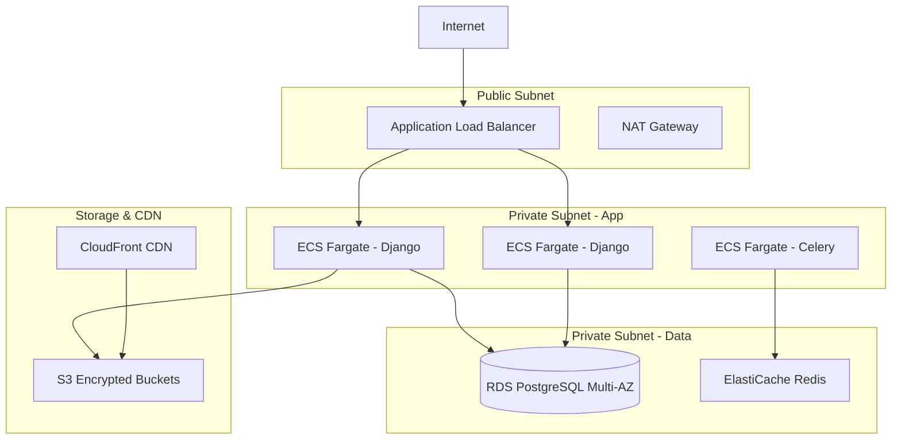

# Configuration AWS Infrastructure

> **Infrastructure cloud sécurisée pour SaaS médical français avec conformité RGPD**

## 🏗️ Architecture AWS

### Vue d'Ensemble Infrastructure


### Régions & Compliance
- **Région Principale**: `eu-west-3` (Paris) - Souveraineté française
- **Région Backup**: `eu-central-1` (Frankfurt) - RGPD compliance
- **Edge Locations**: Europe uniquement pour CloudFront

## 🔧 Configuration Services

### VPC & Networking
```bash
# Création VPC avec subnets isolés
aws ec2 create-vpc \
    --cidr-block 10.0.0.0/16 \
    --tag-specifications 'ResourceType=vpc,Tags=[{Key=Name,Value=medical-saas-vpc},{Key=Environment,Value=production},{Key=Compliance,Value=RGPD}]'

# Subnets publics (Load Balancer)
aws ec2 create-subnet \
    --vpc-id vpc-xxxxx \
    --cidr-block 10.0.1.0/24 \
    --availability-zone eu-west-3a \
    --tag-specifications 'ResourceType=subnet,Tags=[{Key=Name,Value=public-subnet-1a}]'

# Subnets privés (Applications)
aws ec2 create-subnet \
    --vpc-id vpc-xxxxx \
    --cidr-block 10.0.10.0/24 \
    --availability-zone eu-west-3a \
    --tag-specifications 'ResourceType=subnet,Tags=[{Key=Name,Value=private-app-subnet-1a}]'

# Subnets privés (Bases de données)
aws ec2 create-subnet \
    --vpc-id vpc-xxxxx \
    --cidr-block 10.0.20.0/24 \
    --availability-zone eu-west-3a \
    --tag-specifications 'ResourceType=subnet,Tags=[{Key=Name,Value=private-db-subnet-1a}]'
```

### Security Groups
```bash
# Security Group Load Balancer
aws ec2 create-security-group \
    --group-name medical-saas-alb-sg \
    --description "Security group for ALB - HTTPS only" \
    --vpc-id vpc-xxxxx

aws ec2 authorize-security-group-ingress \
    --group-id sg-xxxxx \
    --protocol tcp \
    --port 443 \
    --cidr 0.0.0.0/0

# Security Group Applications ECS
aws ec2 create-security-group \
    --group-name medical-saas-app-sg \
    --description "Security group for Django applications" \
    --vpc-id vpc-xxxxx

aws ec2 authorize-security-group-ingress \
    --group-id sg-yyyyy \
    --protocol tcp \
    --port 8000 \
    --source-group sg-xxxxx  # Depuis ALB uniquement

# Security Group RDS
aws ec2 create-security-group \
    --group-name medical-saas-rds-sg \
    --description "Security group for PostgreSQL RDS" \
    --vpc-id vpc-xxxxx

aws ec2 authorize-security-group-ingress \
    --group-id sg-zzzzz \
    --protocol tcp \
    --port 5432 \
    --source-group sg-yyyyy  # Depuis applications uniquement
```

## 🗄️ Base de Données RDS

### PostgreSQL Configuration
```bash
# Subnet group pour Multi-AZ
aws rds create-db-subnet-group \
    --db-subnet-group-name medical-saas-db-subnet-group \
    --db-subnet-group-description "Subnet group for medical SaaS database" \
    --subnet-ids subnet-xxxxx subnet-yyyyy

# RDS PostgreSQL avec chiffrement
aws rds create-db-instance \
    --db-instance-identifier medical-saas-postgres \
    --db-instance-class db.r6g.xlarge \
    --engine postgres \
    --engine-version 15.4 \
    --master-username postgres \
    --master-user-password "$(aws secretsmanager get-random-password --password-length 32 --exclude-characters '"@/\' --output text --query RandomPassword)" \
    --allocated-storage 100 \
    --storage-type gp3 \
    --storage-encrypted \
    --kms-key-id alias/medical-saas-rds-key \
    --vpc-security-group-ids sg-zzzzz \
    --db-subnet-group-name medical-saas-db-subnet-group \
    --multi-az \
    --backup-retention-period 30 \
    --preferred-backup-window "03:00-04:00" \
    --preferred-maintenance-window "sun:04:00-sun:05:00" \
    --deletion-protection \
    --enable-performance-insights \
    --performance-insights-retention-period 7 \
    --monitoring-interval 60 \
    --monitoring-role-arn arn:aws:iam::account:role/rds-monitoring-role \
    --tags Key=Environment,Value=production Key=Compliance,Value=RGPD Key=DataType,Value=medical-sensitive
```

### ElastiCache Redis
```bash
# Subnet group Redis
aws elasticache create-cache-subnet-group \
    --cache-subnet-group-name medical-saas-redis-subnet-group \
    --cache-subnet-group-description "Subnet group for Redis cache" \
    --subnet-ids subnet-xxxxx subnet-yyyyy

# Redis Cluster avec chiffrement
aws elasticache create-replication-group \
    --replication-group-id medical-saas-redis \
    --description "Redis cluster for medical SaaS caching" \
    --num-cache-clusters 2 \
    --cache-node-type cache.r6g.large \
    --engine redis \
    --engine-version 7.0 \
    --port 6379 \
    --parameter-group-name default.redis7 \
    --cache-subnet-group-name medical-saas-redis-subnet-group \
    --security-group-ids sg-redis-xxxxx \
    --at-rest-encryption-enabled \
    --transit-encryption-enabled \
    --auth-token "$(aws secretsmanager get-random-password --password-length 32 --exclude-characters '"@/\' --output text --query RandomPassword)" \
    --automatic-failover-enabled \
    --multi-az-enabled \
    --tags Key=Environment,Value=production Key=Compliance,Value=RGPD
```

## 🐳 ECS Fargate Deployment

### Task Definition Django
```json
{
  "family": "medical-saas-django",
  "networkMode": "awsvpc",
  "requiresCompatibilities": ["FARGATE"],
  "cpu": "1024",
  "memory": "2048",
  "executionRoleArn": "arn:aws:iam::account:role/ecsTaskExecutionRole",
  "taskRoleArn": "arn:aws:iam::account:role/medical-saas-task-role",
  "containerDefinitions": [
    {
      "name": "django-app",
      "image": "your-registry/medical-saas-django:latest",
      "portMappings": [
        {
          "containerPort": 8000,
          "protocol": "tcp"
        }
      ],
      "environment": [
        {
          "name": "DJANGO_SETTINGS_MODULE",
          "value": "config.settings.production"
        },
        {
          "name": "AWS_DEFAULT_REGION",
          "value": "eu-west-3"
        }
      ],
      "secrets": [
        {
          "name": "DATABASE_URL",
          "valueFrom": "arn:aws:secretsmanager:eu-west-3:account:secret:medical-saas/database-url"
        },
        {
          "name": "REDIS_URL", 
          "valueFrom": "arn:aws:secretsmanager:eu-west-3:account:secret:medical-saas/redis-url"
        },
        {
          "name": "FIELD_ENCRYPTION_KEY",
          "valueFrom": "arn:aws:secretsmanager:eu-west-3:account:secret:medical-saas/encryption-key"
        }
      ],
      "logConfiguration": {
        "logDriver": "awslogs",
        "options": {
          "awslogs-group": "/ecs/medical-saas-django",
          "awslogs-region": "eu-west-3",
          "awslogs-stream-prefix": "ecs"
        }
      },
      "healthCheck": {
        "command": [
          "CMD-SHELL",
          "curl -f http://localhost:8000/health/ || exit 1"
        ],
        "interval": 30,
        "timeout": 5,
        "retries": 3
      }
    }
  ]
}
```

### ECS Service avec ALB
```bash
# Création cluster ECS
aws ecs create-cluster \
    --cluster-name medical-saas-cluster \
    --capacity-providers FARGATE \
    --default-capacity-provider-strategy capacityProvider=FARGATE,weight=1 \
    --tags key=Environment,value=production key=Compliance,value=RGPD

# Service Django
aws ecs create-service \
    --cluster medical-saas-cluster \
    --service-name django-service \
    --task-definition medical-saas-django:1 \
    --desired-count 2 \
    --launch-type FARGATE \
    --network-configuration "awsvpcConfiguration={subnets=[subnet-xxxxx,subnet-yyyyy],securityGroups=[sg-yyyyy],assignPublicIp=DISABLED}" \
    --load-balancers targetGroupArn=arn:aws:elasticloadbalancing:eu-west-3:account:targetgroup/medical-saas-tg/xxxxx,containerName=django-app,containerPort=8000 \
    --service-registries registryArn=arn:aws:servicediscovery:eu-west-3:account:service/srv-xxxxx \
    --enable-logging \
    --tags key=Environment,value=production key=Compliance,value=RGPD
```

## 📦 S3 Storage & CDN

### S3 Buckets Chiffrés
```bash
# Bucket media files chiffrés
aws s3api create-bucket \
    --bucket medical-saas-media-prod \
    --region eu-west-3 \
    --create-bucket-configuration LocationConstraint=eu-west-3

# Chiffrement S3 avec KMS
aws s3api put-bucket-encryption \
    --bucket medical-saas-media-prod \
    --server-side-encryption-configuration '{
        "Rules": [
            {
                "ApplyServerSideEncryptionByDefault": {
                    "SSEAlgorithm": "aws:kms",
                    "KMSMasterKeyID": "alias/medical-saas-s3-key"
                },
                "BucketKeyEnabled": true
            }
        ]
    }'

# Politique accès strict
aws s3api put-bucket-policy \
    --bucket medical-saas-media-prod \
    --policy '{
        "Version": "2012-10-17",
        "Statement": [
            {
                "Sid": "RestrictToEUOnly",
                "Effect": "Deny",
                "Principal": "*",
                "Action": "s3:*",
                "Resource": [
                    "arn:aws:s3:::medical-saas-media-prod",
                    "arn:aws:s3:::medical-saas-media-prod/*"
                ],
                "Condition": {
                    "StringNotEquals": {
                        "aws:RequestedRegion": ["eu-west-3", "eu-central-1"]
                    }
                }
            }
        ]
    }'
```

### CloudFront CDN
```bash
# Distribution CloudFront Europe uniquement
aws cloudfront create-distribution \
    --distribution-config '{
        "CallerReference": "medical-saas-'$(date +%s)'",
        "Origins": {
            "Quantity": 1,
            "Items": [
                {
                    "Id": "medical-saas-s3-origin",
                    "DomainName": "medical-saas-media-prod.s3.eu-west-3.amazonaws.com",
                    "S3OriginConfig": {
                        "OriginAccessIdentity": "origin-access-identity/cloudfront/XXXXX"
                    }
                }
            ]
        },
        "DefaultCacheBehavior": {
            "TargetOriginId": "medical-saas-s3-origin",
            "ViewerProtocolPolicy": "https-only",
            "MinTTL": 0,
            "ForwardedValues": {
                "QueryString": false,
                "Cookies": {"Forward": "none"}
            },
            "TrustedSigners": {
                "Enabled": false,
                "Quantity": 0
            }
        },
        "Comment": "CDN for medical SaaS - RGPD compliant",
        "Enabled": true,
        "PriceClass": "PriceClass_100",
        "Restrictions": {
            "GeoRestriction": {
                "RestrictionType": "whitelist",
                "Locations": ["FR", "DE", "AT", "CH", "BE", "LU"]
            }
        },
        "WebACLId": "arn:aws:wafv2:us-east-1:account:global/webacl/medical-saas-waf/xxxxx"
    }'
```

## 🔐 Sécurité & Monitoring

### KMS Keys Management
```bash
# KMS Key pour chiffrement données médicales
aws kms create-key \
    --policy '{
        "Version": "2012-10-17",
        "Statement": [
            {
                "Sid": "Enable IAM User Permissions",
                "Effect": "Allow",
                "Principal": {"AWS": "arn:aws:iam::account:root"},
                "Action": "kms:*",
                "Resource": "*"
            },
            {
                "Sid": "Allow medical SaaS services",
                "Effect": "Allow",
                "Principal": {"AWS": "arn:aws:iam::account:role/medical-saas-task-role"},
                "Action": [
                    "kms:Decrypt",
                    "kms:GenerateDataKey"
                ],
                "Resource": "*"
            }
        ]
    }' \
    --description "KMS key for medical SaaS data encryption - RGPD compliance" \
    --tags TagKey=Environment,TagValue=production TagKey=Compliance,TagValue=RGPD TagKey=DataType,TagValue=medical-sensitive

# Alias KMS
aws kms create-alias \
    --alias-name alias/medical-saas-data-key \
    --target-key-id key-xxxxx
```

### WAF Configuration
```bash
# Web ACL WAF pour protection
aws wafv2 create-web-acl \
    --scope CLOUDFRONT \
    --default-action Allow={} \
    --rules '[
        {
            "Name": "RateLimitRule",
            "Priority": 1,
            "Action": {"Block": {}},
            "VisibilityConfig": {
                "SampledRequestsEnabled": true,
                "CloudWatchMetricsEnabled": true,
                "MetricName": "RateLimitRule"
            },
            "Statement": {
                "RateBasedStatement": {
                    "Limit": 2000,
                    "AggregateKeyType": "IP"
                }
            }
        },
        {
            "Name": "SQLInjectionRule", 
            "Priority": 2,
            "Action": {"Block": {}},
            "VisibilityConfig": {
                "SampledRequestsEnabled": true,
                "CloudWatchMetricsEnabled": true,
                "MetricName": "SQLInjectionRule"
            },
            "Statement": {
                "ManagedRuleGroupStatement": {
                    "VendorName": "AWS",
                    "Name": "AWSManagedRulesSQLiRuleSet"
                }
            }
        }
    ]' \
    --name medical-saas-waf \
    --description "WAF for medical SaaS - RGPD compliant"
```

## 📊 Monitoring & Logging

### CloudWatch Configuration
```bash
# Log Group pour applications
aws logs create-log-group \
    --log-group-name /ecs/medical-saas-django \
    --retention-in-days 365  # Retention 1 an pour audit RGPD

# Métriques custom
aws cloudwatch put-metric-data \
    --namespace "MedicalSaaS/Application" \
    --metric-data MetricName=PatientDataAccess,Value=1,Unit=Count,Dimensions=Name=Environment,Value=production

# Alarmes critiques
aws cloudwatch put-metric-alarm \
    --alarm-name "medical-saas-high-error-rate" \
    --alarm-description "High error rate in medical SaaS application" \
    --metric-name Errors \
    --namespace AWS/ApplicationELB \
    --statistic Sum \
    --period 300 \
    --threshold 10 \
    --comparison-operator GreaterThanThreshold \
    --evaluation-periods 2 \
    --alarm-actions arn:aws:sns:eu-west-3:account:medical-saas-alerts
```

### AWS Config pour Compliance
```bash
# Configuration Recorder pour audit
aws configservice put-configuration-recorder \
    --configuration-recorder '{
        "name": "medical-saas-config-recorder",
        "roleARN": "arn:aws:iam::account:role/config-role",
        "recordingGroup": {
            "allSupported": true,
            "includeGlobalResourceTypes": true,
            "resourceTypes": []
        }
    }'

# Rules compliance RGPD
aws configservice put-config-rule \
    --config-rule '{
        "ConfigRuleName": "s3-bucket-server-side-encryption-enabled",
        "Source": {
            "Owner": "AWS",
            "SourceIdentifier": "S3_BUCKET_SERVER_SIDE_ENCRYPTION_ENABLED"
        }
    }'
```

## 🚀 Deployment Automation

### CodePipeline CI/CD
```yaml
# buildspec.yml pour CodeBuild
version: 0.2
phases:
  pre_build:
    commands:
      - echo Logging in to Amazon ECR...
      - aws ecr get-login-password --region $AWS_DEFAULT_REGION | docker login --username AWS --password-stdin $AWS_ACCOUNT_ID.dkr.ecr.$AWS_DEFAULT_REGION.amazonaws.com
      - REPOSITORY_URI=$AWS_ACCOUNT_ID.dkr.ecr.$AWS_DEFAULT_REGION.amazonaws.com/medical-saas-django
      - COMMIT_HASH=$(echo $CODEBUILD_RESOLVED_SOURCE_VERSION | cut -c 1-7)
      - IMAGE_TAG=${COMMIT_HASH:=latest}
  build:
    commands:
      - echo Build started on `date`
      - echo Building the Docker image...
      - docker build -f backend/Dockerfile -t $REPOSITORY_URI:latest backend/
      - docker tag $REPOSITORY_URI:latest $REPOSITORY_URI:$IMAGE_TAG
  post_build:
    commands:
      - echo Build completed on `date`
      - echo Pushing the Docker images...
      - docker push $REPOSITORY_URI:latest
      - docker push $REPOSITORY_URI:$IMAGE_TAG
      - printf '[{"name":"django-app","imageUri":"%s"}]' $REPOSITORY_URI:$IMAGE_TAG > imagedefinitions.json
artifacts:
  files: imagedefinitions.json
```

### Terraform Infrastructure as Code
```hcl
# main.tf
terraform {
  required_version = ">= 1.0"
  required_providers {
    aws = {
      source  = "hashicorp/aws"
      version = "~> 5.0"
    }
  }
  
  backend "s3" {
    bucket = "medical-saas-terraform-state"
    key    = "production/terraform.tfstate"
    region = "eu-west-3"
    encrypt = true
    kms_key_id = "alias/terraform-state-key"
  }
}

provider "aws" {
  region = "eu-west-3"
  
  default_tags {
    tags = {
      Environment = "production"
      Project     = "medical-saas"
      Compliance  = "RGPD"
      ManagedBy   = "terraform"
    }
  }
}

# Variables
variable "db_password" {
  description = "Database password"
  type        = string
  sensitive   = true
}

# VPC Module
module "vpc" {
  source = "./modules/vpc"
  
  cidr_block = "10.0.0.0/16"
  environment = "production"
  compliance_tags = {
    RGPD = "true"
    DataType = "medical-sensitive"
  }
}
```

---

*Infrastructure AWS maintenue par Deployment Agent avec expertise EC2 CLI et conformité médicale française*