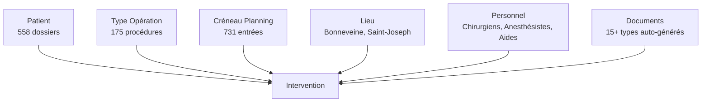
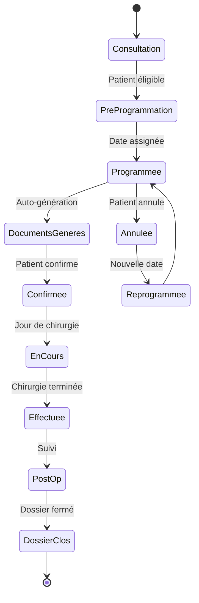

# 🏥 Application Chirurgie - Analyse Complète du Système et des Fonctionnalités

## 📋 Résumé Exécutif

L'application Chirurgie est un **système complet de gestion de pratique chirurgicale** qui gère 558 patients, 175 types de procédures et une planification complexe sur plusieurs sites hospitaliers. Elle dispose d'une automatisation documentaire avancée, d'une coordination multi-équipes et d'une gestion complète des flux de travail pour les pratiques chirurgicales ORL.

---

## 🏗️ Vue d'Ensemble de l'Architecture Système

### **Modèle de Données Principal**



### **Schéma de Base de Données**

```sql
-- Entités Principales
Patients (
    patient_id, nom, prenom, date_naissance, 
    age (calculé), mineur (calculé), 
    telephone, mail, cmu, poids,
    allergies (12 types), medicaments, 
    nb_interventions, dernier_modif
)

Operations (
    operation_id, famille (7 types), 
    nom_operation, code_ccam, tarif_secu,
    protocoles_post_op (9 médicaments),
    modeles_documents, certificats
)

Chirurgies (
    chirurgie_id, patient_id, operation_ids[],
    date_programmee, lieu_id, 
    chirurgien_id, anesthesiste_id, aide_id,
    type_anesthesie, statut, documents[]
)

Planning (
    creneau_id, date, num_semaine, jour_semaine,
    creneau_horaire (Matin/Après-midi), 
    lieu_id, chirurgie_id, type
)

Lieux (
    lieu_id, nom, code_couleur,
    blocs_operatoires, ressources
)

Personnel (
    personnel_id, nom, role, specialites,
    disponibilite, acces_lieux[]
)

Documents (
    document_id, chirurgie_id, type,
    modele_utilise, date_generation,
    chemin_pdf, statut
)
```

---

## 🖥️ Composants de l'Interface Utilisateur

### **1. Vue Calendrier Principal** (Bloc Opératoire > Programmation)

#### **Structure de la Mise en Page**
```
┌─────────────────────────────────────────────────────────┐
│ 📍 Bloc Opératoire > Programmation     [Gestion Planning]│
├─────────────────────────────────────────────────────────┤
│ Filtres: [Lieu ▼] [Anesthésie ▼] [Aide ▼] [Patient ▼]  │
│                                    [Programmer intervention]│
├─────────────────────────────────────────────────────────┤
│  ◄  ►  Aujourd'hui   [Mois] [Semaine] [Jour]            │
├────┬────┬────┬────┬────┬────┬────┐                      │
│ Lun│ Mar│ Mer│ Jeu│ Ven│ Sam│ Dim│   Légende couleurs:  │
├────┼────┼────┼────┼────┼────┼────┤   🟪 Bonneveine     │
│ 1  │ 2  │ 3  │ 4  │ 5  │ 6  │ 7  │   🟩 Bonneveine-2   │
│[B] │[B] │    │[SJ]│[B] │    │    │   🟧 Saint-Joseph   │
│septoturbi│    │    │rhino│+4 en plus│                   │
├────┴────┴────┴────┴────┴────┴────┘                      │
│ ☑️ Voir programmes non programmés                         │
│ Statut: 763 programmes                                   │
└─────────────────────────────────────────────────────────┘
```

#### **Affichage des Cartes de Chirurgie**

Chaque carte de chirurgie contient :
- **Abréviation de la procédure** : "septoturbi-VG", "rhino"
- **Badge de localisation** : [B] pour Bonneveine, [SJ] pour Saint-Joseph
- **Code couleur** : Basé sur le lieu (Violet, Vert, Orange)
- **Icônes** : 💉 (anesthésie), 🫁 (respiratoire), 🧠 (neuro)
- **Débordement** : "+4 en plus" pour les jours chargés

#### **Fonctionnalités Interactives**
- **Glisser-Déposer** : Déplacer les chirurgies entre les dates
- **Clic pour développer** : Voir toutes les chirurgies les jours chargés
- **Infobulles au survol** : Détails complets de la chirurgie
- **Filtres rapides** : Par lieu, anesthésie, personnel, patient

---

### **2. Formulaire de Programmation d'Intervention**

#### **Structure du Formulaire**

```typescript
interface FormulaireProgrammationChirurgie {
  // Section Patient
  patient: {
    selecteur: MenuDeroulantPatient;     // 558 patients recherchables
    apercu: CarteResumePatient;          // Âge, allergies, historique
  };
  
  // Lieu et Horaire
  planification: {
    date: SelecteurDate;
    lieu: SelecteurLieu;                  // Bonneveine, Saint-Joseph
    creneau: SelecteurCreneau;            // Matin, Après-midi
    bloc: SelecteurBloc;
  };
  
  // Procédures (Multi-sélection)
  procedures: {
    premiere: SelecteurProcedure;         // Obligatoire "1er Motif"
    deuxieme?: SelecteurProcedure;        // Optionnel "2ème Motif"
    troisieme?: SelecteurProcedure;       // Optionnel "3ème Motif"
  };
  
  // Équipe Médicale
  equipe: {
    chirurgien: SelecteurPersonnel;
    anesthesiste?: SelecteurPersonnel;
    aide?: SelecteurPersonnel;             // Aide Opératoire
  };
  
  // Détails Médicaux
  medical: {
    typeAnesthesie: SelecteurAnesthesie;  // Locale, Générale
    modalite: SelecteurModalite;          // Ambulatoire, Hospitalisation
    bilanSanguinRequis: boolean;
    biopsieRequise: boolean;
    equipementSpecial: string[];
  };
  
  // Financier
  financier: {
    statutCMU: boolean;
    depassementHonoraires: number;
    genererDevis: boolean;
    envoyerPatient: boolean;
  };
  
  // Documentation
  documents: {
    genererLivret: boolean;
    notesPersonnalisees: string;
  };
}
```

---

### **3. Vue Gestion du Planning**

#### **Affichage en Grille**
- **731 créneaux calendrier** affichés en format tableau
- **Colonnes** : Semaine#, Jour, Date, Type, Créneau, Nombre d'interventions
- **Filtres** : Mois, Semaine, Recherche par jour
- **Actions** : Réinitialiser filtres, Ajouter programmation
- **Pagination** : Gestion efficace des grands ensembles de données

---

### **4. Détail Chirurgie et Centre de Documentation**

#### **Système de Génération de Documents**

```python
class GenerateurDocuments:
    """Génération automatique de documents basée sur les paramètres de chirurgie"""
    
    TYPES_DOCUMENTS = {
        # Pré-opératoire
        'devis': ModeleDevis,                    # Devis financier
        'fiche_info_1': FicheInfo1,              # Information procédure
        'fiche_info_2': FicheInfo2,              # Procédure secondaire
        'fiche_info_3': FicheInfo3,              # Info supplémentaire
        'livret': LivretPatient,                 # Guide complet
        
        # Administratif
        'DA': DemandeAdmission,                  # Admission hospitalière
        'CE': ConsentementEclaire,               # Consentement légal
        'BS': OrdonnanceBilanSanguin,           # Ordonnances labo
        'ordo': Ordonnance,                      # Médicaments
        
        # Post-opératoire
        'lavage_ordo': LavageNasal,              # Spécifique ORL
        'pansement_ordo': OrdonnancePansement,   # Soins de plaie
        'consignes': ConsignesPostOp,            # Instructions patient
        'certificats': CertificatsMedicaux,      # Travail/école
        'rdv_postop': RendezVousPostOp,          # Planification suivi
        
        # Facturation
        'facture': Facture                       # Facturation finale
    }
    
    def generer_dossier_chirurgie(self, chirurgie):
        """Générer tous les documents requis pour une chirurgie"""
        documents = []
        
        # Sélectionner les modèles selon le type de procédure
        for procedure in chirurgie.procedures:
            docs_requis = self.obtenir_documents_requis(procedure)
            
            for type_doc in docs_requis:
                modele = self.TYPES_DOCUMENTS[type_doc]
                pdf = modele.generer(
                    patient=chirurgie.patient,
                    procedure=procedure,
                    lieu=chirurgie.lieu,
                    date=chirurgie.date,
                    chirurgien=chirurgie.chirurgien,
                    financier=chirurgie.details_financiers
                )
                documents.append(pdf)
        
        # Fusionner tous les PDF si demandé
        if chirurgie.fusionner_documents:
            return FusionPDF.combiner(documents)
        
        return documents
```

---

## 🔄 Flux de Travail Principaux

### **1. Cycle de Vie Complet d'une Chirurgie**



### **2. Algorithme de Planification Multi-Sites**

```javascript
class MoteurPlanification {
  
  assignerCreneauChirurgie(chirurgie) {
    const contraintes = {
      lieu: chirurgie.lieuPrefere,
      chirurgien: this.obtenirDisponibiliteChirurgien(chirurgie.chirurgien_id),
      anesthesiste: this.obtenirDisponibiliteAnesthesiste(chirurgie.type_anesthesie),
      bloc: this.obtenirDisponibiliteBloc(chirurgie.lieu),
      duree: this.estimerDuree(chirurgie.procedures),
      contraintesPatient: chirurgie.patient.contraintes
    };
    
    const creneauxDisponibles = this.trouverCreneauxDisponibles(contraintes);
    
    // Code couleur pour le calendrier
    const carteCouleurs = {
      'Bonneveine': '#9B59B6',      // Violet
      'Saint-Joseph': '#E67E22',     // Orange
      'Bonneveine-Bloc2': '#27AE60' // Vert
    };
    
    return {
      creneau: this.optimiserCreneau(creneauxDisponibles),
      couleur: carteCouleurs[chirurgie.lieu],
      badge: this.obtenirBadgeLieu(chirurgie.lieu)
    };
  }
  
  gererDebordement(date) {
    const chirurgies = this.obtenirChirurgiesParDate(date);
    const affichageMax = 4;
    
    if (chirurgies.length > affichageMax) {
      return {
        affichees: chirurgies.slice(0, affichageMax),
        debordement: `+${chirurgies.length - affichageMax} en plus`,
        extensible: true
      };
    }
    
    return { affichees: chirurgies, debordement: null };
  }
}
```

### **3. Flux de Documents Intelligent**

```python
class FluxDocuments:
    """Gère le cycle de vie et l'automatisation des documents"""
    
    def declencher_generation_documents(self, chirurgie, evenement):
        """Générer des documents basés sur les événements du flux"""
        
        declencheurs_documents = {
            'programmee': ['devis', 'fiche_info_1', 'fiche_info_2'],
            'confirmee': ['DA', 'CE', 'BS', 'ordo'],
            'semaine_pre_op': ['livret', 'consignes'],
            'effectuee': ['certificats', 'rdv_postop'],
            'facturation': ['facture']
        }
        
        if evenement in declencheurs_documents:
            docs_a_generer = declencheurs_documents[evenement]
            
            for type_doc in docs_a_generer:
                self.generer_document(chirurgie, type_doc)
                self.envoyer_notification(chirurgie.patient, type_doc)
        
        # Gestion spéciale pour la mise à jour des documents
        if chirurgie.documents_necesitent_maj:
            self.regenerer_tous_documents(chirurgie)
```

---

## 🎯 Fonctionnalités Avancées et Logique Métier

### **1. Système de Protocoles Médicamenteux**

```python
class ProtocoleMedicamenteux:
    """Gestion des médicaments post-opératoires"""
    
    PROTOCOLES = {
        'septoturbinoplastie': {
            'paracetamol': {'jours': 7, 'dose': '1g x 4/jour'},
            'corticoides': {'jours': 5, 'dose': 'décroissante'},
            'lavage_nasal': {'jours': 30, 'frequence': '3x/jour'},
            'antibiotique': {'jours': 7, 'si': 'risque_eleve'}
        },
        'amygdalectomie': {
            'paracetamol': {'jours': 10, 'dose': '1g x 4/jour'},
            'tramadol': {'jours': 5, 'dose': 'si_besoin'},
            'bains_bouche': {'jours': 14, 'frequence': '4x/jour'}
        }
    }
    
    def generer_ordonnance(self, chirurgie):
        """Créer une ordonnance personnalisée selon la procédure"""
        ordonnance = []
        
        for procedure in chirurgie.procedures:
            protocole = self.PROTOCOLES.get(procedure.type)
            
            # Ajuster pour les facteurs patient
            if chirurgie.patient.est_mineur:
                protocole = self.ajuster_posologie_pediatrique(protocole)
            
            if chirurgie.patient.allergies:
                protocole = self.substituer_medicaments(protocole, 
                                                       chirurgie.patient.allergies)
            
            ordonnance.extend(self.formater_ordonnance(protocole))
        
        return ordonnance
```

### **2. Système de Gestion Financière**

```python
class GestionnaireFinancier:
    """Gère les devis, assurances et facturation"""
    
    def calculer_cout_patient(self, chirurgie):
        cout_base = sum(proc.tarif_secu for proc in chirurgie.procedures)
        
        if chirurgie.patient.a_cmu:
            couvert = cout_base
            reste_a_charge = 0
        else:
            couvert = cout_base * 0.7  # Couverture 70% typique
            reste_a_charge = cout_base * 0.3
        
        # Ajouter les dépassements d'honoraires du chirurgien
        depassement = chirurgie.chirurgien.depassement_honoraires
        total_reste_a_charge = reste_a_charge + depassement
        
        return {
            'cout_base': cout_base,
            'couverture_assurance': couvert,
            'paiement_patient': total_reste_a_charge,
            'depassement': depassement,
            'generer_devis': True
        }
```

### **3. Système de Conformité et Audit**

```python
class GestionnaireConformite:
    """Assure la conformité réglementaire et la traçabilité"""
    
    DOCUMENTS_REQUIS = {
        'pre_op': ['consentement_eclaire', 'consentement_anesthesie'],
        'financier': ['devis_accepte', 'plan_paiement'],
        'medical': ['resultats_bilan_sanguin', 'examen_pre_op']
    }
    
    def verifier_conformite_chirurgie(self, chirurgie):
        """Vérifier que toutes les exigences réglementaires sont respectées"""
        statut_conformite = {
            'documents': self.verifier_documents(chirurgie),
            'consentements': self.verifier_consentements(chirurgie),
            'assurance': self.verifier_assurance(chirurgie),
            'autorisation_medicale': self.verifier_autorisation_medicale(chirurgie)
        }
        
        if not all(statut_conformite.values()):
            self.signaler_problemes_conformite(chirurgie, statut_conformite)
            return False
        
        self.enregistrer_audit(chirurgie, 'conformite_verifiee')
        return True
```

---

## 🚀 Architecture de Réplication Moderne

### **Recommandation de Stack Technologique**

```yaml
Frontend:
  Framework: React 18 / Next.js 14
  Bibliothèque UI: Ant Design / Material-UI
  Calendrier: FullCalendar / React Big Calendar
  État: Redux Toolkit / Zustand
  Formulaires: React Hook Form + Yup
  PDF: React-PDF / PDFMake

Backend:
  Framework: Django 5.0 / FastAPI
  Base de données: PostgreSQL 15
  Cache: Redis
  File d'attente: Celery + RabbitMQ
  Stockage: S3 / MinIO
  
DevOps:
  Conteneurisation: Docker
  Orchestration: Kubernetes
  CI/CD: GitHub Actions
  Monitoring: Prometheus + Grafana
  
Sécurité:
  Authentification: JWT + OAuth2
  Chiffrement: AES-256
  Conformité RGPD: Oui
  Journalisation d'audit: Elasticsearch
```

### **Architecture Microservices**

```yaml
Services:
  service-patients:
    - Gestion des patients
    - Historique médical
    - Allergies et médicaments
    
  service-planification:
    - Gestion du calendrier
    - Détection des conflits
    - Allocation des ressources
    
  service-documents:
    - Gestion des modèles
    - Génération PDF
    - Stockage documents
    
  service-financier:
    - Génération de devis
    - Traitement assurance
    - Facturation
    
  service-notifications:
    - Email/SMS
    - Notifications push
    - Rappels
    
  service-audit:
    - Suivi de conformité
    - Journalisation d'audit
    - Rapports
```

---

## 📊 Métriques Clés et Performances

### **Échelle du Système Actuel**
- **558** patients actifs
- **175** types de procédures
- **731** créneaux planifiés
- **763** programmes totaux
- **15+** types de documents par chirurgie
- **3** sites hospitaliers
- **7** spécialités chirurgicales

### **Exigences de Performance**
- Chargement calendrier : < 500ms
- Génération document : < 2s par document
- Réponse recherche : < 200ms
- Utilisateurs simultanés : 50+
- Conservation données : 7 ans (réglementaire)

---

## 🎯 Feuille de Route d'Implémentation

### **Phase 1 : Noyau (Mois 1-2)**
- Gestion des patients
- Planification de base
- Vue calendrier simple

### **Phase 2 : Documents (Mois 3-4)**
- Système de modèles
- Génération PDF
- Stockage documents

### **Phase 3 : Flux de Travail (Mois 5-6)**
- Gestion des statuts
- Déclencheurs automatisés
- Système de notifications

### **Phase 4 : Avancé (Mois 7-8)**
- Support multi-sites
- Gestion financière
- Tableau de bord analytique

### **Phase 5 : Optimisation (Mois 9-10)**
- Optimisation performances
- Applications mobiles
- Fonctionnalités IA

---

## 🎯 Points Clés à Retenir

### **Forces à Préserver**
1. **Automatisation documentaire complète** - 15+ types de documents
2. **Conformité santé française** - Intégration CCAM, CMU
3. **Coordination multi-sites** - Planification complexe
4. **Traçabilité complète** - Chaque action suivie
5. **Automatisation des flux** - Déclencheurs basés sur les statuts

### **Domaines d'Amélioration**
1. **Collaboration temps réel** - Édition multi-utilisateurs
2. **Accessibilité mobile** - Applications natives
3. **Assistance IA** - Fonctionnalités prédictives
4. **Portail patient** - Options libre-service
5. **Analytiques avancées** - Intelligence d'affaires

### **Proposition de Valeur Unique**
Ce n'est pas seulement un système de planification mais un **système d'exploitation complet pour pratique chirurgicale** avec :
- Gestion de flux de bout en bout
- Automatisation de la conformité réglementaire
- Transparence financière
- Gestion du cycle de vie documentaire
- Coordination multi-acteurs

L'application démontre une logique métier sophistiquée qui va bien au-delà des opérations CRUD basiques, en faisant un modèle précieux pour le développement de logiciels de santé modernes.

---

## ✅ Conclusion

L'application Chirurgie est un **système sophistiqué de gestion de pratique chirurgicale** qui combine :

1. **Planification complexe** sur plusieurs sites
2. **Automatisation documentaire complète** (15+ types)
3. **Gestion complète des flux** avec suivi des statuts
4. **Conformité santé française** (CCAM, CMU)
5. **Coordination multi-équipes** avec accès basé sur les rôles
6. **Transparence financière** avec facturation automatisée

C'est une **application d'entreprise de qualité production** qui gère de vrais flux médicaux, pas seulement un simple système CRUD. La combinaison de la flexibilité d'Airtable avec une logique métier personnalisée crée une solution puissante qui nécessiterait un effort de développement significatif pour être reproduite avec des technologies traditionnelles.

**Effort de Développement Estimé** : 8-10 mois avec une équipe de 4-5 développeurs pour construire un système comparable à partir de zéro.