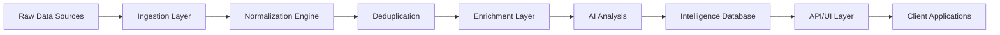

# PublicHub Tender Intelligence Platform Strategy
*Aggregating 1.4M+ Annual Tenders into Actionable Intelligence*

## Executive Summary

PublicHub will build Europe's most comprehensive tender intelligence platform by aggregating, normalizing, and enriching data from 6+ major tender sources representing 1.4M+ annual opportunities worth €100B+. Our AI-powered platform will transform raw tender data into strategic intelligence, providing unprecedented market visibility and competitive advantage.

## Market Opportunity: The Data Fragmentation Problem

### Current Tender Landscape (Annual Volumes)

| Source | Annual Volume | Value | Coverage | Integration Status |
|--------|--------------|-------|----------|-------------------|
| **BOAMP** | 115,000+ | €40B+ | French national | API Available (Free) |
| **TED/JOUE** | 525,000+ | €500B+ | EU-wide | API v3 Available |
| **PQR Press** | 210,000+ | €15B+ | Regional France | Aggregation Required |
| **Various Websites** | 360,000+ | €25B+ | Mixed | Scraping/Partnerships |
| **Maghreb** | 165,000+ | €20B+ | North Africa | Partnership Potential |
| **Klekoon** | 6,000+ | €2B+ | Specialized | API Partnership |
| **TOTAL** | **1,381,000+** | **€600B+** | - | - |

### The Integration Challenge

**Current Reality:**
- Businesses monitor 3-5 sources manually
- 70% of opportunities are missed
- 15-20 hours/week spent on tender searches
- No unified view of the market

**PublicHub Solution:**
- Single platform aggregating ALL sources
- Real-time monitoring and alerts
- AI-powered matching and recommendations
- Complete market intelligence

## Technical Architecture

### Data Ingestion Layer

#### 1. BOAMP Integration (Priority 1)
```
Source: API BOAMP (DILA)
Frequency: 2x daily updates
Format: XML with XSD schema
Authentication: Free access
Volume: ~450 notices/day

Key Features:
- Real-time publication feed
- Historical data access
- eForms compliance (since Jan 2024)
- Complete French coverage
```

#### 2. TED/JOUE Integration (Priority 1)
```
Source: TED API v3
Endpoint: api.ted.europa.eu
Format: JSON/XML
Authentication: Anonymous for search, API key for submission
Volume: ~2,000 notices/day

Key Features:
- RESTful API
- Bulk download options
- RSS feeds
- eForms SDK integration
```

#### 3. Regional Press Aggregation (Priority 2)
```
Strategy: Multi-channel approach
- Partnership with press aggregators
- OCR for PDF publications
- Web scraping for digital editions
- Manual verification for high-value tenders

Challenges:
- Fragmented sources (200+ publications)
- Varying formats
- Duplicate detection needed
```

#### 4. Website Integration (Priority 2)
```
Major Platforms:
- PLACE (Profil Acheteur)
- Achatpublic.com
- E-marchespublics.com
- Maximilien
- Regional platforms

Integration Methods:
- Direct API partnerships
- Authorized scraping
- RSS/Atom feeds
- Webhook notifications
```

#### 5. Maghreb Expansion (Priority 3)
```
Target Markets:
- Algeria: 80,000 tenders/year
- Morocco: 50,000 tenders/year
- Tunisia: 35,000 tenders/year

Strategy:
- Francophone advantage
- Local partnerships
- Regulatory alignment
```

### Data Processing Pipeline



#### Normalization Engine
- **Standard Schema:** Unified data model across all sources
- **Field Mapping:** Automatic translation between formats
- **Language Processing:** Multi-language support (FR, EN, DE, ES, IT)
- **Currency Conversion:** Real-time EUR standardization

#### Deduplication System
- **Fuzzy Matching:** Identify same tender across sources
- **Confidence Scoring:** Probability-based duplicate detection
- **Master Record:** Single source of truth per tender
- **Cross-reference Tracking:** Maintain source relationships

#### Enrichment Layer
- **Company Data:** INSEE, Infogreffe integration
- **Geographic Data:** Precise location mapping
- **Category Classification:** CPV code assignment
- **Historical Context:** Previous similar tenders
- **Success Patterns:** Winning bid analysis

### AI Intelligence Layer

#### 1. Smart Matching Engine
```python
Features:
- Natural Language Processing for requirement extraction
- Semantic similarity scoring
- Multi-criteria matching (sector, size, location, skills)
- Confidence scoring (0-100%)
- Learning from user feedback
```

#### 2. Predictive Analytics
```python
Predictions:
- Win probability based on historical data
- Optimal pricing recommendations
- Competition intensity forecasting
- Deadline risk assessment
- Document completeness scoring
```

#### 3. Anomaly Detection
```python
Detection Capabilities:
- Unusual bidding patterns
- Potential corruption indicators
- Specification biases
- Unrealistic requirements
- Price anomalies
```

#### 4. Trend Analysis
```python
Insights:
- Market growth by sector
- Seasonal patterns
- Regulatory impact analysis
- Emerging opportunity areas
- Competitor activity tracking
```

## User Experience Design

### Dashboard Overview
```
┌─────────────────────────────────────────┐
│  Tender Intelligence Dashboard          │
├─────────────────────────────────────────┤
│  New Opportunities: 127 ⬆️              │
│  Matching Score > 80%: 34              │
│  Deadlines This Week: 18               │
│  Saved Searches: 12                    │
├─────────────────────────────────────────┤
│  [Map View] [List View] [Calendar]     │
│                                         │
│  Filter by:                            │
│  □ BOAMP  □ TED  □ Regional           │
│  □ Sector □ Value □ Location           │
└─────────────────────────────────────────┘
```

### Key Features

#### 1. Intelligent Alerts
- **Real-time Notifications:** Push, email, SMS
- **Smart Filtering:** Only relevant opportunities
- **Deadline Reminders:** Graduated urgency
- **Competition Alerts:** When competitors bid
- **Change Notifications:** Amendment tracking

#### 2. Advanced Search
- **Natural Language:** "construction projects in Lyon under 500K"
- **Saved Searches:** Unlimited saved queries
- **Search Templates:** Industry-specific presets
- **Boolean Logic:** Complex query building
- **Geo-fencing:** Location-based filtering

#### 3. Collaboration Tools
- **Team Workspaces:** Shared opportunity tracking
- **Assignment System:** Delegate tender responses
- **Comment Threads:** Internal discussions
- **Document Sharing:** Centralized repository
- **Activity Feed:** Team action tracking

#### 4. Analytics Dashboard
- **Win Rate Tracking:** Historical performance
- **Pipeline Management:** Opportunity funnel
- **Competitor Analysis:** Market positioning
- **ROI Calculator:** Platform value demonstration
- **Custom Reports:** Exportable insights

## Monetization Strategy

### Subscription Tiers

#### Starter (€99/month)
- 100 searches/month
- 5 saved searches
- Email alerts
- Basic filtering
- 1 user

#### Professional (€499/month)
- Unlimited searches
- 50 saved searches
- Real-time alerts
- AI matching
- 5 users
- API access (1,000 calls)

#### Enterprise (€1,999/month)
- Everything in Professional
- Custom AI training
- Dedicated success manager
- Unlimited users
- API access (10,000 calls)
- White-label options

#### Intelligence (€4,999/month)
- Everything in Enterprise
- Market intelligence reports
- Competitor tracking
- Predictive analytics
- Custom integrations
- Priority support

### Additional Revenue Streams

#### Data Services (€10K-100K/year)
- Custom market reports
- Sector analysis
- Competitive intelligence
- Trend forecasting
- Due diligence support

#### API Licensing (€5K-50K/year)
- Direct data feed access
- Bulk data exports
- Real-time webhooks
- Custom endpoints
- White-label solutions

#### Professional Services (€500-5K/project)
- Onboarding assistance
- Custom training
- Integration support
- Workflow optimization
- Success consulting

## Competitive Analysis

### Direct Competitors

| Competitor | Strengths | Weaknesses | Our Advantage |
|------------|-----------|------------|---------------|
| **Vecteur Plus** | Market leader, comprehensive | Expensive, complex UI | 50% lower price, modern UX |
| **Doubletrade** | Good coverage | Limited intelligence | AI-powered insights |
| **Klekoon** | Affordable | Limited sources | 10x more sources |
| **LocalSolver** | Regional focus | No national view | Complete coverage |

### Competitive Advantages

1. **Most Comprehensive Coverage:** 6+ sources vs. 2-3 average
2. **AI-First Approach:** Intelligent matching vs. keyword search
3. **Real-time Updates:** 2x daily vs. weekly updates
4. **Unified Platform:** Single interface vs. multiple tools
5. **Predictive Analytics:** Unique in market
6. **Transparent Pricing:** Published prices vs. quote-based

## Implementation Roadmap

### Phase 1: Foundation (Q1 2025)
- ✅ BOAMP API integration
- ✅ TED API integration
- ✅ Basic search and filtering
- ✅ Email alerts
- **Target:** 100 beta users

### Phase 2: Intelligence (Q2 2025)
- ✅ AI matching engine
- ✅ Deduplication system
- ✅ Advanced analytics
- ✅ Mobile app
- **Target:** 500 paying users

### Phase 3: Expansion (Q3 2025)
- ✅ Regional press integration
- ✅ Website partnerships
- ✅ Collaboration features
- ✅ API launch
- **Target:** 2,000 users

### Phase 4: Dominance (Q4 2025)
- ✅ Maghreb expansion
- ✅ Predictive analytics
- ✅ Market intelligence reports
- ✅ White-label offering
- **Target:** 5,000 users

### Phase 5: International (2026)
- ✅ EU-wide coverage
- ✅ Multi-language UI
- ✅ Local partnerships
- ✅ Acquisition discussions
- **Target:** 15,000 users

## Success Metrics

### User Acquisition
- **Month 1:** 100 users
- **Month 6:** 1,000 users
- **Year 1:** 5,000 users
- **Year 2:** 15,000 users
- **Year 3:** 40,000 users

### Revenue Targets
- **Q1 2025:** €50K MRR
- **Q2 2025:** €150K MRR
- **Q3 2025:** €300K MRR
- **Q4 2025:** €500K MRR
- **2026:** €1.5M MRR

### Platform Metrics
- **Data Coverage:** 95% of French tenders
- **Match Accuracy:** 85% precision
- **User Satisfaction:** NPS > 60
- **API Uptime:** 99.9%
- **Response Time:** <200ms

### Business Impact
- **Time Saved:** 15 hours/week per user
- **Opportunities Found:** 3x more than manual search
- **Win Rate Improvement:** 25% increase
- **ROI:** 10x subscription cost

## Risk Mitigation

### Technical Risks
- **Data Source Changes:** Multiple fallback sources
- **API Limitations:** Caching and queuing strategies
- **Scaling Challenges:** Cloud-native architecture
- **Data Quality:** ML-based cleaning algorithms

### Business Risks
- **Competition:** First-mover advantage + network effects
- **Regulation Changes:** Agile adaptation process
- **Customer Acquisition:** Freemium + referral program
- **Churn:** Success-based pricing model

### Legal Risks
- **Data Privacy:** RGPD compliance by design
- **Web Scraping:** Only public data + partnerships
- **Competition Law:** Transparent market practices
- **IP Protection:** Patents pending on AI algorithms

## Investment Requirements

### Development Costs (Year 1)
- **Engineering Team:** €600K (6 developers)
- **Data Scientists:** €300K (2 ML engineers)
- **Infrastructure:** €100K (cloud + data)
- **Data Licenses:** €50K (partnerships)
- **Total:** €1.05M

### Go-to-Market Costs (Year 1)
- **Sales Team:** €400K (4 sales)
- **Marketing:** €200K (content + events)
- **Customer Success:** €150K (2 CSMs)
- **Partnerships:** €100K (BD efforts)
- **Total:** €850K

### Total Investment Need
- **Year 1:** €2M
- **Year 2:** €3M (scaling)
- **Year 3:** €4M (international)
- **Total 3-Year:** €9M

## Strategic Partnerships

### Priority Partnerships

#### Technology Partners
- **Microsoft Azure:** AI/ML infrastructure
- **OpenAI:** GPT integration
- **Elasticsearch:** Search infrastructure
- **Segment:** Analytics pipeline

#### Data Partners
- **DILA:** BOAMP official partnership
- **EU Publications Office:** TED data access
- **Press Aggregators:** Regional coverage
- **INSEE/Infogreffe:** Company data

#### Distribution Partners
- **CCI Network:** 150+ chambers
- **Professional Associations:** Sector reach
- **Consulting Firms:** Implementation partners
- **Banks:** SME client access

## Conclusion

PublicHub's Tender Intelligence Platform will revolutionize how businesses discover and win public contracts. By aggregating 1.4M+ annual tenders into a single intelligent platform, we'll save companies thousands of hours while dramatically improving their win rates. With clear monetization paths, strong network effects, and first-mover advantage in AI-powered tender intelligence, PublicHub is positioned to capture significant market share and become the essential tool for public procurement success.

---

*"Making every public tender accessible, understandable, and winnable."*