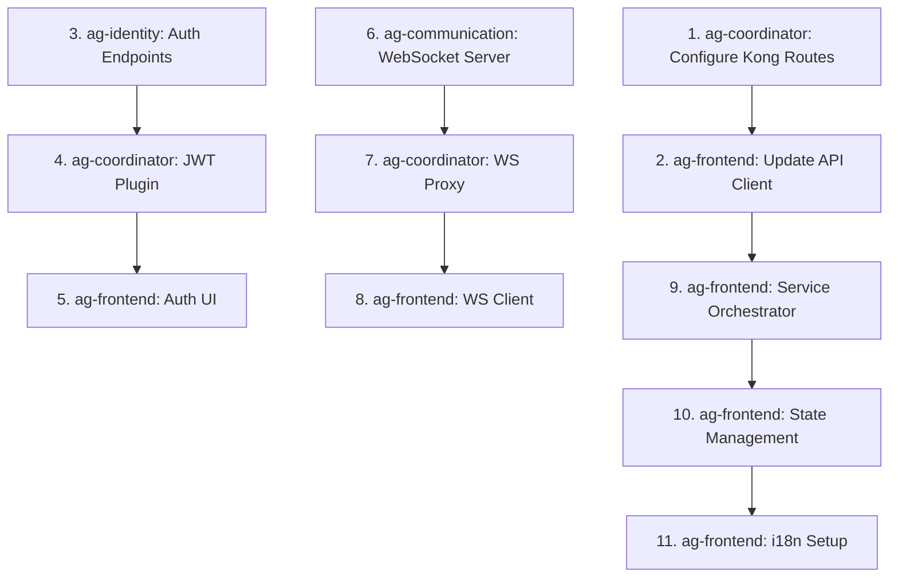

# Frontend Architecture Technical Analysis

## Executive Summary

This document provides a critical technical analysis of the ReactDjango Hub frontend architecture, updated to reflect the current microservices deployment (4 services + Kong API Gateway) and multi-vertical platform requirements. This analysis delivers actionable frontend architecture guidance aligned with the approved incremental implementation approach.

## Critical Analysis of Existing Specification

### What's Right ✅

1. **Microservices Separation**: The service boundary definitions are well-thought-out
2. **Component Modularity**: The shared component library approach is sound
3. **TypeScript First**: Strong typing throughout is non-negotiable
4. **API-First Design**: Service communication patterns are well-defined

### What Needs Refinement 🔄

1. **Service Integration Complexity** ✅ RESOLVED BY COORDINATOR
   - **Current State**: Complete microservices orchestration implemented
   - **Services**: 4 FastAPI services (identity:8001, content:8002, communication:8003, workflow:8004)
   - **Databases**: 4 PostgreSQL 17 instances (ports 5433-5436)
   - **Caching**: 4 Redis instances (ports 6380-6383)
   - **Orchestration**: Unified docker-compose.yml with health checks and dependency management

2. **Monorepo Complexity**
   - **Issue**: Nx/Turborepo/pnpm workspaces add significant overhead
   - **Reality**: Small team doesn't need this complexity yet
   - **Recommendation**: Start with simple structure, migrate when team > 5

3. **Kong Gateway Integration** ✅ FULLY CONFIGURED
   - **Status**: Kong configuration complete with all routes and plugins
   - **Gateway Port**: 8000 (proxy), 8445 (admin)
   - **Route Mappings**:
     - `/api/v1/auth` → Identity Service (8001)
     - `/api/v1/users` → Identity Service (8001)
     - `/api/v1/documents` → Content Service (8002)
     - `/api/v1/messages` → Communication Service (8003)
     - `/api/v1/workflows` → Workflow Service (8004)
   - **Features**: JWT validation, rate limiting, CORS, health checks

4. **WAP/SPA Dual Architecture**
   - **Issue**: Supporting both WAP and SPA fragments effort
   - **Reality**: No clear use case for WAP apps yet
   - **Recommendation**: Focus on SPA, add WAP if specific need arises

### What's Missing 🚫

1. **Multi-Service State Management**: Complex state synchronization across 4 services
2. **Internationalization (i18n)**: French-first with EN, DE, IT, ES support required
3. **Multi-Vertical Architecture**: Supporting medical and public sector verticals
4. **Real-time Communication**: WebSocket integration with communication service
5. **Document Management**: Integration patterns for content service
6. **Workflow Orchestration**: UI patterns for workflow intelligence service

## Pragmatic Frontend Architecture

### Core Principles

1. **Start Simple, Evolve Deliberately**
   - Don't build for imaginary scale
   - Add complexity only when pain points emerge
   - Measure before optimizing

2. **Developer Experience First**
   - Fast local development
   - Clear error messages
   - Intuitive file structure
   - Comprehensive TypeScript

3. **Production-Ready from Day One**
   - Error tracking
   - Performance monitoring
   - Security best practices
   - Accessibility compliance

### Recommended Architecture

```typescript
// Project Structure - Pragmatic Approach
src/
├── app/                    // Application shell
│   ├── App.tsx            // Root component
│   ├── Router.tsx         // Route configuration
│   └── Providers.tsx      // Context providers
│
├── features/              // Feature-based organization
│   ├── auth/             
│   │   ├── components/    // Feature-specific components
│   │   ├── hooks/        // Feature-specific hooks
│   │   ├── services/     // API calls
│   │   ├── stores/       // Zustand stores
│   │   ├── types/        // TypeScript types
│   │   └── index.ts      // Public API
│   │
│   ├── dashboard/
│   ├── users/
│   └── settings/
│
├── shared/               // Truly shared code only
│   ├── components/       // Generic UI components
│   ├── hooks/           // Generic hooks
│   ├── utils/           // Utility functions
│   └── types/           // Shared types
│
├── services/            // Service layer
│   ├── api/            // API client setup
│   │   ├── client.ts   // Axios/fetch wrapper with Kong integration
│   │   ├── kong.ts     // Kong API Gateway client
│   │   ├── identity.ts // Identity service client
│   │   ├── communication.ts // Communication service client
│   │   ├── content.ts  // Content management client
│   │   ├── workflow.ts // Workflow intelligence client
│   │   └── backend.ts  // Django backend client
│   │
│   └── auth/           // Auth token management
│       ├── token.ts    // JWT handling
│       └── refresh.ts  // Token refresh logic
│
└── config/             // Configuration
    ├── env.ts          // Environment variables
    └── constants.ts    // App constants
```

### Service Integration Pattern

```typescript
// services/api/client.ts
import axios, { AxiosInstance, AxiosRequestConfig } from 'axios';
import { getAuthToken, refreshAuthToken, clearAuth } from '../auth/token';

class ApiClient {
  private instances: Map<string, AxiosInstance> = new Map();
  
  constructor() {
    this.setupInterceptors();
  }
  
  private createInstance(baseURL: string): AxiosInstance {
    const instance = axios.create({
      baseURL,
      timeout: 10000,
      headers: {
        'Content-Type': 'application/json',
      },
    });
    
    // Request interceptor for auth
    instance.interceptors.request.use(
      (config) => {
        const token = getAuthToken();
        if (token) {
          config.headers.Authorization = `Bearer ${token}`;
        }
        return config;
      },
      (error) => Promise.reject(error)
    );
    
    // Response interceptor for token refresh
    instance.interceptors.response.use(
      (response) => response,
      async (error) => {
        const originalRequest = error.config;
        
        if (error.response?.status === 401 && !originalRequest._retry) {
          originalRequest._retry = true;
          
          try {
            await refreshAuthToken();
            return instance(originalRequest);
          } catch (refreshError) {
            clearAuth();
            window.location.href = '/login';
            return Promise.reject(refreshError);
          }
        }
        
        return Promise.reject(error);
      }
    );
    
    return instance;
  }
  
  getClient(service: 'identity' | 'backend'): AxiosInstance {
    if (!this.instances.has(service)) {
      const baseURL = this.getServiceUrl(service);
      this.instances.set(service, this.createInstance(baseURL));
    }
    return this.instances.get(service)!;
  }
  
  private getServiceUrl(service: string): string {
    // Kong API Gateway as single entry point
    const KONG_URL = import.meta.env.VITE_KONG_URL || 'http://localhost:8000';
    
    // Service route mappings (aligned with Kong configuration)
    const serviceMap = {
      identity: `${KONG_URL}/api/v1/auth`,
      users: `${KONG_URL}/api/v1/users`,
      organizations: `${KONG_URL}/api/v1/organizations`,
      mfa: `${KONG_URL}/api/v1/mfa`,
      documents: `${KONG_URL}/api/v1/documents`,
      search: `${KONG_URL}/api/v1/search`,
      notifications: `${KONG_URL}/api/v1/notifications`,
      messages: `${KONG_URL}/api/v1/messages`,
      workflows: `${KONG_URL}/api/v1/workflows`,
      ai: `${KONG_URL}/api/v1/ai`,
      backend: `${KONG_URL}/api/v1/business`,
    };
    
    return serviceMap[service] || KONG_URL;
  }
}

export const apiClient = new ApiClient();
```

### State Management Architecture

```typescript
// features/auth/stores/authStore.ts
import { create } from 'zustand';
import { devtools, persist } from 'zustand/middleware';
import { immer } from 'zustand/middleware/immer';

interface User {
  id: string;
  email: string;
  name: string;
  roles: string[];
  permissions: string[];
}

interface AuthState {
  user: User | null;
  isAuthenticated: boolean;
  isLoading: boolean;
  error: string | null;
  
  // Actions
  login: (email: string, password: string) => Promise<void>;
  logout: () => void;
  refreshUser: () => Promise<void>;
  clearError: () => void;
}

export const useAuthStore = create<AuthState>()(
  devtools(
    persist(
      immer((set, get) => ({
        user: null,
        isAuthenticated: false,
        isLoading: false,
        error: null,
        
        login: async (email: string, password: string) => {
          set((state) => {
            state.isLoading = true;
            state.error = null;
          });
          
          try {
            const response = await apiClient
              .getClient('identity')
              .post('/auth/login', { email, password });
            
            const { user, access_token, refresh_token } = response.data;
            
            // Store tokens
            setAuthTokens(access_token, refresh_token);
            
            set((state) => {
              state.user = user;
              state.isAuthenticated = true;
              state.isLoading = false;
            });
          } catch (error) {
            set((state) => {
              state.error = error.response?.data?.message || 'Login failed';
              state.isLoading = false;
            });
          }
        },
        
        logout: () => {
          clearAuth();
          set((state) => {
            state.user = null;
            state.isAuthenticated = false;
          });
        },
        
        refreshUser: async () => {
          try {
            const response = await apiClient
              .getClient('identity')
              .get('/auth/me');
            
            set((state) => {
              state.user = response.data;
            });
          } catch (error) {
            get().logout();
          }
        },
        
        clearError: () => {
          set((state) => {
            state.error = null;
          });
        },
      })),
      {
        name: 'auth-storage',
        partialize: (state) => ({
          user: state.user,
          isAuthenticated: state.isAuthenticated,
        }),
      }
    ),
    {
      name: 'auth-store',
    }
  )
);
```

### Data Fetching Pattern with TanStack Query

```typescript
// features/users/hooks/useUsers.ts
import { useQuery, useMutation, useQueryClient } from '@tanstack/react-query';
import { apiClient } from '@/services/api/client';

// Query Keys
export const userKeys = {
  all: ['users'] as const,
  lists: () => [...userKeys.all, 'list'] as const,
  list: (filters: string) => [...userKeys.lists(), { filters }] as const,
  details: () => [...userKeys.all, 'detail'] as const,
  detail: (id: string) => [...userKeys.details(), id] as const,
};

// Fetch Users Hook
export function useUsers(filters?: UserFilters) {
  return useQuery({
    queryKey: userKeys.list(JSON.stringify(filters || {})),
    queryFn: async () => {
      const response = await apiClient
        .getClient('identity')
        .get('/users', { params: filters });
      return response.data;
    },
    staleTime: 5 * 60 * 1000, // 5 minutes
    gcTime: 10 * 60 * 1000,   // 10 minutes
  });
}

// Fetch Single User Hook
export function useUser(userId: string) {
  return useQuery({
    queryKey: userKeys.detail(userId),
    queryFn: async () => {
      const response = await apiClient
        .getClient('identity')
        .get(`/users/${userId}`);
      return response.data;
    },
    enabled: !!userId,
  });
}

// Create User Mutation
export function useCreateUser() {
  const queryClient = useQueryClient();
  
  return useMutation({
    mutationFn: async (userData: CreateUserDto) => {
      const response = await apiClient
        .getClient('identity')
        .post('/users', userData);
      return response.data;
    },
    onSuccess: () => {
      // Invalidate and refetch users list
      queryClient.invalidateQueries({ queryKey: userKeys.lists() });
    },
    onError: (error) => {
      console.error('Failed to create user:', error);
    },
  });
}

// Update User Mutation with Optimistic Updates
export function useUpdateUser() {
  const queryClient = useQueryClient();
  
  return useMutation({
    mutationFn: async ({ id, ...data }: UpdateUserDto) => {
      const response = await apiClient
        .getClient('identity')
        .patch(`/users/${id}`, data);
      return response.data;
    },
    onMutate: async (updatedUser) => {
      // Cancel in-flight queries
      await queryClient.cancelQueries({ 
        queryKey: userKeys.detail(updatedUser.id) 
      });
      
      // Snapshot previous value
      const previousUser = queryClient.getQueryData(
        userKeys.detail(updatedUser.id)
      );
      
      // Optimistically update
      queryClient.setQueryData(
        userKeys.detail(updatedUser.id),
        updatedUser
      );
      
      return { previousUser };
    },
    onError: (err, updatedUser, context) => {
      // Rollback on error
      if (context?.previousUser) {
        queryClient.setQueryData(
          userKeys.detail(updatedUser.id),
          context.previousUser
        );
      }
    },
    onSettled: (data, error, variables) => {
      // Always refetch after error or success
      queryClient.invalidateQueries({ 
        queryKey: userKeys.detail(variables.id) 
      });
    },
  });
}
```

### Error Handling Architecture

```typescript
// shared/components/ErrorBoundary.tsx
import React, { Component, ErrorInfo, ReactNode } from 'react';
import * as Sentry from '@sentry/react';

interface Props {
  children: ReactNode;
  fallback?: (error: Error, retry: () => void) => ReactNode;
}

interface State {
  hasError: boolean;
  error: Error | null;
}

export class ErrorBoundary extends Component<Props, State> {
  constructor(props: Props) {
    super(props);
    this.state = { hasError: false, error: null };
  }
  
  static getDerivedStateFromError(error: Error): State {
    return { hasError: true, error };
  }
  
  componentDidCatch(error: Error, errorInfo: ErrorInfo) {
    console.error('Error caught by boundary:', error, errorInfo);
    
    // Log to Sentry in production
    if (import.meta.env.PROD) {
      Sentry.captureException(error, {
        contexts: {
          react: {
            componentStack: errorInfo.componentStack,
          },
        },
      });
    }
  }
  
  retry = () => {
    this.setState({ hasError: false, error: null });
  };
  
  render() {
    if (this.state.hasError) {
      if (this.props.fallback) {
        return this.props.fallback(this.state.error!, this.retry);
      }
      
      return (
        <div className="min-h-screen flex items-center justify-center">
          <div className="text-center">
            <h1 className="text-2xl font-bold text-red-600 mb-4">
              Something went wrong
            </h1>
            <p className="text-gray-600 mb-4">
              {this.state.error?.message || 'An unexpected error occurred'}
            </p>
            <button
              onClick={this.retry}
              className="px-4 py-2 bg-blue-500 text-white rounded hover:bg-blue-600"
            >
              Try Again
            </button>
          </div>
        </div>
      );
    }
    
    return this.props.children;
  }
}

// Feature-specific error boundary
export function FeatureErrorBoundary({ 
  children, 
  featureName 
}: { 
  children: ReactNode; 
  featureName: string;
}) {
  return (
    <ErrorBoundary
      fallback={(error, retry) => (
        <div className="p-4 bg-red-50 border border-red-200 rounded">
          <h3 className="text-red-800 font-semibold">
            Error in {featureName}
          </h3>
          <p className="text-red-600 text-sm mt-1">{error.message}</p>
          <button
            onClick={retry}
            className="mt-2 text-sm text-red-700 underline"
          >
            Retry
          </button>
        </div>
      )}
    >
      {children}
    </ErrorBoundary>
  );
}
```

## Multi-Vertical Frontend Architecture

### Vertical-Specific Requirements

#### Medical Vertical (ChirurgieProX)
```typescript
// features/medical/
├── surgery-planning/       // Surgical scheduling and planning
├── patient-management/     // Patient records and data
├── compliance/            // Medical compliance tracking
├── imaging/              // Medical imaging integration
└── billing/              // Medical billing specifics
```

#### Public Sector Vertical
```typescript
// features/public/
├── procurement/          // Public procurement workflows
├── citizen-services/     // Citizen-facing services
├── compliance/          // Regulatory compliance
├── transparency/        // Public transparency features
└── reporting/           // Government reporting
```

### Shared Component Library

```typescript
// packages/ui-components/
├── medical/             // Medical-specific components
│   ├── PatientCard/
│   ├── SurgeryScheduler/
│   └── MedicalForms/
├── public/              // Public sector components
│   ├── ProcurementTable/
│   ├── CitizenPortal/
│   └── ComplianceTracker/
└── shared/              // Cross-vertical components
    ├── DataTable/
    ├── Forms/
    ├── Charts/
    └── Notifications/
```

## Internationalization Architecture

### i18n Implementation Strategy

```typescript
// src/i18n/config.ts
import i18n from 'i18next';
import { initReactI18next } from 'react-i18next';
import LanguageDetector from 'i18next-browser-languagedetector';

// Language resources organized by vertical
import frMedical from './locales/fr/medical.json';
import frPublic from './locales/fr/public.json';
import frCommon from './locales/fr/common.json';

export const supportedLanguages = ['fr', 'en', 'de', 'it', 'es'] as const;
export const defaultLanguage = 'fr'; // French first

i18n
  .use(LanguageDetector)
  .use(initReactI18next)
  .init({
    resources: {
      fr: {
        common: frCommon,
        medical: frMedical,
        public: frPublic,
      },
      // Other languages loaded dynamically
    },
    lng: defaultLanguage,
    fallbackLng: 'fr',
    defaultNS: 'common',
    ns: ['common', 'medical', 'public'],
    
    interpolation: {
      escapeValue: false,
      format: (value, format, lng) => {
        // Custom formatters for dates, numbers, currency
        if (format === 'currency') {
          return new Intl.NumberFormat(lng, {
            style: 'currency',
            currency: lng === 'fr' ? 'EUR' : 'USD',
          }).format(value);
        }
        return value;
      },
    },
  });
```

### Multi-Service Integration Patterns

```typescript
// src/services/integration/ServiceOrchestrator.ts
export class ServiceOrchestrator {
  private services: Map<string, ServiceClient> = new Map();
  
  constructor() {
    this.initializeServices();
  }
  
  private initializeServices() {
    // Initialize all service clients through Kong
    this.services.set('identity', new IdentityServiceClient());
    this.services.set('communication', new CommunicationServiceClient());
    this.services.set('content', new ContentServiceClient());
    this.services.set('workflow', new WorkflowServiceClient());
  }
  
  // Orchestrate cross-service operations
  async createMedicalWorkflow(data: MedicalWorkflowData) {
    // 1. Validate user permissions via identity service
    const permissions = await this.services.get('identity')
      .checkPermissions(['medical.workflow.create']);
    
    // 2. Create workflow in workflow service
    const workflow = await this.services.get('workflow')
      .createWorkflow(data.workflow);
    
    // 3. Upload documents via content service
    const documents = await this.services.get('content')
      .uploadDocuments(data.documents);
    
    // 4. Send notifications via communication service
    await this.services.get('communication')
      .sendNotifications(data.notifications);
    
    return { workflow, documents };
  }
}
```

## Real-time Communication Architecture

```typescript
// src/services/realtime/WebSocketManager.ts
import { io, Socket } from 'socket.io-client';

export class WebSocketManager {
  private sockets: Map<string, Socket> = new Map();
  private subscriptions: Map<string, Set<Function>> = new Map();
  
  connect(service: 'communication' | 'workflow') {
    const socket = io(this.getWebSocketUrl(service), {
      auth: {
        token: getAuthToken(),
      },
      transports: ['websocket', 'polling'],
      reconnection: true,
      reconnectionAttempts: 5,
      reconnectionDelay: 1000,
    });
    
    socket.on('connect', () => {
      console.log(`Connected to ${service} WebSocket`);
    });
    
    socket.on('disconnect', (reason) => {
      console.log(`Disconnected from ${service}: ${reason}`);
      this.handleReconnection(service);
    });
    
    this.sockets.set(service, socket);
    return socket;
  }
  
  subscribe(channel: string, callback: Function) {
    if (!this.subscriptions.has(channel)) {
      this.subscriptions.set(channel, new Set());
    }
    this.subscriptions.get(channel)!.add(callback);
    
    // Subscribe to the channel on the appropriate service
    const service = this.getServiceForChannel(channel);
    const socket = this.sockets.get(service);
    
    if (socket) {
      socket.on(channel, (data) => {
        this.subscriptions.get(channel)?.forEach(cb => cb(data));
      });
    }
  }
  
  private getWebSocketUrl(service: string): string {
    const kongWsUrl = import.meta.env.VITE_KONG_WS_URL || 'ws://localhost:8000';
    return `${kongWsUrl}/${service}`;
  }
}
```

## Implementation Priorities

### Phase 1: Kong Integration & Multi-Service Foundation (Current Sprint)
1. **Kong API Gateway Integration** 🔴 CRITICAL
   - Update API client to use Kong endpoints
   - Configure service discovery through Kong
   - Implement proper error handling for gateway responses
   - Set up request/response interceptors for Kong-specific headers

2. **Multi-Service State Management** 🔴 CRITICAL
   - Implement ServiceOrchestrator class
   - Set up Zustand stores for each service domain
   - Configure TanStack Query with service-specific cache keys
   - Implement cross-service state synchronization

3. **Internationalization Setup** 🟡 HIGH
   - Install and configure i18next with French as default
   - Set up language detection and switching
   - Create translation file structure for medical/public verticals
   - Implement currency and date formatters for EU markets

### Phase 2: Service-Specific Integrations (Week 2)
1. **Identity Service Integration** 🔴 CRITICAL
   - Complete authentication flow with MFA support
   - Implement organization context switching
   - Build user management UI components
   - Set up role-based access control in UI

2. **Communication Service Integration** 🟡 HIGH
   - Implement WebSocket manager for real-time updates
   - Build notification center component
   - Create message composition interfaces
   - Set up push notification handling

3. **Content Service Integration** 🟡 HIGH
   - Build document upload/download components
   - Implement file preview functionality
   - Create document management UI
   - Set up versioning interface

4. **Workflow Service Integration** 🟢 MEDIUM
   - Build workflow designer UI
   - Implement workflow execution monitoring
   - Create approval interfaces
   - Set up workflow analytics dashboard

### Phase 3: Vertical-Specific Features (Week 3)
1. **Medical Vertical Components** 🟡 HIGH
   - Surgery scheduling interface
   - Patient management dashboard
   - Medical compliance tracking
   - Billing integration components

2. **Public Sector Components** 🟢 MEDIUM
   - Procurement workflow UI
   - Citizen portal components
   - Transparency dashboard
   - Regulatory compliance interfaces

3. **Shared Component Library** 🟡 HIGH
   - Extract and generalize common components
   - Create component documentation with Storybook
   - Implement design tokens system
   - Build accessibility testing suite

### Phase 4: Production Readiness (Week 4)
1. **Performance Optimization** 🟡 HIGH
   - Implement code splitting by route and vertical
   - Set up lazy loading for heavy components
   - Configure CDN for static assets
   - Optimize bundle size with tree shaking

2. **Testing & Quality** 🔴 CRITICAL
   - Unit tests for all service integrations
   - Integration tests for Kong API flows
   - E2E tests for critical user journeys
   - Accessibility testing with axe-core

3. **Monitoring & Observability** 🟡 HIGH
   - Sentry integration with source maps
   - Performance monitoring with Web Vitals
   - User analytics with privacy compliance
   - Error tracking with service attribution

## Technology Decisions

### Core Stack
- **React 18**: Latest features, concurrent rendering
- **TypeScript 5.3+**: Strict mode, full coverage
- **Vite**: Fast builds, excellent DX
- **Tailwind CSS**: Utility-first, consistent styling

### Data Management
- **TanStack Query v5**: Server state management
- **Zustand**: Client state (simpler than Redux)
- **Axios**: HTTP client with interceptors

### Development Tools
- **ESLint + Prettier**: Code quality
- **Vitest**: Unit testing
- **Playwright**: E2E testing
- **Storybook**: Component development

### Production Tools
- **Sentry**: Error tracking
- **Datadog/New Relic**: APM
- **GitHub Actions**: CI/CD
- **Docker**: Containerization

## Performance Requirements

### Metrics
- **FCP (First Contentful Paint)**: < 1.5s
- **TTI (Time to Interactive)**: < 3.5s
- **Bundle Size**: < 200KB initial, < 500KB total
- **Code Coverage**: > 80% for critical paths
- **Lighthouse Score**: > 90 for performance

### Optimization Strategies
1. **Code Splitting**: Route-based and component-based
2. **Lazy Loading**: Images, components, routes
3. **Caching**: TanStack Query, service workers
4. **Bundle Analysis**: Regular size audits
5. **Performance Budgets**: Automated checks in CI

## Security Considerations

### JWT Management
- Store in memory, not localStorage
- Refresh tokens in httpOnly cookies
- Short access token lifetime (15 min)
- Automatic refresh before expiry

### XSS Prevention
- Sanitize all user input
- Use React's built-in protections
- Content Security Policy headers
- Regular security audits

### API Security
- CORS properly configured
- Rate limiting on frontend
- Request signing for sensitive ops
- Environment variable protection

## Development Workflow

### Local Development Setup
```bash
# Environment setup
cp .env.example .env.local

# Install dependencies
npm install

# Start development server
npm run dev

# Run tests in watch mode
npm run test:watch

# Type checking
npm run type-check
```

### Git Workflow
```bash
# Feature branch
git checkout -b feature/user-dashboard

# Commit with conventional commits
git commit -m "feat(dashboard): add user analytics widget"

# Push and create PR
git push origin feature/user-dashboard
```

### Code Review Checklist
- [ ] TypeScript types complete
- [ ] Error handling implemented
- [ ] Loading states present
- [ ] Accessibility checked
- [ ] Tests written
- [ ] Performance impact assessed

## Conclusion

The existing architecture specification provides a good vision but needs pragmatic adjustment for current realities. This document provides actionable guidance for immediate implementation while maintaining flexibility for future growth.

Key takeaways:
1. Start simple, evolve based on real needs
2. Focus on developer experience and productivity
3. Implement production-ready patterns from day one
4. Measure everything, optimize based on data
5. Security and performance are not optional

## Task Ownership Clarification

### ⚠️ IMPORTANT: Task Assignment Update

Based on microservices architecture boundaries, tasks have been reassigned to appropriate agents. See `/docs/architecture/task-ownership-matrix.md` for authoritative task assignments.

### Tasks by Agent Ownership

#### 🌐 Frontend Agent (ag-frontend) Tasks

**Fully Owned by Frontend:**
1. **Update API Client Configuration** ✅
   - Modify `src/services/api/client.ts` to use Kong Gateway endpoints
   - Update environment variables to point to Kong (port 8000)
   - Remove direct service port references (8001, etc.)
   - **Prerequisite**: Kong routes must be configured by ag-coordinator first

2. **Implement Service Orchestrator** ✅
   - Create `src/services/integration/ServiceOrchestrator.ts`
   - Define service client interfaces for all 4 microservices
   - Implement cross-service operation methods
   - **Note**: This is client-side orchestration logic, fully owned by frontend

3. **Set Up Internationalization** ✅
   - Install i18next and react-i18next packages
   - Create locale file structure with French as primary language
   - Implement language switcher component
   - Manage translation keys and UI text

4. **Create Multi-Service State Architecture** ✅
   - Set up separate Zustand stores per service domain
   - Configure TanStack Query with proper cache invalidation
   - Implement state synchronization patterns

**Shared Ownership Tasks:**

5. **Authentication Flow UI** 🤝
   - **Frontend**: Login/logout UI, MFA screens, auth state management
   - **Identity Service**: JWT generation, validation, refresh logic
   - **Coordinator**: Kong JWT plugin configuration

6. **WebSocket Client Implementation** 🤝
   - **Frontend**: WebSocket client manager, reconnection logic, UI updates
   - **Communication Service**: WebSocket server implementation
   - **Coordinator**: Kong WebSocket proxy configuration

#### 🔧 Coordinator Agent (ag-coordinator) Tasks

**Must Complete Before Frontend Integration:**
1. **Kong API Gateway Configuration** 🔴
   - Configure all service routes in Kong
   - Set up JWT validation plugin
   - Configure CORS, rate limiting, health checks
   - Enable WebSocket proxy support
   - Document endpoint mappings for frontend

#### 🔐 Identity Agent (ag-identity) Tasks

**Authentication Service Tasks:**
1. **Authentication Endpoints** 🔴
   - Implement login, logout, refresh endpoints
   - JWT token generation and validation
   - MFA implementation (email, SMS, TOTP)
   - User session management

#### 📡 Communication Agent (ag-communication) Tasks

**Real-time Communication Tasks:**
1. **WebSocket Server** 🟡
   - Implement WebSocket server
   - Handle connection management
   - Implement message broadcasting
   - Create notification channels

### Critical Integration Points
- **Kong API Gateway**: All API calls must go through `http://localhost:8000`
- **Service Routes**: Use `/api/v1/{service}` prefixes via Kong
- **WebSocket Connections**: Establish through Kong's WebSocket proxy
- **Authentication**: JWT tokens validated by identity service, passed via Kong

### Task Execution Sequence



### Testing Requirements by Agent

**Frontend Agent Testing:**
- Test API client with Kong endpoints
- Verify auth UI flow with identity service
- Test WebSocket client connections
- Validate i18n with French-first approach
- Test ServiceOrchestrator patterns

**Coordinator Agent Testing:**
- Verify all Kong routes work correctly
- Test JWT plugin validation
- Verify WebSocket proxy functionality
- Test rate limiting and CORS

**Service Agent Testing:**
- Each service tests its own endpoints
- Integration testing through Kong
- WebSocket server testing (communication)
- Auth flow testing (identity)

---

**Document maintained by**: Technical Lead Agent  
**Last updated**: September 11, 2025  
**Next review**: September 18, 2025  
**Status**: UPDATED with task ownership clarifications  
**See also**: `/docs/architecture/task-ownership-matrix.md` for authoritative task assignments