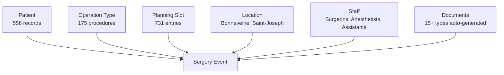
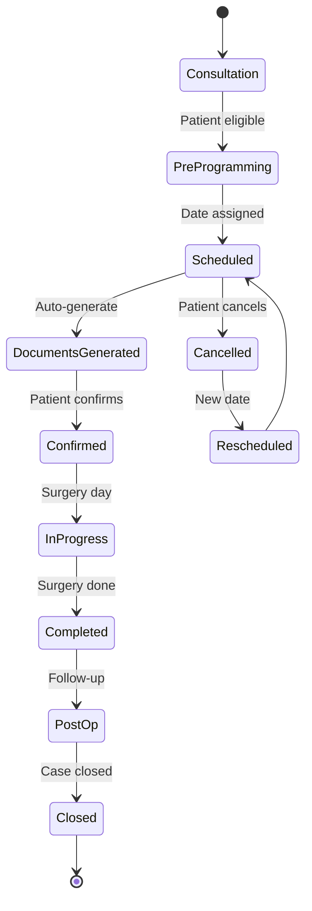

# 🏥 Chirurgie Application - Complete System Architecture & Functionality Analysis

## 📋 Executive Summary

The Chirurgie application is a **comprehensive surgical practice management system** that handles 558 patients, 175 procedure types, and complex scheduling across multiple hospital locations. It features advanced document automation, multi-team coordination, and complete workflow management for ENT surgical practices.

---

## 🏗️ System Architecture Overview

### **Core Data Model**



### **Database Schema**

```sql
-- Core Entities
Patients (
    patient_id, nom, prenom, date_naissance, 
    age (computed), mineur (computed), 
    telephone, mail, cmu, poids,
    allergies (12 types), medications, 
    nb_interventions, last_modified
)

Operations (
    operation_id, famille (7 types), 
    operation_name, ccam_code, tarif_secu,
    post_op_protocols (9 medications),
    document_templates, certificates
)

Surgeries (
    surgery_id, patient_id, operation_ids[],
    scheduled_date, location_id, 
    surgeon_id, anesthetist_id, assistant_id,
    anesthesia_type, status, documents[]
)

Planning (
    slot_id, date, week_num, day_of_week,
    time_slot (Matin/Après-midi), 
    location_id, surgery_id, type
)

Locations (
    location_id, name, color_code,
    operating_blocks, resources
)

Staff (
    staff_id, name, role, specialties,
    availability, location_access[]
)

Documents (
    document_id, surgery_id, type,
    template_used, generated_date,
    pdf_path, status
)
```

---

## 🖥️ User Interface Components

### **1. Main Calendar View** (Bloc Opératoire > Programmation)

#### **Layout Structure**
```
┌─────────────────────────────────────────────────────────┐
│ 📍 Bloc Opératoire > Programmation     [Gestion Planning]│
├─────────────────────────────────────────────────────────┤
│ Filters: [Lieu ▼] [Anesthésie ▼] [Aide ▼] [Patient ▼]  │
│                                    [Programmer intervention]│
├─────────────────────────────────────────────────────────┤
│  ◄  ►  Today   [Month] [Week] [Day]                      │
├────┬────┬────┬────┬────┬────┬────┐                      │
│ Mon│ Tue│ Wed│ Thu│ Fri│ Sat│ Sun│   Color Legend:      │
├────┼────┼────┼────┼────┼────┼────┤   🟪 Bonneveine     │
│ 1  │ 2  │ 3  │ 4  │ 5  │ 6  │ 7  │   🟩 Bonneveine-2   │
│[B] │[B] │    │[SJ]│[B] │    │    │   🟧 Saint-Joseph   │
│septoturbi│    │    │rhino│+4 more│                      │
├────┴────┴────┴────┴────┴────┴────┘                      │
│ ☑️ Voir programmes non programmés                         │
│ Status: 763 programmes                                   │
└─────────────────────────────────────────────────────────┘
```

#### **Surgery Cards Display**

Each surgery card contains:
- **Procedure abbreviation**: "septoturbi-VG", "rhino"
- **Location badge**: [B] for Bonneveine, [SJ] for Saint-Joseph
- **Color coding**: Location-based (Pink, Green, Orange)
- **Icons**: 💉 (anesthesia), 🫁 (respiratory), 🧠 (neuro)
- **Overflow**: "+4 en plus" for busy days

#### **Interactive Features**
- **Drag & Drop**: Move surgeries between dates
- **Click to expand**: View all surgeries on busy days
- **Hover tooltips**: Full surgery details
- **Quick filters**: By location, anesthesia, staff, patient

---

### **2. Surgery Programming Form** (Programmer Intervention)

#### **Form Structure**

```typescript
interface SurgeryProgrammingForm {
  // Patient Section
  patient: {
    selector: PatientDropdown;        // 558 patients searchable
    quickView: PatientSummaryCard;    // Age, allergies, history
  };
  
  // Location & Timing
  scheduling: {
    date: DatePicker;
    location: LocationSelector;       // Bonneveine, Saint-Joseph
    timeSlot: SlotSelector;          // Matin, Après-midi
    operatingBlock: BlockSelector;
  };
  
  // Procedures (Multi-select)
  procedures: {
    primary: ProcedureSelector;      // Required
    secondary?: ProcedureSelector;   // Optional
    tertiary?: ProcedureSelector;    // Optional
  };
  
  // Medical Team
  team: {
    surgeon: StaffSelector;
    anesthetist?: StaffSelector;
    assistant?: StaffSelector;        // Aide Opératoire
  };
  
  // Medical Details
  medical: {
    anesthesiaType: AnesthesiaSelector; // Local, General
    modality: ModalitySelector;         // Ambulatoire, Hospitalization
    bloodTestRequired: boolean;
    biopsyRequired: boolean;
    specialEquipment: string[];
  };
  
  // Financial
  financial: {
    cmuStatus: boolean;
    outOfPocket: number;              // Dépassement Honoraires
    generateQuote: boolean;
  };
  
  // Documentation
  documents: {
    generateBooklet: boolean;
    customNotes: string;
  };
}
```

---

### **3. Planning Management View** (Gestion du Planning)

#### **Grid Display**
- **731 calendar slots** displayed in table format
- **Columns**: Week#, Day, Date, Type, Time Slot, Interventions Count
- **Filters**: Month, Week, Day search
- **Actions**: Reset filters, Add programming
- **Pagination**: Handle large datasets efficiently

---

### **4. Surgery Detail & Document Center**

#### **Document Generation System**

```python
class DocumentGenerator:
    """Automatic document generation based on surgery parameters"""
    
    DOCUMENT_TYPES = {
        # Pre-operative
        'devis': QuoteTemplate,              # Financial quote
        'fiche_info_1': InfoSheet1,          # Procedure information
        'fiche_info_2': InfoSheet2,          # Secondary procedure
        'fiche_info_3': InfoSheet3,          # Additional info
        'livret': PatientBooklet,            # Complete guide
        
        # Administrative
        'DA': AdmissionRequest,              # Hospital admission
        'CE': InformedConsent,               # Legal consent
        'BS': BloodTestOrder,                # Lab orders
        'ordo': Prescription,                 # Medications
        
        # Post-operative
        'lavage_ordo': NasalIrrigation,      # Specific to ENT
        'pansement_ordo': DressingOrder,     # Wound care
        'consignes': PostOpInstructions,     # Patient instructions
        'certificats': MedicalCertificates,  # Work/school
        'rdv_postop': FollowUpAppointment,   # Scheduling
        
        # Billing
        'facture': Invoice                   # Final billing
    }
    
    def generate_surgery_package(self, surgery):
        """Generate all required documents for a surgery"""
        documents = []
        
        # Select templates based on procedure type
        for procedure in surgery.procedures:
            required_docs = self.get_required_documents(procedure)
            
            for doc_type in required_docs:
                template = self.DOCUMENT_TYPES[doc_type]
                pdf = template.render(
                    patient=surgery.patient,
                    procedure=procedure,
                    location=surgery.location,
                    date=surgery.date,
                    surgeon=surgery.surgeon,
                    financial=surgery.financial_details
                )
                documents.append(pdf)
        
        # Merge all PDFs if requested
        if surgery.merge_documents:
            return PDFMerger.combine(documents)
        
        return documents
```

---

## 🔄 Core Workflows

### **1. Complete Surgery Lifecycle**



### **2. Multi-Location Scheduling Algorithm**

```javascript
class SchedulingEngine {
  
  assignSurgerySlot(surgery) {
    const constraints = {
      location: surgery.preferredLocation,
      surgeon: this.getSurgeonAvailability(surgery.surgeon_id),
      anesthetist: this.getAnesthetistAvailability(surgery.anesthesia_type),
      operatingBlock: this.getBlockAvailability(surgery.location),
      duration: this.estimateDuration(surgery.procedures),
      patientConstraints: surgery.patient.constraints
    };
    
    const availableSlots = this.findAvailableSlots(constraints);
    
    // Color coding for calendar
    const colorMap = {
      'Bonneveine': '#9B59B6',      // Purple
      'Saint-Joseph': '#E67E22',     // Orange
      'Bonneveine-Block2': '#27AE60' // Green
    };
    
    return {
      slot: this.optimizeSlot(availableSlots),
      color: colorMap[surgery.location],
      badge: this.getLocationBadge(surgery.location)
    };
  }
  
  handleOverflow(date) {
    const surgeries = this.getSurgeriesForDate(date);
    const maxDisplay = 4;
    
    if (surgeries.length > maxDisplay) {
      return {
        displayed: surgeries.slice(0, maxDisplay),
        overflow: `+${surgeries.length - maxDisplay} en plus`,
        expandable: true
      };
    }
    
    return { displayed: surgeries, overflow: null };
  }
}
```

### **3. Intelligent Document Workflow**

```python
class DocumentWorkflow:
    """Manages document lifecycle and automation"""
    
    def trigger_document_generation(self, surgery, event):
        """Generate documents based on workflow events"""
        
        document_triggers = {
            'scheduled': ['devis', 'fiche_info_1', 'fiche_info_2'],
            'confirmed': ['DA', 'CE', 'BS', 'ordo'],
            'pre_op_week': ['livret', 'consignes'],
            'completed': ['certificats', 'rdv_postop'],
            'billing': ['facture']
        }
        
        if event in document_triggers:
            docs_to_generate = document_triggers[event]
            
            for doc_type in docs_to_generate:
                self.generate_document(surgery, doc_type)
                self.send_notification(surgery.patient, doc_type)
        
        # Special handling for document updates
        if surgery.documents_need_update:
            self.regenerate_all_documents(surgery)
```

---

## 🎯 Advanced Features & Business Logic

### **1. Medication Protocol System**

```python
class MedicationProtocol:
    """Post-operative medication management"""
    
    PROTOCOLS = {
        'septoturbinoplastie': {
            'paracetamol': {'days': 7, 'dose': '1g x 4/day'},
            'corticoides': {'days': 5, 'dose': 'decreasing'},
            'lavage_nasal': {'days': 30, 'frequency': '3x/day'},
            'antibiotique': {'days': 7, 'if': 'high_risk'}
        },
        'amygdalectomie': {
            'paracetamol': {'days': 10, 'dose': '1g x 4/day'},
            'tramadol': {'days': 5, 'dose': 'if_needed'},
            'bains_bouche': {'days': 14, 'frequency': '4x/day'}
        }
    }
    
    def generate_prescription(self, surgery):
        """Create personalized prescription based on procedure"""
        prescription = []
        
        for procedure in surgery.procedures:
            protocol = self.PROTOCOLS.get(procedure.type)
            
            # Adjust for patient factors
            if surgery.patient.is_minor:
                protocol = self.adjust_pediatric_dosing(protocol)
            
            if surgery.patient.allergies:
                protocol = self.substitute_medications(protocol, 
                                                      surgery.patient.allergies)
            
            prescription.extend(self.format_prescription(protocol))
        
        return prescription
```

### **2. Financial Management System**

```python
class FinancialManager:
    """Handles quotes, insurance, and billing"""
    
    def calculate_patient_cost(self, surgery):
        base_cost = sum(proc.tarif_secu for proc in surgery.procedures)
        
        if surgery.patient.has_cmu:
            covered = base_cost
            out_of_pocket = 0
        else:
            covered = base_cost * 0.7  # 70% coverage typical
            out_of_pocket = base_cost * 0.3
        
        # Add surgeon's additional fees
        depassement = surgery.surgeon.depassement_honoraires
        total_out_of_pocket = out_of_pocket + depassement
        
        return {
            'base_cost': base_cost,
            'insurance_covered': covered,
            'patient_payment': total_out_of_pocket,
            'depassement': depassement,
            'generate_quote': True
        }
```

### **3. Compliance & Audit System**

```python
class ComplianceManager:
    """Ensures regulatory compliance and audit trail"""
    
    REQUIRED_DOCUMENTS = {
        'pre_op': ['informed_consent', 'anesthesia_consent'],
        'financial': ['quote_accepted', 'payment_plan'],
        'medical': ['blood_test_results', 'pre_op_exam']
    }
    
    def verify_surgery_compliance(self, surgery):
        """Check all regulatory requirements are met"""
        compliance_status = {
            'documents': self.check_documents(surgery),
            'consents': self.verify_consents(surgery),
            'insurance': self.verify_insurance(surgery),
            'medical_clearance': self.check_medical_clearance(surgery)
        }
        
        if not all(compliance_status.values()):
            self.flag_compliance_issues(surgery, compliance_status)
            return False
        
        self.log_audit_trail(surgery, 'compliance_verified')
        return True
```

---

## 🚀 Modern Replication Architecture

### **Technology Stack Recommendation**

```yaml
Frontend:
  Framework: React 18 / Next.js 14
  UI Library: Ant Design / Material-UI
  Calendar: FullCalendar / React Big Calendar
  State: Redux Toolkit / Zustand
  Forms: React Hook Form + Yup
  PDF: React-PDF / PDFMake

Backend:
  Framework: Django 5.0 / FastAPI
  Database: PostgreSQL 15
  Cache: Redis
  Queue: Celery + RabbitMQ
  Storage: S3 / MinIO
  
DevOps:
  Containerization: Docker
  Orchestration: Kubernetes
  CI/CD: GitHub Actions
  Monitoring: Prometheus + Grafana
  
Security:
  Authentication: JWT + OAuth2
  Encryption: AES-256
  HIPAA Compliance: Yes
  Audit Logging: Elasticsearch
```

### **Microservices Architecture**

```yaml
Services:
  patient-service:
    - Patient management
    - Medical history
    - Allergies & medications
    
  scheduling-service:
    - Calendar management
    - Conflict detection
    - Resource allocation
    
  document-service:
    - Template management
    - PDF generation
    - Document storage
    
  financial-service:
    - Quote generation
    - Insurance processing
    - Billing
    
  notification-service:
    - Email/SMS
    - Push notifications
    - Reminders
    
  audit-service:
    - Compliance tracking
    - Audit logging
    - Reporting
```

### **API Design**

```typescript
// RESTful API Structure
interface ChirurgieAPI {
  // Surgeries
  'GET /api/surgeries': { filters: SurgeryFilters };
  'POST /api/surgeries': { body: SurgeryCreation };
  'PUT /api/surgeries/:id': { body: SurgeryUpdate };
  'DELETE /api/surgeries/:id': { params: { id: string } };
  
  // Calendar
  'GET /api/calendar/slots': { date: string, location?: string };
  'POST /api/calendar/schedule': { surgery_id: string, slot_id: string };
  'PUT /api/calendar/reschedule': { surgery_id: string, new_slot: string };
  
  // Documents
  'POST /api/documents/generate': { surgery_id: string, types: string[] };
  'GET /api/documents/:surgery_id': { params: { surgery_id: string } };
  'POST /api/documents/merge': { document_ids: string[] };
  
  // Workflow
  'POST /api/workflow/trigger': { surgery_id: string, action: string };
  'GET /api/workflow/status/:surgery_id': { params: { surgery_id: string } };
}
```

---

## 📊 Key Metrics & Performance

### **Current System Scale**
- **558** active patients
- **175** procedure types
- **731** scheduled slots
- **763** total programs
- **15+** document types per surgery
- **3** hospital locations
- **7** surgical specialties

### **Performance Requirements**
- Calendar load: < 500ms
- Document generation: < 2s per document
- Search response: < 200ms
- Concurrent users: 50+
- Data retention: 7 years (regulatory)

---

## 🎯 Implementation Roadmap

### **Phase 1: Core (Months 1-2)**
- Patient management
- Basic scheduling
- Simple calendar view

### **Phase 2: Documents (Months 3-4)**
- Template system
- PDF generation
- Document storage

### **Phase 3: Workflow (Months 5-6)**
- Status management
- Automated triggers
- Notification system

### **Phase 4: Advanced (Months 7-8)**
- Multi-location support
- Financial management
- Analytics dashboard

### **Phase 5: Optimization (Months 9-10)**
- Performance tuning
- Mobile apps
- AI features

---

## ✅ Conclusion

The Chirurgie application is a **sophisticated surgical practice management system** that combines:

1. **Complex scheduling** across multiple locations
2. **Comprehensive document automation** (15+ types)
3. **Complete workflow management** with status tracking
4. **French healthcare compliance** (CCAM, CMU)
5. **Multi-team coordination** with role-based access
6. **Financial transparency** with automated billing

This is a **production-grade enterprise application** that handles real medical workflows, not just a simple CRUD system. The combination of Airtable's flexibility with custom business logic creates a powerful solution that would require significant development effort to replicate with traditional technology.

**Estimated Development Effort**: 8-10 months with a team of 4-5 developers to build a comparable system from scratch.