# ReactDjango Hub - Microservices Architecture

## 🏗️ **Services Overview**

| Service | Purpose | Port | Technology | Status |
|---------|---------|------|------------|---------|
| **🔐 Identity Service** | Auth + Users + Roles + MFA | 8001 | FastAPI + PostgreSQL + Redis | ✅ **Production Ready** |
| **📄 Content Service** | Documents + Search + Audit | 8002 | FastAPI + PostgreSQL + Redis | ✅ **Framework Complete** |
| **📢 Communication Service** | Notifications + Messaging | 8003 | FastAPI + Celery + Redis | ✅ **Framework Complete** |
| **🔄 Workflow & Intelligence Service** | Process Automation + AI | 8004 | FastAPI + AI/ML + Redis | ✅ **Framework Complete** |

## 🚀 **Quick Start**

### Start All Services
```bash
cd services
docker-compose up -d
```

### Individual Service Development
```bash
# Identity Service (Auth + Users + Roles) - PRODUCTION READY
cd services/identity-service
python main.py  # or uvicorn main:app --reload --port 8001

# Content Service (Documents + Search) - FRAMEWORK COMPLETE
cd services/content-service  
python main.py  # or uvicorn main:app --reload --port 8002

# Communication Service (Notifications + Messaging) - FRAMEWORK COMPLETE
cd services/communication-service
python main.py  # or uvicorn main:app --reload --port 8003

# Workflow Service (Process Automation + AI) - FRAMEWORK COMPLETE
cd services/workflow-intelligence-service
python main.py  # or uvicorn main:app --reload --port 8004
```

## 📡 **API Documentation**

When services are running, access interactive API docs:

- **Identity Service**: http://localhost:8001/docs ✅ **Production Ready**
- **Content Service**: http://localhost:8002/docs ✅ **Framework Complete**  
- **Communication Service**: http://localhost:8003/docs ✅ **Framework Complete**
- **Workflow Service**: http://localhost:8004/docs ✅ **Framework Complete**

## 🗃️ **Database Configuration**

Each service has its own isolated database:

| Service | Database | Port | User | Password |
|---------|----------|------|------|----------|
| Identity | `identity_service` | 5433 | `identity_user` | `identity_pass` |
| Content | `content_service` | 5434 | `content_user` | `content_pass` |
| Communication | `communication_service` | 5435 | `communication_user` | `communication_pass` |
| Workflow | `workflow_intelligence_service` | 5436 | `workflow_user` | `workflow_pass` |

## 🔄 **Redis Configuration**

Each service has dedicated Redis instances:

| Service | Redis Port | Usage |
|---------|------------|-------|
| Identity | 6380 | Caching + Rate Limiting |
| Content | 6381 | Search Cache + Processing |
| Communication | 6382 | Celery Broker + Message Queue |
| Workflow | 6383 | Pub/Sub + AI Job Queue |

## 👥 **Service Integration**

### Authentication Flow
1. **Frontend** → **Identity Service** (login, get JWT)
2. **Other Services** → **Identity Service** (validate JWT)

### Service Communication Architecture

```mermaid
graph TD
    Frontend[Frontend React App]
    Gateway[API Gateway - Kong]
    Identity[🔐 Identity Service :8001<br/>✅ PRODUCTION READY]
    Content[📄 Content Service :8002<br/>✅ FRAMEWORK COMPLETE]
    Comm[📢 Communication Service :8003<br/>✅ FRAMEWORK COMPLETE]
    Workflow[🔄 Workflow Intelligence :8004<br/>✅ FRAMEWORK COMPLETE]
    
    Frontend --> Gateway
    Gateway --> Identity
    Gateway --> Content
    Gateway --> Comm  
    Gateway --> Workflow
    
    Content -.-> Identity
    Comm -.-> Identity
    Workflow -.-> Identity
    Workflow -.-> Content
    Workflow -.-> Comm
    
    Identity --> IdentityDB[(PostgreSQL<br/>Port 5433)]
    Content --> ContentDB[(PostgreSQL<br/>Port 5434)]
    Comm --> CommDB[(PostgreSQL<br/>Port 5435)]
    Workflow --> WorkflowDB[(PostgreSQL<br/>Port 5436)]
    
    Identity --> IdentityRedis[(Redis<br/>Port 6380)]
    Content --> ContentRedis[(Redis<br/>Port 6381)]
    Comm --> CommRedis[(Redis<br/>Port 6382)]
    Workflow --> WorkflowRedis[(Redis<br/>Port 6383)]
```


## 📦 **Requirements Management**

### Shared Dependencies Strategy
All services use a shared requirements baseline to ensure consistency:

```bash
# Shared requirements file (maintained by Services Coordinator)
services/requirements.shared.txt

# Each service extends the shared requirements:
# In your service requirements.txt:
-r ../requirements.shared.txt

# Add SERVICE-SPECIFIC dependencies below:
# Database driver (choose one):
asyncpg==0.29.0          # For async services (identity-service)
# psycopg2-binary==2.9.9 # For sync services (other services)

# Other service-specific dependencies...
```

### ⚠️ **Important**: Database Drivers are Service-Specific
Database drivers are **NOT** in shared requirements due to compilation conflicts:
- **Identity Service**: Uses `asyncpg==0.29.0` (async PostgreSQL)
- **Other Services**: Use `psycopg2-binary==2.9.9` (sync PostgreSQL)

### Current Dependency Versions (Latest Stable - Sep 2025)
- **FastAPI**: 0.116.1
- **Pydantic**: 2.11.7  
- **SQLAlchemy**: 2.0.43
- **Redis**: 6.4.0
- **pytest**: 8.3.4

See [`requirements.shared.txt`](./requirements.shared.txt) for the complete list.

## 🎯 **Development Workflow**

### Using Specialized Agents
Each service has a dedicated Claude Code agent in `.claude/agents/`:

- `identity-service-agent.md` - Auth + Users + Roles specialist
- `content-service-agent.md` - Documents + Search specialist  
- `communication-service-agent.md` - Notifications + Messaging specialist
- `workflow-intelligence-service-agent.md` - Process Automation + AI specialist

### Service-Specific Development
```bash
# Work on identity service
cd services/identity-service
claude  # Uses identity-service-agent

# Work on content service  
cd services/content-service
claude  # Uses content-service-agent
```

## 📋 **Multi-Domain Applications**

### **PublicHub Context**
- **Identity**: Supplier accounts, procurement roles
- **Content**: RC, CCAP, CCTP documents, offers
- **Communication**: Bid notifications, supplier alerts
- **Workflow**: Consultation lifecycle automation

### **Medical Context**
- **Identity**: Doctor/patient accounts, medical roles
- **Content**: Medical documents, patient records  
- **Communication**: Patient reminders, clinical messaging
- **Workflow**: Patient care pathway automation

---

## 📚 **Documentation**

### **Architecture & Technical Details**
- **[Architecture Overview](docs/ARCHITECTURE.md)** - Detailed technical architecture, deployment patterns, and service communication
- **[Service Integration Patterns](docs/SERVICE_INTEGRATION_PATTERNS.md)** - Standard patterns for implementing services
- **[API Integration Guide](docs/API_INTEGRATION_GUIDE.md)** - Cross-service API usage and authentication
- **[Troubleshooting Guide](docs/TROUBLESHOOTING.md)** - Common issues and solutions

### **Coordination & Management**
- **[Coordination Issues](COORDINATION_ISSUES.md)** - Cross-service issue tracking and resolution
- **[Shared Requirements](requirements.shared.txt)** - Centralized dependency management

### **Service-Specific Documentation**
Each service maintains its own detailed documentation in its respective directory.

---

**🤖 Each service is designed to be domain-agnostic with specialized configurations for different applications.**